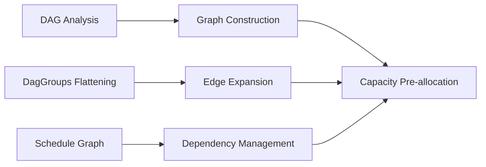

+++
title = "#21964 Preallocate more things"
date = "2025-11-29T00:00:00"
draft = false
template = "pull_request_page.html"
in_search_index = true

[taxonomies]
list_display = ["show"]

[extra]
current_language = "en"
available_languages = {"en" = { name = "English", url = "/pull_request/bevy/2025-11/pr-21964-en-20251129" }, "zh-cn" = { name = "中文", url = "/pull_request/bevy/2025-11/pr-21964-zh-cn-20251129" }}
labels = ["A-ECS", "C-Performance", "D-Straightforward"]
+++

# Preallocate more things

## Basic Information
- **Title**: Preallocate more things
- **PR Link**: https://github.com/bevyengine/bevy/pull/21964
- **Author**: ItsDoot
- **Status**: MERGED
- **Labels**: A-ECS, C-Performance, S-Ready-For-Final-Review, D-Straightforward
- **Created**: 2025-11-28T05:09:34Z
- **Merged**: 2025-11-29T00:17:02Z
- **Merged By**: mockersf

## Description Translation

# Objective

- Part of #20115

We should try to minimize allocations where its easy to do so.

## Solution

Pre-allocate things upfront where we know their exact resulting size.

## Testing

It'd probably be good to benchmark to see how much (if any) this helps.

## The Story of This Pull Request

This PR addresses a common performance optimization opportunity in Bevy's ECS scheduling system: reducing unnecessary memory allocations during graph construction. The core issue was that several graph operations were using default constructors that start with minimal capacity, requiring frequent reallocations as nodes and edges are added.

The solution follows a straightforward principle: when the final size of a data structure is known in advance, pre-allocate the required capacity upfront. This avoids the performance cost of multiple reallocations and copying operations that occur when containers grow beyond their initial capacity.

In the DAG analysis system, the changes focus on graph construction during topological sorting and transitive operations. Previously, graphs were initialized with default capacity, but now they're created with exact capacity based on known node and edge counts. This is particularly important for the transitive reduction and closure operations, which can involve complex graph manipulations.

The graph flattening operations in `DagGroups` received significant attention. When expanding edges between key and value nodes, the code now pre-calculates the exact number of edges that will be added. For example, when expanding edges between two key nodes, the number of resulting edges equals the product of the sizes of both key groups. By reserving this capacity upfront, we avoid multiple reallocations during the nested loops that create these edges.

The PR also adds new API methods to the graph data structure itself. The `reserve_nodes` and `reserve_edges` methods expose the underlying capacity management, allowing callers to optimize graph construction when they know the expected size in advance.

In the schedule graph building process, the changes target edge creation operations. When connecting nodes in dependency chains or handling node removal with neighbor reconnection, the code now calculates the exact number of edges that will be created and reserves capacity before entering the nested loops. This is especially important for operations that create edges between all combinations of two node sets, where the number of edges grows quadratically.

The engineering approach here is conservative and focused - these changes don't alter the algorithms or data structures, but simply optimize their memory allocation patterns. This makes the changes low-risk while providing potential performance benefits, particularly for large schedules with many systems and complex dependencies.

## Visual Representation



## Key Files Changed

### `crates/bevy_ecs/src/schedule/graph/dag.rs` (+25/-7)

This file contains the core DAG analysis and manipulation logic. The changes focus on pre-allocating graph capacity for topological sorting and edge expansion operations.

**Key changes:**
```rust
// Before:
let mut topsorted = DiGraph::<N>::default();

// After:
let mut topsorted = DiGraph::<N>::with_capacity(topological_order.len(), graph.edge_count());
```

```rust
// Before:
for &lhs in self.get(&lhs_key).into_iter().flatten() {
    for &rhs in self.get(&rhs_key).into_iter().flatten() {
        flattened.add_edge(lhs, rhs);
    }
}

// After:
let Some(lhs_group) = self.get(&lhs_key) else { continue };
let Some(rhs_group) = self.get(&rhs_key) else { continue };
flattened.reserve_edges(lhs_group.len() * rhs_group.len());
for &lhs in lhs_group {
    for &rhs in rhs_group {
        flattened.add_edge(lhs, rhs);
    }
}
```

### `crates/bevy_ecs/src/schedule/graph/graph_map.rs` (+13/-1)

This file defines the graph data structure. The changes add capacity reservation methods and use them in graph operations.

**Key changes:**
```rust
// New methods added:
pub fn reserve_nodes(&mut self, additional: usize) {
    self.nodes.reserve(additional);
}

pub fn reserve_edges(&mut self, additional: usize) {
    self.edges.reserve(additional);
}
```

```rust
// Before:
let mut subgraph = DiGraph::<N>::default();

// After:
let mut subgraph = DiGraph::<N>::with_capacity(scc.len(), 0);
```

### `crates/bevy_ecs/src/schedule/schedule.rs` (+6/-0)

This file handles schedule graph construction. The changes pre-allocate edge capacity for dependency and hierarchy operations.

**Key changes:**
```rust
// Added capacity reservation before nested loops:
self.dependency.reserve_edges(previous_nodes.len() * current_nodes.len());
for previous_node in previous_nodes {
    for current_node in current_nodes {
        self.dependency.add_edge(*previous_node, *current_node);
    }
}
```

```rust
// Added for hierarchy operations:
self.hierarchy.reserve_edges(in_nodes.len() * out_nodes.len());
for &in_node in &in_nodes {
    for &out_node in &out_nodes {
        self.hierarchy.add_edge(in_node, out_node);
    }
}
```

## Further Reading

- [Rust Vec::with_capacity documentation](https://doc.rust-lang.org/std/vec/struct.Vec.html#method.with_capacity)
- [Bevy ECS Scheduling](https://bevyengine.org/learn/quick-start/ecs/#systems-and-schedules)
- [Performance optimization patterns in game engines](https://gameprogrammingpatterns.com/performance-patterns.html)
- [Graph algorithms in Rust](https://github.com/petgraph/petgraph) - The graph library that inspired Bevy's graph implementation