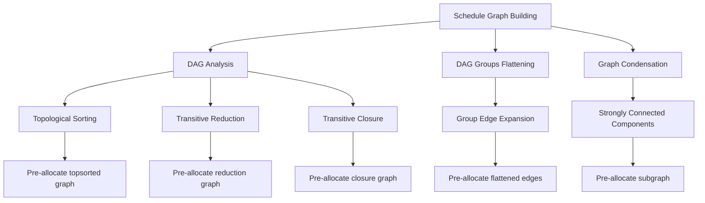

+++
title = "#21964 Preallocate more things"
date = "2025-11-29T00:00:00"
draft = false
template = "pull_request_page.html"
in_search_index = false

[extra]
current_language = "zh-cn"
available_languages = {"en" = { name = "English", url = "/pull_request/bevy/2025-11/pr-21964-en-20251129" }, "zh-cn" = { name = "中文", url = "/pull_request/bevy/2025-11/pr-21964-zh-cn-20251129" }}
labels = ["A-ECS", "C-Performance", "D-Straightforward"]
+++

# Title

## Basic Information
- **Title**: Preallocate more things
- **PR Link**: https://github.com/bevyengine/bevy/pull/21964
- **Author**: ItsDoot
- **Status**: MERGED
- **Labels**: A-ECS, C-Performance, S-Ready-For-Final-Review, D-Straightforward
- **Created**: 2025-11-28T05:09:34Z
- **Merged**: 2025-11-29T00:17:02Z
- **Merged By**: mockersf

## Description Translation
# 目标

- 作为 #20115 的一部分

我们应该在容易做到的地方尽量减少内存分配。

## 解决方案

在知道确切结果大小的情况下，预先分配资源。

## 测试

最好进行基准测试，看看这能带来多少（如果有的话）帮助。

## The Story of This Pull Request

这个PR的核心问题很简单：ECS调度系统中的图结构在构建过程中存在不必要的动态内存分配。当系统构建依赖图时，图的节点和边会随着调度逻辑的展开而动态增长，这导致了多次重新分配的开销。

开发者采取了直接的解决方案：在已知确切大小的情况下预先分配内存。这种优化策略在性能敏感的系统代码中很常见，特别是在ECS这种需要处理大量实体的框架中。

在`dag.rs`中，主要的改进集中在图构建过程中。当进行拓扑排序和传递归约时，代码现在能够预先分配足够的内存来容纳所有节点和边。例如，在构建`topsorted`图时，代码现在使用`with_capacity`来指定确切的节点数和边数：

```rust
let mut topsorted =
    DiGraph::<N>::with_capacity(topological_order.len(), graph.edge_count());
```

类似的优化也应用于传递归约和传递闭包图的构建：

```rust
let mut transitive_reduction = DiGraph::with_capacity(topsorted.node_count(), 0);
let mut transitive_closure = DiGraph::with_capacity(topsorted.node_count(), 0);
```

在`DagGroups::flatten`方法中，开发者添加了更精细的边预分配逻辑。这里的关键洞察是：在展开组间边时，可以精确计算需要添加的边数。例如，当处理两个键节点之间的边时，需要添加的边数是两个组的大小的乘积：

```rust
flattened.reserve_edges(lhs_group.len() * rhs_group.len());
```

这种预分配避免了在嵌套循环中反复扩容的开销。

在`graph_map.rs`中，开发者添加了新的API来支持这种优化模式：

```rust
pub fn reserve_nodes(&mut self, additional: usize) {
    self.nodes.reserve(additional);
}

pub fn reserve_edges(&mut self, additional: usize) {
    self.edges.reserve(additional);
}
```

这些方法为图的构建提供了更细粒度的控制，允许调用者在知道确切需求时预先分配内存。

在`schedule.rs`中，优化集中在调度图的构建过程中。当添加批量边时（如笛卡尔积的情况），代码现在会预先分配足够的内存：

```rust
self.dependency
    .reserve_edges(previous_nodes.len() * current_nodes.len());
```

这种模式在`remove_node`方法中同样适用，当需要连接传入节点和传出节点时，预先计算并分配所需的边数。

从工程角度看，这些优化体现了几个重要的原则：

1. **提前计算**：在知道确切需求时预先分配，避免动态扩容
2. **批量操作**：将相关的边添加操作批量处理，减少函数调用开销
3. **资源意识**：在性能关键路径上减少内存分配器的压力

这些改变虽然看起来简单，但在大规模系统中可以带来显著的性能提升，特别是在调度构建这种频繁执行的操作中。

## Visual Representation



## Key Files Changed

### `crates/bevy_ecs/src/schedule/graph/dag.rs` (+25/-7)

这个文件包含了DAG分析和组展开的核心逻辑改进：

```rust
// 关键改进1：拓扑排序图预分配
let mut topsorted =
    DiGraph::<N>::with_capacity(topological_order.len(), graph.edge_count());

// 关键改进2：传递归约和闭图预分配  
let mut transitive_reduction = DiGraph::with_capacity(topsorted.node_count(), 0);
let mut transitive_closure = DiGraph::with_capacity(topsorted.node_count(), 0);

// 关键改进3：组展开时的边预分配
flattened.reserve_edges(lhs_group.len() * rhs_group.len());
```

### `crates/bevy_ecs/src/schedule/graph/graph_map.rs` (+13/-1)

这个文件添加了图的预分配API：

```rust
// 新增的预分配API
pub fn reserve_nodes(&mut self, additional: usize) {
    self.nodes.reserve(additional);
}

pub fn reserve_edges(&mut self, additional: usize) {
    self.edges.reserve(additional);
}

// 在强连通分量分析中的使用
let mut subgraph = DiGraph::<N>::with_capacity(scc.len(), 0);
```

### `crates/bevy_ecs/src/schedule/schedule.rs` (+6/-0)

这个文件在调度图构建过程中添加了边预分配：

```rust
// 依赖图边预分配
self.dependency
    .reserve_edges(previous_nodes.len() * current_nodes.len());

// 层次图边预分配  
self.hierarchy
    .reserve_edges(in_nodes.len() * out_nodes.len());
```

## Further Reading

- [Rust HashMap Capacity Documentation](https://doc.rust-lang.org/std/collections/struct.HashMap.html#method.with_capacity)
- [ECS Scheduling in Bevy](https://bevy-cheatbook.github.io/programming/schedules.html)
- [Graph Algorithms in Rust](https://github.com/petgraph/petgraph)