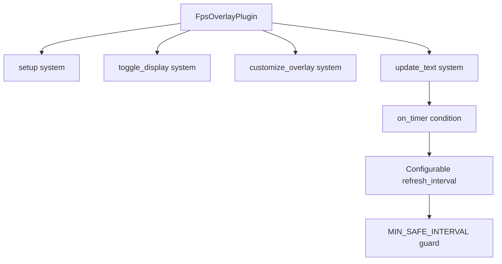

+++
title = "#21965 on_timer() for update_text() in the fps_overlay"
date = "2025-11-29T00:00:00"
draft = false
template = "pull_request_page.html"
in_search_index = true

[taxonomies]
list_display = ["show"]

[extra]
current_language = "en"
available_languages = {"en" = { name = "English", url = "/pull_request/bevy/2025-11/pr-21965-en-20251129" }, "zh-cn" = { name = "中文", url = "/pull_request/bevy/2025-11/pr-21965-zh-cn-20251129" }}
labels = ["C-Performance", "A-Dev-Tools", "D-Straightforward"]
+++

# Title
on_timer() for update_text() in the fps_overlay

## Basic Information
- **Title**: on_timer() for update_text() in the fps_overlay
- **PR Link**: https://github.com/bevyengine/bevy/pull/21965
- **Author**: Breakdown-Dog
- **Status**: MERGED
- **Labels**: C-Performance, S-Ready-For-Final-Review, A-Dev-Tools, D-Straightforward
- **Created**: 2025-11-28T13:12:04Z
- **Merged**: 2025-11-28T23:49:27Z
- **Merged By**: mockersf

## Description Translation

# Objective

- The `update_text()` system was running on every frame, causing unnecessary performance overhead.

## Solution

- Refactored it to use `on_timer()` to run on a configurable interval.

## Testing

- Ran the `fps_overlay.rs` example; the overlay works correctly and the new performance warning triggers as expected.

---

## The Story of This Pull Request

This PR addresses a straightforward but important performance optimization in Bevy's FPS overlay system. The core issue was that the `update_text()` system, responsible for updating the frames-per-second display, was executing on every single frame. This created unnecessary CPU overhead since FPS values don't need millisecond-level precision - updating every few hundred milliseconds provides sufficient accuracy for monitoring purposes.

The original implementation used a manual timing approach with a `Local<Duration>` variable that accumulated frame deltas and triggered updates when exceeding the configured refresh interval. This worked functionally but had several drawbacks: it required maintaining local state, performed delta time calculations every frame, and ran the system logic even when no update was needed.

The solution leverages Bevy's built-in `on_timer()` condition system, which is specifically designed for this type of periodic execution. By moving from a manual timing approach to Bevy's scheduler-managed timing, the system now only runs when actually needed. This eliminates the per-frame overhead while maintaining the same update frequency behavior.

A key addition in this PR is the performance safety mechanism that warns developers if they configure excessively frequent updates. The constant `MIN_SAFE_INTERVAL` set to 50 milliseconds prevents users from accidentally degrading performance by setting refresh rates that are too aggressive for the intended purpose.

The implementation also simplified the `update_text()` function by removing the manual timing logic and local state management. The function now focuses purely on its core responsibility: reading the FPS diagnostic and updating the text display. This follows the single responsibility principle and makes the code more maintainable.

## Visual Representation



## Key Files Changed

### `crates/bevy_dev_tools/src/fps_overlay.rs` (+19/-16)

This file contains the core implementation of the FPS overlay functionality. The changes focus on optimizing how frequently the FPS text updates.

**Key Changes:**

1. **Added performance warning for low refresh intervals:**
```rust
// Warn the user if the interval is below this threshold.
const MIN_SAFE_INTERVAL: Duration = Duration::from_millis(50);

if self.config.refresh_interval < MIN_SAFE_INTERVAL {
    warn!(
        "Low refresh interval ({:?}) may degrade performance. \
        Min recommended: {:?}.",
        self.config.refresh_interval, MIN_SAFE_INTERVAL
    );
}
```

2. **Replaced manual timing with `on_timer()` condition:**
```rust
// Before:
update_text,

// After:  
update_text.run_if(on_timer(self.config.refresh_interval)),
```

3. **Simplified the update_text system:**
```rust
// Before:
fn update_text(
    diagnostic: Res<DiagnosticsStore>,
    query: Query<Entity, With<FpsText>>,
    mut writer: TextUiWriter,
    time: Res<Time>,
    config: Res<FpsOverlayConfig>,
    mut time_since_rerender: Local<Duration>,
) {
    *time_since_rerender += time.delta();
    if *time_since_rerender >= config.refresh_interval {
        *time_since_rerender = Duration::ZERO;
        for entity in &query {
            if let Some(fps) = diagnostic.get(&FrameTimeDiagnosticsPlugin::FPS)
                && let Some(value) = fps.smoothed()
            {
                *writer.text(entity, 1) = format!("{value:.2}");
            }
        }
    }
}

// After:
fn update_text(
    diagnostic: Res<DiagnosticsStore>,
    query: Query<Entity, With<FpsText>>,
    mut writer: TextUiWriter,
) {
    if let Ok(entity) = query.single()
        && let Some(fps) = diagnostic.get(&FrameTimeDiagnosticsPlugin::FPS)
        && let Some(value) = fps.smoothed()
    {
        *writer.text(entity, 1) = format!("{value:.2}");
    }
}
```

## Further Reading

- [Bevy Conditions Documentation](https://docs.rs/bevy/latest/bevy/ecs/schedule/trait.IntoSystemConfigs.html#method.run_if) - Understanding system conditions in Bevy
- [Bevy Time Systems](https://docs.rs/bevy/latest/bevy/time/common_conditions/index.html) - Common time-based conditions including `on_timer()`
- [Rust Duration Type](https://doc.rust-lang.org/std/time/struct.Duration.html) - Working with time durations in Rust
- [Performance Optimization Patterns](https://gameprogrammingpatterns.com/optimization-patterns.html) - Common patterns for game performance optimization

# Full Code Diff
```diff
diff --git a/crates/bevy_dev_tools/src/fps_overlay.rs b/crates/bevy_dev_tools/src/fps_overlay.rs
index ea5c0fde4318b..f180b6ef9e810 100644
--- a/crates/bevy_dev_tools/src/fps_overlay.rs
+++ b/crates/bevy_dev_tools/src/fps_overlay.rs
@@ -7,7 +7,6 @@ use bevy_diagnostic::{DiagnosticsStore, FrameTimeDiagnosticsPlugin};
 use bevy_ecs::{
     component::Component,
     entity::Entity,
-    prelude::Local,
     query::{With, Without},
     resource::Resource,
     schedule::{common_conditions::resource_changed, IntoScheduleConfigs},
@@ -16,13 +15,14 @@ use bevy_ecs::{
 use bevy_picking::Pickable;
 use bevy_render::storage::ShaderStorageBuffer;
 use bevy_text::{Font, TextColor, TextFont, TextSpan};
-use bevy_time::Time;
+use bevy_time::common_conditions::on_timer;
 use bevy_ui::{
     widget::{Text, TextUiWriter},
     FlexDirection, GlobalZIndex, Node, PositionType, Val,
 };
 use bevy_ui_render::prelude::MaterialNode;
 use core::time::Duration;
+use tracing::warn;
 
 use crate::frame_time_graph::{
     FrameTimeGraphConfigUniform, FrameTimeGraphPlugin, FrametimeGraphMaterial,
@@ -33,6 +33,9 @@ use crate::frame_time_graph::{
 /// We use a number slightly under `i32::MAX` so you can render on top of it if you really need to.
 pub const FPS_OVERLAY_ZINDEX: i32 = i32::MAX - 32;
 
+// Warn the user if the interval is below this threshold.
+const MIN_SAFE_INTERVAL: Duration = Duration::from_millis(50);
+
 // Used to scale the frame time graph based on the fps text size
 const FRAME_TIME_GRAPH_WIDTH_SCALE: f32 = 6.0;
 const FRAME_TIME_GRAPH_HEIGHT_SCALE: f32 = 2.0;
@@ -61,6 +64,14 @@ impl Plugin for FpsOverlayPlugin {
             app.add_plugins(FrameTimeGraphPlugin);
         }
 
+        if self.config.refresh_interval < MIN_SAFE_INTERVAL {
+            warn!(
+                "Low refresh interval ({:?}) may degrade performance. \
+                Min recommended: {:?}.",
+                self.config.refresh_interval, MIN_SAFE_INTERVAL
+            );
+        }
+
         app.insert_resource(self.config.clone())
             .add_systems(Startup, setup)
             .add_systems(
@@ -68,7 +79,7 @@ impl Plugin for FpsOverlayPlugin {
                 (
                     (toggle_display, customize_overlay)
                         .run_if(resource_changed::<FpsOverlayConfig>),
-                    update_text,
+                    update_text.run_if(on_timer(self.config.refresh_interval)),
                 ),
             );
     }
@@ -213,20 +224,12 @@ fn update_text(
     diagnostic: Res<DiagnosticsStore>,
     query: Query<Entity, With<FpsText>>,
     mut writer: TextUiWriter,
-    time: Res<Time>,
-    config: Res<FpsOverlayConfig>,
-    mut time_since_rerender: Local<Duration>,
 ) {
-    *time_since_rerender += time.delta();
-    if *time_since_rerender >= config.refresh_interval {
-        *time_since_rerender = Duration::ZERO;
-        for entity in &query {
-            if let Some(fps) = diagnostic.get(&FrameTimeDiagnosticsPlugin::FPS)
-                && let Some(value) = fps.smoothed()
-            {
-                *writer.text(entity, 1) = format!("{value:.2}");
-            }
-        }
+    if let Ok(entity) = query.single()
+        && let Some(fps) = diagnostic.get(&FrameTimeDiagnosticsPlugin::FPS)
+        && let Some(value) = fps.smoothed()
+    {
+        *writer.text(entity, 1) = format!("{value:.2}");
     }
 }
```