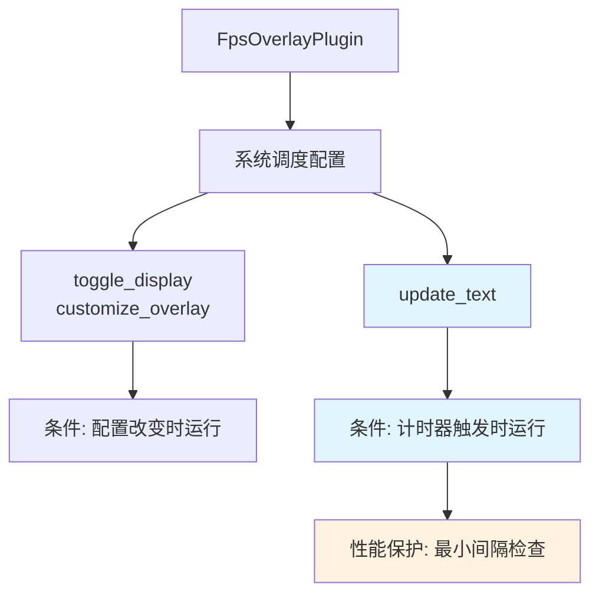

+++
title = "#21965 on_timer() for update_text() in the fps_overlay"
date = "2025-11-29T00:00:00"
draft = false
template = "pull_request_page.html"
in_search_index = false

[extra]
current_language = "zh-cn"
available_languages = {"en" = { name = "English", url = "/pull_request/bevy/2025-11/pr-21965-en-20251129" }, "zh-cn" = { name = "中文", url = "/pull_request/bevy/2025-11/pr-21965-zh-cn-20251129" }}
labels = ["C-Performance", "A-Dev-Tools", "D-Straightforward"]
+++

# Title
on_timer() for update_text() in the fps_overlay

## Basic Information
- **Title**: on_timer() for update_text() in the fps_overlay
- **PR Link**: https://github.com/bevyengine/bevy/pull/21965
- **Author**: Breakdown-Dog
- **Status**: MERGED
- **Labels**: C-Performance, S-Ready-For-Final-Review, A-Dev-Tools, D-Straightforward
- **Created**: 2025-11-28T13:12:04Z
- **Merged**: 2025-11-28T23:49:27Z
- **Merged By**: mockersf

## Description Translation
**目标 (Objective)**

- `update_text()` 系统在每一帧都运行，造成了不必要的性能开销。

**解决方案 (Solution)**

- 重构该系统，使用 `on_timer()` 在可配置的时间间隔内运行。

**测试 (Testing)**

- 运行了 `fps_overlay.rs` 示例；叠加层工作正常，新的性能警告按预期触发。

---

## The Story of This Pull Request

这个 PR 解决了一个在 Bevy 引擎开发工具中存在的性能问题。FPS 叠加层（FPS overlay）是一个用于显示游戏帧率的开发工具，但在之前的实现中，更新文本的系统在每一帧都会执行，这造成了不必要的性能开销。

**问题分析**

在原始实现中，`update_text` 系统使用了手动的时间累积方法来控制更新频率：

```rust
// 之前的实现（简化）
fn update_text(
    mut time_since_rerender: Local<Duration>,
    time: Res<Time>,
    config: Res<FpsOverlayConfig>
) {
    *time_since_rerender += time.delta();
    if *time_since_rerender >= config.refresh_interval {
        *time_since_rerender = Duration::ZERO;
        // 更新文本的逻辑
    }
}
```

这种方法虽然功能上正确，但存在几个问题：
1. 系统仍然在每一帧都被调度和执行，只是大部分时间提前返回
2. 需要维护额外的状态（`Local<Duration>`）
3. 没有充分利用 Bevy 调度系统的优化能力

**解决方案的实现**

PR 作者采用了更符合 Bevy 设计模式的方法，使用 `on_timer` 条件系统来重构：

```rust
// 新的实现
fn update_text(
    diagnostic: Res<DiagnosticsStore>,
    query: Query<Entity, With<FpsText>>,
    mut writer: TextUiWriter,
) {
    if let Ok(entity) = query.single()
        && let Some(fps) = diagnostic.get(&FrameTimeDiagnosticsPlugin::FPS)
        && let Some(value) = fps.smoothed()
    {
        *writer.text(entity, 1) = format!("{value:.2}");
    }
}
```

关键的技术改进包括：

1. **使用条件系统**：通过 `on_timer(self.config.refresh_interval)` 条件，系统只在计时器触发时执行
2. **简化系统逻辑**：移除了手动的时间累积和状态管理
3. **优化查询**：使用 `query.single()` 替代迭代，因为 FPS 文本实体应该是唯一的

**系统调度的变化**

在插件注册阶段，系统的调度方式发生了变化：

```rust
// 之前：
.add_systems(Update, (toggle_display, customize_overlay, update_text))

// 之后：
.add_systems(
    Update,
    (
        (toggle_display, customize_overlay)
            .run_if(resource_changed::<FpsOverlayConfig>),
        update_text.run_if(on_timer(self.config.refresh_interval)),
    ),
)
```

这种改变使得：
- `toggle_display` 和 `customize_overlay` 只在配置改变时运行
- `update_text` 只在计时器触发时运行

**性能保护机制**

PR 还引入了性能保护机制，防止用户设置过高的更新频率：

```rust
const MIN_SAFE_INTERVAL: Duration = Duration::from_millis(50);

if self.config.refresh_interval < MIN_SAFE_INTERVAL {
    warn!(
        "Low refresh interval ({:?}) may degrade performance. \
        Min recommended: {:?}.",
        self.config.refresh_interval, MIN_SAFE_INTERVAL
    );
}
```

这个警告机制确保用户不会意外设置过短的刷新间隔而抵消性能优化的好处。

**技术洞察**

这个重构展示了几个重要的 Bevy 开发模式：

1. **条件系统的正确使用**：`on_timer` 是处理周期性任务的理想选择
2. **系统状态的最小化**：移除不必要的 `Local` 资源
3. **调度优化**：减少不必要的系统执行
4. **防御性编程**：通过警告机制防止误用

对于显示 FPS 这种不需要每帧更新的 UI 元素，使用计时器是更合理的选择。人类的视觉系统无法分辨 60Hz 以上的更新频率，而 FPS 数值本身也不需要如此频繁的更新。

## Visual Representation



## Key Files Changed

### `crates/bevy_dev_tools/src/fps_overlay.rs` (+19/-16)

**主要变化概述：**
这个文件包含了 FPS 叠加层插件的核心实现，主要的改进是将文本更新系统从每帧运行改为基于计时器运行。

**关键代码修改：**

```rust
// 导入变化
- use bevy_ecs::prelude::Local;
- use bevy_time::Time;
+ use bevy_time::common_conditions::on_timer;
+ use tracing::warn;

// 新增常量
+ const MIN_SAFE_INTERVAL: Duration = Duration::from_millis(50);

// 插件初始化中的性能检查
+ if self.config.refresh_interval < MIN_SAFE_INTERVAL {
+     warn!(
+         "Low refresh interval ({:?}) may degrade performance. \
+         Min recommended: {:?}.",
+         self.config.refresh_interval, MIN_SAFE_INTERVAL
+     );
+ }

// 系统调度配置变化
-     .add_systems(Update, (toggle_display, customize_overlay, update_text))
+     .add_systems(
+         Update,
+         (
+             (toggle_display, customize_overlay)
+                 .run_if(resource_changed::<FpsOverlayConfig>),
+             update_text.run_if(on_timer(self.config.refresh_interval)),
+         ),
+     );

// update_text 系统简化
fn update_text(
-     diagnostic: Res<DiagnosticsStore>,
-     query: Query<Entity, With<FpsText>>,
-     mut writer: TextUiWriter,
-     time: Res<Time>,
-     config: Res<FpsOverlayConfig>,
-     mut time_since_rerender: Local<Duration>,
+     diagnostic: Res<DiagnosticsStore>,
+     query: Query<Entity, With<FpsText>>,
+     mut writer: TextUiWriter,
) {
-     *time_since_rerender += time.delta();
-     if *time_since_rerender >= config.refresh_interval {
-         *time_since_rerender = Duration::ZERO;
-         for entity in &query {
-             if let Some(fps) = diagnostic.get(&FrameTimeDiagnosticsPlugin::FPS)
-                 && let Some(value) = fps.smoothed()
-             {
-                 *writer.text(entity, 1) = format!("{value:.2}");
-             }
-         }
+     if let Ok(entity) = query.single()
+         && let Some(fps) = diagnostic.get(&FrameTimeDiagnosticsPlugin::FPS)
+         && let Some(value) = fps.smoothed()
+     {
+         *writer.text(entity, 1) = format!("{value:.2}");
     }
}
```

**这些变化如何关联到 PR 的目的：**
- 移除每帧运行的性能开销
- 使用 Bevy 的条件系统机制来优化调度
- 添加保护措施防止性能回归
- 简化系统实现，减少状态管理

## Further Reading

**相关资源推荐：**

1. **Bevy 条件系统文档**：
   - [Bevy Conditions](https://docs.rs/bevy/latest/bevy/ecs/schedule/trait.IntoSystemConfigs.html#method.run_if) - 了解各种条件系统的使用方法

2. **系统调度优化**：
   - [Bevy System Scheduling](https://bevy-cheatbook.github.io/programming/systems.html) - Bevy 系统调度的最佳实践

3. **性能优化模式**：
   - [ECS Pattern: Throttling Systems](https://github.com/bevyengine/bevy/discussions) - 关于系统节流的设计模式讨论

4. **Rust 中的计时器**：
   - [`std::time::Duration`](https://doc.rust-lang.org/std/time/struct.Duration.html) - Rust 标准库中的时间处理

这个 PR 展示了如何在保持功能不变的情况下，通过更合理的架构设计来提升性能，是一个很好的优化范例。