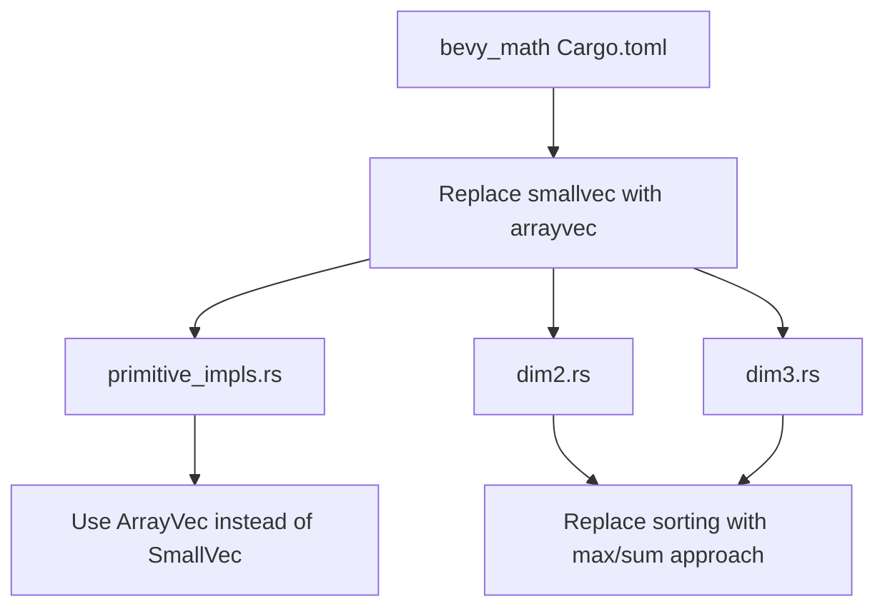

+++
title = "#21969 Fix bevy_math when no alloc is available"
date = "2025-11-30T00:00:00"
draft = false
template = "pull_request_page.html"
in_search_index = true

[taxonomies]
list_display = ["show"]

[extra]
current_language = "en"
available_languages = {"en" = { name = "English", url = "/pull_request/bevy/2025-11/pr-21969-en-20251130" }, "zh-cn" = { name = "中文", url = "/pull_request/bevy/2025-11/pr-21969-zh-cn-20251130" }}
labels = ["A-Math", "O-Embedded"]
+++

# Title: Fix bevy_math when no alloc is available

## Basic Information
- **Title**: Fix bevy_math when no alloc is available
- **PR Link**: https://github.com/bevyengine/bevy/pull/21969
- **Author**: NiseVoid
- **Status**: MERGED
- **Labels**: S-Ready-For-Final-Review, A-Math, P-Compile-Failure, O-Embedded
- **Created**: 2025-11-28T19:24:00Z
- **Merged**: 2025-11-30T17:57:50Z
- **Merged By**: mockersf

## Description Translation
# Objective

`bevy_math` does not work when no `alloc` is available despite the existance of the `alloc` feature which should gate all logic that requires it. Support for no std + no alloc can be useful for some embedded usecases, for example using `bevy_math` types on the GPU using Rust GPU.

## Solution

Swap `smallvec` out with `arrayvec`, and fix two minor uses of `alloc::slice::sort_by` (not available on `core` because they allocate `Vec`s internally)

## Testing

- Unit tests still pass
- I was able to compile a shader with Rust GPU while depending on bevy_math

## The Story of This Pull Request

The core issue addressed in this PR was a dependency problem in the `bevy_math` crate that prevented it from working in no-std environments without an allocator. Despite having an `alloc` feature flag intended to gate allocation-dependent functionality, the crate was still using components that required allocation even when this feature was disabled.

The problem manifested in two key areas. First, the crate was using `smallvec`, which despite its name still requires an allocator for its fallback behavior when the inline storage is exceeded. Second, the triangle geometry calculations were using `sort_by` from the alloc module, which internally allocates vectors and therefore depends on an allocator being available.

For embedded use cases like running on GPUs with Rust GPU, having no-std and no-alloc support is essential. The current implementation blocked these use cases unnecessarily.

The solution involved two strategic changes. First, `smallvec` was replaced with `arrayvec`, which provides similar functionality with fixed-capacity inline storage but doesn't require an allocator. Second, the triangle classification algorithms were rewritten to avoid sorting, eliminating the dependency on allocation-based sorting functions.

The implementation maintains the same mathematical correctness while being more constrained-environment friendly. The triangle acute/obtuse detection was rewritten using a mathematical approach that finds the maximum side length and compares the sum of the other two sides, which achieves the same result without requiring sorting.

This change demonstrates an important principle in systems programming: being mindful of dependencies and their requirements, especially when targeting constrained environments. The fix enables `bevy_math` to be used in more embedded contexts while maintaining full functionality for standard use cases.

## Visual Representation



## Key Files Changed

### `crates/bevy_math/Cargo.toml` (+1/-1)
**Change**: Replaced `smallvec` dependency with `arrayvec`

```toml
# Before:
smallvec = { version = "1", default-features = false }

# After:
arrayvec = { version = "0.7", default-features = false }
```

**Why**: `smallvec` requires an allocator when its inline capacity is exceeded, while `arrayvec` provides fixed-capacity stack allocation without requiring an allocator.

### `crates/bevy_math/src/bounding/bounded2d/primitive_impls.rs` (+3/-3)
**Change**: Replaced `SmallVec` with `ArrayVec` in bounding point calculations

```rust
// Before:
use smallvec::SmallVec;
fn arc_bounding_points(arc: Arc2d, rotation: impl Into<Rot2>) -> SmallVec<[Vec2; 7]> {
    let mut bounds = SmallVec::<[Vec2; 7]>::new();
}

// After:
use arrayvec::ArrayVec;
fn arc_bounding_points(arc: Arc2d, rotation: impl Into<Rot2>) -> ArrayVec<Vec2, 7> {
    let mut bounds = ArrayVec::<Vec2, 7>::new();
}
```

**Why**: `ArrayVec` provides the same fixed-capacity functionality without allocator dependency.

### `crates/bevy_math/src/primitives/dim2.rs` and `crates/bevy_math/src/primitives/dim3.rs` (+8/-6 each)
**Change**: Replaced sorting-based triangle classification with mathematical approach

```rust
// Before (in both dim2.rs and dim3.rs):
let mut side_lengths = [
    ab.length_squared(),
    bc.length_squared(),
    ca.length_squared(),
];
side_lengths.sort_by(|a, b| a.partial_cmp(b).unwrap());
side_lengths[0] + side_lengths[1] > side_lengths[2]

// After (in both dim2.rs and dim3.rs):
let side_lengths = [
    ab.length_squared(),
    bc.length_squared(),
    ca.length_squared(),
];
let sum = side_lengths[0] + side_lengths[1] + side_lengths[2];
let max = side_lengths[0].max(side_lengths[1]).max(side_lengths[2]);
sum - max > max
```

**Why**: The `sort_by` function allocates internally, while the mathematical approach using `max` and sum calculations achieves the same result without allocation.

## Further Reading

- [ArrayVec documentation](https://docs.rs/arrayvec/latest/arrayvec/) - Fixed capacity array-based vector implementation
- [Rust Embedded Book](https://docs.rust-embedded.org/book/) - Guide to embedded development in Rust
- [no_std Rust](https://rust-embedded.github.io/book/intro/no-std.html) - Working without the standard library
- [Bevy Engine](https://bevyengine.org/) - The game engine this PR contributes to

# Full Code Diff
*(Provided in the original request)*