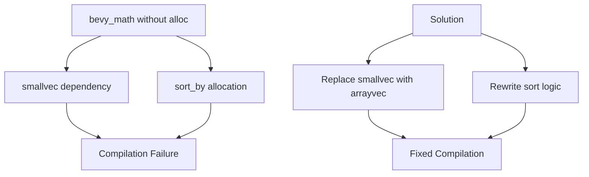

+++
title = "#21969 Fix bevy_math when no alloc is available"
date = "2025-11-30T00:00:00"
draft = false
template = "pull_request_page.html"
in_search_index = false

[extra]
current_language = "zh-cn"
available_languages = {"en" = { name = "English", url = "/pull_request/bevy/2025-11/pr-21969-en-20251130" }, "zh-cn" = { name = "中文", url = "/pull_request/bevy/2025-11/pr-21969-zh-cn-20251130" }}
labels = ["A-Math", "O-Embedded"]
+++

# Fix bevy_math when no alloc is available

## Basic Information
- **Title**: Fix bevy_math when no alloc is available
- **PR Link**: https://github.com/bevyengine/bevy/pull/21969
- **Author**: NiseVoid
- **Status**: MERGED
- **Labels**: S-Ready-For-Final-Review, A-Math, P-Compile-Failure, O-Embedded
- **Created**: 2025-11-28T19:24:00Z
- **Merged**: 2025-11-30T17:57:50Z
- **Merged By**: mockersf

## Description Translation
**目标**

`bevy_math` 在没有 `alloc` 可用时无法工作，尽管存在 `alloc` 特性应该控制所有需要它的逻辑。支持无标准库 + 无分配器对于一些嵌入式用例很有用，例如使用 Rust GPU 在 GPU 上使用 `bevy_math` 类型。

**解决方案**

用 `arrayvec` 替换 `smallvec`，并修复两处使用 `alloc::slice::sort_by` 的地方（在 `core` 中不可用，因为它们在内部分配 `Vec`）

**测试**

- 单元测试仍然通过
- 我能够在依赖 bevy_math 的情况下使用 Rust GPU 编译着色器

## The Story of This Pull Request

这个 PR 解决了一个在嵌入式环境中使用 bevy_math 时遇到的实际问题。问题的核心在于，虽然 bevy_math 有一个 `alloc` 特性来控制在没有分配器时的行为，但实际代码中仍然存在一些硬性依赖分配器的实现。

问题的根本原因有两个方面。首先，代码使用了 `smallvec` 库，这个库即使在不需要动态分配的情况下，仍然依赖于分配器相关的功能。其次，在三角形几何计算中使用了 `sort_by` 方法，这个方法在 `core` 中不可用，因为它内部会分配向量。

开发者采用了直接的解决方案：用 `arrayvec` 替换 `smallvec`，并重写排序逻辑以避免依赖分配。`arrayvec` 是一个基于栈的、固定容量的向量实现，完全不依赖分配器，这使其成为嵌入式环境的理想选择。

在实现细节上，最重要的变化发生在三角形几何计算的方法中。原来的实现使用了 `sort_by` 来对边长进行排序，然后比较前两个边长的平方和与第三个边长的平方。新的实现通过数学等价变换，避免了排序操作，直接计算所有边长的总和并找到最大值。

这种方法的优势在于：
1. 消除了对分配器的依赖
2. 减少了函数调用开销
3. 保持了相同的数学正确性

对于边界计算函数，变化相对简单，主要是将 `SmallVec` 类型替换为 `ArrayVec`，两者的 API 基本兼容，使得迁移变得简单直接。

这个修复对于需要在严格受限环境中使用 bevy_math 的开发者来说非常重要，特别是在 Rust GPU 等场景中，这些环境通常没有可用的分配器。

## Visual Representation



## Key Files Changed

### `crates/bevy_math/Cargo.toml`
**变化**: 将依赖从 `smallvec` 改为 `arrayvec`

```toml
# Before:
smallvec = { version = "1", default-features = false }

# After:
arrayvec = { version = "0.7", default-features = false }
```

这个变化是解决方案的核心，用不依赖分配器的 `arrayvec` 替换了依赖分配器的 `smallvec`。

### `crates/bevy_math/src/bounding/bounded2d/primitive_impls.rs`
**变化**: 替换 SmallVec 为 ArrayVec

```rust
// Before:
use smallvec::SmallVec;
fn arc_bounding_points(arc: Arc2d, rotation: impl Into<Rot2>) -> SmallVec<[Vec2; 7]> {
    let mut bounds = SmallVec::<[Vec2; 7]>::new();
}

// After:
use arrayvec::ArrayVec;
fn arc_bounding_points(arc: Arc2d, rotation: impl Into<Rot2>) -> ArrayVec<Vec2, 7> {
    let mut bounds = ArrayVec::<Vec2, 7>::new();
}
```

这个文件处理 2D 几何图形的边界计算，`ArrayVec` 提供了与 `SmallVec` 相似的 API 但不需要分配器。

### `crates/bevy_math/src/primitives/dim2.rs` 和 `crates/bevy_math/src/primitives/dim3.rs`
**变化**: 重写三角形几何计算方法以避免使用 `sort_by`

```rust
// 原来的实现 (使用排序):
let mut side_lengths = [
    ab.length_squared(),
    bc.length_squared(),
    ca.length_squared(),
];
side_lengths.sort_by(|a, b| a.partial_cmp(b).unwrap());
side_lengths[0] + side_lengths[1] > side_lengths[2]

// 新的实现 (无排序):
let side_lengths = [
    ab.length_squared(),
    bc.length_squared(),
    ca.length_squared(),
];
let sum = side_lengths[0] + side_lengths[1] + side_lengths[2];
let max = side_lengths[0].max(side_lengths[1]).max(side_lengths[2]);
sum - max > max
```

这个重写很巧妙，它通过数学上的等价变换避免了排序操作。原来的代码排序后比较前两个元素的和与第三个元素，这实际上等价于比较所有元素的和减去最大值与最大值的关系。

## Further Reading

- [arrayvec 文档](https://docs.rs/arrayvec/) - 了解这个无分配向量实现的详细信息
- [Rust 的 no_std 编程](https://rust-embedded.github.io/book/intro/no-std.html) - 嵌入式 Rust 开发指南
- [Bevy 的嵌入式支持](https://bevyengine.org/learn/quick-start/getting-started/no-std/) - Bevy 在无标准库环境下的使用方法
- [Rust GPU 项目](https://github.com/embarkstudios/rust-gpu) - 在 GPU 上运行 Rust 代码的工具链