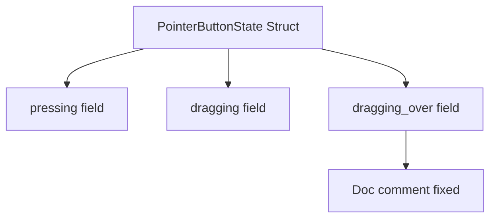

+++
title = "#21970 Remove double space"
date = "2025-11-28T00:00:00"
draft = false
template = "pull_request_page.html"
in_search_index = true

[taxonomies]
list_display = ["show"]

[extra]
current_language = "en"
available_languages = {"en" = { name = "English", url = "/pull_request/bevy/2025-11/pr-21970-en-20251128" }, "zh-cn" = { name = "中文", url = "/pull_request/bevy/2025-11/pr-21970-zh-cn-20251128" }}
labels = ["C-Docs", "D-Trivial"]
+++

# Title
Remove double space

## Basic Information
- **Title**: Remove double space
- **PR Link**: https://github.com/bevyengine/bevy/pull/21970
- **Author**: ickshonpe
- **Status**: MERGED
- **Labels**: C-Docs, D-Trivial, S-Ready-For-Final-Review
- **Created**: 2025-11-28T22:10:46Z
- **Merged**: 2025-11-28T23:24:55Z
- **Merged By**: mockersf

## Description Translation
# Objective

Remove a double space in a doc comment for `PointerButtonState`.

## Solution

Delete it.

## The Story of This Pull Request

This pull request addresses a straightforward documentation issue in the Bevy engine's picking system. The problem was a minor typographical error - a double space in a Rust doc comment for the `PointerButtonState` struct. While this type of change might seem trivial, it reflects the attention to detail that maintains code quality in large codebases.

The issue was located in the `PointerButtonState` struct within the `bevy_picking` crate. This struct tracks the state of pointer interactions in Bevy's input system, specifically handling button presses, drag operations, and drag-over events. The double space occurred in the documentation for the `dragging_over` field, which stores hit data for entities currently being dragged over by a pointer.

The solution was minimal and surgical: removing a single extraneous space character from the doc comment. The change went from having two spaces after "Stores" to just one space, aligning with standard Rust documentation conventions and improving readability.

From a technical perspective, this change doesn't affect runtime behavior or functionality - it's purely a documentation improvement. However, consistent and clean documentation is important for developer experience, especially in a game engine like Bevy where multiple contributors work with complex input systems. Well-formatted documentation helps prevent misunderstandings and makes the codebase more approachable for new contributors.

The change was reviewed and merged quickly, taking just over an hour from creation to merge, which is typical for straightforward documentation fixes. The labels applied (C-Docs for documentation changes, D-Trivial for trivial changes, S-Ready-For-Final-Review for review status) accurately reflect the nature of this minor but worthwhile improvement.

## Visual Representation



## Key Files Changed

**File:** `crates/bevy_picking/src/events.rs` (+1/-1)

This file contains input event handling for Bevy's picking system. The change was a simple documentation fix in the `PointerButtonState` struct.

**Before:**
```rust
/// Stores  the hit data for each entity currently being dragged over by the pointer.
pub dragging_over: HashMap<Entity, HitData>,
```

**After:**
```rust
/// Stores the hit data for each entity currently being dragged over by the pointer.
pub dragging_over: HashMap<Entity, HitData>,
```

The change removes the double space between "Stores" and "the", bringing the documentation in line with standard formatting conventions.

## Further Reading

- [Rust Documentation Comments](https://doc.rust-lang.org/rustdoc/how-to-write-documentation.html) - Official Rust documentation on writing effective doc comments
- [Bevy Picking System](https://github.com/bevyengine/bevy/tree/main/crates/bevy_picking) - Source code for Bevy's picking system
- [Rust Style Guide](https://github.com/rust-lang/rfcs/blob/master/style-guide/README.md) - Community style guidelines for Rust code

# Full Code Diff
```diff
diff --git a/crates/bevy_picking/src/events.rs b/crates/bevy_picking/src/events.rs
index 6e25bd235c891..4528001f0e429 100644
--- a/crates/bevy_picking/src/events.rs
+++ b/crates/bevy_picking/src/events.rs
@@ -347,7 +347,7 @@ pub struct PointerButtonState {
     pub pressing: HashMap<Entity, (Location, Instant, HitData)>,
     /// Stores the starting and current locations for each entity currently being dragged by the pointer.
     pub dragging: HashMap<Entity, DragEntry>,
-    /// Stores  the hit data for each entity currently being dragged over by the pointer.
+    /// Stores the hit data for each entity currently being dragged over by the pointer.
     pub dragging_over: HashMap<Entity, HitData>,
 }
 
```