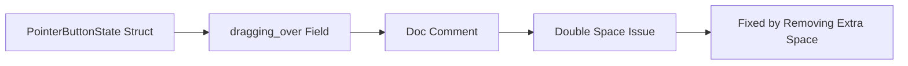

+++
title = "#21970 Remove double space"
date = "2025-11-28T00:00:00"
draft = false
template = "pull_request_page.html"
in_search_index = false

[extra]
current_language = "zh-cn"
available_languages = {"en" = { name = "English", url = "/pull_request/bevy/2025-11/pr-21970-en-20251128" }, "zh-cn" = { name = "中文", url = "/pull_request/bevy/2025-11/pr-21970-zh-cn-20251128" }}
labels = ["C-Docs", "D-Trivial"]
+++

# Remove double space

## Basic Information
- **Title**: Remove double space
- **PR Link**: https://github.com/bevyengine/bevy/pull/21970
- **Author**: ickshonpe
- **Status**: MERGED
- **Labels**: C-Docs, D-Trivial, S-Ready-For-Final-Review
- **Created**: 2025-11-28T22:10:46Z
- **Merged**: 2025-11-28T23:24:55Z
- **Merged By**: mockersf

## Description Translation
# 目标

移除 `PointerButtonState` 文档注释中的一个多余空格。

## 解决方案

删除它。

## The Story of This Pull Request

这个PR解决了一个非常具体但重要的代码质量问题：文档注释中的多余空格。在软件开发中，代码的可读性和一致性是维护代码库健康的关键因素，即使是看似微小的格式问题也可能影响代码的整体质量。

问题出现在 `PointerButtonState` 结构体的文档注释中。该结构体是Bevy引擎的picking系统的一部分，用于跟踪指针按钮的状态。在其中一个字段的文档注释中，存在一个多余的空格字符。

从技术角度来看，这个问题的根本原因是简单的打字错误。在编写文档注释时，开发者在"Stores"和"the"之间意外地输入了两个空格而不是一个。虽然这不会影响代码的编译或运行，但它破坏了代码格式的一致性。

这种格式问题在几个方面可能产生影响：
1. **代码可读性**：多余的空格会使注释在阅读时显得不专业
2. **工具链处理**：某些IDE和代码格式化工具可能会将这种不一致标记为警告
3. **开发者体验**：对于注重代码质量的团队，这种小问题会分散注意力

解决方案是直接且明确的：删除多余的空格字符。这是一个最小化的变更，只涉及单个字符的修改，但体现了对代码质量的关注。

从工程实践的角度看，这类修改虽然简单，但对于维护大型开源项目的代码质量标准非常重要。它展示了项目对细节的关注，即使是最小的不一致也会被识别和修复。

## Visual Representation



## Key Files Changed

### `crates/bevy_picking/src/events.rs` (+1/-1)

这个文件包含了指针事件相关的数据结构和逻辑。修改涉及`PointerButtonState`结构体的文档注释。

**修改内容：**
```rust
// Before:
/// Stores  the hit data for each entity currently being dragged over by the pointer.

// After:
/// Stores the hit data for each entity currently being dragged over by the pointer.
```

**说明：**
- 修改了`dragging_over`字段的文档注释
- 移除了"Stores"和"the"之间的多余空格
- 保持了注释内容的完整性和准确性
- 这是一个纯粹的格式修复，不影响任何功能逻辑

## Further Reading

- [Rust Documentation Guidelines](https://doc.rust-lang.org/rustdoc/how-to-write-documentation.html)
- [Bevy Picking System Documentation](https://github.com/bevyengine/bevy/tree/main/crates/bevy_picking)
- [Rust Style Guide](https://github.com/rust-dev-tools/fmt-rfcs/blob/master/guide/guide.md)

# Full Code Diff
```diff
diff --git a/crates/bevy_picking/src/events.rs b/crates/bevy_picking/src/events.rs
index 6e25bd235c891..4528001f0e429 100644
--- a/crates/bevy_picking/src/events.rs
+++ b/crates/bevy_picking/src/events.rs
@@ -347,7 +347,7 @@ pub struct PointerButtonState {
     pub pressing: HashMap<Entity, (Location, Instant, HitData)>,
     /// Stores the starting and current locations for each entity currently being dragged by the pointer.
     pub dragging: HashMap<Entity, DragEntry>,
-    /// Stores  the hit data for each entity currently being dragged over by the pointer.
+    /// Stores the hit data for each entity currently being dragged over by the pointer.
     pub dragging_over: HashMap<Entity, HitData>,
 }
```