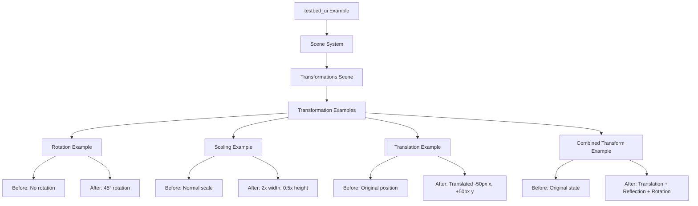

+++
title = "#21974 Add a UiTransform centered scene to examples/testbed/ui"
date = "2025-11-29T00:00:00"
draft = false
template = "pull_request_page.html"
in_search_index = true

[taxonomies]
list_display = ["show"]

[extra]
current_language = "en"
available_languages = {"en" = { name = "English", url = "/pull_request/bevy/2025-11/pr-21974-en-20251129" }, "zh-cn" = { name = "中文", url = "/pull_request/bevy/2025-11/pr-21974-zh-cn-20251129" }}
labels = ["C-Examples", "D-Straightforward"]
+++

# Add a UiTransform centered scene to examples/testbed/ui

## Basic Information
- **Title**: Add a UiTransform centered scene to examples/testbed/ui
- **PR Link**: https://github.com/bevyengine/bevy/pull/21974
- **Author**: kfc35
- **Status**: MERGED
- **Labels**: C-Examples, S-Ready-For-Final-Review, D-Straightforward
- **Created**: 2025-11-29T06:32:57Z
- **Merged**: 2025-11-29T21:17:38Z
- **Merged By**: mockersf

## Description Translation
# Objective

Fixes #21815

## Solution

- Adds a new scene to `examples/testbed/ui` called `Transformations` that calls some basic `UiTransform`s on Nodes.

This is my first PR for Bevy!

## Testing

I ran the example via console to test out the scene.

Tested on Desktop MacOS 15.7.1

## Showcase


To view, run in console: `cargo run --package bevy --example testbed_ui`
Press spacebar 11x until you see the new scene.

## The Story of This Pull Request

This pull request addresses a gap in Bevy's UI example suite by adding comprehensive demonstrations of `UiTransform` component functionality. The issue #21815 highlighted the need for better documentation and examples around UI transformations, which are essential for developers building interactive user interfaces.

The solution follows Bevy's established patterns for UI examples while focusing specifically on transformation operations. The implementation centers around creating a new scene in the existing testbed UI example that systematically demonstrates various transformation types and their combinations.

The core technical approach involves extending the scene enumeration system in the testbed UI example:

```rust
enum Scene {
    // ... existing scenes
    Transformations,
}
```

The scene cycling logic was updated to include the new Transformations scene between RadialGradient and Image scenes:

```rust
impl Next for Scene {
    fn next(&self) -> Self {
        match self {
            // ... existing cases
            Scene::RadialGradient => Scene::Transformations,
            Scene::Transformations => Scene::Image,
        }
    }
}
```

The implementation demonstrates four key transformation scenarios, each presented in a comparative layout showing both the original and transformed state:

1. **Rotation**: 45-degree rotation using `UiTransform::from_rotation(Rot2::degrees(45.))`
2. **Scaling**: Non-uniform scaling with `UiTransform::from_scale(Vec2::new(2., 0.5))`
3. **Translation**: Position offset using `UiTransform::from_translation(Val2::px(-50., 50.))`
4. **Combined Transform**: A complex transformation demonstrating translation, reflection (negative scale), and rotation combined

Each transformation example follows a consistent pattern where two colored boxes with rounded corners are displayed side by side - one showing the "Before Tf" state and the other showing the transformed state with a descriptive label.

The implementation uses Bevy's UI layout system effectively, creating rows that span the full width of the screen with appropriate margins and flexbox-style alignment:

```rust
Node {
    width: percent(100),
    margin: UiRect {
        top: px(50),
        bottom: px(50),
        ..default()
    },
    align_items: AlignItems::Center,
    justify_content: JustifyContent::SpaceAround,
    ..default()
}
```

This layout approach ensures the examples are clearly visible and properly spaced, making it easy for developers to understand the visual impact of each transformation.

The technical implementation demonstrates several important Bevy UI concepts:

- **Component Composition**: Each UI element is built by spawning entities with multiple components (`Node`, `BackgroundColor`, `UiTransform`, etc.)
- **Transform Stacking**: Shows how transformations can be combined and how they interact
- **Layout Integration**: Demonstrates how transforms work within Bevy's flexbox-like layout system
- **Cleanup Pattern**: Uses `DespawnOnExit` to properly manage scene transitions

The choice to use distinct colors for each transformation type (RED, GREEN, BLUE, DARK_CYAN) helps visually distinguish the different examples and makes it easier to understand the transformation effects.

This implementation provides immediate value to Bevy developers by:
- Offering concrete, runnable examples of UI transformation usage
- Demonstrating both simple and complex transformation scenarios
- Showing how transformations interact with other UI properties like border radius
- Providing a reference implementation for common transformation patterns

The straightforward nature of this PR and its adherence to existing patterns made it an ideal first contribution, and the clear visual demonstration of functionality makes it valuable for both new and experienced Bevy developers working with UI transformations.

## Visual Representation



## Key Files Changed

- `examples/testbed/ui.rs` (+88/-1)

This file was modified to add the new Transformations scene to the UI testbed example:

```rust
// File: examples/testbed/ui.rs
// Before (scene cycling logic):
Scene::LinearGradient => Scene::RadialGradient,
Scene::RadialGradient => Scene::Image,

// After:
Scene::LinearGradient => Scene::RadialGradient,
Scene::RadialGradient => Scene::Transformations,
Scene::Transformations => Scene::Image,
```

```rust
// File: examples/testbed/ui.rs  
// Before (system registration):
.add_systems(OnEnter(Scene::RadialGradient), radial_gradient::setup)

// After:
.add_systems(OnEnter(Scene::RadialGradient), radial_gradient::setup)
.add_systems(OnEnter(Scene::Transformations), transformations::setup)
```

The main addition is the new `transformations` module that contains the setup function for the transformation examples:

```rust
mod transformations {
    use bevy::{color::palettes::css::*, prelude::*};

    pub fn setup(mut commands: Commands) {
        commands.spawn((Camera2d, DespawnOnExit(super::Scene::Transformations)));
        commands
            .spawn((
                Node {
                    width: percent(100),
                    height: percent(100),
                    display: Display::Block,
                    ..default()
                },
                DespawnOnExit(super::Scene::Transformations),
            ))
            .with_children(|parent| {
                for (transformation, label, background) in [
                    (
                        UiTransform::from_rotation(Rot2::degrees(45.)),
                        "Rotate 45 degrees",
                        RED,
                    ),
                    // ... additional transformation examples
                ] {
                    parent
                        .spawn((Node {
                            width: percent(100),
                            // ... layout properties
                        },))
                        .with_children(|row| {
                            // Spawn before/after comparison boxes
                            row.spawn((
                                Text::new("Before Tf"),
                                // ... node properties
                                BackgroundColor(background.into()),
                            ));
                            row.spawn((
                                Text::new(label),
                                // ... node properties  
                                BackgroundColor(background.into()),
                                transformation,
                            ));
                        });
                }
            });
    }
}
```

## Further Reading

- [Bevy UI Transform Documentation](https://docs.rs/bevy/latest/bevy/ui/struct.UiTransform.html)
- [Bevy UI Examples](https://github.com/bevyengine/bevy/tree/main/examples/ui)
- [Bevy UI System Overview](https://bevy-cheatbook.github.io/fundamentals/ui.html)
- [Transformation Matrices in Computer Graphics](https://en.wikipedia.org/wiki/Transformation_matrix)