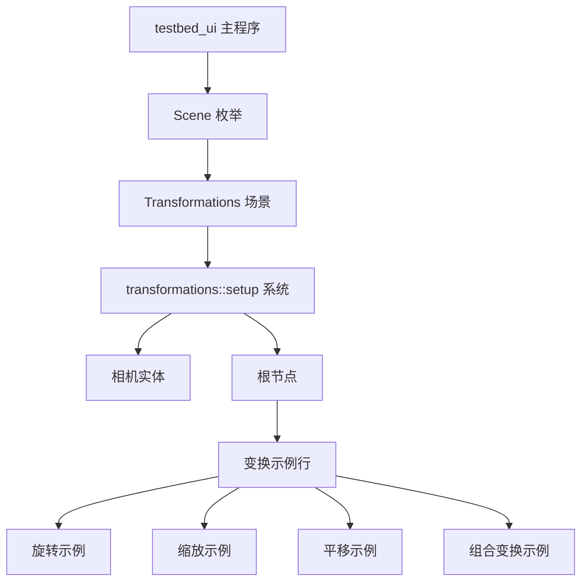

+++
title = "#21974 Add a UiTransform centered scene to examples/testbed/ui"
date = "2025-11-29T00:00:00"
draft = false
template = "pull_request_page.html"
in_search_index = false

[extra]
current_language = "zh-cn"
available_languages = {"en" = { name = "English", url = "/pull_request/bevy/2025-11/pr-21974-en-20251129" }, "zh-cn" = { name = "中文", url = "/pull_request/bevy/2025-11/pr-21974-zh-cn-20251129" }}
+++

# Add a UiTransform centered scene to examples/testbed/ui

## 基本信息
- **标题**: Add a UiTransform centered scene to examples/testbed/ui
- **PR链接**: https://github.com/bevyengine/bevy/pull/21974
- **作者**: kfc35
- **状态**: 已合并
- **标签**: C-Examples, S-Ready-For-Final-Review, D-Straightforward
- **创建时间**: 2025-11-29T06:32:57Z
- **合并时间**: 2025-11-29T21:17:38Z
- **合并者**: mockersf

## 描述翻译
# 目标

修复 #21815

## 解决方案

- 在 `examples/testbed/ui` 中添加一个名为 `Transformations` 的新场景，该场景演示了在节点上应用一些基本的 `UiTransform`。

这是我为 Bevy 提交的第一个 PR！

## 测试

我通过控制台运行了示例来测试新场景。

测试环境：桌面版 MacOS 15.7.1

## 展示


要查看，请在控制台中运行：`cargo run --package bevy --example testbed_ui`
按空格键 11 次直到看到新场景。

## 本次 Pull Request 的技术分析

这个 PR 解决了一个具体的问题：为 Bevy 的 UI 系统添加一个展示 `UiTransform` 功能的示例场景。从技术角度看，这是一个相对简单的功能添加，但对于理解 Bevy UI 系统的变换功能具有重要意义。

### 问题背景与上下文

在 #21815 中，用户报告需要更多的 UI 变换示例来帮助理解 `UiTransform` 组件的使用方式。`UiTransform` 是 Bevy UI 系统的核心组件之一，负责处理 UI 元素的平移、旋转和缩放变换，但现有的示例不够全面，特别是缺少组合变换的演示。

### 解决方案设计

开发者采用了直接在现有的 UI testbed 中添加新场景的方式。这种设计选择有几个优点：
1. 复用现有的测试框架和场景切换逻辑
2. 保持代码结构的一致性
3. 用户可以方便地在不同 UI 示例间切换对比

技术实现上，这个 PR 遵循了 Bevy 示例代码的标准模式：
- 使用 `OnEnter` 系统来处理场景初始化
- 利用 `DespawnOnExit` 组件自动清理资源
- 采用标准的 UI 节点构建方式

### 具体实现细节

核心实现位于新增的 `transformations` 模块中。这个模块展示了四种不同类型的变换：

```rust
// 旋转45度
UiTransform::from_rotation(Rot2::degrees(45.))

// 非均匀缩放
UiTransform::from_scale(Vec2::new(2., 0.5))

// 平移
UiTransform::from_translation(Val2::px(-50., 50.))

// 组合变换：平移 + 反射 + 旋转
UiTransform {
    translation: Val2::px(50., 0.),
    scale: Vec2::new(-1., 1.),
    rotation: Rot2::degrees(30.),
}
```

特别值得注意的是组合变换的示例，它展示了多个变换如何叠加作用，这对于理解变换的复合顺序非常有帮助。

### 技术洞察

这个实现揭示了几个重要的技术点：

1. **变换组合顺序**：Bevy 中的变换应用顺序通常是先缩放，再旋转，最后平移
2. **坐标系统**：UI 变换使用的是相对坐标系，平移量使用 `Val2` 类型支持像素和百分比值
3. **负值缩放**：通过设置 X 轴缩放为 -1 实现了水平反射效果

在性能方面，由于这只是示例代码，主要关注可读性而非优化。但在生产环境中，需要注意频繁的 UI 变换可能影响渲染性能。

### 影响与价值

这个 PR 的主要价值在于：
- 为开发者提供了直观的 `UiTransform` 使用参考
- 展示了变换的组合使用方式
- 完善了 Bevy UI 示例的覆盖范围
- 帮助用户理解 UI 变换的视觉表现

从代码质量角度看，这个实现很好地遵循了 Bevy 的代码风格和最佳实践，包括正确的组件使用、资源管理和错误处理。

## 视觉表示



## 关键文件变更

- `examples/testbed/ui.rs` (+88/-1)

### 主要变更分析

1. **场景注册**
```rust
// 在 main 函数中添加系统注册
.add_systems(OnEnter(Scene::Transformations), transformations::setup)
```

2. **枚举扩展**
```rust
// 在 Scene 枚举中添加新变体
enum Scene {
    // ... 其他场景
    Transformations,
}

// 更新场景切换逻辑
impl Next for Scene {
    fn next(&self) -> Self {
        match self {
            // ... 其他场景切换
            Scene::RadialGradient => Scene::Transformations,
            Scene::Transformations => Scene::Image,
        }
    }
}
```

3. **新模块实现**
```rust
mod transformations {
    use bevy::{color::palettes::css::*, prelude::*};

    pub fn setup(mut commands: Commands) {
        // 创建相机和根节点
        commands.spawn((Camera2d, DespawnOnExit(super::Scene::Transformations)));
        commands.spawn((
            Node {
                width: percent(100),
                height: percent(100),
                display: Display::Block,
                ..default()
            },
            DespawnOnExit(super::Scene::Transformations),
        ))
        .with_children(|parent| {
            // 创建四个变换示例
            for (transformation, label, background) in [
                // 旋转示例
                (UiTransform::from_rotation(Rot2::degrees(45.)), "Rotate 45 degrees", RED),
                // 缩放示例  
                (UiTransform::from_scale(Vec2::new(2., 0.5)), "Scale 2.x 0.5y", GREEN),
                // 平移示例
                (UiTransform::from_translation(Val2::px(-50., 50.)), "Translate -50px x +50px y", BLUE),
                // 组合变换示例
                (UiTransform {
                    translation: Val2::px(50., 0.),
                    scale: Vec2::new(-1., 1.),
                    rotation: Rot2::degrees(30.),
                }, "T 50px x\nS -1.x (refl)\nR 30deg", DARK_CYAN),
            ] {
                // 为每个示例创建一行包含两个方块的布局
                parent.spawn((Node {
                    width: percent(100),
                    margin: UiRect { top: px(50), bottom: px(50), ..default() },
                    align_items: AlignItems::Center,
                    justify_content: JustifyContent::SpaceAround,
                    ..default()
                },))
                .with_children(|row| {
                    // 变换前的参考方块
                    row.spawn((
                        Text::new("Before Tf"),
                        Node { width: px(100), height: px(100), border_radius: BorderRadius::bottom_right(px(25.)), ..default() },
                        BackgroundColor(background.into()),
                        TextFont::default(),
                    ));
                    // 应用变换后的方块
                    row.spawn((
                        Text::new(label),
                        Node { width: px(100), height: px(100), border_radius: BorderRadius::bottom_right(px(25.)), ..default() },
                        BackgroundColor(background.into()),
                        transformation,
                        TextFont::default(),
                    ));
                });
            }
        });
    }
}
```

## 延伸阅读

对于想要深入了解相关概念的开发者，建议参考：

1. [Bevy UI 官方文档](https://docs.rs/bevy_ui/latest/bevy_ui/) - 了解 Bevy UI 系统的完整 API
2. [变换矩阵基础知识](https://en.wikipedia.org/wiki/Transformation_matrix) - 理解计算机图形学中的变换原理
3. [Bevy ECS 系统](https://bevy-cheatbook.github.io/programming/systems.html) - 掌握 Bevy 的实体组件系统模式
4. [其他 UI 示例](https://github.com/bevyengine/bevy/tree/main/examples/ui) - 查看更多的 Bevy UI 使用示例

这个 PR 展示了如何在现有框架中添加功能模块的最佳实践，对于学习 Bevy 开发模式的新开发者具有很好的参考价值。