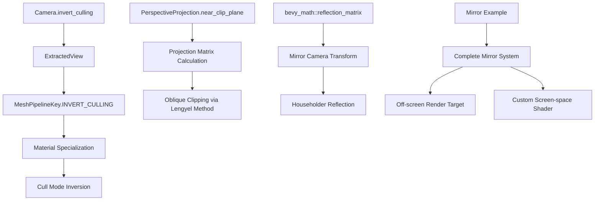

+++
title = "#13797 Implement the infrastructure needed to support portals and mirrors."
date = "2025-12-09T00:00:00"
draft = false
template = "pull_request_page.html"
in_search_index = true

[taxonomies]
list_display = ["show"]

[extra]
current_language = "en"
available_languages = {"en" = { name = "English", url = "/pull_request/bevy/2025-12/pr-13797-en-20251209" }, "zh-cn" = { name = "中文", url = "/pull_request/bevy/2025-12/pr-13797-zh-cn-20251209" }}
labels = ["C-Feature", "A-Rendering", "A-Math", "M-Release-Note"]
+++

# Title

## Basic Information
- **Title**: Implement the infrastructure needed to support portals and mirrors.
- **PR Link**: https://github.com/bevyengine/bevy/pull/13797
- **Author**: pcwalton
- **Status**: MERGED
- **Labels**: C-Feature, A-Rendering, S-Ready-For-Review, A-Math, M-Release-Note
- **Created**: 2024-06-10T18:55:21Z
- **Merged**: 2025-12-09T23:32:50Z
- **Merged By**: alice-i-cecile

## Description Translation
Implement the infrastructure needed to support portals and mirrors.

Bevy currently supports multiple cameras and rendering to off-screen render targets, so one might naïvely think that the engine has support for portals and mirrors already. However, Bevy is missing two key features that enable portals and mirrors at present:

1. Bevy has support for neither custom clip planes nor oblique clip planes. This prevents the construction of proper portals or mirrors, as meshes that intersect the portal plane must be clipped to render properly.

2. Bevy has no support for cameras that invert the culling mode, so meshes that are reflected across a plane will render inside-out.

This PR addresses the two issues above:

1. This commit introduces a new field on `PerspectiveProjection`, `near_clip_plane`, which allows the application to specify a custom near plane. That feature fully enables [Lengyel oblique clipping], which is the most optimal way to achieve a custom near clipping plane. It allows us to avoid having to support custom clip planes, which are often implemented inefficiently in hardware.

2. This patch adds a new field on the `Camera` component, `invert_culling`. This field causes the Bevy renderer to invert the front face setting when rendering the objects visible from that camera. When coupled with an appropriately-set [Householder matrix] on the camera, this allows correct rendering of objects reflected across a plane.

Additionally, this PR adds a new function to `bevy_math::mat3`, `reflection_matrix`. This generates the matrix that reflects objects across a plane, suitable for encoding into a `Transform`. It's fully documented for ease of use.

Finally, a new example, `mirror`, has been added. This example is a complete instance of a working mirror, combining a camera with a Householder matrix, oblique projection, and inverted culling with a custom material to render an animated mesh and its planar reflection. The camera and mesh may be moved with the mouse, and the off-screen render target that stores the rendered contents of the mirror world is properly resized when the user resizes the window.

[Lengyel oblique clipping]: https://terathon.com/lengyel/Lengyel-Oblique.pdf

[Householder matrix]: https://en.wikipedia.org/wiki/Householder_transformation


## The Story of This Pull Request

This PR addresses two fundamental technical gaps in Bevy's rendering system that prevented proper implementation of portals and mirrors. While Bevy already supported multiple cameras and off-screen render targets, the missing pieces were custom clipping planes and culling inversion for reflected scenes.

The core problem with portals and mirrors is geometry clipping. When you have a portal or mirror surface, any geometry that intersects the plane of that surface needs to be clipped to avoid rendering artifacts. Without custom clip planes, objects would render through the mirror plane, breaking the illusion. The second issue is that reflecting a scene across a plane flips the winding order of polygons, which causes standard backface culling to cull the wrong faces - what should be visible becomes culled, and vice versa.

The solution implements two complementary features. First, the `PerspectiveProjection` struct gains a `near_clip_plane` field that uses Lengyel's oblique clipping technique. This approach modifies the projection matrix to use an arbitrary plane as the near clipping plane, which is more efficient than hardware custom clip planes. The implementation in `adjust_perspective_matrix_for_clip_plane()` follows the mathematical derivation from Lengyel's paper, adapted for Bevy's reverse-Z projection system.

Second, a new `invert_culling` field is added to the `Camera` component. When this flag is true, the rendering pipeline flips the culling mode - materials that would normally cull back faces instead cull front faces, and vice versa. This is implemented by adding an `INVERT_CULLING` bit to `MeshPipelineKey`, which is set during view preparation and used during material specialization to swap the cull face.

To make these features usable, the PR also adds a `reflection_matrix` utility function to `bevy_math`. This generates a Householder transformation matrix that reflects points across a plane, which is essential for setting up the mirror camera's transform. The implementation follows the standard formula I - 2NNᵀ, where N is the plane normal.

The `mirror` example demonstrates the complete system working together. It creates a scene with a main camera, a mirror surface, and a secondary camera that renders the reflected scene to an off-screen texture. The mirror camera uses a Householder matrix to reflect the main camera's transform, sets `invert_culling` to true, and configures an oblique projection plane aligned with the mirror surface. The mirror material uses a custom shader that samples from the off-screen texture at screen-space coordinates, effectively compositing the reflection onto the mirror surface.

One important implementation detail is how the system handles window resizing. Since the off-screen render target needs to match the window dimensions, the example includes logic to recreate the render texture when the window size changes and update both the camera target and material texture references.

The changes are integrated throughout Bevy's rendering pipeline. The `invert_culling` flag propagates from the `Camera` component through `ExtractedView` to the mesh pipeline key system. The oblique clipping modifies the projection matrix calculation in both the standard and sub-view camera paths. The system maintains backward compatibility by using default values that preserve existing behavior.

## Visual Representation



## Key Files Changed

### `examples/3d/mirror.rs` (+677/-0)
This new example demonstrates a complete mirror implementation. It shows how to set up a mirror camera with inverted culling and oblique projection, create an off-screen render target, and use a custom material to display the reflection.

Key code showing mirror camera setup:
```rust
// Spawn the mirror camera with inverted culling
commands.spawn((
    Camera3d::default(),
    Camera {
        order: -1,
        target: mirror_render_target.clone().into(),
        invert_culling: true,
        ..default()
    },
    mirror_camera_transform,
    Projection::Perspective(mirror_camera_projection),
    MirrorCamera,
));
```

### `crates/bevy_camera/src/projection.rs` (+106/-4)
Adds oblique clipping support to `PerspectiveProjection`. The `near_clip_plane` field allows specifying a custom clipping plane, and the `adjust_perspective_matrix_for_clip_plane` method implements Lengyel's algorithm.

Key code implementing oblique clipping:
```rust
fn adjust_perspective_matrix_for_clip_plane(&self, matrix: &mut Mat4) {
    if self.near_clip_plane == vec4(0.0, 0.0, -1.0, -self.near) {
        return;
    }
    
    let c = self.near_clip_plane;
    let q_prime = vec4(c.x.signum(), c.y.signum(), 0.0, 1.0);
    let q = matrix.inverse() * q_prime;
    let a = -q.z / c.dot(q);
    let m3_prime = Vec4::NEG_Z - c * a;
    
    matrix.x_axis.z = m3_prime.x;
    matrix.y_axis.z = m3_prime.y;
    matrix.z_axis.z = m3_prime.z;
    matrix.w_axis.z = m3_prime.w;
}
```

### `assets/shaders/screen_space_texture_material.wgsl` (+37/-0)
A custom shader for the mirror material that samples its emissive texture at screen-space coordinates rather than UV coordinates.

Key shader code:
```rust
@fragment
fn fragment(in: VertexOutput, @builtin(front_facing) is_front: bool) -> FragmentOutput {
    var pbr_input = pbr_input_from_standard_material(in, is_front);
    
    // Use zero alpha to avoid multiplying the emissive by the view exposure.
    pbr_input.material.emissive = vec4(
        textureLoad(emissive_texture, vec2<i32>(floor(in.position.xy)), 0).rgb,
        0.0
    );
    
    var out: FragmentOutput;
    out.color = apply_pbr_lighting(pbr_input);
    out.color = main_pass_post_lighting_processing(pbr_input, out.color);
    return out;
}
```

### `crates/bevy_math/src/mat3.rs` (+30/-0)
Adds the `reflection_matrix` utility function for generating Householder reflection matrices.

Key implementation:
```rust
pub fn reflection_matrix(plane_normal: Vec3) -> Mat3A {
    let n_nt = Mat3A::from_cols(
        Vec3A::from(plane_normal) * plane_normal.x,
        Vec3A::from(plane_normal) * plane_normal.y,
        Vec3A::from(plane_normal) * plane_normal.z,
    );
    
    Mat3A::IDENTITY - n_nt * 2.0
}
```

### `crates/bevy_pbr/src/pbr_material.rs` (+13/-9)
Updates material specialization to handle inverted culling based on the `MeshPipelineKey::INVERT_CULLING` flag.

Key logic for culling inversion:
```rust
descriptor.primitive.cull_mode = match (
    key.bind_group_data.contains(StandardMaterialKey::CULL_FRONT),
    key.bind_group_data.contains(StandardMaterialKey::CULL_BACK),
    key.mesh_key.contains(MeshPipelineKey::INVERT_CULLING),
) {
    (true, false, false) | (false, true, true) => Some(Face::Front),
    (false, true, false) | (true, false, true) => Some(Face::Back),
    _ => None,
};
```

## Further Reading

1. [Lengyel, Eric. "Oblique View Frustum Depth Projection and Clipping". Journal of Game Development, 2005](https://terathon.com/lengyel/Lengyel-Oblique.pdf) - The foundational paper on efficient oblique clipping planes.
2. [Householder Transformation on Wikipedia](https://en.wikipedia.org/wiki/Householder_transformation) - Mathematical background on reflection matrices.
3. [Bevy Camera System Documentation](https://docs.rs/bevy_camera/latest/bevy_camera/) - Understanding Bevy's camera and projection systems.
4. [Bevy PBR Rendering Pipeline](https://github.com/bevyengine/bevy/tree/main/crates/bevy_pbr) - Details on Bevy's physically-based rendering system and material specialization.