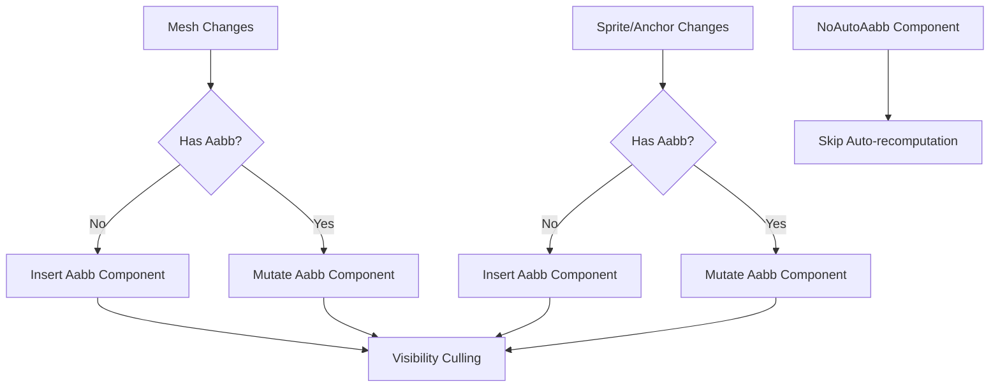

+++
title = "#18742 Recompute AABBs"
date = "2025-12-14T00:00:00"
draft = false
template = "pull_request_page.html"
in_search_index = true

[taxonomies]
list_display = ["show"]

[extra]
current_language = "en"
available_languages = {"en" = { name = "English", url = "/pull_request/bevy/2025-12/pr-18742-en-20251214" }, "zh-cn" = { name = "中文", url = "/pull_request/bevy/2025-12/pr-18742-zh-cn-20251214" }}
labels = ["C-Bug", "A-Rendering", "C-Performance", "A-Animation"]
+++

# Title
**Recompute AABBs**

## Basic Information
- **Title**: Recompute AABBs
- **PR Link**: https://github.com/bevyengine/bevy/pull/18742
- **Author**: aevyrie
- **Status**: MERGED
- **Labels**: C-Bug, A-Rendering, C-Performance, S-Ready-For-Final-Review, A-Animation
- **Created**: 2025-04-07T02:00:42Z
- **Merged**: 2025-12-14T23:20:44Z
- **Merged By**: alice-i-cecile

## Description Translation
# Objective

- Recompute AABBs when meshes change.
- Optimize sprite AABB re-computation to avoid component insertion where mutation is possible.
- Fixes #4294 and closes #7971

## Solution

- Implement the things.

## Testing

- CI

## The Story of This Pull Request

The core problem this PR addresses is that in Bevy, Axis-Aligned Bounding Boxes (AABBs) for entities were not being updated when their underlying meshes changed. This is a critical issue for visibility culling, as an outdated AABB could cause an entity to be incorrectly culled (not rendered) or force unnecessary rendering when it's outside the view frustum. The bug reports (#4294, #7971) specifically highlighted cases where animated meshes or sprites would disappear because their AABBs weren't recomputed after their mesh assets were modified.

The initial implementation only computed AABBs for entities that didn't already have one. If a mesh changed after the initial AABB calculation, the system would never update it. This made dynamic meshes (like those used in animations) problematic because their changing vertex positions required updated bounding volumes.

The solution involves two main improvements: First, we need to detect when meshes change and trigger AABB recomputation. Second, we should optimize this process by avoiding expensive component insertion operations when we can simply mutate existing AABB components.

Looking at the implementation, the developer made several key changes. In the 3D visibility system (`crates/bevy_camera/src/visibility/mod.rs`), the `calculate_bounds` system was split into two distinct queries:

1. **New entities without AABBs**: For entities that have a `Mesh3d` component but no `Aabb` component, we insert a new AABB component.
2. **Existing entities with changed meshes**: For entities that already have an AABB component but whose mesh has changed (detected via `AssetChanged<Mesh3d>` or `Changed<Mesh3d>`), we mutate the existing AABB component.

This separation is crucial for performance. Inserting components is more expensive than mutating existing ones because it can trigger archetype changes and require moving entities between tables. By using `par_iter_mut()` with parallel iteration for the update path, the system can efficiently update many AABBs concurrently.

A new component `NoAutoAabb` was introduced to give developers control over this automatic recomputation. This is useful for entities that already have correct AABBs or for performance optimization when you have many entities and want to avoid the table scans that the system performs.

The system ordering was also adjusted. The `CalculateBounds` system now runs after `AssetEventSystems` to ensure mesh asset changes are processed, and it's marked as ambiguous with itself to prevent multiple instances from running concurrently. This ensures AABBs are recomputed after mesh changes but before visibility checking.

For 2D sprites (`crates/bevy_sprite/src/lib.rs`), a similar approach was taken but with additional complexity. Sprite AABBs depend on both the `Sprite` component (which contains size information) and the `Anchor` component (which affects the AABB center). The system was refactored to:

1. Handle new mesh entities without AABBs (insert component)
2. Handle existing mesh entities with changed meshes (mutate component)
3. Handle new sprite entities without AABBs (insert component)
4. Handle existing sprite entities with changed sprites or anchors (mutate component)

The sprite AABB calculation logic was extracted into a helper function `sprite_size` to avoid code duplication. The queries use `Without<Mesh2d>` and `Without<Sprite>` constraints to ensure they're disjoint and can safely run in parallel without conflicting access to components.

One important optimization is the use of `set_if_neq()` when updating AABB components. This method only updates the component if the new value differs from the current one, avoiding unnecessary change detection triggers and potential downstream system work.

The impact of these changes is significant: animated meshes and sprites now maintain correct AABBs throughout their lifecycle, fixing visibility culling for dynamic content. The performance improvements from avoiding component insertion and using parallel iteration make the system scalable for scenes with many dynamic objects. The addition of `NoAutoAabb` provides an escape hatch for advanced use cases where manual AABB control is needed.

## Visual Representation



## Key Files Changed

### 1. `crates/bevy_camera/src/visibility/mod.rs` (+45/-9)
**Purpose**: Fix AABB recomputation for 3D meshes when meshes change.

Key changes:
- Added `NoAutoAabb` component to disable automatic AABB recomputation
- Split `calculate_bounds` system into two queries for new entities and updated entities
- Added parallel iteration for updating existing AABBs
- Adjusted system ordering to run after asset events

```rust
// Before: Only handled entities without AABB
pub fn calculate_bounds(
    mut commands: Commands,
    meshes: Res<Assets<Mesh>>,
    without_aabb: Query<(Entity, &Mesh3d), (Without<Aabb>, Without<NoFrustumCulling>)>,
) {
    for (entity, mesh_handle) in &without_aabb {
        if let Some(mesh) = meshes.get(mesh_handle)
            && let Some(aabb) = mesh.compute_aabb()
        {
            commands.entity(entity).try_insert(aabb);
        }
    }
}

// After: Handles both new entities and updates to existing ones
pub fn calculate_bounds(
    mut commands: Commands,
    meshes: Res<Assets<Mesh>>,
    new_aabb: Query<
        (Entity, &Mesh3d),
        (
            Without<Aabb>,
            Without<NoFrustumCulling>,
            Without<NoAutoAabb>,
        ),
    >,
    mut update_aabb: Query<
        (&Mesh3d, &mut Aabb),
        (
            Or<(AssetChanged<Mesh3d>, Changed<Mesh3d>)>,
            Without<NoFrustumCulling>,
            Without<NoAutoAabb>,
        ),
    >,
) {
    // Insert AABB for new entities
    for (entity, mesh_handle) in &new_aabb {
        if let Some(mesh) = meshes.get(mesh_handle)
            && let Some(aabb) = mesh.compute_aabb()
        {
            commands.entity(entity).try_insert(aabb);
        }
    }
    
    // Update AABB for existing entities with changed meshes
    update_aabb
        .par_iter_mut()
        .for_each(|(mesh_handle, mut old_aabb)| {
            if let Some(aabb) = meshes.get(mesh_handle).and_then(MeshAabb::compute_aabb) {
                *old_aabb = aabb;
            }
        });
}
```

### 2. `crates/bevy_sprite/src/lib.rs` (+72/-14)
**Purpose**: Fix AABB recomputation for 2D sprites and meshes when they change.

Key changes:
- Split sprite AABB calculation into separate paths for new and updated entities
- Added helper function to compute sprite size from various sources (custom_size, rect, atlas)
- Used parallel iteration for updating existing AABB components
- Added `set_if_neq()` to avoid unnecessary updates

```rust
// Sprite size calculation helper (extracted for reuse)
let sprite_size = |sprite: &Sprite| -> Option<Vec2> {
    sprite
        .custom_size
        .or_else(|| sprite.rect.map(|rect| rect.size()))
        .or_else(|| match &sprite.texture_atlas {
            Some(atlas) => {
                atlases
                    .get(&atlas.layout)
                    .and_then(|layout| layout.textures.get(atlas.index as usize))
                    .map(|rect| rect.size().as_vec2())
            }
            None => images
                .get(&sprite.image)
                .and_then(|image| image.texture_descriptor.size.as_vec2().try_into().ok())
                .and_then(|size: Vec2| {
                    sprite
                        .rect
                        .map(|rect| rect.size())
                        .or(Some(size))
                }),
        })
};

// New sprites require inserting a component
for (size, (entity, anchor)) in new_sprite_aabb
    .iter()
    .filter_map(|(entity, sprite, anchor)| sprite_size(sprite).zip(Some((entity, anchor))))
{
    let aabb = Aabb {
        center: (-anchor.as_vec() * size).extend(0.0).into(),
        half_extents: (0.5 * size).extend(0.0).into(),
    };
    commands.entity(entity).try_insert(aabb);
}

// Updated sprites can take the fast path with parallel component mutation
update_sprite_aabb
    .par_iter_mut()
    .for_each(|(sprite, mut aabb, anchor)| {
        if let Some(size) = sprite_size(sprite) {
            aabb.set_if_neq(Aabb {
                center: (-anchor.as_vec() * size).extend(0.0).into(),
                half_extents: (0.5 * size).extend(0.0).into(),
            });
        }
    });
```

## Further Reading

1. **Bevy ECS Change Detection**: Understanding how `Changed<T>`, `AssetChanged<T>`, and `set_if_neq()` work is crucial for optimizing systems that respond to component changes.
2. **Parallel Iteration in Bevy**: The `par_iter_mut()` method enables parallel processing of entities, which can significantly improve performance for systems that process many entities.
3. **Frustum Culling**: Learn how AABBs are used in visibility determination to understand why correct AABB computation is essential for rendering performance.
4. **Bevy System Ordering**: The PR adjusts system sets and ordering constraints, which is important for ensuring systems run in the correct sequence.
5. **Component Insertion vs Mutation**: The performance difference between inserting new components and mutating existing ones is a key consideration in ECS design.