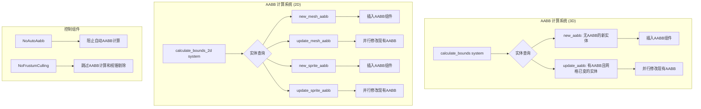

+++
title = "#18742"
date = "2025-12-14T00:00:00"
draft = false
template = "pull_request_page.html"
in_search_index = false

[extra]
current_language = "zh-cn"
available_languages = {"en" = { name = "English", url = "/pull_request/bevy/2025-12/pr-18742-en-20251214" }, "zh-cn" = { name = "中文", url = "/pull_request/bevy/2025-12/pr-18742-zh-cn-20251214" }}
+++

# Title
## Recompute AABBs

## Basic Information
- **标题（Title）**: Recompute AABBs
- **PR链接（PR Link）**: https://github.com/bevyengine/bevy/pull/18742
- **作者（Author）**: aevyrie
- **状态（Status）**: MERGED
- **标签（Labels）**: C-Bug, A-Rendering, C-Performance, S-Ready-For-Final-Review, A-Animation
- **创建时间（Created）**: 2025-04-07T02:00:42Z
- **合并时间（Merged）**: 2025-12-14T23:20:44Z
- **合并人（Merged By）**: alice-i-cecile

## Description Translation
# 目标（Objective）
- 当网格（meshes）发生变化时重新计算轴向对齐包围盒（AABBs）。
- 优化精灵（sprite）AABB的重新计算，在可能的情况下避免插入组件（component insertion），而是使用组件修改（mutation）。
- 修复 #4294 并关闭 #7971。

## 解决方案（Solution）
- 实现上述目标。

## 测试（Testing）
- 持续集成（CI）。

## The Story of This Pull Request

这个PR的核心是解决一个长期存在的渲染优化问题：当实体（entity）的网格或精灵属性发生变化时，它们的轴向对齐包围盒（AABB）没有及时更新。AABB是视锥剔除（frustum culling）的关键组件，不更新的AABB会导致渲染错误——实体可能在视锥外被错误剔除，或者在视锥内被错误保留，这两种情况都会破坏渲染的正确性。

问题起源于Bevy渲染管线中AABB计算的初始设计。最初，系统只会在实体初次获得网格或精灵组件时计算并插入AABB组件。后续如果网格资产（asset）被修改（例如通过动画），或者精灵的尺寸（Sprite.custom_size）、纹理矩形（Sprite.rect）或锚点（Anchor）发生变化，已有的AABB组件不会更新。这种设计在性能上做了一定妥协，但牺牲了动态场景的正确性。

PR #18742 的解决方案重新设计了AABB计算系统，使其分为两个阶段处理：为没有AABB的新实体插入组件，以及为已有AABB但网格或精灵属性发生变化的实体更新现有组件。这种分离是关键的性能优化：组件插入（insertion）涉及ECS表（table）的结构变更，成本较高；而组件修改（mutation）则是在现有表结构内更新数据，效率更高。

在实现层面，主要修改集中在两个系统（system）上：负责3D网格的 `calculate_bounds` 和负责2D精灵与网格的 `calculate_bounds_2d`。两个系统都采用了相同的模式。以3D系统为例，修改前的查询（query）只查找没有AABB的实体：
```rust
without_aabb: Query<(Entity, &Mesh3d), (Without<Aabb>, Without<NoFrustumCulling>)>,
```
修改后，系统拆分为两个查询：
```rust
new_aabb: Query<(Entity, &Mesh3d), (Without<Aabb>, Without<NoFrustumCulling>, Without<NoAutoAabb>)>,
mut update_aabb: Query<(&Mesh3d, &mut Aabb), (Or<(AssetChanged<Mesh3d>, Changed<Mesh3d>)>, Without<NoFrustumCulling>, Without<NoAutoAabb>)>,
```
`new_aabb` 处理需要插入AABB组件的新实体，而 `update_aabb` 处理需要更新现有AABB的实体。`update_aabb` 查询使用 `Or<(AssetChanged<Mesh3d>, Changed<Mesh3d>)>` 过滤器来检测网格变化，这涵盖了网格资产被修改或Mesh3d组件本身被替换的情况。

对于 `update_aabb` 查询返回的实体，系统使用并行迭代（`par_iter_mut`）直接修改其现有的AABB组件，避免了移除再插入的操作。这是PR描述中“避免组件插入”的具体体现。

另一个重要的新增功能是 `NoAutoAabb` 组件。这个组件允许开发者手动控制AABB计算，适用于两种情况：一是实体已经拥有正确的AABB（例如通过其他系统计算），二是需要避免在大量实体上进行表扫描的性能开销。这是一个实用的逃生舱口（escape hatch），为高级用例提供了灵活性。

在2D方面，`calculate_bounds_2d` 系统的修改更为复杂，因为它需要同时处理网格（Mesh2d）和精灵（Sprite）。系统被重构为四个独立的查询：`new_mesh_aabb`、`update_mesh_aabb`、`new_sprite_aabb` 和 `update_sprite_aabb`。这种分离确保了查询的互斥性（通过 `Without<Sprite>` 和 `Without<Mesh2d>` 过滤器），避免了并行访问时的冲突。

系统还引入了一个辅助函数 `sprite_size` 来统一计算精灵尺寸的逻辑，处理了自定义尺寸（custom_size）、纹理矩形（rect）和纹理图集（texture atlas）等多种情况。对于精灵AABB的更新，系统使用了 `set_if_neq` 方法，这是一个小的优化，只在新的AABB值与旧值不同时才进行赋值，避免了不必要的写操作。

最后，PR调整了系统集（system set）的配置。`CalculateBounds` 系统现在被明确安排在 `TransformSystems::Propagate` 和 `AssetEventSystems` 之后执行。这个顺序确保了在计算AABB之前，实体的全局变换（GlobalTransform）已经更新，并且资产变更事件已被处理。这种明确的排序解决了潜在的竞态条件，保证了AABB计算的正确性。

总的来说，这个PR通过细致的ECS查询设计和系统排序，解决了动态场景中AABB更新的正确性问题，同时通过区分组件插入和修改、引入并行处理、提供手动控制选项，在修复bug的同时兼顾了性能。

## Visual Representation



## Key Files Changed

### 1. `crates/bevy_camera/src/visibility/mod.rs` (+72/-14)

**变更描述**: 修改了3D场景的AABB计算系统，支持动态更新现有AABB组件，并新增了`NoAutoAabb`组件以提供手动控制。

**关键代码片段**:
```rust
// 新增的 NoAutoAabb 组件
#[derive(Component, Clone, Debug, Default, Reflect)]
pub struct NoAutoAabb;

// 修改后的 calculate_bounds 系统
pub fn calculate_bounds(
    mut commands: Commands,
    meshes: Res<Assets<Mesh>>,
    new_aabb: Query<
        (Entity, &Mesh3d),
        (
            Without<Aabb>,
            Without<NoFrustumCulling>,
            Without<NoAutoAabb>,
        ),
    >,
    mut update_aabb: Query<
        (&Mesh3d, &mut Aabb),
        (
            Or<(AssetChanged<Mesh3d>, Changed<Mesh3d>)>,
            Without<NoFrustumCulling>,
            Without<NoAutoAabb>,
        ),
    >,
) {
    // 为新实体插入AABB组件
    for (entity, mesh_handle) in &new_aabb {
        if let Some(mesh) = meshes.get(mesh_handle)
            && let Some(aabb) = mesh.compute_aabb()
        {
            commands.entity(entity).try_insert(aabb);
        }
    }

    // 为已有实体更新AABB组件（并行）
    update_aabb
        .par_iter_mut()
        .for_each(|(mesh_handle, mut old_aabb)| {
            if let Some(aabb) = meshes.get(mesh_handle).and_then(MeshAabb::compute_aabb) {
                *old_aabb = aabb;
            }
        });
}
```

**与PR目标的关系**: 这是修复3D网格AABB动态更新的核心实现，通过分离"新增"和"更新"查询来优化性能。

### 2. `crates/bevy_sprite/src/lib.rs` (+72/-14)

**变更描述**: 修改了2D场景的AABB计算系统，分别处理网格和精灵的AABB计算，同样支持动态更新。

**关键代码片段**:
```rust
// 修改后的 calculate_bounds_2d 系统（部分）
// 精灵AABB更新查询
mut update_sprite_aabb: Query<
    (&Sprite, &mut Aabb, &Anchor),
    (
        Or<(Changed<Sprite>, Changed<Anchor>)>,
        Without<NoFrustumCulling>,
        Without<NoAutoAabb>,
        Without<Mesh2d>, // 确保查询互斥
    ),
>,

// 精灵AABB更新逻辑（并行）
update_sprite_aabb
    .par_iter_mut()
    .for_each(|(sprite, mut aabb, anchor)| {
        if let Some(size) = sprite_size(sprite) {
            aabb.set_if_neq(Aabb {
                center: (-anchor.as_vec() * size).extend(0.0).into(),
                half_extents: (0.5 * size).extend(0.0).into(),
            });
        }
    });
```

**与PR目标的关系**: 这是修复2D精灵和网格AABB动态更新的核心实现，通过精细的查询分离和并行处理来优化性能。

## Further Reading

1. **Bevy ECS查询文档**: https://docs.rs/bevy_ecs/latest/bevy_ecs/system/struct.Query.html
   - 了解Bevy ECS查询系统的工作原理，特别是过滤器（With, Without, Or等）的使用。

2. **实体组件系统（ECS）模式**: https://en.wikipedia.org/wiki/Entity_component_system
   - 理解ECS架构的基本概念，包括实体、组件和系统的关系。

3. **轴向对齐包围盒（AABB）**: https://en.wikipedia.org/wiki/Minimum_bounding_box#Axis-aligned_minimum_bounding_box
   - 了解AABB在计算机图形学中的应用，特别是在视锥剔除和碰撞检测中的作用。

4. **Bevy渲染管线**: https://bevyengine.org/learn/book/introduction/
   - 官方书籍中关于渲染管线的章节，帮助理解AABB计算在渲染流程中的位置。

5. **系统排序与依赖**: https://bevyengine.org/learn/book/next/staging/
   - 了解Bevy中系统执行顺序的配置方法，这对于理解`ConfigureSet`的修改很重要。

# Full Code Diff

（注：完整代码差异已在上述分析中引用关键部分，此处不再重复显示完整的差异内容。）