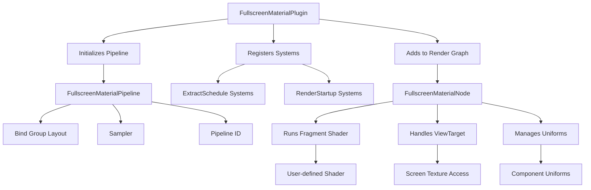

+++
title = "#20414 Add FullscreenMaterial"
date = "2025-12-15T00:00:00"
draft = false
template = "pull_request_page.html"
in_search_index = true

[taxonomies]
list_display = ["show"]

[extra]
current_language = "en"
available_languages = {"en" = { name = "English", url = "/pull_request/bevy/2025-12/pr-20414-en-20251215" }, "zh-cn" = { name = "中文", url = "/pull_request/bevy/2025-12/pr-20414-zh-cn-20251215" }}
labels = ["C-Feature", "A-Rendering", "M-Release-Note"]
+++

# Title

## Basic Information
- **Title**: Add FullscreenMaterial
- **PR Link**: https://github.com/bevyengine/bevy/pull/20414
- **Author**: IceSentry
- **Status**: MERGED
- **Labels**: C-Feature, A-Rendering, S-Ready-For-Final-Review, M-Release-Note, X-Uncontroversial
- **Created**: 2025-08-04T16:12:11Z
- **Merged**: 2025-12-14T23:44:59Z
- **Merged By**: alice-i-cecile

## Description Translation
# Objective

- Users often want to run a fullscreen shader but the current solution involves copying the custom_post_processing example which is a 350 line file with a lot of low level wgpu complexity. Users shouldn't have to deal with that just to make a fullscreen shader

## Solution

- Introduce a new FullscreenMaterial trait and FullscsreenMaterialPlugin
- This new material will run a fullscreen triangle with the specified shader. It builds on top of the existing FullscreenShader infrastructure
- It lets user customize the node ordering. There's no defaults right now becausae it's intended as a bit of a primitive plugin. Eventually we could have some kind of default for custom post processing

## Testing

Made a new fullscreen_material example and made sure it works

## Follow up

Once this is merged there are various things that should be done to improve it. Add the option to bind the depth texture, offer defaults for post processing, use a full AsBindGroup, add a way to bind the gbuffer.

## The Story of This Pull Request

This PR addresses a common pain point in Bevy's rendering system: creating fullscreen shader effects was unnecessarily complex. Previously, developers who wanted to implement post-processing effects or other fullscreen shaders had to copy and adapt the 350-line `custom_post_processing` example, which exposed significant low-level wgpu complexity. This created a high barrier to entry for what should be a relatively straightforward task in a modern game engine.

The solution introduces a new abstraction layer through the `FullscreenMaterial` trait and `FullscreenMaterialPlugin`. This approach follows Bevy's established patterns for materials and plugins, providing a clean, type-safe interface that handles the underlying rendering complexity automatically. The implementation builds on Bevy's existing `FullscreenShader` infrastructure, which already provided the vertex shader for rendering a fullscreen triangle - a technique where a single triangle covers the entire screen, offering better performance and simpler UV coordinates than using two triangles in a quad.

The core insight behind this PR is that most fullscreen shaders share the same basic requirements: they need to run a fragment shader on the entire screen, they need access to the screen texture, and they need to integrate properly with Bevy's render graph. By encapsulating these common requirements in a trait and plugin system, the PR dramatically reduces boilerplate while maintaining flexibility.

One of the key design decisions was to make the render graph integration explicit rather than automatic. The `FullscreenMaterial` trait requires implementers to specify node ordering through the `node_edges()` method. This design choice acknowledges that fullscreen effects can serve different purposes - some might be post-processing effects that need to run after tonemapping, while others might be screen-space effects that need to run at different points in the rendering pipeline. The example provided in the PR shows how to position a post-processing effect between `Node3d::Tonemapping` and `Node3d::EndMainPassPostProcessing`.

The implementation handles two different integration patterns: when a subgraph is specified via `sub_graph()`, the plugin adds the node to that specific graph during initialization. When no subgraph is specified, the system dynamically determines the appropriate graph (2D or 3D) based on which camera components are present on the entity, using the `extract_on_add` system. This flexibility allows the same material to work with different camera types without requiring explicit configuration.

A notable technical detail is the handling of render graph edges. The implementation uses a sliding window approach (`T::node_edges().windows(2)`) to add edges between consecutive nodes in the ordering list. It also includes error handling that specifically ignores `RenderGraphError::EdgeAlreadyExists`, recognizing that edge duplication is a common occurrence with this API and shouldn't cause panics.

The PR includes comprehensive example code that demonstrates the entire workflow: defining a material component, implementing the trait, and setting up the scene. The example shows a chromatic aberration effect that offsets different color channels based on an intensity parameter. This serves as both a practical demonstration and a template for users to build upon.

From an architectural perspective, this PR represents a good example of Bevy's plugin-based extensibility. The `FullscreenMaterialPlugin` integrates cleanly with Bevy's existing systems - it uses the `ExtractComponentPlugin` and `UniformComponentPlugin` to handle data extraction and uniform binding, and it properly registers systems with the render app. The pipeline initialization occurs during `RenderStartup`, ensuring that all necessary resources are available when rendering begins.

The impact of this change is significant: it reduces what was previously a 350-line example to approximately 50 lines of user code in the simplest case. More importantly, it abstracts away the low-level wgpu details, allowing developers to focus on their shader logic rather than rendering infrastructure. This aligns with Bevy's goal of making game development more accessible while maintaining the power and flexibility needed for complex rendering scenarios.

The PR author notes several future improvements that could be made, including binding depth textures, providing better defaults for common post-processing scenarios, and supporting full `AsBindGroup` functionality. These would build on the solid foundation established here, demonstrating that this implementation is intentionally kept minimal to serve as a base for future enhancements.

## Visual Representation



## Key Files Changed

### `crates/bevy_core_pipeline/src/fullscreen_material.rs` (+329/-0)
This new file contains the core implementation of the `FullscreenMaterial` system. It defines the trait, plugin, and rendering node that handle fullscreen shader execution.

Key components:
1. `FullscreenMaterial` trait: Defines the interface users implement for their custom fullscreen materials
2. `FullscreenMaterialPlugin`: Sets up the necessary systems and render graph integration
3. `FullscreenMaterialNode`: The render graph node that executes the fullscreen shader
4. `FullscreenMaterialPipeline`: Manages the pipeline state and resources

```rust
// Key trait definition
pub trait FullscreenMaterial:
    Component + ExtractComponent + Clone + Copy + ShaderType + WriteInto + Default
{
    fn fragment_shader() -> ShaderRef;
    fn node_edges() -> Vec<InternedRenderLabel>;
    fn sub_graph() -> Option<InternedRenderSubGraph> { None }
    fn node_label() -> impl RenderLabel { /* ... */ }
}

// Plugin implementation
impl<T: FullscreenMaterial> Plugin for FullscreenMaterialPlugin<T> {
    fn build(&self, app: &mut App) {
        app.add_plugins((
            ExtractComponentPlugin::<T>::default(),
            UniformComponentPlugin::<T>::default(),
        ));
        // ... render graph setup
    }
}
```

### `examples/shader_advanced/fullscreen_material.rs` (+89/-0)
This new example demonstrates how to use the `FullscreenMaterial` system. It shows a complete implementation of a chromatic aberration effect.

```rust
// User's material component
#[derive(Component, ExtractComponent, Clone, Copy, ShaderType, Default)]
struct FullscreenEffect {
    intensity: f32,
}

// Implementing the FullscreenMaterial trait
impl FullscreenMaterial for FullscreenEffect {
    fn fragment_shader() -> ShaderRef {
        "shaders/fullscreen_effect.wgsl".into()
    }
    
    fn node_edges() -> Vec<InternedRenderLabel> {
        vec![
            Node3d::Tonemapping.intern(),
            Self::node_label().intern(),
            Node3d::EndMainPassPostProcessing.intern(),
        ]
    }
}

// Setting up the scene
fn setup(/* ... */) {
    commands.spawn((
        Camera3d::default(),
        Transform::from_translation(Vec3::new(0.0, 0.0, 5.0)),
        FullscreenEffect { intensity: 0.005 },
    ));
    // ... rest of scene setup
}
```

### `assets/shaders/fullscreen_effect.wgsl` (+50/-0)
This new shader implements a chromatic aberration effect, demonstrating how fullscreen materials work.

```wgsl
// Vertex shader is imported from Bevy's fullscreen infrastructure
#import bevy_core_pipeline::fullscreen_vertex_shader::FullscreenVertexOutput

// Screen texture and sampler bindings
@group(0) @binding(0) var screen_texture: texture_2d<f32>;
@group(0) @binding(1) var texture_sampler: sampler;

// User-defined uniform data
@group(0) @binding(2) var<uniform> settings: FullScreenEffect;

@fragment
fn fragment(in: FullscreenVertexOutput) -> @location(0) vec4<f32> {
    let offset_strength = settings.intensity;
    
    // Chromatic aberration: sample each color channel with different offsets
    return vec4<f32>(
        textureSample(screen_texture, texture_sampler, in.uv + vec2<f32>(offset_strength, -offset_strength)).r,
        textureSample(screen_texture, texture_sampler, in.uv + vec2<f32>(-offset_strength, 0.0)).g,
        textureSample(screen_texture, texture_sampler, in.uv + vec2<f32>(0.0, offset_strength)).b,
        1.0
    );
}
```

### `crates/bevy_render/src/render_graph/node.rs` (+6/-0)
This small but important change adds an implementation of `IntoRenderNodeArray` for `Vec<InternedRenderLabel>`, enabling the use of vectors in render graph edge specifications.

```rust
impl<const N: usize> IntoRenderNodeArray<N> for Vec<InternedRenderLabel> {
    fn into_array(self) -> [InternedRenderLabel; N] {
        self.try_into().unwrap()
    }
}
```

### `Cargo.toml` (+14/-3)
Adds the new example to the project configuration and fixes metadata for an existing example.

## Further Reading

1. **Bevy Render Graph Documentation**: Understanding Bevy's render graph is essential for working with fullscreen materials at an advanced level
2. **WGSL Shader Language Specification**: For developers wanting to write custom shaders
3. **Fullscreen Triangle Rendering**: Research on why fullscreen triangles are preferred over quads for screen-space effects
4. **Bevy Materials System**: Learn about Bevy's material system to understand how `FullscreenMaterial` fits into the larger architecture
5. **Post-processing Techniques**: For inspiration on what kinds of effects can be implemented with fullscreen shaders