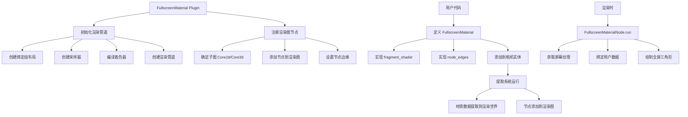

+++
title = "#20414 Add FullscreenMaterial"
date = "2025-12-15T00:00:00"
draft = false
template = "pull_request_page.html"
in_search_index = false

[extra]
current_language = "zh-cn"
available_languages = {"en" = { name = "English", url = "/pull_request/bevy/2025-12/pr-20414-en-20251215" }, "zh-cn" = { name = "中文", url = "/pull_request/bevy/2025-12/pr-20414-zh-cn-20251215" }}
+++

# Title
## Add FullscreenMaterial

## Basic Information
- **标题**: Add FullscreenMaterial
- **PR 链接**: https://github.com/bevyengine/bevy/pull/20414
- **作者**: IceSentry
- **状态**: 已合并
- **标签**: C-Feature, A-Rendering, S-Ready-For-Final-Review, M-Release-Note, X-Uncontroversial
- **创建时间**: 2025-08-04T16:12:11Z
- **合并时间**: 2025-12-14T23:44:59Z
- **合并人**: alice-i-cecile

## 描述翻译
# 目标

- 用户经常想要运行全屏着色器，但当前的解决方案需要复制 `custom_post_processing` 示例，这是一个包含大量底层 wgpu 复杂性的 350 行文件。用户不应该仅仅为了制作一个全屏着色器而处理这些细节

## 解决方案

- 引入新的 `FullscreenMaterial` trait 和 `FullscreenMaterialPlugin`
- 这种新材质将使用指定的着色器运行全屏三角形。它建立在现有的 `FullscreenShader` 基础设施之上
- 它允许用户自定义节点排序。目前没有默认值，因为它旨在作为一个基础插件。最终我们可能会为自定义后处理提供某种默认值

## 测试

创建了一个新的 `fullscreen_material` 示例并确保其正常工作

## 后续工作

合并后，应进行各种改进。添加绑定深度纹理的选项，为后处理提供默认值，使用完整的 `AsBindGroup`，添加绑定 gbuffer 的方法

## 本 PR 的技术分析

### 问题与背景
Bevy 渲染系统中存在一个常见需求：用户希望运行全屏着色器效果，比如后处理特效（颜色校正、色差、模糊等）。在 PR #20414 之前，实现这种功能的唯一方法是复制 `custom_post_processing` 示例，该示例长达 350 行，包含了大量底层 wgpu API 调用、渲染管道设置和渲染图（Render Graph）操作。

这种方法的缺点很明显：
1. **学习曲线陡峭**：用户需要理解 Bevy 渲染系统的内部细节才能实现简单功能
2. **代码重复**：每个全屏着色器都需要重复大量模板代码
3. **维护困难**：底层 wgpu API 变更会影响所有使用这种模式的代码

问题本质是为常用功能提供更高级别的抽象，同时保持灵活性。

### 解决方案设计
开发者采用了典型的 Bevy 插件化架构模式。核心思想是：
- 创建一个可重用的 trait `FullscreenMaterial`，让用户定义着色器和配置
- 提供一个插件 `FullscreenMaterialPlugin` 来处理底层的渲染设置
- 利用现有的 `FullscreenShader` 基础设施渲染全屏三角形
- 保持对渲染图节点排序的灵活控制

技术选择上，这个方案没有采用自动检测和默认排序，而是要求用户明确指定节点边缘（node edges）。这种设计决策平衡了简单性和灵活性：用户需要理解渲染图的概念，但不需要编写底层 wgpu 代码。

### 实现细节分析
PR 的核心是新的 `fullscreen_material` 模块。我们来看关键部分：

**`FullscreenMaterial` trait 设计**：
```rust
pub trait FullscreenMaterial:
    Component + ExtractComponent + Clone + Copy + ShaderType + WriteInto + Default
{
    fn fragment_shader() -> ShaderRef;
    fn node_edges() -> Vec<InternedRenderLabel>;
    fn sub_graph() -> Option<InternedRenderSubGraph> { None }
    fn node_label() -> impl RenderLabel {
        FullscreenMaterialLabel(type_name::<Self>())
    }
}
```

这个 trait 有几个重要约束：
- `Component`: 可作为实体组件
- `ExtractComponent`: 支持从主世界提取到渲染世界
- `ShaderType`: 可序列化为着色器 uniform
- `WriteInto`: 支持数据写入 GPU 缓冲区

**渲染管道初始化**：
```rust
fn init_pipeline<T: FullscreenMaterial>(
    mut commands: Commands,
    render_device: Res<RenderDevice>,
    asset_server: Res<AssetServer>,
    fullscreen_shader: Res<FullscreenShader>,
    pipeline_cache: Res<PipelineCache>,
) {
    // 创建绑定组布局
    let layout = BindGroupLayoutDescriptor::new(
        "post_process_bind_group_layout",
        &BindGroupLayoutEntries::sequential(
            ShaderStages::FRAGMENT,
            (
                // 屏幕纹理
                texture_2d(TextureSampleType::Float { filterable: true }),
                // 采样器
                sampler(SamplerBindingType::Filtering),
                // 用户数据的 uniform 缓冲区
                uniform_buffer::<T>(true),
            ),
        ),
    );
    // ... 创建采样器和着色器
}
```

绑定组布局定义了三个绑定：
1. 屏幕纹理（用于读取当前渲染结果）
2. 采样器（用于纹理采样）
3. 用户自定义数据的 uniform 缓冲区

这种设计的一个限制是当前只支持 uniform 缓冲区传递数据，不支持完整的 `AsBindGroup`。这会在后续版本中改进。

**渲染节点实现**：
`FullscreenMaterialNode<T>` 实现了 `ViewNode` trait，在 `run` 方法中：
1. 获取当前视图目标的纹理
2. 根据 HDR 状态选择正确的渲染管道
3. 创建绑定组并设置渲染状态
4. 绘制全屏三角形（0..3 个顶点）

**渲染图集成**：
插件根据是否指定 `sub_graph()` 采用两种策略：
1. 如果指定了子图，直接在该子图中添加节点
2. 如果未指定，通过 `extract_on_add` 系统根据相机类型（2D 或 3D）动态添加到对应子图

这种方法提供了灵活性，但也增加了复杂性。在提取阶段动态添加渲染图节点是不常见的模式，但在这里是必要的，因为相机类型在编译时未知。

**辅助功能添加**：
PR 还修改了 `bevy_render/src/render_graph/node.rs`，为 `Vec<InternedRenderLabel>` 实现了 `IntoRenderNodeArray` trait。这是一个技术细节，使得 `node_edges()` 方法能够返回动态大小的向量，同时与现有的渲染图 API 兼容。

### 示例代码分析
新示例 `fullscreen_material.rs` 展示了如何使用这个系统：

```rust
#[derive(Component, ExtractComponent, Clone, Copy, ShaderType, Default)]
struct FullscreenEffect {
    intensity: f32,
}

impl FullscreenMaterial for FullscreenEffect {
    fn fragment_shader() -> ShaderRef {
        "shaders/fullscreen_effect.wgsl".into()
    }
    
    fn node_edges() -> Vec<InternedRenderLabel> {
        vec![
            Node3d::Tonemapping.intern(),
            Self::node_label().intern(),
            Node3d::EndMainPassPostProcessing.intern(),
        ]
    }
}
```

着色器 `fullscreen_effect.wgsl` 实现了色差效果：
```wgsl
@fragment
fn fragment(in: FullscreenVertexOutput) -> @location(0) vec4<f32> {
    let offset_strength = settings.intensity;
    
    return vec4<f32>(
        textureSample(screen_texture, texture_sampler, in.uv + vec2<f32>(offset_strength, -offset_strength)).r,
        textureSample(screen_texture, texture_sampler, in.uv + vec2<f32>(-offset_strength, 0.0)).g,
        textureSample(screen_texture, texture_sampler, in.uv + vec2<f32>(0.0, offset_strength)).b,
        1.0
    );
}
```

这个示例清晰地展示了：
1. 如何定义材质数据结构
2. 如何指定着色器路径
3. 如何在渲染图中定位效果（色调映射后，后处理结束前）

### 技术洞察
这个实现体现了几个重要的设计模式：

**基于 Trait 的插件系统**：Bevy 的核心模式是通过 trait 定义行为，通过插件提供实现。`FullscreenMaterial` trait 定义了接口，`FullscreenMaterialPlugin` 提供具体实现。

**渲染图抽象**：系统暴露了渲染图的概念，但隐藏了 wgpu 细节。用户需要理解节点排序，但不需要处理管道状态、绑定组等底层概念。

**资源生命周期管理**：管道、采样器等 GPU 资源在 `init_pipeline` 中创建并存储在 `FullscreenMaterialPipeline` 资源中，确保正确的生命周期管理。

**条件编译考虑**：着色器中包含了对 WebGL2 16 字节对齐的考虑：
```wgsl
#ifdef SIXTEEN_BYTE_ALIGNMENT
    _webgl2_padding: vec3<f32>
#endif
```

这展示了跨平台兼容性的考虑。

### 影响与意义
这个 PR 对 Bevy 生态系统有几个重要影响：

1. **降低入门门槛**：用户现在可以用 ~20 行代码实现全屏效果，而不是 350 行
2. **标准化模式**：为全屏效果建立了标准实现模式
3. **可扩展的基础**：虽然当前功能有限，但为未来增强（深度纹理、gbuffer 绑定等）奠定了基础
4. **更好的开发者体验**：抽象了底层复杂性，让开发者专注于效果本身

从架构角度看，这个 PR 展示了如何在不破坏现有系统的情况下添加新功能。它复用现有的 `FullscreenShader` 基础设施，与 Bevy 的插件系统无缝集成。

### 限制与未来改进
作者在 PR 描述中明确指出了几个限制和未来改进方向：

1. **不支持 `AsBindGroup`**：当前只支持 uniform 缓冲区，未来应该支持完整的绑定组
2. **缺少默认值**：没有为常见用例（如后处理）提供默认排序
3. **缺少深度纹理和 gbuffer 支持**：高级效果需要访问这些资源
4. **2D/3D 检测逻辑**：动态检测相机类型并添加到对应子图的逻辑相对复杂

这些都是合理的限制，因为这个 PR 旨在提供基础功能，后续可以在此基础上构建。

## 视觉表示



## 关键文件变更

### `crates/bevy_core_pipeline/src/fullscreen_material.rs` (+329/-0)
**描述**: 新增全屏材质系统核心实现
**关键代码**:
```rust
pub trait FullscreenMaterial:
    Component + ExtractComponent + Clone + Copy + ShaderType + WriteInto + Default
{
    fn fragment_shader() -> ShaderRef;
    fn node_edges() -> Vec<InternedRenderLabel>;
    // ...
}
```
**关联**: 定义了全屏材质的核心 trait 和插件，提供了渲染管道的创建和管理

### `examples/shader_advanced/fullscreen_material.rs` (+89/-0)
**描述**: 新增使用示例
**关键代码**:
```rust
impl FullscreenMaterial for FullscreenEffect {
    fn fragment_shader() -> ShaderRef {
        "shaders/fullscreen_effect.wgsl".into()
    }
    
    fn node_edges() -> Vec<InternedRenderLabel> {
        vec![
            Node3d::Tonemapping.intern(),
            Self::node_label().intern(),
            Node3d::EndMainPassPostProcessing.intern(),
        ]
    }
}
```
**关联**: 展示了如何使用新系统创建全屏色差效果

### `assets/shaders/fullscreen_effect.wgsl` (+50/-0)
**描述**: 新增示例着色器
**关键代码**:
```wgsl
@fragment
fn fragment(in: FullscreenVertexOutput) -> @location(0) vec4<f32> {
    let offset_strength = settings.intensity;
    return vec4<f32>(
        textureSample(screen_texture, texture_sampler, in.uv + vec2<f32>(offset_strength, -offset_strength)).r,
        textureSample(screen_texture, texture_sampler, in.uv + vec2<f32>(-offset_strength, 0.0)).g,
        textureSample(screen_texture, texture_sampler, in.uv + vec2<f32>(0.0, offset_strength)).b,
        1.0
    );
}
```
**关联**: 实现了色差效果的 WGSL 着色器，展示如何读取屏幕纹理和应用效果

### `Cargo.toml` (+14/-3)
**描述**: 添加新示例到构建配置
**关键变更**:
```toml
[[example]]
name = "fullscreen_material"
path = "examples/shader_advanced/fullscreen_material.rs"
doc-scrape-examples = true

[package.metadata.example.fullscreen_material]
name = "Fullscreen Material"
description = "Demonstrates how to write a fullscreen material"
category = "Shaders Advanced"
wasm = true
```
**关联**: 配置新示例的构建和文档生成

### `examples/README.md` (+7/-0)
**描述**: 更新示例文档
**关键变更**:
```markdown
### Shaders Advanced

Example | Description
--- | ---
[Fullscreen Material](../examples/shader_advanced/fullscreen_material.rs) | Demonstrates how to write a fullscreen material
```
**关联**: 为新示例添加文档链接

### `crates/bevy_render/src/render_graph/node.rs` (修改)
**描述**: 为 `Vec<InternedRenderLabel>` 实现 `IntoRenderNodeArray`
**关键代码**:
```rust
impl<const N: usize> IntoRenderNodeArray<N> for Vec<InternedRenderLabel> {
    fn into_array(self) -> [InternedRenderLabel; N] {
        self.try_into().unwrap()
    }
}
```
**关联**: 支持 `node_edges()` 方法返回动态大小的向量

## 进一步阅读

1. **Bevy 渲染图文档**: https://bevyengine.org/learn/advanced-topics/rendering/render-graph/
2. **WGSL 着色语言规范**: https://www.w3.org/TR/WGSL/
3. **Bevy 材质系统**: https://bevyengine.org/learn/advanced-topics/rendering/materials/
4. **自定义后处理示例**: https://github.com/bevyengine/bevy/blob/main/examples/shader/custom_post_processing.rs
5. **全屏三角形技术**: https://www.saschawillems.de/blog/2016/08/13/vulkan-tutorial-on-rendering-a-fullscreen-quad-without-buffers/