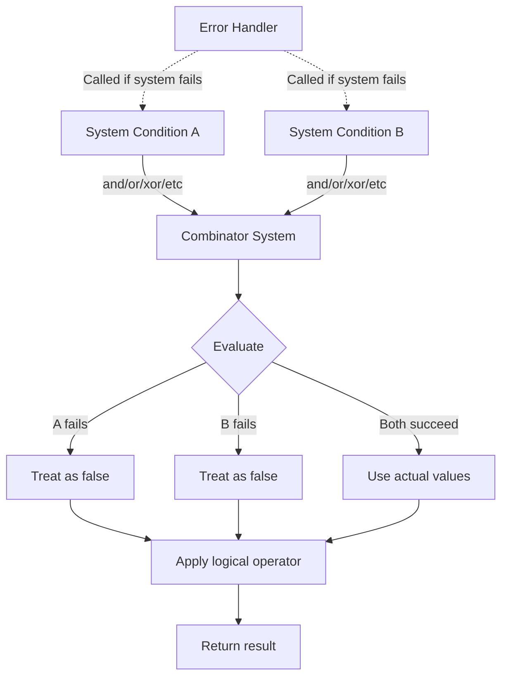

+++
title = "#20671 system combinators short circuiting with system failure"
date = "2025-12-14T00:00:00"
draft = false
template = "pull_request_page.html"
in_search_index = true

[taxonomies]
list_display = ["show"]

[extra]
current_language = "en"
available_languages = {"en" = { name = "English", url = "/pull_request/bevy/2025-12/pr-20671-en-20251214" }, "zh-cn" = { name = "中文", url = "/pull_request/bevy/2025-12/pr-20671-zh-cn-20251214" }}
labels = ["C-Bug", "A-ECS", "M-Migration-Guide", "X-Contentious", "D-Straightforward"]
+++

# Title

## Basic Information
- **Title**: system combinators short circuiting with system failure
- **PR Link**: https://github.com/bevyengine/bevy/pull/20671
- **Author**: janis-bhm
- **Status**: MERGED
- **Labels**: C-Bug, A-ECS, S-Ready-For-Final-Review, M-Migration-Guide, X-Contentious, D-Straightforward
- **Created**: 2025-08-20T13:32:59Z
- **Merged**: 2025-12-14T23:22:16Z
- **Merged By**: alice-i-cecile

## Description Translation
**Objective**

Fixes https://github.com/bevyengine/bevy/issues/20376:

CombinatorSystems short circuit if one of the systems fails to validate, e.g. because it queries a Component that isn't resident in the world.

**Solution**

Instead, we can treat the system failing as the system yielding `false`, appropriately querying the second system depending on the logical operator.

**Testing**

I added a new test that calls the combinators in different configurations with a failing system as both the rhs and lhs of the combinator and counts the invocations of the system and the condition.

---

# The Story of This Pull Request

This PR addresses a specific bug in Bevy's Entity Component System (ECS) where combinator systems would incorrectly short-circuit when one of their constituent systems failed to validate. The issue was particularly problematic because it broke the expected logical operator semantics, leading to inconsistent behavior compared to Rust's standard boolean operators.

## The Problem and Context

System combinators in Bevy allow developers to combine multiple `SystemCondition`s using logical operators like `and`, `or`, `xor`, and their negated variants. These combinators are implemented as systems themselves and follow Rust's short-circuiting behavior for logical operators. However, there was a critical flaw in the implementation: when a system failed to validate (for example, because it queried for a component that doesn't exist in the world), the entire combinator would fail immediately, preventing the second system from running even when the logical operator semantics required it.

Consider this example from the migration guide:
```rust
fn vacant(_: crate::system::Single<&Vacant>) -> bool {
    true
}

fn is_true() -> bool {
    true
}

assert!(world.query::<&Vacant>().iter(&world).next().is_none());

// Previously: This would return an error
assert!(world.run_system_once(is_true.or(vacant)).is_err());

// Expected behavior: This should return Ok(true) because `is_true() || false` = true
```

The problem stemmed from how the `combine` method in the `Func` trait implementation handled errors. When a system returned a `RunSystemError::Failed`, the `?` operator would propagate the error immediately, causing the entire combinator to fail. This violated the expected short-circuiting semantics of logical operators.

## The Solution Approach

The fix adopts a straightforward approach: treat a system failure as if the system returned `false` for the purpose of the logical operation. This preserves the expected short-circuiting behavior while ensuring that combinators don't fail unexpectedly when one system cannot run.

The implementation required changes in two key areas:
1. The logical operator implementations in `condition.rs` needed to handle errors by converting them to `false` values
2. The `CombinatorSystem` in `combinator.rs` needed to handle error reporting correctly while still allowing both systems to attempt validation and execution

## The Implementation

### Changes to Logical Operators

In `condition.rs`, the PR modifies all six logical operator implementations (`And`, `Nand`, `Nor`, `Or`, `Xor`, `Xnor`) to use `.unwrap_or(false)` instead of the `?` operator when evaluating systems. This change ensures that if a system fails, it's treated as returning `false` rather than propagating the error:

```rust
// Before (in the And implementation):
Ok(a(input, data)? && b(input, data)?)

// After:
Ok(a(input, data).unwrap_or(false) && b(input, data).unwrap_or(false))
```

This pattern is applied consistently across all six operators. The change is minimal but significant: it preserves the short-circuiting behavior of `&&` and `||` while converting errors to `false` values. For example, in `a && b`, if `a` returns an error (treated as `false`), the expression short-circuits to `false` without evaluating `b`. However, in `a || b`, if `a` returns an error (treated as `false`), the combinator still evaluates `b` to determine the final result.

### Changes to CombinatorSystem

The more complex changes occur in `combinator.rs`. The `CombinatorSystem` struct needed modifications to properly handle error reporting while still allowing both systems to run when appropriate. The key insight is that we need to intercept system errors, pass them to the world's error handler, and then continue with the combinator logic.

The PR introduces a helper function within `run_unsafe`:

```rust
unsafe fn run_system<S: System>(
    system: &mut S,
    input: SystemIn<S>,
    world: &mut PrivateUnsafeWorldCell,
) -> Result<S::Out, RunSystemError> {
    // SAFETY: see comment on `Func::combine` call
    match (|| unsafe {
        system.validate_param_unsafe(world.0)?;
        system.run_unsafe(input, world.0)
    })() {
        Err(RunSystemError::Failed(err)) => {
            // let the world's default error handler handle the error if `Failed(_)`
            (world.0.default_error_handler())(
                err,
                ErrorContext::System {
                    name: system.name(),
                    last_run: system.get_last_run(),
                },
            );

            // Since the error handler takes the error by value, create a new error:
            // The original error has already been handled, including
            // the reason for the failure here isn't important.
            Err(format!("System `{}` failed", system.name()).into())
        }
        // `Skipped(_)` and `Ok(_)` are passed through:
        // system skipping is not an error, and isn't passed to the
        // world's error handler by the executors.
        result @ (Ok(_) | Err(RunSystemError::Skipped(_))) => result,
    }
}
```

This function wraps system execution with error handling that:
1. Attempts to validate and run the system
2. If it fails with `RunSystemError::Failed`, passes the error to the world's default error handler
3. Returns a new generic error message so the combinator knows the system failed
4. Preserves `Skipped` errors (which aren't actual failures) and successful results

This approach ensures that errors are properly reported while allowing the combinator logic to continue. The function is then used in both closures passed to `Func::combine`:

```rust
|input, world| unsafe { run_system(&mut self.a, input, world) },
|input, world| unsafe { run_system(&mut self.b, input, world) },
```

Additionally, the `validate_param_unsafe` method is modified to always return `Ok(())`, deferring actual validation to the `run_unsafe` method. This allows both systems to attempt validation even if the first one fails:

```rust
#[inline]
unsafe fn validate_param_unsafe(
    &mut self,
    _world: UnsafeWorldCell,
) -> Result<(), SystemParamValidationError> {
    // Both systems are validated in `Self::run_unsafe`, so that we get the
    // chance to run the second system even if the first one fails to
    // validate.
    Ok(())
}
```

### Comprehensive Testing

The PR includes an extensive test suite that validates the new behavior. The test creates systems that always succeed (returning `true` or `false`) and systems that fail (querying a non-existent component). It then tests all combinator variations with different combinations of successful and failing systems.

The test uses a clever approach with prime numbers to track which systems executed:
```rust
const FALSE: usize = 2;
const TRUE: usize = 3;

fn test_true(counter: &Counter) -> bool {
    *counter.0.lock().unwrap() *= TRUE;
    true
}

fn test_false(counter: &Counter) -> bool {
    *counter.0.lock().unwrap() *= FALSE;
    false
}
```

By multiplying the counter by `TRUE` or `FALSE` when a system runs, the test can verify both the final result and which systems executed. For example, if only `test_true` runs, the counter becomes `3` (1 × 3). If both run, it becomes `6` (1 × 3 × 2). This allows the test to verify short-circuiting behavior precisely.

## Technical Insights

This PR highlights several important aspects of Bevy's ECS design:

1. **Error Handling Strategy**: Bevy uses a dual approach to error handling. Critical errors are passed to a configurable error handler for user-defined handling, while the system execution continues with a degraded but predictable state.

2. **System Validation Timing**: The change to defer validation until execution time (`run_unsafe`) rather than at scheduling time (`validate_param_unsafe`) demonstrates a trade-off between early error detection and flexible execution semantics. In this case, the need to support logical operator semantics takes precedence.

3. **Unsafe Code Patterns**: The implementation carefully manages unsafe code by using a private wrapper type (`PrivateUnsafeWorldCell`) to ensure that world accesses don't conflict between the two systems in the combinator.

4. **Logical Operator Semantics**: The PR maintains Rust's standard logical operator semantics, which is crucial for developer intuition and code correctness.

## The Impact

The primary impact of this change is that system combinators now behave predictably according to standard logical operator semantics. Developers can rely on combinators to work correctly even when some systems might fail to validate.

However, there's an important behavioral change: previously, a failing system in a combinator would cause the entire combinator to fail early. Now, the error is reported through the error handler, but the combinator continues execution according to logical operator rules. This means developers need to audit their error handling code to ensure they're not relying on the old short-circuit-to-error behavior.

The migration guide clearly documents this change and provides examples to help developers understand the new behavior. The guide also includes a helpful reference table mapping combinators to their Rust equivalents.

## Visual Representation



## Key Files Changed

### `crates/bevy_ecs/src/schedule/condition.rs` (+254/-8)
This file contains the implementations of logical operator combinators for system conditions. The key change is replacing the `?` operator with `.unwrap_or(false)` to convert system failures to `false` values:

```rust
// Before (And implementation):
Ok(a(input, data)? && b(input, data)?)

// After:
Ok(a(input, data).unwrap_or(false) && b(input, data).unwrap_or(false))
```

This pattern is applied to all six logical operators (`And`, `Nand`, `Nor`, `Or`, `Xor`, `Xnor`). The file also includes extensive new test code to verify the corrected behavior.

### `crates/bevy_ecs/src/system/combinator.rs` (+44/-14)
This file contains the `CombinatorSystem` implementation. The main changes are:

1. Added a helper function `run_system` that wraps system execution with error handling
2. Modified `run_unsafe` to use this helper for both systems
3. Changed `validate_param_unsafe` to always succeed, deferring validation to execution time

```rust
// Key addition: error handling wrapper
unsafe fn run_system<S: System>(
    system: &mut S,
    input: SystemIn<S>,
    world: &mut PrivateUnsafeWorldCell,
) -> Result<S::Out, RunSystemError> {
    // ... validation and execution with error handling
}

// Modified validation to defer to run_unsafe
unsafe fn validate_param_unsafe(
    &mut self,
    _world: UnsafeWorldCell,
) -> Result<(), SystemParamValidationError> {
    Ok(())
}
```

### `release-content/migration-guides/combinator_system.md` (+38/-0)
This new migration guide documents the behavioral change and provides examples:

```markdown
The `CombinatorSystem`s can be used to combine multiple `SystemCondition`s with logical operators. Previously, the conditions would short circuit if the system failed to run, for example because it's query could not be filled by the world.

Now, the `CombinatorSystem`s will work as expected, following the semantics of rust's logical operators.
Namely, if a `SystemCondition` fails, it will be considered to have returned `false` and in combinators that don't short circuit the other condition will now be run.
```

## Further Reading

1. **Bevy ECS Documentation**: https://bevyengine.org/learn/book/ecs/
2. **System Combinators in Bevy**: https://bevyengine.org/learn/book/ecs/system-combinators/
3. **Error Handling in Bevy**: https://bevyengine.org/learn/book/error-handling/
4. **Rust's Logical Operator Semantics**: The Rust Reference section on boolean logic
5. **Original Issue #20376**: https://github.com/bevyengine/bevy/issues/20376