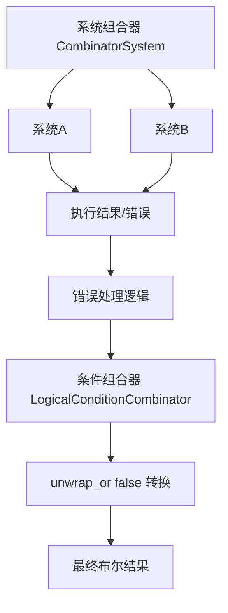

+++
title = "#20671 system combinators short circuiting with system failure"
date = "2025-12-14T00:00:00"
draft = false
template = "pull_request_page.html"
in_search_index = false

[extra]
current_language = "zh-cn"
available_languages = {"en" = { name = "English", url = "/pull_request/bevy/2025-12/pr-20671-en-20251214" }, "zh-cn" = { name = "中文", url = "/pull_request/bevy/2025-12/pr-20671-zh-cn-20251214" }}
+++

# system combinators short circuiting with system failure

## 基本信息
- **标题**: system combinators short circuiting with system failure
- **PR链接**: https://github.com/bevyengine/bevy/pull/20671
- **作者**: janis-bhm
- **状态**: 已合并
- **标签**: C-Bug, A-ECS, S-Ready-For-Final-Review, M-Migration-Guide, X-Contentious, D-Straightforward
- **创建时间**: 2025-08-20T13:32:59Z
- **合并时间**: 2025-12-14T23:22:16Z
- **合并者**: alice-i-cecile

## 描述翻译

**目标**

修复 https://github.com/bevyengine/bevy/issues/20376：

当组合系统中的某个系统验证失败时（例如，因为它查询的组件不存在于世界中），CombinatorSystems 会短路。

**解决方案**

我们可以将系统失败视为系统返回 `false`，根据逻辑运算符适当地查询第二个系统。

**测试**

我添加了一个新的测试，使用失败的系统作为组合器的左侧和右侧，在不同的配置中调用组合器，并统计系统和条件的调用次数。

---

## 本次 Pull Request 的技术分析

### 问题背景

Bevy 的 ECS（实体组件系统）提供了系统组合器（combinator systems），允许开发者使用逻辑运算符（AND、OR、XOR 等）组合多个系统条件。这些组合器在调度系统中用于决定是否运行特定的系统集。

然而，在 PR #20671 之前存在一个问题：当组合器中的某个系统在验证阶段失败时，整个组合器会立即失败，而不是按照逻辑运算符的预期行为执行。具体来说，如果一个系统查询的组件在世界上不存在，系统会验证失败并返回 `RunSystemError`。在之前的实现中，组合器会直接传播这个错误，导致整个组合器短路，而不是像 Rust 的逻辑运算符那样处理。

例如，考虑 `system_a.or(system_b)` 的情况。如果 `system_a` 验证失败，按照 Rust 的 `||` 运算符逻辑，应该尝试运行 `system_b`。但之前的实现会在 `system_a` 失败时直接返回错误，不会执行 `system_b`。

### 解决方案设计

作者采取的解决方案是改变错误处理策略：将系统验证失败视为返回 `false`，而不是传播错误。这样可以让组合器按照预期的逻辑运算规则继续执行。

实现上的关键改动包括：

1. **修改条件组合器的错误处理**：在 `condition.rs` 中，将所有逻辑组合器的实现从使用 `?` 传播错误改为使用 `unwrap_or(false)`，将错误转换为 `false`。
2. **修改组合器系统的执行逻辑**：在 `combinator.rs` 中，重构 `run_unsafe` 方法，将错误处理逻辑集中到 `run_system` 辅助函数中，确保系统失败时会被世界的默认错误处理器处理，然后返回一个表示系统失败的错误。
3. **延迟参数验证**：修改 `validate_param_unsafe` 方法，使其不执行验证，而是在 `run_unsafe` 中验证两个系统，这样即使第一个系统验证失败，第二个系统也有机会运行。

### 技术实现细节

#### 条件组合器的修改

在 `condition.rs` 中，所有逻辑组合器（AND、OR、XOR、NAND、NOR、XNOR）的实现都被修改。以 AND 组合器为例：

**修改前**：
```rust
Ok(a(input, data)? && b(input, data)?)
```

**修改后**：
```rust
Ok(a(input, data).unwrap_or(false) && b(input, data).unwrap_or(false))
```

这个改动确保当 `a` 或 `b` 返回错误时，它们被当作 `false` 处理，然后按照 Rust 逻辑运算符的短路规则执行。例如，对于 `a && b`，如果 `a` 返回错误（现在被视为 `false`），那么 `b` 不会被调用，整个表达式返回 `false`，这与 Rust 的 `&&` 运算符行为一致。

#### 组合器系统的重构

在 `combinator.rs` 中，`CombinatorSystem` 的 `run_unsafe` 方法被重构，添加了 `run_system` 辅助函数：

```rust
unsafe fn run_system<S: System>(
    system: &mut S,
    input: SystemIn<S>,
    world: &mut PrivateUnsafeWorldCell,
) -> Result<S::Out, RunSystemError> {
    // SAFETY: see comment on `Func::combine` call
    match (|| unsafe {
        system.validate_param_unsafe(world.0)?;
        system.run_unsafe(input, world.0)
    })() {
        Err(RunSystemError::Failed(err)) => {
            // let the world's default error handler handle the error if `Failed(_)`
            (world.0.default_error_handler())(
                err,
                ErrorContext::System {
                    name: system.name(),
                    last_run: system.get_last_run(),
                },
            );

            // Since the error handler takes the error by value, create a new error:
            // The original error has already been handled, including
            // the reason for the failure here isn't important.
            Err(format!("System `{}` failed", system.name()).into())
        }
        // `Skipped(_)` and `Ok(_)` are passed through:
        // system skipping is not an error, and isn't passed to the
        // world's error handler by the executors.
        result @ (Ok(_) | Err(RunSystemError::Skipped(_))) => result,
    }
}
```

这个辅助函数的关键点：
1. 它包装了系统的验证和执行过程
2. 当系统失败时（`RunSystemError::Failed`），它会调用世界的默认错误处理器记录错误，然后返回一个新的通用错误
3. 对于成功或跳过的系统，它直接返回结果

这样做的目的是确保错误被适当记录，同时让组合器可以将系统失败视为 `false` 继续执行。

#### 参数验证的调整

`validate_param_unsafe` 方法的修改也很重要：

**修改前**：
```rust
unsafe fn validate_param_unsafe(
    &mut self,
    world: UnsafeWorldCell,
) -> Result<(), SystemParamValidationError> {
    // We only validate parameters for the first system,
    // since it may make changes to the world that affect
    // whether the second system has valid parameters.
    // The second system will be validated in `Self::run_unsafe`.
    // SAFETY: Delegate to other `System` implementations.
    unsafe { self.a.validate_param_unsafe(world) }
}
```

**修改后**：
```rust
unsafe fn validate_param_unsafe(
    &mut self,
    _world: UnsafeWorldCell,
) -> Result<(), SystemParamValidationError> {
    // Both systems are validated in `Self::run_unsafe`, so that we get the
    // chance to run the second system even if the first one fails to
    // validate.
    Ok(())
}
```

现在两个系统的验证都在 `run_unsafe` 中进行，这样即使第一个系统验证失败，第二个系统仍然有机会运行（如果需要的话）。

### 测试策略

为了确保修改的正确性，作者添加了一个全面的测试 `combinators_with_maybe_failing_condition`。这个测试验证了：

1. 组合器的最终结果是否正确
2. 预期应该运行的系统是否真的运行了
3. 预期不应该运行的系统是否真的没有运行

测试使用质数作为计数器来唯一标识哪些系统运行了。例如，`TRUE = 3` 和 `FALSE = 2`，通过将计数器乘以这些值，测试可以检测出哪些条件被执行了。

测试涵盖了所有组合器在各种场景下的行为：
- 正常系统（返回 true 或 false）与失败系统的组合
- 失败系统作为左侧或右侧参数
- 两个系统都成功但返回不同值的情况
- 两个系统都失败的情况

### 技术影响与权衡

这个修改带来了几个重要的技术影响：

1. **行为一致性**：组合器现在与 Rust 的逻辑运算符行为一致，提高了 API 的直观性。
2. **错误处理**：系统失败仍然会被世界的错误处理器记录，但不会阻止组合器继续执行。
3. **向后兼容性**：这是一个破坏性变更，因此需要迁移指南。

主要的权衡在于：
- **安全性**：修改确保了组合器在部分系统失败时仍能继续工作，这可能在某些场景下是有益的
- **可预测性**：现在组合器的行为更符合开发者的直觉，但需要更新对旧行为有依赖的代码

### 迁移指南

新增的迁移指南清楚地说明了变更：
- 以前：如果系统运行失败，组合器会短路并返回错误
- 现在：如果系统运行失败，它被视为返回 `false`，组合器按照 Rust 逻辑运算符的语义继续执行

迁移指南提供了代码示例，展示了变更前后的行为差异。

## 组件关系图



## 关键文件变更

### `crates/bevy_ecs/src/schedule/condition.rs` (+254/-8)

**变更说明**：修改了所有逻辑条件组合器的实现，将错误传播改为将错误视为 `false`，并添加了全面的测试。

**关键代码片段**：
```rust
// AND 组合器的修改示例
// 修改前：
Ok(a(input, data)? && b(input, data)?)

// 修改后：
Ok(a(input, data).unwrap_or(false) && b(input, data).unwrap_or(false))
```

**与 PR 目的的关系**：这是修复的核心部分，确保组合器在系统失败时能按照逻辑运算符的预期行为继续执行。

### `crates/bevy_ecs/src/system/combinator.rs` (+44/-14)

**变更说明**：重构了 `CombinatorSystem` 的执行逻辑，添加了 `run_system` 辅助函数来处理错误，并修改了参数验证逻辑。

**关键代码片段**：
```rust
// 新增的 run_system 辅助函数
unsafe fn run_system<S: System>(
    system: &mut S,
    input: SystemIn<S>,
    world: &mut PrivateUnsafeWorldCell,
) -> Result<S::Out, RunSystemError> {
    // 处理系统执行，包括错误处理
    match (|| unsafe {
        system.validate_param_unsafe(world.0)?;
        system.run_unsafe(input, world.0)
    })() {
        Err(RunSystemError::Failed(err)) => {
            // 调用世界的默认错误处理器
            (world.0.default_error_handler())(err, ErrorContext::System { /* ... */ });
            Err(format!("System `{}` failed", system.name()).into())
        }
        result @ (Ok(_) | Err(RunSystemError::Skipped(_))) => result,
    }
}
```

**与 PR 目的的关系**：这确保了系统失败时错误会被适当处理，同时允许组合器继续执行。

### `release-content/migration-guides/combinator_system.md` (+38/-0)

**变更说明**：新增迁移指南，解释组合器行为的变化，提供代码示例帮助用户迁移。

**关键代码片段**：
```rust
// 迁移指南中的示例
// 以前：
assert!(world.run_system_once(is_true.or(vacant)).is_err());

// 现在：
assert!(matches!(world.run_system_once(is_true.or(vacant)), Ok(true)));
```

**与 PR 目的的关系**：帮助用户理解和适应这次破坏性变更。

## 进一步阅读

1. **Bevy ECS 文档**：了解 Bevy 的实体组件系统架构
   - https://bevyengine.org/learn/book/getting-started/ecs/

2. **Rust 逻辑运算符**：理解短路求值（short-circuit evaluation）行为
   - https://doc.rust-lang.org/rust-by-example/flow_control/if_else.html

3. **错误处理模式**：了解 Result 类型和错误传播的最佳实践
   - https://doc.rust-lang.org/book/ch09-00-error-handling.html

4. **系统组合器设计模式**：了解函数式编程中的组合器模式
   - https://rust-lang.github.io/api-guidelines/future-proofing.html#c-sealed

5. **Bevy 调度系统**：了解 Bevy 如何调度和执行系统
   - https://bevyengine.org/learn/book/getting-started/scheduling/