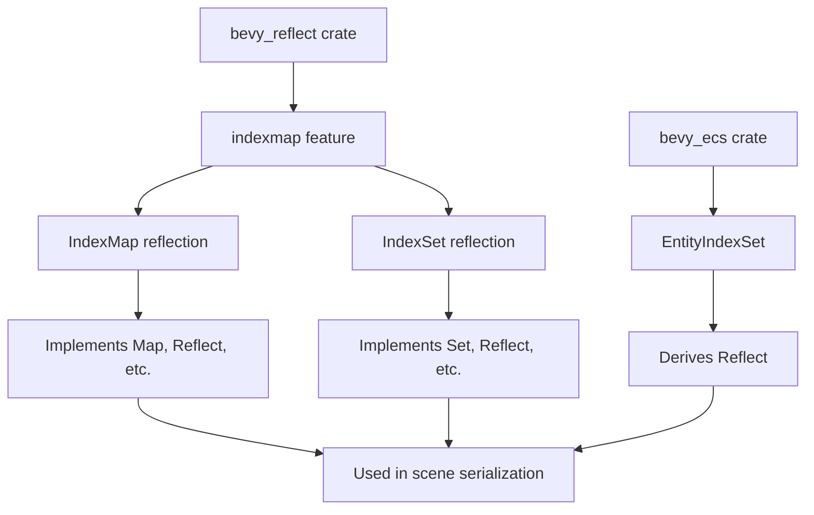

+++
title = "#20734 Implementing Reflect for `indexmap::IndexMap` and `indexmap::IndexSet`"
date = "2025-12-16T00:00:00"
draft = false
template = "pull_request_page.html"
in_search_index = true

[taxonomies]
list_display = ["show"]

[extra]
current_language = "en"
available_languages = {"en" = { name = "English", url = "/pull_request/bevy/2025-12/pr-20734-en-20251216" }, "zh-cn" = { name = "中文", url = "/pull_request/bevy/2025-12/pr-20734-zh-cn-20251216" }}
labels = ["C-Usability", "A-Reflection", "D-Modest"]
+++

# Title: Implementing Reflect for `indexmap::IndexMap` and `indexmap::IndexSet`

## Basic Information
- **Title**: Implement Reflect for `indexmap::IndexMap`and `indexmap::IndexSet`
- **PR Link**: https://github.com/bevyengine/bevy/pull/20734
- **Author**: 2ne1ugly
- **Status**: MERGED
- **Labels**: C-Usability, S-Ready-For-Final-Review, A-Reflection, D-Modest
- **Created**: 2025-08-24T06:48:35Z
- **Merged**: 2025-12-16T05:25:24Z
- **Merged By**: alice-i-cecile

## Description Translation
# Objective
- Fixes #19681

## Solution
- Implement Map, PartialReflect, Reflect, Typed, FromReflect, GetTypeRegistration for `indexmap::IndexMap` and `indexmap::IndexSet`
- Add `#[derive(Reflect)]` to `EntityIndexSet`
- Add indexmap feature to `bevy_reflect` and Update docs accordingly

## Testing
- Added test on indexmap::IndexMap

---
I initially tried using `impl_reflect_for_hashmap`, but ran into two issues:
1. `IndexMap::drain` requires a range parameter, unlike `HashMap::drain`.
2. `IndexMap::remove` defaults to `swap_remove`, and is now deprecated.

I went with `shift_remove`, since I think it matches user expectations.  
That said, it's `O(n)`, while `swap_remove` is `O(1)`.  
Would love feedback on which behavior we should prefer.

## The Story of This Pull Request

This PR addresses a gap in Bevy's reflection system by adding support for `IndexMap` and `IndexSet` from the `indexmap` crate. The core issue was that these data structures, which are used in various parts of the Bevy ecosystem, couldn't be serialized, deserialized, or manipulated through Bevy's reflection APIs.

The problem stemmed from the fact that `indexmap` provides map and set implementations that preserve insertion order, unlike the standard library's `HashMap` and `HashSet`. This makes them particularly useful in game development scenarios where predictable iteration order matters. However, without reflection support, these types couldn't participate in Bevy's serialization, scene system, or property inspection workflows.

The developer initially attempted to reuse the existing `impl_reflect_for_hashmap` pattern but encountered two key API differences. First, `IndexMap::drain` requires a range parameter (needing `..` to drain the entire map), while `HashMap::drain` takes no arguments. Second, `IndexMap::remove` is deprecated in favor of `swap_remove` and `shift_remove`, with different performance characteristics. The developer chose `shift_remove` for its predictable behavior (maintaining order after removal), despite its O(n) complexity versus `swap_remove`'s O(1) performance.

The implementation follows Bevy's established patterns for reflection. For `IndexMap<K, V, S>`, it implements:
- `Map` trait for map-specific operations
- `PartialReflect` and `Reflect` for basic reflection capabilities
- `Typed` for type information
- `FromReflect` for deserialization from reflected data
- `GetTypeRegistration` for type registration in the type registry

Similarly, for `IndexSet<T, S>`, it implements:
- `Set` trait for set-specific operations
- The same reflection traits as above

The key challenge was adapting the generic implementations to handle `indexmap`'s API differences while maintaining compatibility with the existing reflection system. The solution uses `IndexMap::drain(..)` to drain all elements and `IndexMap::shift_remove` for element removal, which preserves insertion order but has linear time complexity.

One notable design decision was the handling of type constraints. The implementations require that key, value, and set element types implement `FromReflect`, `MaybeTyped`, `TypePath`, and `GetTypeRegistration`, ensuring they can be properly reflected and reconstructed. The hasher type `S` must implement `BuildHasher`, `Default`, `Send`, `Sync`, and `TypePath`.

The PR also updates `EntityIndexSet` in the ECS module to derive `Reflect` when the reflection feature is enabled. This enables reflection support for a commonly used ECS type without breaking existing code.

The performance consideration around `shift_remove` versus `swap_remove` is significant. While `shift_remove` provides predictable behavior that matches user expectations for an insertion-order-preserving map, its O(n) complexity could be problematic for large maps. The developer explicitly asked for feedback on this trade-off, indicating an awareness of the performance implications.

The implementation includes comprehensive tests to ensure the reflection system works correctly with `IndexMap`. These tests verify that type information is correctly registered and that the map can be used through reflection interfaces.

From an architectural perspective, this PR follows Bevy's pattern of implementing reflection for external types via feature flags. The `indexmap` feature is added to `bevy_reflect` and enabled by default in the `bevy` meta-feature, ensuring that reflection support is available when using the full engine.

The changes are relatively self-contained, adding a new module `impls/indexmap.rs` without modifying existing reflection implementations. This keeps the codebase maintainable and follows the principle of separation of concerns.

## Visual Representation



## Key Files Changed

### 1. `crates/bevy_reflect/src/impls/indexmap.rs` (+496/-0)
This new file contains the core implementation of reflection traits for `IndexMap` and `IndexSet`. The implementation is structured similarly to existing hashmap and hashset reflection implementations but adapts to `indexmap`'s API.

**Key Implementation Details:**
```rust
// For IndexMap::drain - note the need for range parameter
fn drain(&mut self) -> Vec<(Box<dyn PartialReflect>, Box<dyn PartialReflect>)> {
    self.drain(..)  // Uses full range
        .map(|(key, value)| {
            (
                Box::new(key) as Box<dyn PartialReflect>,
                Box::new(value) as Box<dyn PartialReflect>,
            )
        })
        .collect()
}

// For IndexMap::remove - uses shift_remove instead of remove
fn remove(&mut self, key: &dyn PartialReflect) -> Option<Box<dyn PartialReflect>> {
    let mut from_reflect = None;
    key.try_downcast_ref::<K>()
        .or_else(|| {
            from_reflect = K::from_reflect(key);
            from_reflect.as_ref()
        })
        .and_then(|key| self.shift_remove(key))  // Uses shift_remove
        .map(|value| Box::new(value) as Box<dyn PartialReflect>)
}
```

### 2. `crates/bevy_reflect/src/lib.rs` (+32/-4)
Updated to include the new indexmap module and update documentation.

**Changes:**
- Added `indexmap` module under `#[cfg(feature = "indexmap")]`
- Updated documentation to mention `indexmap` as a dependency
- Added test case for `IndexMap` reflection

```rust
// Added module declaration
#[cfg(feature = "indexmap")]
mod indexmap;

// Updated documentation table
//! | Default | Dependencies                                        |
//! | :-----: | :-------------------------------------------------: |
//! | ❌      | [`bevy_math`], [`glam`], [`indexmap`], [`smallvec`] |

// Added test case
#[cfg(feature = "indexmap")]
{
    use std::hash::RandomState;
    type MyIndexMap = indexmap::IndexMap<String, u32, RandomState>;
    // ... test implementation
}
```

### 3. `crates/bevy_reflect/Cargo.toml` (+5/-1)
Added `indexmap` as an optional dependency and feature.

**Changes:**
```toml
# Added to features
indexmap = ["dep:indexmap"]

# Added to dependencies
indexmap = { version = "2.5.0", default-features = false, optional = true }

# Updated default features to include indexmap
default = ["std", "smallvec", "indexmap", "debug", "auto_register_inventory"]
```

### 4. `crates/bevy_ecs/src/entity/index_set.rs` (+4/-0)
Added `Reflect` derive to `EntityIndexSet` when the `bevy_reflect` feature is enabled.

**Changes:**
```rust
#[cfg(feature = "bevy_reflect")]
use bevy_reflect::Reflect;

#[cfg_attr(feature = "bevy_reflect", derive(Reflect))]
#[derive(Debug, Clone, Default)]
pub struct EntityIndexSet(pub(crate) IndexSet<Entity, EntityHash>);
```

### 5. `crates/bevy_ecs/Cargo.toml` (+1/-0)
Enabled the `indexmap` feature of `bevy_reflect` dependency.

**Changes:**
```toml
bevy_reflect = { path = "../bevy_reflect", version = "0.18.0-dev", features = [
  "smallvec",
  "indexmap",  # Added this line
], default-features = false, optional = true }
```

## Further Reading

1. **Bevy Reflection System**: [Bevy Reflection Documentation](https://docs.rs/bevy_reflect/latest/bevy_reflect/)
2. **IndexMap Crate**: [indexmap documentation](https://docs.rs/indexmap/latest/indexmap/)
3. **Rust Orphan Rules**: Understanding why reflection implementations must be in the bevy_reflect crate due to Rust's orphan rules
4. **Feature Flags in Rust**: How Bevy uses feature flags to manage optional dependencies
5. **Type-Driven Design**: The pattern of implementing `Typed`, `GetTypeRegistration`, and type registry usage in Bevy