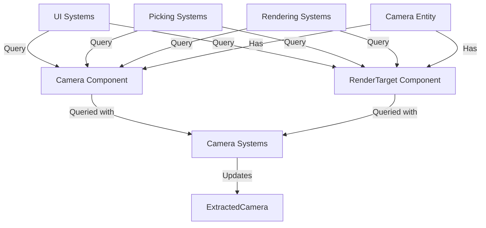

+++
title = "#20917 Convert RenderTarget to `Component`"
date = "2025-12-15T00:00:00"
draft = false
template = "pull_request_page.html"
in_search_index = true

[taxonomies]
list_display = ["show"]

[extra]
current_language = "en"
available_languages = {"en" = { name = "English", url = "/pull_request/bevy/2025-12/pr-20917-en-20251215" }, "zh-cn" = { name = "中文", url = "/pull_request/bevy/2025-12/pr-20917-zh-cn-20251215" }}
labels = ["C-Feature", "A-Rendering", "M-Migration-Guide"]
+++

# Title

## Basic Information
- **Title**: Convert RenderTarget to `Component`
- **PR Link**: https://github.com/bevyengine/bevy/pull/20917
- **Author**: tychedelia
- **Status**: MERGED
- **Labels**: C-Feature, A-Rendering, S-Ready-For-Final-Review, M-Migration-Guide
- **Created**: 2025-09-07T06:54:01Z
- **Merged**: 2025-12-14T22:57:12Z
- **Merged By**: alice-i-cecile

## Description Translation
# Objective

#20830 created the possibility that we may want to have render targets that produce a number of outputs, e.g. depth and normals. This is a first step towards something like that (e.g. a `RendersTo` relation) by converting `RenderTarget` to be a component. This is also useful for out-of-tree render targets that may want to do something like `#[require(RenderTarget::Image)]` once BSN lands.

## Solution

Make it a component.

## The Story of This Pull Request

This PR addresses a structural limitation in Bevy's rendering architecture. Previously, the `RenderTarget` was stored as a field within the `Camera` component. While functional for basic use cases, this design constrained future development where cameras might need to render to multiple outputs or where render targets might need to be shared or referenced independently.

The core problem was that embedding `RenderTarget` within `Camera` made it difficult to extend the system. For instance, PR #20830 explored the possibility of cameras producing multiple outputs (like depth and normals simultaneously). With the old design, supporting such features would require significant refactoring. Additionally, for developers building custom render pipelines outside the main Bevy repository, the ability to query for or require specific types of render targets as components would be valuable once Bevy's scene system (BSN) is implemented.

The solution approach was straightforward but had widespread implications: extract `RenderTarget` from being a field of `Camera` and make it a standalone ECS component. This required modifying all systems that accessed a camera's render target to now query for both the `Camera` and `RenderTarget` components.

The implementation involved several key changes. First, in `crates/bevy_camera/src/camera.rs`, the `RenderTarget` enum was updated to derive `Component`, and the `target` field was removed from the `Camera` struct:

```rust
// Before in Camera struct:
pub struct Camera {
    // ...
    pub target: RenderTarget,
    // ...
}

// After in Camera struct:
pub struct Camera {
    // ... (target field removed)
    // ...
}

// RenderTarget definition:
#[derive(Component, Debug, Clone, Reflect, From)] // Added Component
#[reflect(Clone)]
pub enum RenderTarget {
    Window(WindowRef),
    Image(Handle<Image>),
    None { size: UVec2 },
}
```

This structural change necessitated updates across 13 crates and 10 examples. Systems that previously accessed `camera.target` now needed to query for the separate `RenderTarget` component. For example, in `crates/bevy_render/src/camera.rs`, the `camera_system` function was updated:

```rust
// Before:
for (mut camera, mut camera_projection) in &mut cameras {
    if let Some(normalized_target) = &camera.target.normalize(primary_window) {
        // ...
    }
}

// After:
for (mut camera, render_target, mut camera_projection) in &mut cameras {
    if let Some(normalized_target) = render_target.normalize(primary_window) {
        // ...
    }
}
```

Similarly, in `crates/bevy_picking/src/backend.rs`, the `make_ray` function signature changed to accept both `Camera` and `RenderTarget`:

```rust
// Before:
fn make_ray(
    primary_window_entity: &Query<Entity, With<PrimaryWindow>>,
    camera: &Camera,
    camera_tfm: &GlobalTransform,
    pointer_loc: &PointerLocation,
) -> Option<Ray3d>

// After:
fn make_ray(
    primary_window_entity: &Query<Entity, With<PrimaryWindow>>,
    camera: &Camera,
    render_target: &RenderTarget, // Added parameter
    camera_tfm: &GlobalTransform,
    pointer_loc: &PointerLocation,
) -> Option<Ray3d>
```

These changes propagated through UI systems, sprite picking, OIT (Order Independent Transparency) systems, and more. The migration was comprehensive but followed a consistent pattern: wherever a system needed render target information, it now had to query for the `RenderTarget` component alongside the `Camera`.

From a technical perspective, this refactoring demonstrates several important principles. First, it shows the value of component composition in ECS architectures - by separating concerns into distinct components, systems can query only what they need, and the data model becomes more flexible for future extensions. Second, the change enables potential future features like cameras with multiple render targets or shared render targets between cameras without requiring further breaking changes to the API.

The impact of this change is primarily architectural. Functionally, rendering behavior remains the same, but the data model is now more extensible. Developers spawning cameras must now include `RenderTarget` as a separate component rather than setting `camera.target`. The migration guide provides clear examples of this change:

```rust
// Before:
commands.spawn((
    Camera3d::default(),
    Camera {
        target: RenderTarget::Image(image_handle.into()),
        ..default()
    },
));

// After:
commands.spawn((
    Camera3d::default(),
    RenderTarget::Image(image_handle.into()),
));
```

This change also has performance implications: systems that don't need render target information can continue querying only for `Camera`, avoiding unnecessary component access. Conversely, systems that do need render targets must now query for an additional component, which adds some overhead but is minimal in practice.

The PR successfully lays groundwork for future rendering enhancements while maintaining backward compatibility through a clear migration path. The widespread but mechanical nature of the changes suggests good test coverage and careful implementation to ensure no regressions in rendering behavior.

## Visual Representation



## Key Files Changed

1. **`crates/bevy_camera/src/camera.rs`** (+27/-21)
   - Removed `target` field from `Camera` struct
   - Added `Component` derive to `RenderTarget` enum
   - Updated `Default` implementation for `Camera` to not initialize `target`

```rust
// Key change in Camera struct:
// Before:
pub struct Camera {
    // ...
    pub target: RenderTarget,
    // ...
}

// After:
pub struct Camera {
    // ... (target field removed)
    // todo: reflect this when #6042 lands
    // ...
}

// RenderTarget now a component:
#[derive(Component, Debug, Clone, Reflect, From)] // Added Component
#[reflect(Clone)]
pub enum RenderTarget {
    // ... variants unchanged
}
```

2. **`crates/bevy_render/src/camera.rs`** (+24/-19)
   - Updated `camera_system` to query for `RenderTarget` alongside `Camera`
   - Updated `extract_cameras` to include `RenderTarget` in query
   - Changed how render target normalization is accessed

```rust
// Before in camera_system:
for (mut camera, mut camera_projection) in &mut cameras {
    if let Some(normalized_target) = &camera.target.normalize(primary_window) {
        // ...
    }
}

// After in camera_system:
for (mut camera, render_target, mut camera_projection) in &mut cameras {
    if let Some(normalized_target) = render_target.normalize(primary_window) {
        // ...
    }
}
```

3. **`release-content/migration-guides/render_target_component.md`** (+25/-0)
   - Created new migration guide for the breaking change
   - Provides clear before/after examples for spawning cameras with render targets

4. **`crates/bevy_ui/src/update.rs`** (+6/-26)
   - Updated camera queries to include `RenderTarget`
   - Simplified test code by removing unnecessary `Camera` configuration

```rust
// Test code simplification example:
// Before:
let camera2 = world.spawn((
    Camera2d,
    Camera {
        target: RenderTarget::Window(WindowRef::Entity(window_2)),
        ..default()
    },
)).id();

// After:
let camera2 = world.spawn((
    Camera2d,
    RenderTarget::Window(WindowRef::Entity(window_2)),
)).id();
```

5. **`crates/bevy_picking/src/backend.rs`** (+12/-7)
   - Updated ray casting systems to accept `RenderTarget` parameter
   - Modified `make_ray` function signature and implementation

## Further Reading

- PR #20830: The original PR that explored multiple output render targets, providing context for why this change was made
- Bevy ECS documentation: For understanding component composition and query patterns
- Bevy Render Graph documentation: For understanding how cameras and render targets interact in the rendering pipeline
- Entity Component System patterns: For broader context on data-oriented design principles demonstrated in this refactoring

# Full Code Diff
*(Included as provided)*