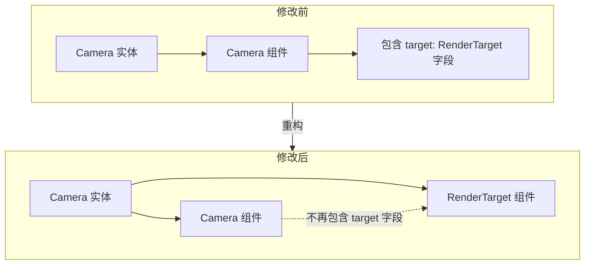

+++
title = "#20917 Convert RenderTarget to `Component"
date = "2025-12-15T00:00:00"
draft = false
template = "pull_request_page.html"
in_search_index = false

[extra]
current_language = "zh-cn"
available_languages = {"en" = { name = "English", url = "/pull_request/bevy/2025-12/pr-20917-en-20251215" }, "zh-cn" = { name = "中文", url = "/pull_request/bevy/2025-12/pr-20917-zh-cn-20251215" }}
+++

# Title

## Basic Information
- **标题**: Convert RenderTarget to `Component`
- **PR链接**: https://github.com/bevyengine/bevy/pull/20917
- **作者**: tychedelia
- **状态**: 已合并
- **标签**: C-Feature, A-Rendering, S-Ready-For-Final-Review, M-Migration-Guide
- **创建时间**: 2025-09-07T06:54:01Z
- **合并时间**: 2025-12-14T22:57:12Z
- **合并者**: alice-i-cecile

## Description Translation
**目标**

#20830 创建了一种可能性，即我们可能希望拥有能产生多个输出（例如深度和法线）的渲染目标 (render targets)。这是实现类似功能（例如 `RendersTo` 关系）的第一步，通过将 `RenderTarget` 转换为一个组件 (component) 来实现。这对于希望在 BSN 落地后执行类似 `#[require(RenderTarget::Image)]` 操作的树外渲染目标也很有用。

**解决方案**

使其成为一个组件。

## 本次PR的技术分析

本次PR的核心任务是将 `RenderTarget` 从一个结构体字段转换为一个独立的 Bevy ECS 组件。这是一项看似简单但影响深远的架构调整，其目的是为渲染系统的未来演进铺平道路。

**问题与背景**

在修改之前，`RenderTarget` 是 `Camera` 结构体的一个字段，用于定义相机渲染的输出目标，例如一个窗口的交换链或一个 `Image` 句柄。这种设计存在一个固有的限制：一个 `Camera` 实体只能关联一个 `RenderTarget`。然而，随着渲染管线复杂性的增加（例如在PR描述中提到的 #20830），未来可能需要一个相机向多个目标渲染（例如同时输出颜色、深度和法线贴图）。将 `RenderTarget` 作为 `Camera` 的一个字段使得这种扩展变得困难，因为它与“一个相机对应一个目标”的假设紧密耦合。

此外，将 `RenderTarget` 作为组件，能够更好地利用 Bevy 的 ECS 系统和即将到来的 BSN (Bevy Scene Node) 特性。例如，外部渲染系统可以通过 `#[require(RenderTarget::Image)]` 这样的属性来声明其对特定类型渲染目标的依赖，这使得代码更模块化、更易于组合。

**解决方案与实现**

解决方案非常直接：将 `RenderTarget` 枚举添加 `#[derive(Component)]` 属性，并将其从 `Camera` 结构体中移除，使其成为一个必须与 `Camera` 组件一起 spawned 的独立组件。

1.  **核心数据结构变更**:
    在 `camera.rs` 中，`Camera` 结构体移除了 `target: RenderTarget` 字段。同时，`RenderTarget` 枚举现在派生 `Component` trait。

    ```rust
    // 文件: crates/bevy_camera/src/camera.rs
    // 之前: Camera 结构体包含 target 字段
    pub struct Camera {
        // ...
        pub target: RenderTarget, // 此行被移除
        // ...
    }

    // 之后: RenderTarget 成为一个组件
    #[derive(Component, Debug, Clone, Reflect, From)] // 添加了 Component
    #[reflect(Clone)]
    public enum RenderTarget {
        Window(WindowRef),
        Image(Handle<Image>),
        ManualTextureView(ManualTextureViewHandle),
        None { size: UVec2 },
    }
    ```

    这个改动是破坏性的。所有之前通过 `camera.target` 访问渲染目标的代码都需要更新。

2.  **系统查询的更新**:
    这是本次重构中工作量最大的部分。所有需要同时知道相机及其渲染目标的系统，其查询 (Query) 都必须修改，以同时获取 `Camera` 和 `RenderTarget` 组件。这涉及遍布渲染、UI、拾取 (picking) 等模块的十几个文件。

    例如，在 `bevy_render::camera::camera_system` 中，查询从 `Query<(&mut Camera, &mut Projection)>` 变为 `Query<(&mut Camera, &RenderTarget, &mut Projection)>`。在计算相机视口大小时，原本通过 `camera.target.normalize(...)` 获取标准化目标，现在改为通过 `render_target.normalize(...)`。

    ```rust
    // 文件: crates/bevy_render/src/camera.rs
    // 修改前
    for (mut camera, mut camera_projection) in &mut cameras {
        if let Some(normalized_target) = &camera.target.normalize(primary_window) { /* ... */ }
    }

    // 修改后
    for (mut camera, render_target, mut camera_projection) in &mut cameras {
        if let Some(normalized_target) = render_target.normalize(primary_window) { /* ... */ }
    }
    ```

    类似地，在 `bevy_picking::backend::ray` 模块中，构建光线 (ray) 的 `make_ray` 函数现在需要接收 `&RenderTarget` 作为额外参数，用于判断指针位置是否在相机的视口内。

3.  **示例代码迁移**:
    所有使用自定义 `RenderTarget` 的官方示例都得到了更新，以展示新的 API 用法。新的模式是：在生成 (spawn) 相机实体时，将 `RenderTarget` 作为一个独立的组件添加，而不是设置 `Camera` 结构体的字段。

    ```rust
    // 文件: examples/3d/render_to_texture.rs (修改后)
    commands.spawn((
        Camera3d::default(),
        Camera {
            order: -1,
            // target: image_handle.clone().into(), // 旧方式，已移除
            clear_color: Color::WHITE.into(),
            ..default()
        },
        RenderTarget::Image(image_handle.clone().into()), // 新方式：作为独立组件
        Transform::from_translation(Vec3::new(0.0, 0.0, 15.0)).looking_at(Vec3::ZERO, Vec3::Y),
        first_pass_layer,
    ));
    ```

4.  **提供迁移指南**:
    PR 创建了一个新的迁移指南文件 `render_target_component.md`，清晰地对比了修改前后的代码，帮助开发者平滑过渡。

**技术见解与影响**

*   **架构解耦与灵活性提升**：将 `RenderTarget` 变为组件，使其与 `Camera` 解耦。这为未来实现一个相机对应多个渲染目标（例如通过 `RendersTo` 关系组件）扫清了架构障碍。它也符合 ECS 的“数据即组件”哲学，使渲染目标可以独立地被查询和操作。
*   **为未来特性奠基**：正如 PR 描述所述，这是实现更复杂渲染管线（如多目标渲染）的“第一步”。同时，它也为 BSN 等未来特性中声明式地要求特定类型的渲染目标做好了准备。
*   **API 清晰度**：新的 API 在实体组合上更加清晰。`RenderTarget` 现在与 `Camera3d`、`Camera2d` 等标记组件一样，是一个显式的、必需的组件，这使得实体的配置意图更明确。
*   **破坏性变更与更新成本**：这是一个破坏性变更，影响了大量内部系统和所有相关示例。然而，这种成本是为实现更长远架构目标所必须付出的。迁移指南的提供降低了用户端的升级成本。

**总结**

本次 PR 实施了一次精心策划的架构重构。它没有增加新功能，而是通过将 `RenderTarget` 从 `Camera` 的字段提升为独立的 ECS 组件，为渲染系统的未来扩展奠定了更坚实的基础。这次改动体现了良好的软件设计原则：通过解耦来增强灵活性和可维护性，即使这意味着在短期内需要对多个子系统进行适配。对于 Bevy 用户来说，需要按照迁移指南更新代码；对于 Bevy 开发者而言，这是一个迈向更强大、更灵活渲染管线的清晰信号。

## Visual Representation

以下 Mermaid 图展示了本次 PR 修改的核心关系变化：`RenderTarget` 从 `Camera` 的内部字段，转变为与 `Camera` 并列、共同附加于同一实体的独立组件。



## Key Files Changed

本次PR中最重要的文件变更如下：

1.  **`crates/bevy_camera/src/camera.rs` (+27/-21)**
    *   **修改内容与原因**：这是本次重构的核心。移除了 `Camera` 结构体中的 `target: RenderTarget` 字段，并为 `RenderTarget` 枚举添加了 `#[derive(Component)]`。这是所有其他变更的源头。
    *   **关键代码片段**:
        ```rust
        // 修改后 Camera 结构体定义（移除了 target 字段）
        pub struct Camera {
            // ...
            // pub target: RenderTarget, // 此字段已被移除
            pub output_mode: CameraOutputMode,
            // ...
        }

        // 修改后 RenderTarget 枚举定义（添加了 Component）
        #[derive(Component, Debug, Clone, Reflect, From)] // 注意新增的 Component
        #[reflect(Clone)]
        pub enum RenderTarget {
            Window(WindowRef),
            // ... 其他变体
        }
        ```

2.  **`crates/bevy_render/src/camera.rs` (+27/-21)**
    *   **修改内容与原因**：更新了主要的相机系统 (`camera_system`) 和相机数据提取系统 (`extract_cameras`)，使其查询同时包含 `Camera` 和 `RenderTarget` 组件，以适配新的数据布局。
    *   **关键代码片段**:
        ```rust
        // 在 camera_system 中，查询签名变更
        // 之前: mut cameras: Query<(&mut Camera, &mut Projection)>
        // 之后: mut cameras: Query<(&mut Camera, &RenderTarget, &mut Projection)>
        for (mut camera, render_target, mut camera_projection) in &mut cameras {
            // 使用 render_target 而非 camera.target
            if let Some(normalized_target) = render_target.normalize(primary_window) {
                // ...
            }
        }

        // 在 extract_cameras 中，查询也增加了 &RenderTarget
        let mut cameras: Query<(
            Entity,
            RenderEntity,
            &Camera,
            &RenderTarget, // 新增
            &CameraRenderGraph,
            // ...
        )>
        ```

3.  **`release-content/migration-guides/render_target_component.md` (+25/-0)**
    *   **修改内容与原因**：这是一个新增的迁移指南文件，对于用户升级至关重要。它用简洁的代码对比说明了如何从旧的 API 迁移到新的 API。
    *   **关键代码片段**:
        ````markdown
        // before
        commands.spawn((
            Camera3d::default(),
            Camera {
                target: RenderTarget::Image(image_handle.into()),
                ..default()
            },
        ));

        // after
        commands.spawn((
            Camera3d::default(),
            RenderTarget::Image(image_handle.into()), // 作为独立组件添加
        ));
        ````

4.  **`crates/bevy_ui/src/picking_backend.rs` (+13/-10) 与 `crates/bevy_picking/src/backend.rs` (+12/-7)**
    *   **修改内容与原因**：UI 和 3D 拾取系统都需要知道指针位于哪个相机的渲染目标内。这些文件更新了相应的查询，以访问独立的 `RenderTarget` 组件。
    *   **关键代码片段** (`bevy_picking/src/backend.rs`):
        ```rust
        // 在 ray::make_ray 函数签名中增加了 render_target 参数
        fn make_ray(
            // ...
            camera: &Camera,
            render_target: &RenderTarget, // 新增参数
            camera_tfm: &GlobalTransform,
            pointer_loc: &PointerLocation,
        ) -> Option<Ray3d> {
            // 判断逻辑改用 render_target
            if !pointer_loc.is_in_viewport(camera, render_target, primary_window_entity) {
                return None;
            }
            // ...
        }
        ```

5.  **多个示例文件 (总计10个)**
    *   **修改内容与原因**：更新了所有使用自定义 `RenderTarget` 的示例，以演示新的、正确的 API 用法。这是确保文档和用户学习材料保持最新的关键步骤。
    *   **关键代码片段** (`examples/3d/render_to_texture.rs`):
        ```rust
        // 修改后，RenderTarget 作为独立组件
        commands.spawn((
            Camera3d::default(),
            Camera {
                order: -1,
                // 注意：不再设置 camera.target
                ..default()
            },
            RenderTarget::Image(image_handle.clone().into()), // 在这里
            Transform::from_xyz(...),
        ));
        ```

## Further Reading

*   **Bevy ECS 官方文档**：理解组件 (Component)、查询 (Query) 和实体 (Entity) 是如何在 Bevy 中工作的基础。
    *   链接: https://bevyengine.org/learn/quick-start/ecs/
*   **RFC #20830**: 本次 PR 提及的、启发此改动的原始讨论。了解其背景有助于理解本次重构的长期目标。
    *   (需要在 Bevy 仓库中查找相关 Issue/PR 链接)
*   **《数据导向设计》相关文章**: 本次重构符合数据导向设计的原则，即将关联的数据（相机和其目标）解耦为可以独立组合的单元。
*   **Bevy 迁移指南 (Migration Guides)**: 了解如何处理 Bevy 版本升级中的破坏性变更。
    *   链接: https://bevyengine.org/learn/migration-guides/