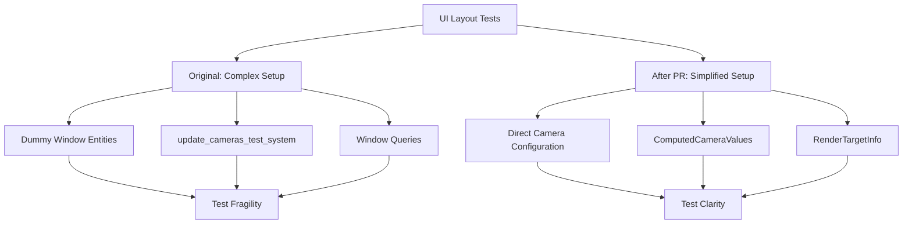

+++
title = "#21081 Simplify UI layout tests"
date = "2025-12-16T00:00:00"
draft = false
template = "pull_request_page.html"
in_search_index = true

[taxonomies]
list_display = ["show"]

[extra]
current_language = "en"
available_languages = {"en" = { name = "English", url = "/pull_request/bevy/2025-12/pr-21081-en-20251216" }, "zh-cn" = { name = "中文", url = "/pull_request/bevy/2025-12/pr-21081-zh-cn-20251216" }}
labels = ["A-UI", "C-Code-Quality", "C-Testing", "D-Straightforward"]
+++

# Title

## Basic Information
- **Title**: Simplify UI layout tests
- **PR Link**: https://github.com/bevyengine/bevy/pull/21081
- **Author**: ickshonpe
- **Status**: MERGED
- **Labels**: A-UI, C-Code-Quality, S-Ready-For-Final-Review, C-Testing, X-Uncontroversial, D-Straightforward
- **Created**: 2025-09-16T10:32:37Z
- **Merged**: 2025-12-16T20:39:19Z
- **Merged By**: alice-i-cecile

## Description Translation

# Objective

The UI layout tests use dummy `Window` entities and a system `update_cameras_test_system` that updates the camera target info from the dummy windows. We can simplify the tests, and make them less fragile, by setting the camera's `ComputedCameraValues` and `RenderTargetInfo` directly.

## Solution

* Remove the dummy `Window` entities, any `Window` queries, and `update_cameras_test_system`.
* In the UI test setup code, set the values for the camera's computed values and render target info when they are spawned.
* Had to hack around a bit with the `ui_node_should_properly_update_when_changing_target_camera` test and manually set the camera's viewport values. The logic for the other tests is unchanged.

This ended up one line longer in total, but it's just because of white space added by formatting around the nested camera value declarations.

## Testing

The tests still pass.

## The Story of This Pull Request

The PR addresses a structural issue in Bevy's UI layout testing. The tests were using a complex setup involving dummy `Window` entities and a custom test system called `update_cameras_test_system` to simulate camera rendering behavior. This approach introduced unnecessary complexity and made the tests more fragile than they needed to be.

The core problem was that UI layout calculations depend on camera properties like the render target's physical size and scale factor. In normal Bevy operation, these values are computed automatically from `Window` entities. For tests, however, this created a dependency chain: tests needed windows, systems to update cameras from those windows, and additional queries to handle window data. This made test setup overly complex and prone to break if the window or camera systems changed.

The solution takes a more direct approach. Instead of creating window entities and running systems to populate camera data, the tests now set the camera's `ComputedCameraValues` and `RenderTargetInfo` directly when spawning cameras. This eliminates the need for dummy windows and the entire `update_cameras_test_system` that was bridging the gap between windows and cameras.

Here's how the approach changed. Before, tests would spawn a window with a specific resolution, then spawn a camera, and rely on `update_cameras_test_system` to read the window's properties and update the camera:

```rust
// Old approach: window + system bridge
world.spawn((Window { resolution: WindowResolution::new(WINDOW_WIDTH, WINDOW_HEIGHT), ..default() }, PrimaryWindow));
world.spawn(Camera2d);
// update_cameras_test_system runs to transfer window data to camera
```

After the change, tests directly configure the camera with the necessary values:

```rust
// New approach: direct camera configuration
world.spawn((Camera2d, Camera {
    computed: ComputedCameraValues {
        target_info: Some(RenderTargetInfo {
            physical_size: UVec2::new(TARGET_WIDTH, TARGET_HEIGHT),
            scale_factor: 1.,
        }),
        ..Default::default()
    },
    viewport: Some(Viewport {
        physical_size: UVec2::new(TARGET_WIDTH, TARGET_HEIGHT),
        ..default()
    }),
    ..Default::default()
}));
```

This direct configuration approach is cleaner because it eliminates indirection. The tests now explicitly state what camera properties they need, rather than relying on implicit behavior of window-to-camera data flow. It also makes the tests less fragile to changes in how windows and cameras interact in the main codebase.

One test required special handling: `ui_node_should_properly_update_when_changing_target_camera`. This test involves multiple cameras with viewports, and the logic for updating viewport sizes had to be adjusted to work with the new approach. Instead of querying window resolution, the updated function now uses the camera's `physical_target_size()` method:

```rust
// Before: used window resolution
let primary_window = primary_window_query.single().expect("missing primary window");
let viewport_width = primary_window.resolution.physical_width() / camera_count as u32;

// After: uses camera's target size directly
let target_size = camera.physical_target_size().unwrap();
let viewport_width = target_size.x / camera_count as u32;
```

This change actually improves the test's logic because it better matches how viewport calculations would work in practice - cameras should base viewport calculations on their own render target properties, not on a global window query.

The refactoring also required updating all existing UI layout and camera propagation tests in `update.rs`. Each test that previously spawned windows and relied on the update system now directly configures camera components. This results in more verbose test setup code (the PR notes it's one line longer overall), but the tradeoff is worthwhile for increased clarity and reduced test fragility.

The changes are purely in test code - no production logic is affected. This makes the PR low-risk while providing meaningful improvements to test maintainability.

## Visual Representation



## Key Files Changed

### `crates/bevy_ui/src/layout/mod.rs` (+119/-109)
This file contains the main UI layout tests. The changes refactor the test setup to eliminate window dependencies and directly configure cameras.

**Key Changes:**
- Removed imports of `update_cameras_test_system`, `Window`, `PrimaryWindow`, and `WindowResolution`
- Added imports for `ComputedCameraValues`, `RenderTargetInfo`, and `Viewport`
- Changed test constants from `WINDOW_WIDTH/WINDOW_HEIGHT` to `TARGET_WIDTH/TARGET_HEIGHT`
- Updated `setup_ui_test_app()` to spawn cameras with direct configuration instead of windows
- Modified the `ui_node_should_properly_update_when_changing_target_camera` test to work without window queries

```rust
// Before: Window-based setup
world.spawn((
    Window {
        resolution: WindowResolution::new(WINDOW_WIDTH, WINDOW_HEIGHT),
        ..default()
    },
    PrimaryWindow,
));
world.spawn(Camera2d);

// After: Direct camera configuration
world.spawn((
    Camera2d,
    Camera {
        computed: ComputedCameraValues {
            target_info: Some(RenderTargetInfo {
                physical_size: UVec2::new(TARGET_WIDTH, TARGET_HEIGHT),
                scale_factor: 1.,
            }),
            ..Default::default()
        },
        viewport: Some(Viewport {
            physical_size: UVec2::new(TARGET_WIDTH, TARGET_HEIGHT),
            ..default()
        }),
        ..Default::default()
    },
));
```

### `crates/bevy_ui/src/update.rs` (+119/-109)
This file contains camera propagation tests for UI. The changes remove the test-only `update_cameras_test_system` and update all tests to directly configure cameras.

**Key Changes:**
- Removed the entire `update_cameras_test_system` function
- Updated all test functions to spawn cameras with pre-configured `ComputedCameraValues` instead of relying on windows
- Removed window-related imports and queries from tests
- Removed the system from the test app schedule

```rust
// Before: Using update_cameras_test_system
app.add_systems(
    bevy_app::Update,
    (
        super::update_cameras_test_system,
        propagate_ui_target_cameras,
    ).chain(),
);

// After: Direct system setup
app.add_systems(bevy_app::Update, propagate_ui_target_cameras);
```

### `crates/bevy_ui/src/widget/viewport.rs` (+6/-5)
Minor import reorganization to clean up dependencies and improve code organization.

**Key Changes:**
- Reordered imports to group Bevy UI imports together
- Separated conditional imports for better clarity
- No functional changes to the viewport widget itself

```rust
// Import reorganization - grouping related imports
#[cfg(feature = "bevy_picking")]
use crate::UiGlobalTransform;
use crate::{ComputedNode, Node};
use bevy_asset::Assets;
#[cfg(feature = "bevy_picking")]
use bevy_camera::Camera;
use bevy_camera::RenderTarget;
```

## Further Reading

- [Bevy UI System Documentation](https://bevyengine.org/learn/book/getting-started/ui/) - Official Bevy UI guide
- [Bevy Testing Best Practices](https://bevyengine.org/learn/book/advanced-topics/testing/) - Testing patterns in Bevy
- [Entity Component System Pattern](https://en.wikipedia.org/wiki/Entity_component_system) - Understanding ECS architecture
- [Test Code Simplicity Principles](https://martinfowler.com/bliki/TestPyramid.html) - Martin Fowler on test design patterns