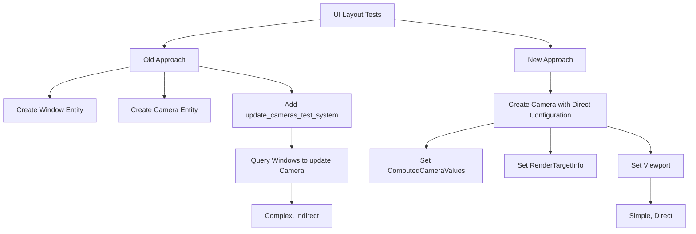

+++
title = "#21081 Simplify UI layout tests"
date = "2025-12-16T00:00:00"
draft = false
template = "pull_request_page.html"
in_search_index = false

[extra]
current_language = "zh-cn"
available_languages = {"en" = { name = "English", url = "/pull_request/bevy/2025-12/pr-21081-en-20251216" }, "zh-cn" = { name = "中文", url = "/pull_request/bevy/2025-12/pr-21081-zh-cn-20251216" }}
labels = ["A-UI", "C-Code-Quality", "C-Testing", "D-Straightforward"]
+++

# Title: Simplify UI layout tests

## Basic Information
- **Title**: Simplify UI layout tests
- **PR Link**: https://github.com/bevyengine/bevy/pull/21081
- **Author**: ickshonpe
- **Status**: MERGED
- **Labels**: A-UI, C-Code-Quality, S-Ready-For-Final-Review, C-Testing, X-Uncontroversial, D-Straightforward
- **Created**: 2025-09-16T10:32:37Z
- **Merged**: 2025-12-16T20:39:19Z
- **Merged By**: alice-i-cecile

## Description Translation
**目标**

UI布局测试使用了模拟的`Window`实体和一个系统`update_cameras_test_system`，该系统从模拟窗口更新相机的目标信息。我们可以通过直接设置相机的`ComputedCameraValues`和`RenderTargetInfo`来简化测试，并使其更健壮。

**解决方案**

* 移除模拟的`Window`实体、所有`Window`查询和`update_cameras_test_system`系统。
* 在UI测试设置代码中，在创建相机时直接设置其计算值和渲染目标信息的值。
* 对于`ui_node_should_properly_update_when_changing_target_camera`测试，不得不稍作修改，手动设置相机的视口值。其他测试的逻辑保持不变。

由于嵌套相机值声明周围的格式调整增加了空白，代码总行数最终增加了一行。

**测试**

测试仍然通过。

## The Story of This Pull Request

这个PR的核心目标是简化Bevy中UI布局测试的实现，使其更直接、更健壮。原先的测试方案依赖于模拟的窗口实体和专门为测试编写的更新系统，而新方案直接设置相机组件的数据，减少了不必要的间接性。

**问题与背景**

在Bevy的UI系统测试中，测试代码需要模拟一个渲染目标（通常是一个窗口）来测试UI节点的布局计算。原先的实现方案是：
1. 创建一个模拟的`Window`实体
2. 创建一个`Camera2d`实体
3. 通过一个名为`update_cameras_test_system`的特殊系统，从窗口数据更新相机的`RenderTargetInfo`

这种方案有几个问题：
1. **间接性**：测试需要通过一个额外的系统来更新相机数据
2. **脆弱性**：测试依赖于窗口查询和系统执行顺序
3. **复杂性**：测试设置涉及多个实体和系统，增加了理解成本

**解决方案思路**

开发者采取了直接的方法：既然测试需要特定的相机配置，为什么不直接设置这些配置？新方案移除了模拟窗口和更新系统，直接在创建相机时设置：
- `Camera.computed.target_info` - 包含物理尺寸和缩放因子的渲染目标信息
- `Camera.viewport` - 视口设置

这种改变使测试更直接：创建相机时即带有正确的配置，无需依赖外部系统更新。

**实现细节**

实现分为三个主要部分：

1. **移除测试专用的更新系统**：删除了`update_cameras_test_system`函数及其在测试中的使用。
2. **重构相机创建逻辑**：在所有测试中，将相机创建从简单的`Camera2d`组件改为包含完整配置的相机。
3. **更新测试常量**：将`WINDOW_WIDTH/WINDOW_HEIGHT`重命名为更通用的`TARGET_WIDTH/TARGET_HEIGHT`。

关键的技术决策包括：
- 保持向后兼容的测试行为
- 在视口相关的测试中手动设置视口值
- 保持所有测试的原有逻辑不变，只改变配置方式

**技术洞察**

这个PR展示了几种测试优化模式：
1. **直接配置优于间接计算**：在测试中，直接设置所需状态比通过系统计算更可靠。
2. **最小化测试依赖**：通过移除窗口实体和查询，测试现在更独立于窗口系统。
3. **关注点分离**：UI布局测试应关注布局逻辑，而不是相机更新机制。

性能方面，虽然变化不大，但减少了测试运行时的系统调度和查询开销。

**影响**

这些变化带来了几个好处：
1. **代码简化**：减少了约100行代码，移除了专门的测试系统。
2. **测试健壮性**：减少了对系统执行顺序和查询的依赖。
3. **可维护性**：测试设置更直接，新人更容易理解。
4. **执行速度**：轻微的性能提升，减少了不必要的系统调用。

最重要的是，这个PR为UI测试建立了更清晰的模式：直接在测试中设置所需的组件状态，而不是依赖复杂的模拟场景。

## Visual Representation



## Key Files Changed

### 1. `crates/bevy_ui/src/layout/mod.rs` (+119/-109)
**变化描述**：重构了UI布局测试模块，移除了窗口依赖，改为直接配置相机组件。

**关键修改**：
```rust
// Before: 使用窗口和更新系统
world.spawn((
    Window {
        resolution: WindowResolution::new(WINDOW_WIDTH, WINDOW_HEIGHT),
        ..default()
    },
    PrimaryWindow,
));
world.spawn(Camera2d);

// After: 直接配置相机
world.spawn((
    Camera2d,
    Camera {
        computed: ComputedCameraValues {
            target_info: Some(RenderTargetInfo {
                physical_size: UVec2::new(TARGET_WIDTH, TARGET_HEIGHT),
                scale_factor: 1.,
            }),
            ..Default::default()
        },
        viewport: Some(Viewport {
            physical_size: UVec2::new(TARGET_WIDTH, TARGET_HEIGHT),
            ..default()
        }),
        ..Default::default()
    },
));
```

**与PR目标的关系**：这是主要的测试重构部分，展示了从间接窗口更新到直接相机配置的转变。

### 2. `crates/bevy_ui/src/update.rs` (+38/-27)
**变化描述**：移除了测试专用的`update_cameras_test_system`并更新了相关测试。

**关键修改**：
```rust
// Before: 测试系统
#[cfg(test)]
pub(crate) fn update_cameras_test_system(
    primary_window: Query<Entity, bevy_ecs::query::With<bevy_window::PrimaryWindow>>,
    window_query: Query<&bevy_window::Window>,
    mut camera_query: Query<(&mut Camera, &bevy_camera::RenderTarget)>,
) {
    // 复杂的窗口查询和更新逻辑
}

// After: 完全移除该系统
// 所有测试现在直接配置相机
```

**与PR目标的关系**：移除了测试间接性的根源，简化了测试架构。

### 3. `crates/bevy_ui/src/widget/viewport.rs` (+6/-5)
**变化描述**：仅调整了导入语句的顺序，没有功能变化。

**关键修改**：
```rust
// 导入顺序调整，更好的代码组织
```

**与PR目标的关系**：虽然是次要变化，但显示了代码质量的改进。

## Further Reading

对于想要深入了解此PR中使用的模式和技术的读者，建议参考：

1. **Bevy测试指南**：了解Bevy的测试最佳实践和模式
2. **实体组件系统（ECS）模式**：理解如何直接在测试中配置组件状态
3. **测试驱动开发（TDD）**：学习如何编写更简洁、健壮的测试
4. **Bevy UI系统文档**：深入了解UI布局系统的工作原理