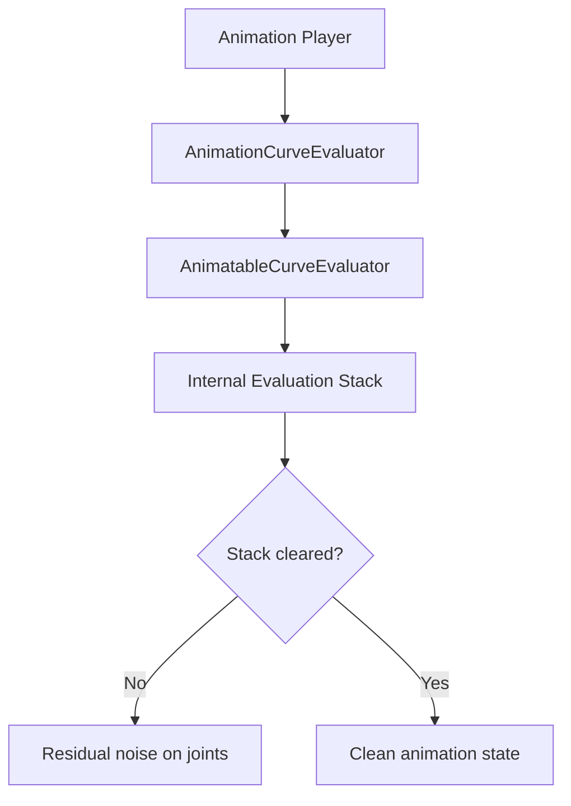

+++
title = "#21118 clear animation evaluator stack"
date = "2025-12-08T00:00:00"
draft = false
template = "pull_request_page.html"
in_search_index = true

[taxonomies]
list_display = ["show"]

[extra]
current_language = "en"
available_languages = {"en" = { name = "English", url = "/pull_request/bevy/2025-12/pr-21118-en-20251208" }, "zh-cn" = { name = "中文", url = "/pull_request/bevy/2025-12/pr-21118-zh-cn-20251208" }}
labels = ["C-Bug", "A-Animation", "D-Straightforward"]
+++

# Title

## Basic Information
- **Title**: clear animation evaluator stack
- **PR Link**: https://github.com/bevyengine/bevy/pull/21118
- **Author**: robtfm
- **Status**: MERGED
- **Labels**: C-Bug, S-Ready-For-Final-Review, A-Animation, X-Uncontroversial, D-Straightforward
- **Created**: 2025-09-18T14:09:55Z
- **Merged**: 2025-12-08T21:57:05Z
- **Merged By**: mockersf

## Description Translation
# Objective

A large complex animation (2642 curves over 62 joints) causes serious residual noise on joints after it stops playing. here i start the animation then quickly cancel it:

https://github.com/user-attachments/assets/9552d69e-bb10-400f-94a6-c93d301c689b

this also seems to affect entities that are animated, but not by the player that fires the large animation, which is really bizarre (here i do not cancel it):

https://github.com/user-attachments/assets/a0d99df5-f53d-4ff0-9cf1-87a0e78b8abd


## Solution

debugging i found that the curve evaluator stack is growing unbounded while the complex animation is playing (100k items after a second or two) and is not cleared after the animation is stopped / replaced, so i tried clearing the evaluator stack and that seems to fix it.

i have no idea if this fix is sensible or if the root of the issue is elsewhere. i don't see any knockon ill-effects but can't be sure there aren't any. i do not understand this code at all and it's hard to get a clear picture of what it's trying to do, so hopefully somebody who does understand it can diagnose better.

i attached the gltf containing the animation that causes the issue but i can't give a simple repro - in my code i have to retarget the animation onto an avatar which isn't included in the animation gltf (i can provide an example for that if anybody wants it).

[bafybeicoja22tkr2rxpccmwh74yehnurgolias77reztd2kuhtvsn2luue.glb.zip](https://github.com/user-attachments/files/22408365/bafybeicoja22tkr2rxpccmwh74yehnurgolias77reztd2kuhtvsn2luue.glb.zip)


## Testing

no

## The Story of This Pull Request

A developer encountered a critical bug in Bevy's animation system when working with complex animations. The issue manifested as serious residual noise on joints after animations stopped playing. Specifically, a large animation with 2642 curves over 62 joints caused visual artifacts that persisted even after the animation was canceled. Even more concerning, this bug seemed to affect entities that weren't directly animated by the problematic animation player, suggesting a systemic issue in the animation system.

The developer started investigating by reproducing the issue with two test cases. The first case showed an animation being started and quickly canceled, leaving joints in an incorrect state. The second case demonstrated the animation affecting unrelated entities, which was particularly concerning for game development where animation state isolation is crucial.

Through debugging, the developer discovered that the animation curve evaluator's internal stack was growing unbounded during animation playback. For complex animations, this stack could accumulate over 100,000 items in just a few seconds. More critically, this stack was never cleared after animations stopped or were replaced, leaving residual data that continued to affect animation evaluations.

The root cause appeared to be in the `AnimationCurveEvaluator` implementation for `AnimatableCurveEvaluator`. The system was designed to use a stack-based approach for evaluating animation curves, but it failed to properly clean up this stack after completing evaluations. This memory leak of sorts in the evaluation state caused subsequent animations to be evaluated incorrectly, leading to the observed visual artifacts.

The fix was straightforward but required careful consideration. The developer added a single line to clear the evaluator stack after completing the evaluation:

```rust
self.evaluator.stack.clear();
```

This line was inserted in the `evaluate` method of the `AnimationCurveEvaluator` implementation for `AnimatableCurveEvaluator`, specifically after the final value was popped from the stack but before returning from the evaluation.

The developer acknowledged that while this fix resolved the immediate issue, there might be deeper architectural problems in the animation system. The code was complex and difficult to understand, making it hard to determine if this was the optimal solution or merely a workaround for a more fundamental design flaw. However, given that the fix eliminated the visual artifacts without apparent side effects, it was proposed as a practical solution.

This case highlights a common pattern in complex systems: memory or state that persists beyond its intended lifetime can cause subtle bugs that are difficult to diagnose. The stack-based evaluation approach is efficient for certain types of animation curve calculations but requires careful state management to prevent cross-contamination between different animation evaluations.

## Visual Representation



## Key Files Changed

1. **File**: `crates/bevy_animation/src/animation_curves.rs`

**Description**: This file contains the implementation of animation curve evaluation. The change adds a single line to clear the internal evaluation stack after completing an animation curve evaluation, preventing residual stack data from affecting subsequent animations.

**Code Change**:
```rust
// Before:
impl<A: Animatable> AnimationCurveEvaluator for AnimatableCurveEvaluator<A> {
    fn evaluate(&mut self) -> Result<(), AnimationError> {
        let _ = self
            .evaluator
            .stack
            .pop()
            .ok_or_else(inconsistent::<AnimatableCurveEvaluator<A>>)?
            .value;
        Ok(())
    }
}

// After:
impl<A: Animatable> AnimationCurveEvaluator for AnimatableCurveEvaluator<A> {
    fn evaluate(&mut self) -> Result<(), AnimationError> {
        let _ = self
            .evaluator
            .stack
            .pop()
            .ok_or_else(inconsistent::<AnimatableCurveEvaluator<A>>)?
            .value;
        self.evaluator.stack.clear();  // Added line
        Ok(())
    }
}
```

**Relationship to PR Purpose**: This change directly addresses the root cause of the bug by ensuring that the evaluation stack is cleared after each animation evaluation, preventing residual data from accumulating and causing visual artifacts.

## Further Reading

1. **Bevy Animation System Documentation**: For understanding Bevy's animation architecture and how curve evaluation fits into the larger system
2. **Stack-Based Evaluation Patterns**: Research on stack-based evaluation algorithms commonly used in animation and procedural generation systems
3. **Memory Management in Game Engines**: Understanding how game engines manage state and memory to prevent cross-contamination between systems
4. **Animation Retargeting**: The developer mentioned retargeting animations, which is a complex topic in character animation systems
5. **GLTF Animation Format**: Understanding how complex animations are structured in the GLTF format used in the test case