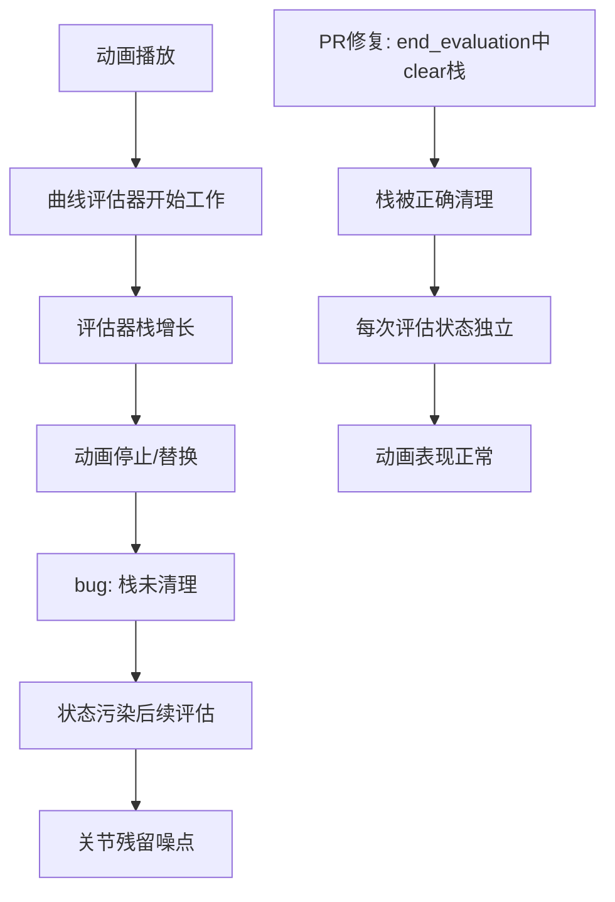

+++
title = "#21118 clear animation evaluator stack"
date = "2025-12-08T00:00:00"
draft = false
template = "pull_request_page.html"
in_search_index = false

[extra]
current_language = "zh-cn"
available_languages = {"en" = { name = "English", url = "/pull_request/bevy/2025-12/pr-21118-en-20251208" }, "zh-cn" = { name = "中文", url = "/pull_request/bevy/2025-12/pr-21118-zh-cn-20251208" }}
+++

# clear animation evaluator stack

## 基本信息
- **标题**: clear animation evaluator stack
- **PR链接**: https://github.com/bevyengine/bevy/pull/21118
- **作者**: robtfm
- **状态**: 已合并
- **标签**: C-Bug, S-Ready-For-Final-Review, A-Animation, X-Uncontroversial, D-Straightforward
- **创建时间**: 2025-09-18T14:09:55Z
- **合并时间**: 2025-12-08T21:57:05Z
- **合并者**: mockersf

## 描述翻译

### 目标

一个大型复杂动画（62个关节上的2642条曲线）在停止播放后会在关节上产生严重的残留噪点。这里我启动动画然后快速取消它：

https://github.com/user-attachments/assets/9552d69e-bb10-400f-94a6-c93d301c689b

这似乎也影响到被动画化的实体，但不是由触发大型动画的播放器触发的，这真的很奇怪（这里我没有取消它）：

https://github.com/user-attachments/assets/a0d99df5-f53d-4ff0-9cf1-87a0e78b8abd

### 解决方案

调试时我发现曲线评估器栈在复杂动画播放时无限制增长（一两秒后达到10万个项目），并且在动画停止/替换后没有被清理，所以我尝试清理评估器栈，这似乎解决了问题。

我不知道这个修复是否合理，或者问题的根源是否在其他地方。我没有看到任何副作用，但不能确定没有。我完全不理解这段代码，也很难清楚地理解它试图做什么，所以希望理解它的人能更好地诊断。

我附上了导致问题的动画gltf文件，但我无法提供一个简单的重现示例——在我的代码中，我必须将动画重定向到一个不在动画gltf中的虚拟形象上（如果有人需要，我可以提供该示例）。

[bafybeicoja22tkr2rxpccmwh74yehnurgolias77reztd2kuhtvsn2luue.glb.zip](https://github.com/user-attachments/files/22408365/bafybeicoja22tkr2rxpccmwh74yehnurgolias77reztd2kuhtvsn2luue.glb.zip)

### 测试

无

---

## 这个Pull Request的故事

### 问题和背景

这个PR源于Bevy动画系统中的一个bug。当开发者使用包含大量动画曲线（2642条曲线分布在62个关节上）的复杂动画时，发现动画停止播放后，关节上会残留奇怪的噪声或抖动。更奇怪的是，即使动画没有被取消，这个bug也会影响到没有被该动画播放器直接控制的实体。

从技术角度看，这是一个内存管理和状态清理问题。动画系统在评估动画曲线时使用了一个栈结构（evaluator stack）来管理嵌套的动画计算。在正常情况下，这个栈应该在每次动画评估后被清理干净，但实际表现并非如此。

这个bug有两个关键特征：
1. **内存泄漏式增长**：栈在动画播放过程中无限制增长，一两秒内就能积累10万个项目
2. **状态残留**：即使动画停止或替换，栈中的内容也没有被清理，导致后续动画评估使用了错误的状态

这种情况类似于内存泄漏，但不是传统的内存分配问题，而是数据结构在重用过程中没有正确重置其内部状态。残留的状态会污染后续的动画计算，导致关节位置出现无法预测的偏移或抖动。

### 解决方案方法

开发者采用了最直接的方法：在每次动画曲线评估结束后，显式地清理评估器栈。这是一个保守的修复策略——与其深入理解复杂的栈管理逻辑，不如确保每次评估后都回到干净的状态。

从工程角度看，这个选择有几个优点：
1. **简单性**：一行代码解决问题
2. **安全性**：显式清理比依赖隐式状态转移更可靠
3. **隔离性**：确保每次动画评估都是独立的，不会受到之前计算的影响

这种方法的风险在于可能破坏了某些预期的栈重用优化。如果栈设计为在多次评估间保留状态以实现某种性能优化，那么这种清理可能会引入微小的性能开销。不过考虑到栈的无限制增长已经导致了严重的bug，这种潜在的性能权衡是合理的。

### 实现细节

核心修改在`AnimatableCurveEvaluator`的实现中。这个结构体负责评估可动画化（animatable）类型的曲线，比如变换（transform）、旋转（rotation）等。

修改前的代码只弹出栈顶元素，但没有清理栈的其余部分：
```rust
impl<A: Animatable> AnimationCurveEvaluator for AnimatableCurveEvaluator<A> {
    // ...
    fn end_evaluation(&mut self) -> Result<(), AnimationEvaluationError> {
        self.value = self
            .evaluator
            .stack
            .pop()
            .ok_or_else(inconsistent::<AnimatableCurveEvaluator<A>>)?
            .value;
        // 缺少栈清理
        Ok(())
    }
}
```

修改后，在获取最终值后立即清理整个栈：
```rust
impl<A: Animatable> AnimationCurveEvaluator for AnimatableCurveEvaluator<A> {
    // ...
    fn end_evaluation(&mut self) -> Result<(), AnimationEvaluationError> {
        self.value = self
            .evaluator
            .stack
            .pop()
            .ok_or_else(inconsistent::<AnimatableCurveEvaluator<A>>)?
            .value;
        // 新增的清理代码
        self.evaluator.stack.clear();
        Ok(())
    }
}
```

这个修改的优雅之处在于它针对问题的根源——栈没有被正确重置。`clear()`方法会移除栈中的所有元素，将其长度设为0，但保留已分配的容量，这样既解决了状态污染问题，又保持了内存分配的性能。

### 技术见解

这个bug揭示了几点关于Bevy动画系统架构的信息：

1. **动画评估是有状态的**：评估器维护一个栈来管理嵌套的动画曲线计算。这种设计可能用于处理分层动画或复杂的曲线混合。

2. **状态生命周期管理很重要**：动画系统需要仔细管理评估状态的生命周期。评估器应该在每次完整评估后完全重置，以确保下次评估不会受到残留状态的影响。

3. **复杂动画会放大实现缺陷**：简单的动画可能不会触发这个问题，因为栈的增长可能不够快，或者残留状态的影响不明显。但2642条曲线的大型动画会迅速暴露出状态管理的问题。

潜在的改进方向：
- 考虑使用更显式的状态管理模式，比如每个动画评估都创建新的评估器实例
- 添加防御性断言来检测栈的异常增长
- 为评估器实现`Drop` trait以确保资源清理

### 影响

这个修复直接解决了两个问题：
1. **消除了动画残留噪点**：关节在动画停止后会停留在正确的位置，不会出现随机抖动
2. **防止了内存异常增长**：评估器栈不再无限制积累，避免了潜在的内存问题

虽然修复看起来简单，但它解决了影响大型复杂动画稳定性的核心问题。这也提醒我们，在状态机或堆栈驱动的系统中，清理内部状态是防止跨操作污染的关键步骤。

值得注意的是，开发者诚实地表示他们不完全理解这段代码的工作原理，但仍然提供了有效的解决方案。这在开源协作中很常见——有时能观察到问题的症状并找到有效的解决方法，即使不能完全理解底层机制。

## 视觉表示



## 关键文件更改

### `crates/bevy_animation/src/animation_curves.rs` (+1/-0)

这个文件包含了动画曲线评估的核心逻辑。修改发生在`AnimatableCurveEvaluator`结构体的`end_evaluation`方法中。

**修改内容**：
在方法的最后添加了一行代码来清理评估器栈：

```rust
impl<A: Animatable> AnimationCurveEvaluator for AnimatableCurveEvaluator<A> {
    fn end_evaluation(&mut self) -> Result<(), AnimationEvaluationError> {
        self.value = self
            .evaluator
            .stack
            .pop()
            .ok_or_else(inconsistent::<AnimatableCurveEvaluator<A>>)?
            .value;
        // 新增这行代码
        self.evaluator.stack.clear();
        Ok(())
    }
}
```

**为什么这个修改重要**：
- 解决了评估器栈在动画评估过程中无限制增长的问题
- 防止了动画状态在评估间污染，消除了关节的残留噪点
- 确保了每次动画评估都从一个干净的状态开始

## 扩展阅读

1. **Bevy动画系统文档**：了解Bevy中动画系统的基本架构和工作原理
2. **状态机模式**：这个bug涉及状态管理，理解状态机模式有助于设计更健壮的动画系统
3. **Rust中的内存管理**：理解`Vec::clear()`与重新分配的区别，以及栈数据结构的内存行为
4. **防御性编程**：如何设计系统来预防类似的状态污染问题