+++
title = "#21225 anchor layout example"
date = "2025-12-08T00:00:00"
draft = false
template = "pull_request_page.html"
in_search_index = true

[taxonomies]
list_display = ["show"]

[extra]
current_language = "en"
available_languages = {"en" = { name = "English", url = "/pull_request/bevy/2025-12/pr-21225-en-20251208" }, "zh-cn" = { name = "中文", url = "/pull_request/bevy/2025-12/pr-21225-zh-cn-20251208" }}
labels = ["C-Examples", "A-UI"]
+++

# Title
## anchor layout example

## Basic Information
- **Title**: anchor layout example
- **PR Link**: https://github.com/bevyengine/bevy/pull/21225
- **Author**: ChristopherBiscardi
- **Status**: MERGED
- **Labels**: C-Examples, A-UI, S-Needs-Review
- **Created**: 2025-09-26T09:25:11Z
- **Merged**: 2025-12-08T12:19:16Z
- **Merged By**: mockersf

## Description Translation
The PR description remains in English as requested.

# Objective

There was [some discussion in discord](https://discord.com/channels/691052431525675048/1264881140007702558/1420909052879175810) about "anchor layouts".

They are, as far as I can tell, basically absolute positioning.

## Solution

Write an example that shows how to "anchor" elements to the top/left/right/bottom of a box. Also optionally included "centering" using auto margins.

## Testing

```
cargo run --example anchor_positioning
```

Moving the window around changes the gray box sizes, while the interior labels are "anchored" to their respective positions, offset from their specific side attachments by 10 pixels

## Showcase


## The Story of This Pull Request

The PR addresses a community request for an example demonstrating "anchor layouts" in Bevy's UI system. Anchor layouts refer to a common UI pattern where elements are positioned relative to the edges of their container, similar to CSS absolute positioning with offsets from specific sides.

The developer identified a gap in Bevy's existing examples: while Bevy's UI system supports absolute positioning through the `PositionType::Absolute` setting combined with `left`, `right`, `top`, and `bottom` properties, there wasn't a clear example showing how to use these features together. This made it difficult for new users to understand how to implement common UI patterns like tooltips, overlays, or positioned dialogs.

The solution approach was straightforward: create a minimal, focused example that demonstrates all combinations of edge anchoring. The example needed to be visually clear, showing each possible combination of anchored edges (top-left, top-center, top-right, middle-left, center, middle-right, bottom-left, bottom-center, bottom-right). The developer chose a 3x3 grid layout to display all nine combinations simultaneously, which makes it easy for users to see how each anchoring configuration behaves.

The implementation is clean and educational. The core insight is that anchor layouts in Bevy require two key settings: first, setting `position_type: PositionType::Absolute` on the positioned element, and second, specifying offsets from one or more edges using the `left`, `right`, `top`, and `bottom` properties on the `Node` component. For centering, the example demonstrates using auto margins - when you set `margin: UiRect::all(Val::Auto)` on an absolutely positioned element, it centers within its parent container.

Here's the key code pattern that makes anchoring work:

```rust
Node {
    display: Display::Block,
    padding: UiRect::axes(px(5), px(1)),
    position_type: PositionType::Absolute,  // This enables absolute positioning
    left: px(10),  // Anchor 10px from the left edge
    top: px(10),   // Anchor 10px from the top edge
    ..default()
}
```

The example also shows a clever technique for centering: when you want an element centered horizontally, you can use `margin: auto().horizontal()`, which sets both left and right margins to `Val::Auto`. This pushes the element to the center. Similarly, `UiRect::vertical(Val::Auto)` centers vertically, and `UiRect::all(Val::Auto)` centers in both dimensions.

One important implementation detail is how the example handles the grid layout. The parent container uses CSS Grid layout properties that were recently added to Bevy:

```rust
Node {
    display: Display::Grid,
    grid_template_columns: RepeatedGridTrack::fr(3, 1.),
    grid_template_rows: RepeatedGridTrack::fr(3, 1.),
    ..default()
}
```

This creates a 3x3 grid where each cell takes up equal space. Each gray box is placed in one cell using `grid_column: GridPlacement::span(1)` and `grid_row: GridPlacement::span(1)`. This grid approach makes the example responsive - when you resize the window, the gray boxes resize proportionally, but the anchored labels maintain their positions relative to their containing gray box.

The example is well-structured for educational purposes. It uses a data-driven approach where all nine configurations are defined in an array, then mapped to UI elements:

```rust
let rows = [
    ("left: 10px\ntop: 10px", Node { left: px(10), top: px(10), ..default() }),
    // ... 7 more configurations ...
    ("right: 10px\nbottom: 10px", Node { right: px(10), bottom: px(10), ..default() }),
];
```

This makes it easy to see all the possible configurations in one place and understand how each property combination affects positioning.

From a technical perspective, this example demonstrates several important Bevy UI concepts:
1. Absolute positioning with `PositionType::Absolute`
2. Edge-based positioning with `left`, `right`, `top`, `bottom`
3. Centering techniques using auto margins
4. CSS Grid layout for container organization
5. Nested UI hierarchies with parent-child relationships
6. Responsive design that works with window resizing

The impact of this PR is purely educational - it doesn't change any functionality in Bevy, but it provides a valuable reference for developers trying to understand how to position UI elements precisely. Examples like this reduce the learning curve for new Bevy users and serve as living documentation for the UI system's capabilities.

One thing to note is that the example uses `PositionType::Absolute`, which positions elements relative to their nearest positioned ancestor (or the viewport if none exist). In this case, each gray box serves as the positioning context for its anchored label because it's the immediate parent. This is an important detail that developers need to understand when building more complex UI hierarchies.

## Visual Representation

```mermaid
graph TD
    A[Window/Root Node] --> B[Grid Container]
    B --> C[Gray Box 1 Top-Left]
    B --> D[Gray Box 2 Top-Center]
    B --> E[Gray Box 3 Top-Right]
    B --> F[Gray Box 4 Middle-Left]
    B --> G[Gray Box 5 Center]
    B --> H[Gray Box 6 Middle-Right]
    B --> I[Gray Box 7 Bottom-Left]
    B --> J[Gray Box 8 Bottom-Center]
    B --> K[Gray Box 9 Bottom-Right]
    
    C --> L[Pink Label anchored top-left]
    D --> M[Pink Label anchored top-center]
    E --> N[Pink Label anchored top-right]
    F --> O[Pink Label anchored middle-left]
    G --> P[Pink Label anchored center]
    H --> Q[Pink Label anchored middle-right]
    I --> R[Pink Label anchored bottom-left]
    J --> S[Pink Label anchored bottom-center]
    K --> T[Pink Label anchored bottom-right]
    
    style A fill:#f9f,stroke:#333
    style B fill:#ccf,stroke:#333
    style C fill:#ddd,stroke:#333
    style D fill:#ddd,stroke:#333
    style E fill:#ddd,stroke:#333
    style F fill:#ddd,stroke:#333
    style G fill:#ddd,stroke:#333
    style H fill:#ddd,stroke:#333
    style I fill:#ddd,stroke:#333
    style J fill:#ddd,stroke:#333
    style K fill:#ddd,stroke:#333
    style L fill:#fcc,stroke:#333
    style M fill:#fcc,stroke:#333
    style N fill:#fcc,stroke:#333
    style O fill:#fcc,stroke:#333
    style P fill:#fcc,stroke:#333
    style Q fill:#fcc,stroke:#333
    style R fill:#fcc,stroke:#333
    style S fill:#fcc,stroke:#333
    style T fill:#fcc,stroke:#333
```



## Key Files Changed

1. **`examples/ui/anchor_layout.rs`** (+146/-0)
   - This is a completely new file that contains the anchor layout example
   - The example demonstrates 9 different anchor position combinations in a 3x3 grid
   - Each combination shows text labels positioned using `left`, `right`, `top`, `bottom` properties with `PositionType::Absolute`
   
   Key code snippet showing the absolute positioning setup:
   ```rust
   Node {
       display: Display::Block,
       padding: UiRect::axes(px(5), px(1)),
       position_type: PositionType::Absolute,  // Enables absolute positioning
       ..node  // Contains left/right/top/bottom values from the rows array
   }
   ```

2. **`Cargo.toml`** (+11/-0)
   - Added the new example to Bevy's example configuration
   - Makes the example runnable with `cargo run --example anchor_layout`
   - Sets up proper documentation scraping for the example
   
   ```toml
   [[example]]
   name = "anchor_layout"
   path = "examples/ui/anchor_layout.rs"
   doc-scrape-examples = true
   
   [package.metadata.example.anchor_layout]
   name = "Anchor Layout"
   description = "Shows an 'anchor layout' style of ui layout"
   category = "UI (User Interface)"
   wasm = true
   ```

3. **`examples/README.md`** (+1/-0)
   - Added a single line to the documentation to list the new example
   - Ensures the example appears in the project's example documentation
   
   ```markdown
   [Anchor Layout](../examples/ui/anchor_layout.rs) | Shows an 'anchor layout' style of ui layout
   ```

## Further Reading

1. **Bevy UI Documentation**: The official Bevy UI documentation provides comprehensive information about the UI system's components and layout algorithms
2. **CSS Absolute Positioning**: Since Bevy's UI system is inspired by CSS, understanding CSS absolute positioning concepts (like `position: absolute`, `top`, `left`, etc.) can help understand the patterns shown in this example
3. **Bevy UI Examples**: Other UI examples in the Bevy repository demonstrate different aspects of the UI system, such as `flex_layout`, `grid_layout`, and `overflow`
4. **CSS Grid Layout**: The example uses CSS Grid for the container layout, which is worth studying separately to understand modern layout techniques
5. **Bevy Discord Community**: The PR originated from Discord discussion, showing that the Bevy community is an active resource for learning and sharing UI patterns