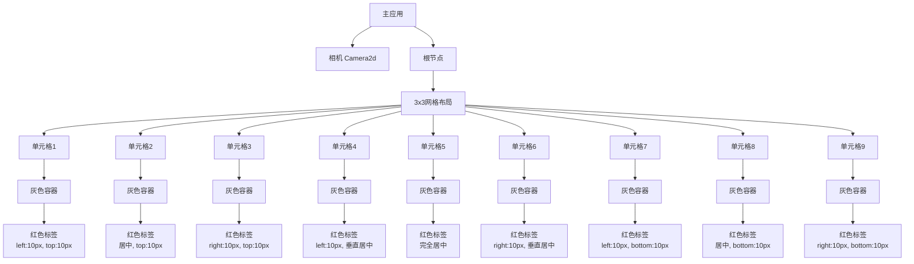

+++
title = "#21225 anchor layout example"
date = "2025-12-08T00:00:00"
draft = false
template = "pull_request_page.html"
in_search_index = false

[extra]
current_language = "zh-cn"
available_languages = {"en" = { name = "English", url = "/pull_request/bevy/2025-12/pr-21225-en-20251208" }, "zh-cn" = { name = "中文", url = "/pull_request/bevy/2025-12/pr-21225-zh-cn-20251208" }}
+++

# 锚点布局示例分析报告

## 基本信息
- **标题**: anchor layout example
- **PR链接**: https://github.com/bevyengine/bevy/pull/21225
- **作者**: ChristopherBiscardi
- **状态**: 已合并
- **标签**: C-Examples, A-UI, S-Needs-Review
- **创建时间**: 2025-09-26T09:25:11Z
- **合并时间**: 2025-12-08T12:19:16Z
- **合并者**: mockersf

## 描述翻译

### 目标
在 Discord 中[有关于"锚点布局"的讨论](https://discord.com/channels/691052431525675048/1264881140007702558/1420909052879175810)。

据我所知，它们基本上就是绝对定位。

### 解决方案
编写一个示例，展示如何将元素"锚定"到盒子的顶部/左侧/右侧/底部。同时可选地包含使用自动边距的"居中"功能。

### 测试
```
cargo run --example anchor_positioning
```

移动窗口会改变灰色盒子的大小，而内部标签则"锚定"在它们各自的位置，从它们特定的侧边附着点偏移10像素

### 展示


## 该拉取请求的故事

这个拉取请求源于 Bevy 社区中对"锚点布局"概念的讨论。在 Discord 聊天中，开发者们讨论了如何在 Bevy 的 UI 系统中实现类似传统 CSS 中绝对定位的功能。问题的核心是：用户需要一种方式来相对于父容器的特定边缘（顶部、底部、左侧、右侧）定位 UI 元素，而不是依赖于流式布局或网格布局。

作者 ChristopherBiscardi 识别到这个需求，并决定创建一个示例来演示如何在 Bevy 中实现这种布局模式。技术实现的关键在于理解 Bevy UI 系统中的 `Node` 组件及其定位属性。Bevy 的 UI 系统已经支持绝对定位，但这个示例展示了如何结合使用 `left`、`right`、`top`、`bottom` 属性和 `margin` 属性来实现精确的锚定效果。

示例的实现思路是创建一个 3x3 的网格布局，每个单元格包含一个灰色背景的容器，内部放置一个红色背景的标签。每个标签使用不同的定位组合来展示九种不同的锚定场景。例如：
- 左上角锚定：`left: 10px` 和 `top: 10px`
- 顶部居中：使用 `margin: auto().horizontal()` 和 `top: 10px`
- 右下角锚定：`right: 10px` 和 `bottom: 10px`

技术实现上，这个示例使用了 Bevy 的 `PositionType::Absolute` 来启用绝对定位，然后通过设置 `left`、`right`、`top`、`bottom` 属性来指定元素相对于父容器边缘的偏移量。特别值得注意的是，居中效果是通过设置 `margin: Val::Auto` 来实现的，这是 CSS 盒子模型中实现水平或垂直居中的标准方法。

这个示例的实用价值在于它展示了 Bevy UI 系统相对定位能力的实际应用场景。对于从 Web 开发转向游戏开发的开发者来说，这种锚点布局模式非常熟悉，因为它类似于 CSS 中的绝对定位。示例代码结构清晰，使用了数据驱动的方法：通过一个数组定义所有九种定位场景，然后通过迭代生成对应的 UI 元素。

从工程角度看，这个实现展示了几个重要的 Bevy UI 概念：
1. 如何使用 `Display::Grid` 创建网格布局
2. 如何结合使用绝对定位和边距来实现复杂的布局效果
3. 如何使用 `Children::spawn(SpawnIter(...))` 模式批量生成子元素
4. 如何通过嵌套节点结构创建视觉层次

这个示例没有修改 Bevy 的核心代码，只是添加了一个示例文件，这对项目的维护非常友好。它为用户提供了实用的参考代码，帮助他们理解如何在 Bevy 中实现常见的 UI 布局模式。

## 视觉表示



## 关键文件更改

### 1. `examples/ui/anchor_layout.rs` (+146/-0)
**新增文件**：这是一个全新的示例文件，展示了如何使用锚点布局（绝对定位）在 Bevy UI 中定位元素。

**关键代码**：
```rust
//! Shows an "anchor layout" style of ui layout
use bevy::prelude::*;

const MARGIN: Val = Val::Px(12.);

fn main() {
    App::new()
        .add_plugins(DefaultPlugins.set(WindowPlugin {
            primary_window: Some(Window {
                title: "Bevy Anchor Layout Example".to_string(),
                ..default()
            }),
            ..default()
        }))
        .add_systems(Startup, spawn_layout)
        .run();
}

fn spawn_layout(mut commands: Commands, asset_server: Res<AssetServer>) {
    let font = asset_server.load("fonts/FiraSans-Bold.ttf");
    commands.spawn(Camera2d);

    // 定义9种不同的锚定位置
    let rows = [
        (
            "left: 10px\ntop: 10px",
            Node {
                left: px(10),
                top: px(10),
                ..default()
            },
        ),
        // ... 其他8种配置
    ];

    commands.spawn((
        Node {
            // 填充整个窗口
            width: percent(100),
            height: percent(100),
            padding: MARGIN.all(),
            row_gap: MARGIN,
            column_gap: MARGIN,
            display: Display::Grid,
            grid_template_columns: RepeatedGridTrack::fr(3, 1.),
            grid_template_rows: RepeatedGridTrack::fr(3, 1.),
            ..default()
        },
        BackgroundColor(Color::BLACK),
        Children::spawn(SpawnIter(
            rows.into_iter()
                .map(move |v| anchored_node(font.clone(), v.1, v.0)),
        )),
    ));
}

fn anchored_node(font: Handle<Font>, node: Node, label: &str) -> impl Bundle {
    (
        // 外部灰色盒子
        Node {
            grid_column: GridPlacement::span(1),
            grid_row: GridPlacement::span(1),
            ..default()
        },
        BackgroundColor(Color::srgb(0.25, 0.25, 0.25)),
        children![
            // 内部标签盒子
            (
                Node {
                    display: Display::Block,
                    padding: UiRect::axes(px(5), px(1)),
                    position_type: PositionType::Absolute,
                    ..node
                },
                BackgroundColor(Color::srgb(1., 0.066, 0.349)),
                children![(
                    Text::new(label),
                    TextFont { font, ..default() },
                    TextColor::BLACK,
                )],
            )
        ],
    )
}
```

**说明**：这个文件创建了一个完整的示例，展示了9种不同的锚点布局配置。每个配置都展示了如何通过设置 `left`、`right`、`top`、`bottom` 和 `margin` 属性来实现相对于父容器的定位。

### 2. `Cargo.toml` (+11/-0)
**修改内容**：添加了新示例的配置信息。

**关键代码**：
```toml
[[example]]
name = "anchor_layout"
path = "examples/ui/anchor_layout.rs"
doc-scrape-examples = true

[package.metadata.example.anchor_layout]
name = "Anchor Layout"
description = "Shows an 'anchor layout' style of ui layout"
category = "UI (User Interface)"
wasm = true
```

**说明**：这些配置使得新示例能够被 Cargo 识别和运行，并确保它在文档生成过程中被包含。`wasm = true` 表示这个示例也支持 WebAssembly 目标。

### 3. `examples/README.md` (+1/-0)
**修改内容**：在 UI 示例部分添加了新示例的链接。

**关键代码**：
```markdown
[Anchor Layout](../examples/ui/anchor_layout.rs) | Shows an 'anchor layout' style of ui layout
```

**说明**：这个简单的修改更新了示例目录的文档，使开发者能够发现并使用这个新示例。

## 进一步阅读

1. **Bevy UI 官方文档**：了解 Bevy UI 系统的基础概念和组件
   - https://bevyengine.org/learn/quick-start/ui/

2. **CSS 绝对定位**：理解这个示例所基于的 Web 布局概念
   - https://developer.mozilla.org/en-US/docs/Web/CSS/position

3. **Bevy UI 示例仓库**：查看其他 UI 示例以了解不同的布局技术
   - https://github.com/bevyengine/bevy/tree/main/examples/ui

4. **Bevy Discord 社区**：参与关于 UI 布局和其他 Bevy 相关话题的讨论
   - https://discord.gg/bevy