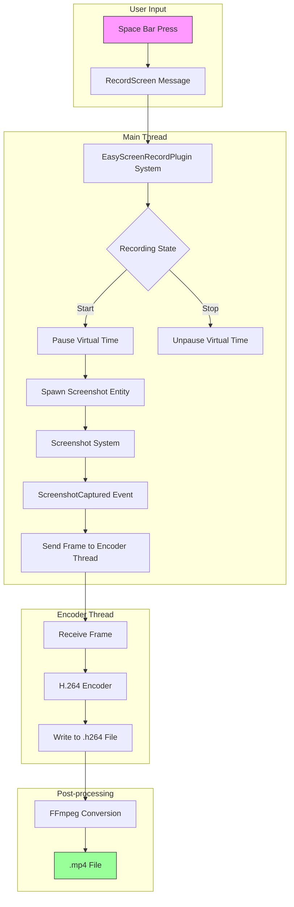

+++
title = "#21237 Easy screenrecording plugin"
date = "2025-12-15T00:00:00"
draft = false
template = "pull_request_page.html"
in_search_index = true

[taxonomies]
list_display = ["show"]

[extra]
current_language = "en"
available_languages = {"en" = { name = "English", url = "/pull_request/bevy/2025-12/pr-21237-en-20251215" }, "zh-cn" = { name = "中文", url = "/pull_request/bevy/2025-12/pr-21237-zh-cn-20251215" }}
labels = ["C-Feature", "M-Release-Note", "A-Dev-Tools"]
+++

# Title

## Basic Information
- **Title**: Easy screenrecording plugin
- **PR Link**: https://github.com/bevyengine/bevy/pull/21237
- **Author**: mockersf
- **Status**: MERGED
- **Labels**: C-Feature, S-Ready-For-Review, S-Ready-For-Final-Review, M-Release-Note, A-Dev-Tools
- **Created**: 2025-09-27T01:53:38Z
- **Merged**: 2025-12-15T01:23:05Z
- **Merged By**: alice-i-cecile

## Description Translation

# Objective

- Followup on #21235
- See https://github.com/mockersf/bevy/compare/easy-screenshots...mockersf:bevy:easy-screenrecording for what's new
- Be able to record videos from Bevy in a consistent manner

## Solution

- Make a new `EasyScreenRecordPlugin` in the dev tools

## Testing

- Add to any example
```
        .add_plugins(bevy::dev_tools::EasyScreenRecordPlugin::default())
```
- Run the example with the feature `bevy_internal/screenrecording` enabled
- press the space bar
- wait for it...
- press the space bar again
- screen recording! 🎉 
- almost... you now have a h264 file. VLC can read them, but they are not the most friendly format
- `ffmpeg` is our friend! `for file in *.h264; do ffmpeg -i $file $file.mp4; done`
- you now have a .mp4 file that can be shared anywhere!

---

## Showcase

directly taken by Bevy

https://github.com/user-attachments/assets/217f5093-9443-40e5-b2ce-33f65f6a56c6

## The Story of This Pull Request

This PR addresses a practical need in Bevy development workflows: creating consistent video recordings of Bevy applications for demonstrations, marketing materials, and debugging purposes. The implementation builds upon the existing screenshot functionality introduced in PR #21235, extending it from single-frame captures to full video recording.

The core problem was straightforward: while Bevy could take screenshots since version 0.11, there was no built-in mechanism for recording videos. Developers had to rely on external screen recording tools, which often produced inconsistent results across different systems and added complexity to development workflows.

The solution implemented here takes a pragmatic approach by leveraging Bevy's existing screenshot system and adding H.264 video encoding. The architecture separates concerns effectively: the main thread handles user input and screenshot triggering, while a dedicated encoding thread manages video compression and file I/O. This separation prevents the video encoding process from blocking the game loop, maintaining smooth performance during recording.

The implementation introduces a new `EasyScreenRecordPlugin` struct with configurable parameters for the toggle key, encoder preset, tune settings, and target frame time. The plugin uses a message-passing architecture with a channel (`std::sync::mpsc::channel`) to communicate between the main application thread and the encoding thread. When recording starts, the plugin creates an H.264 encoder instance using the `x264` crate and begins capturing frames at the specified interval.

```rust
std::thread::spawn(move || {
    let mut encoder: Option<Encoder> = None;
    let mut setup = None;
    let mut file: Option<File> = None;
    let mut frame = 0;
    loop {
        let Ok(next) = rx.recv() else {
            break;
        };
        match next {
            RecordCommand::Start(name, preset, tune) => {
                info!("starting recording at {}", name);
                file = Some(File::create(name).unwrap());
                setup = Some(Setup::preset(preset, tune, false, true).high());
            }
            // ... more command handling
        }
    }
});
```

One important design decision was the use of virtual time manipulation to maintain consistent frame timing during recording. When recording starts, the plugin pauses the virtual time and advances it manually at the target frame interval for each captured frame. This ensures that animations and other time-dependent behaviors remain smooth and consistent in the recorded output, regardless of actual frame rendering times.

```rust
virtual_time.advance_by(frame_time);
*time = virtual_time.as_generic();
```

The plugin integrates with Bevy's existing screenshot system by spawning a `Screenshot` entity for the primary window when recording is active and no screenshot is currently being processed. Each captured image is sent to the encoding thread via the channel. The encoding thread converts the image data to RGB format and feeds it to the x264 encoder, writing the compressed data to a file.

A notable implementation detail is the handling of the H.264 file format. The plugin produces raw H.264 elementary streams (`.h264` files), which are efficient but not universally playable. The documentation provides a clear workflow for converting these to more accessible MP4 format using `ffmpeg`, acknowledging the trade-off between simplicity and compatibility.

The changes extend beyond the core plugin code to include CI configuration updates. The GitHub Actions workflow now installs `libx264-dev` dependencies on Linux build agents, ensuring the feature works correctly in CI environments. This demonstrates good engineering practice by ensuring the feature is testable across the entire development pipeline.

From a technical perspective, the implementation makes effective use of conditional compilation with `#[cfg(feature = "screenrecording")]` to keep the screen recording functionality optional. This follows Bevy's established patterns for feature-gated functionality and prevents unnecessary dependencies for users who don't need video recording.

The impact of this PR is significant for Bevy's developer experience. It provides a consistent, integrated solution for creating video content from Bevy applications, which is particularly valuable for:
1. Creating demonstration videos for tutorials and documentation
2. Recording gameplay footage for marketing and showcases
3. Capturing reproducible bug reports with visual context
4. Generating automated test recordings for visual regression testing

The implementation also serves as a reference for other developers looking to implement similar functionality, demonstrating patterns for:
- Cross-thread communication in Bevy systems
- Integration with existing Bevy APIs (screenshot system, time management)
- Feature-gated plugin development
- External library integration (x264 encoding)

One consideration for future improvement would be adding support for other video codecs or container formats to reduce the need for post-processing with `ffmpeg`. However, the current implementation strikes a good balance between functionality and complexity, providing a solid foundation that can be extended as needed.

## Visual Representation



## Key Files Changed

1. **`crates/bevy_dev_tools/src/easy_screenshot.rs` (+192/-0)**
   - Added the complete implementation of `EasyScreenRecordPlugin`
   - Added new types: `EasyScreenRecordPlugin`, `RecordCommand` enum, `RecordScreen` message enum
   - Implemented the encoding thread that runs separately from the main game loop
   - Added systems for handling user input, managing recording state, and processing frames

   Key code snippet showing the plugin structure:
   ```rust
   pub struct EasyScreenRecordPlugin {
       pub toggle: KeyCode,
       pub preset: Preset,
       pub tune: Tune,
       pub frame_time: Duration,
   }
   
   impl Plugin for EasyScreenRecordPlugin {
       fn build(&self, app: &mut App) {
           // Setup channel for cross-thread communication
           let (tx, rx) = channel::<RecordCommand>();
           
           // Spawn encoding thread
           std::thread::spawn(move || {
               // Encoding logic here
           });
           
           // Add systems for input handling and frame capture
           app.add_message::<RecordScreen>().add_systems(
               Update,
               // System definitions here
           );
       }
   }
   ```

2. **`crates/bevy_dev_tools/Cargo.toml` (+3/-0)**
   - Added `screenrecording` feature flag
   - Added `bevy_image` dependency for image manipulation
   - Added `x264` dependency (optional, enabled by `screenrecording` feature)

   ```toml
   [features]
   screenrecording = ["x264"]
   
   [dependencies]
   bevy_image = { path = "../bevy_image", version = "0.18.0-dev" }
   x264 = { version = "0.5.0", optional = true }
   ```

3. **`.github/actions/install-linux-deps/action.yml` (+5/-0)**
   - Added `x264` input parameter to install `libx264-dev` dependencies on Linux
   - Updated the package installation step to include x264 libraries when requested

   ```yaml
   x264:
     description: Install x264 (libx264-dev)
     required: false
     default: "false"
   ```

4. **`.github/workflows/ci.yml` (+2/-0)**
   - Updated CI jobs to install x264 dependencies for linting and documentation jobs
   - Ensures the screen recording feature can be built and tested in CI environments

   ```yaml
   with:
     wayland: true
     xkb: true
     x264: true
   ```

5. **`release-content/release-notes/easy_marketing_material.md` (+9/-0)**
   - Added documentation for both the `EasyScreenshotPlugin` (from PR #21235) and `EasyScreenRecordPlugin`
   - Provides usage instructions and context for the new functionality

## Further Reading

1. **Bevy Screenshot System**: Understanding the existing screenshot functionality that this PR extends
   - `bevy_render::view::screenshot` module documentation
   - PR #21235 for the original easy screenshot implementation

2. **H.264 Video Compression**: Technical details of the video format used
   - IETF RFC 6184: "RTP Payload Format for H.264 Video"
   - x264 encoder library documentation: https://www.videolan.org/developers/x264.html

3. **Multithreading in Bevy**: Patterns for cross-thread communication in ECS-based game engines
   - Bevy's `std::sync::mpsc` usage patterns
   - Bevy's time management systems (`bevy_time` crate)

4. **FFmpeg Tool**: Post-processing tool mentioned for converting H.264 to MP4
   - Official FFmpeg documentation: https://ffmpeg.org/documentation.html
   - Common FFmpeg commands for video conversion

# Full Code Diff
*(Provided in the original PR description)*