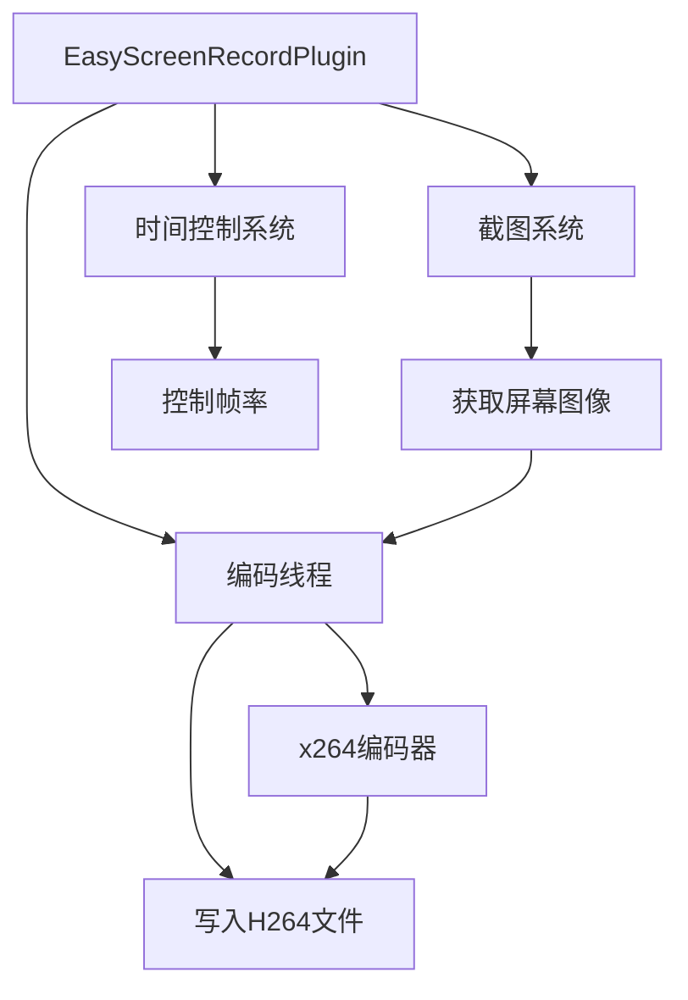

+++
title = "#21237 Easy screenrecording plugin"
date = "2025-12-15T00:00:00"
draft = false
template = "pull_request_page.html"
in_search_index = false

[extra]
current_language = "zh-cn"
available_languages = {"en" = { name = "English", url = "/pull_request/bevy/2025-12/pr-21237-en-20251215" }, "zh-cn" = { name = "中文", url = "/pull_request/bevy/2025-12/pr-21237-zh-cn-20251215" }}
+++

# Easy screenrecording plugin

## 基本信息
- **标题**: Easy screenrecording plugin
- **PR链接**: https://github.com/bevyengine/bevy/pull/21237
- **作者**: mockersf
- **状态**: 已合并
- **标签**: C-Feature, S-Ready-For-Final-Review, M-Release-Note, A-Dev-Tools
- **创建时间**: 2025-09-27T01:53:38Z
- **合并时间**: 2025-12-15T01:23:05Z
- **合并者**: alice-i-cecile

## 描述翻译

# 目标

- #21235的后续工作
- 查看 https://github.com/mockersf/bevy/compare/easy-screenshots...mockersf:bevy:easy-screenrecording 了解新增内容
- 能够以一致的方式从Bevy录制视频

## 解决方案

- 在开发工具中创建一个新的 `EasyScreenRecordPlugin`

## 测试

- 添加到任何示例中
```
        .add_plugins(bevy::dev_tools::EasyScreenRecordPlugin::default())
```
- 启用 `bevy_internal/screenrecording` 功能运行示例
- 按下空格键
- 等待...
- 再次按下空格键
- 屏幕录制完成！🎉
- 差不多... 你现在有了一个h264文件。VLC可以读取它们，但这不是最友好的格式
- `ffmpeg` 是我们的朋友！`for file in *.h264; do ffmpeg -i $file $file.mp4; done`
- 你现在有了一个可以分享到任何地方的.mp4文件！

---

## 展示

由Bevy直接录制

https://github.com/user-attachments/assets/217f5093-9443-40e5-b2ce-33f65f6a56c6

## 这个Pull Request的故事

这个PR解决了Bevy游戏中需要简便录制视频的问题。开发者经常需要创建演示视频或营销材料，但之前Bevy只提供了截图功能，录制视频需要外部工具或复杂的集成。

### 问题与背景

Bevy从0.11版本开始支持截图功能，但视频录制一直是一个缺失的功能。用户需要依赖外部屏幕录制软件，这会导致几个问题：录制质量不一致、可能影响性能、需要额外的配置步骤，并且在不同的开发环境中可能有兼容性问题。

PR #21235 为截图功能添加了`EasyScreenshotPlugin`，为视频录制功能铺平了道路。这个PR在此基础上扩展，提供类似的易用性来录制视频。

### 解决方案思路

作者采用了以下技术方案：
1. 使用Bevy现有的截图系统作为视频帧的来源
2. 使用x264编码器进行高效的视频编码
3. 将编码操作放在单独线程中，避免阻塞游戏主循环
4. 提供简单的API：按下空格键开始/停止录制

关键的工程决策包括：
- 选择h.264作为编码格式，因为它具有广泛的支持和良好的压缩率
- 将编码线程与游戏线程分离，确保录制不影响游戏性能
- 使用条件编译（`#[cfg(feature = "screenrecording")]`）将功能设为可选，避免不需要此功能的用户增加依赖

### 实现细节

核心实现在`easy_screenshot.rs`文件中，添加了`EasyScreenRecordPlugin`结构体。这个插件的主要工作流程是：

```rust
// 当用户按下空格键时，触发录制开始/停止
.run_if(input_just_pressed(self.toggle))
```

录制过程使用单独的线程处理编码：

```rust
std::thread::spawn(move || {
    let mut encoder: Option<Encoder> = None;
    let mut setup = None;
    let mut file: Option<File> = None;
    // ... 编码逻辑
});
```

插件使用Bevy的消息系统（`MessageWriter`和`MessageReader`）来控制录制状态：

```rust
enum RecordScreen {
    /// Starts screen recording
    Start,
    /// Stops screen recording
    Stop,
}
```

对于每一帧，插件通过截图系统获取当前屏幕图像，然后发送到编码线程：

```rust
commands.spawn(Screenshot::primary_window()).observe(
    move |screenshot_captured: On<ScreenshotCaptured>,
          mut virtual_time: ResMut<Time<bevy_time::Virtual>>,
          mut time: ResMut<Time<()>>| {
        let img = screenshot_captured.image.clone();
        tx.send(RecordCommand::Frame(img)).unwrap();
        virtual_time.advance_by(frame_time);
        *time = virtual_time.as_generic();
    },
);
```

一个重要的技术细节是时间控制：录制时需要精确控制帧率。插件使用虚拟时间（`Virtual` time）来确保录制的帧率一致：

```rust
virtual_time.advance_by(frame_time);
*time = virtual_time.as_generic();
```

### 技术洞察

这个实现有几个值得注意的技术点：

1. **线程安全的设计**：编码操作在单独线程中进行，通过channel（通道）在主线程和编码线程之间通信。这避免了阻塞游戏循环。

2. **条件编译**：整个功能通过`#[cfg(feature = "screenrecording")]`属性保护，用户可以选择是否包含此功能，避免不必要的依赖。

3. **灵活的配置**：插件提供了多个可配置选项：
   ```rust
   pub struct EasyScreenRecordPlugin {
       pub toggle: KeyCode,      // 触发键
       pub preset: Preset,       // h264编码预设
       pub tune: Tune,           // h264调优参数
       pub frame_time: Duration, // 目标帧时间
   }
   ```

4. **与现有系统的集成**：插件重用Bevy的截图系统（`Screenshot`组件和`ScreenshotCaptured`事件），这减少了代码重复并确保与现有功能的兼容性。

### 影响

这个PR为Bevy生态系统带来了几个重要改进：

1. **开发者体验提升**：开发者现在可以轻松录制高质量的游戏视频，无需外部工具。
2. **一致性保证**：由于录制直接在游戏引擎内部进行，可以确保视频质量的一致性和可重复性。
3. **性能考虑**：编码在单独线程中进行，最小化了对游戏性能的影响。
4. **扩展性**：这个实现为未来的视频录制功能扩展奠定了基础，如添加音频录制、不同编码格式支持等。

这个PR是Bevy开发工具集的重要补充，特别是对于那些需要创建演示、教程或营销材料的开发者来说非常有用。

## 可视化表示



## 关键文件变更

### `crates/bevy_dev_tools/src/easy_screenshot.rs` (+192/-0)
这个文件添加了`EasyScreenRecordPlugin`的实现。关键变化包括：
1. 新的`EasyScreenRecordPlugin`结构体和相关类型定义
2. 编码线程的实现
3. 与Bevy生态系统的集成逻辑

```rust
// 新增：EasyScreenRecordPlugin 结构体定义
pub struct EasyScreenRecordPlugin {
    pub toggle: KeyCode,
    pub preset: Preset,
    pub tune: Tune,
    pub frame_time: Duration,
}

// 新增：编码线程的核心逻辑
std::thread::spawn(move || {
    let mut encoder: Option<Encoder> = None;
    let mut setup = None;
    let mut file: Option<File> = None;
    let mut frame = 0;
    loop {
        let Ok(next) = rx.recv() else {
            break;
        };
        match next {
            RecordCommand::Start(name, preset, tune) => {
                // 开始录制
            }
            // ... 其他命令处理
        }
    }
});
```

### `release-content/release-notes/easy_marketing_material.md` (+9/-0)
新增的发布说明文档，说明了这个功能的使用方法和目的。

### `.github/actions/install-linux-deps/action.yml` (+5/-0)
更新了CI配置，添加x264依赖安装：
```yaml
x264:
  description: Install x264 (libx264-dev)
  required: false
  default: "false"
```

### `crates/bevy_dev_tools/Cargo.toml` (+3/-0)
添加了x264依赖和screenrecording特性：
```toml
[features]
bevy_ci_testing = ["serde", "ron"]
+screenrecording = ["x264"]

[dependencies]
+x264 = { version = "0.5.0", optional = true }
```

### `.github/workflows/ci.yml` (+2/-0)
在CI工作中启用了x264依赖：
```yaml
- name: Install dependencies (Linux)
  uses: ./.github/actions/install-linux-deps
  with:
    wayland: true
    xkb: true
+   x264: true
```

## 进一步阅读

1. **H.264编码标准**: 了解这个广泛使用的视频编码标准
2. **Bevy截图系统**: 阅读Bevy官方文档中关于`Screenshot`组件和`ScreenshotCaptured`事件的部分
3. **Rust中的线程通信**: 学习`std::sync::mpsc::channel`的使用和多线程编程最佳实践
4. **Bevy插件系统**: 理解如何创建和配置Bevy插件
5. **FFmpeg工具**: 了解如何使用FFmpeg转换视频格式，如将H.264转换为MP4