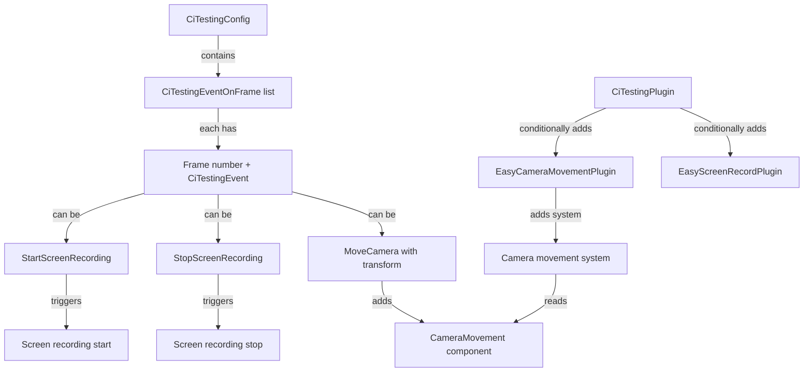

+++
title = "#21243 Easy demo recording"
date = "2025-12-16T00:00:00"
draft = false
template = "pull_request_page.html"
in_search_index = true

[taxonomies]
list_display = ["show"]

[extra]
current_language = "en"
available_languages = {"en" = { name = "English", url = "/pull_request/bevy/2025-12/pr-21243-en-20251216" }, "zh-cn" = { name = "中文", url = "/pull_request/bevy/2025-12/pr-21243-zh-cn-20251216" }}
labels = ["C-Feature", "M-Release-Note", "A-Dev-Tools"]
+++

# Easy demo recording

## Basic Information
- **Title**: Easy demo recording
- **PR Link**: https://github.com/bevyengine/bevy/pull/21243
- **Author**: mockersf
- **Status**: MERGED
- **Labels**: C-Feature, S-Ready-For-Final-Review, M-Release-Note, A-Dev-Tools
- **Created**: 2025-09-27T13:48:58Z
- **Merged**: 2025-12-16T04:10:51Z
- **Merged By**: cart

## Description Translation
# Objective

- Followup on #21237
- It can be hard to share how to record a demo for a specific feature
- Make it easy

## Solution

- Add a dev plugin that can move the camera
- Add plumbing to CI testing to be able to move the camera and control screen recording
- Demo can be configured in code or in a configuration file

## Testing

- Add to an example:
```rs
let fps = 120; // FPS for the example on your computer

[...]

// Before `DefaultPlugins`:
        .insert_resource(CiTestingConfig {
            events: vec![
                CiTestingEventOnFrame(fps * 1, ci_testing::CiTestingEvent::StartScreenRecording),
                {
                    let transform = Transform::from_xyz(0.7, 0.7, -1.0)
                        .looking_at(Vec3::new(0.0, 0.3, 0.0), Vec3::Y);
                    CiTestingEventOnFrame(
                        fps * 6,
                        ci_testing::CiTestingEvent::MoveCamera {
                            translation: transform.translation,
                            rotation: transform.rotation,
                        },
                    )
                },
                {
                    let transform = Transform::from_xyz(-0.7, 0.7, -1.0)
                        .looking_at(Vec3::new(0.0, 0.3, 0.0), Vec3::Y);
                    CiTestingEventOnFrame(
                        fps * 11,
                        ci_testing::CiTestingEvent::MoveCamera {
                            translation: transform.translation,
                            rotation: transform.rotation,
                        },
                    )
                },
                {
                    let transform = Transform::from_xyz(-0.7, 0.7, 1.0)
                        .looking_at(Vec3::new(0.0, 0.3, 0.0), Vec3::Y);
                    CiTestingEventOnFrame(
                        fps * 16,
                        ci_testing::CiTestingEvent::MoveCamera {
                            translation: transform.translation,
                            rotation: transform.rotation,
                        },
                    )
                },
                {
                    let transform = Transform::from_xyz(0.7, 0.7, 1.0)
                        .looking_at(Vec3::new(0.0, 0.3, 0.0), Vec3::Y);
                    CiTestingEventOnFrame(
                        fps * 21,
                        ci_testing::CiTestingEvent::MoveCamera {
                            translation: transform.translation,
                            rotation: transform.rotation,
                        },
                    )
                },
                CiTestingEventOnFrame(fps * 26, ci_testing::CiTestingEvent::StopScreenRecording),
            ],
            ..default()
        })
```
- Run the example with `--features bevy_internal/screenrecording,bevy_ci_testing`
- Lay back, enjoy your demo recording
---

## Showcase

https://github.com/user-attachments/assets/bbd9e56d-58c1-41eb-b6b4-1f1db2f2dab5

## The Story of This Pull Request

This PR addresses a practical problem in Bevy's development workflow: creating demo recordings for features or examples was previously cumbersome and required manual intervention. The solution extends Bevy's existing CI testing infrastructure to provide automated camera movement and screen recording capabilities, making it easier to create polished demonstration videos.

### The Problem and Context

Before this PR, creating demo videos for Bevy examples or features involved manual screen recording and camera manipulation. This was time-consuming, inconsistent, and difficult to share or reproduce. The existing CI testing framework (`bevy_ci_testing`) already provided some automation for screenshots and controlled exits, but it lacked camera control and screen recording capabilities.

The PR builds on previous work in #21237, which added screen recording functionality. However, that work alone didn't provide a way to script camera movements or integrate with the CI testing system.

### The Solution Approach

The approach taken is to extend the existing CI testing configuration system with new event types for camera movement and screen recording control. This leverages the existing event-driven architecture where specific actions can be scheduled to occur at particular frames. The implementation adds:

1. New event types in the CI testing configuration
2. A camera movement plugin that smoothly interpolates camera positions
3. Integration logic to automatically add the necessary plugins when their features are needed
4. Support for both programmatic configuration (in code) and file-based configuration

This design choice makes sense because it builds on established patterns in Bevy's CI testing system rather than creating a separate, parallel system. Users familiar with the existing CI testing configuration can easily adapt to the new features.

### The Implementation

The implementation adds three new event types to the `CiTestingEvent` enum:
- `StartScreenRecording` and `StopScreenRecording` for controlling screen capture
- `MoveCamera` with translation and rotation parameters for camera positioning

The `CiTestingPlugin` was modified to conditionally load the `EasyCameraMovementPlugin` and `EasyScreenRecordPlugin` based on whether the configuration requires them. This is a smart optimization that avoids adding unnecessary systems when they're not needed.

One interesting implementation detail is how the plugin checks if a resource is already added:
```rust
if !app.world().is_resource_added::<CiTestingConfig>() {
    // Load configuration from file
} else {
    app.world().resource::<CiTestingConfig>().clone()
}
```

This allows users to either provide configuration through a file or programmatically insert the `CiTestingConfig` resource before the plugin runs.

The camera movement system uses exponential smoothing (via `smooth_nudge`) to create fluid camera transitions:
```rust
query.0.translation.smooth_nudge(
    &target.translation,
    decay_rate,
    time.delta_secs(),
);
```

This produces professional-looking camera movements without abrupt jumps.

### Technical Insights

The implementation demonstrates several good engineering practices:

1. **Conditional Plugin Loading**: The system only adds the screen recording plugin if the configuration actually contains screen recording events. This minimizes overhead when the feature isn't needed.

2. **Smooth Interpolation**: The camera movement uses mathematical interpolation rather than instant teleportation, which produces more natural-looking demos.

3. **Backward Compatibility**: The changes extend existing structures with new variants and `Clone` implementations without breaking existing functionality.

4. **Flexible Configuration**: Supporting both file-based and programmatic configuration gives users flexibility in how they define their demos.

One potential limitation is that the camera movement system assumes there's exactly one camera in the scene (`world.query_filtered::<Entity, With<Camera>>().single(world)`). This works for simple examples but might need extension for more complex scenes with multiple cameras.

### The Impact

This PR significantly improves Bevy's documentation and demonstration capabilities. Developers can now create reproducible, scripted demos that showcase features from specific camera angles and with professional transitions. This is particularly valuable for:

1. **Documentation**: Creating consistent demo videos for examples
2. **Marketing**: Producing high-quality feature showcases
3. **Testing**: Automated visual testing with controlled camera positions
4. **Education**: Creating tutorial content with scripted camera movements

The feature is opt-in through feature flags (`bevy_internal/screenrecording` and `bevy_ci_testing`), so it doesn't affect users who don't need it. The integration with the existing CI testing system means there's minimal new API surface to learn for developers already using those tools.

## Visual Representation



## Key Files Changed

### 1. `crates/bevy_dev_tools/src/ci_testing/config.rs`
Added new event types and made configuration structs cloneable to support programmatic configuration.

```rust
// Before:
#[derive(Deserialize, PartialEq, Debug)]
pub enum CiTestingEvent {
    Screenshot,
    AppExit,
    Custom(String),
}

// After:
#[derive(Deserialize, PartialEq, Debug, Clone)]
pub enum CiTestingEvent {
    Screenshot,
    AppExit,
    StartScreenRecording,
    StopScreenRecording,
    MoveCamera {
        translation: Vec3,
        rotation: Quat,
    },
    Custom(String),
}
```

### 2. `crates/bevy_dev_tools/src/ci_testing/mod.rs`
Modified the plugin to conditionally add camera movement and screen recording plugins based on configuration needs.

```rust
// Key addition: Conditional plugin loading
if !app.is_plugin_added::<EasyCameraMovementPlugin>() {
    app.add_plugins(EasyCameraMovementPlugin::default());
}

#[cfg(feature = "screenrecording")]
if !app.is_plugin_added::<EasyScreenRecordPlugin>()
    && config
        .events
        .iter()
        .any(|e| matches!(e.1, CiTestingEvent::StartScreenRecording))
{
    app.add_plugins(EasyScreenRecordPlugin::default());
}
```

### 3. `crates/bevy_dev_tools/src/ci_testing/systems.rs`
Added handling for the new event types in the event processing system.

```rust
// Handling MoveCamera event:
CiTestingEvent::MoveCamera {
    translation,
    rotation,
} => {
    info!("Moved camera at frame {}.", *current_frame);
    if let Ok(camera) = world.query_filtered::<Entity, With<Camera>>().single(world) {
        world.entity_mut(camera).insert(CameraMovement {
            translation,
            rotation,
        });
    }
}
```

### 4. `crates/bevy_dev_tools/src/easy_screenshot.rs`
Added the new `EasyCameraMovementPlugin` and `CameraMovement` component for smooth camera transitions.

```rust
/// Plugin to move the camera smoothly according to the current time
pub struct EasyCameraMovementPlugin {
    /// Decay rate for the camera movement
    pub decay_rate: f32,
}

#[derive(Component)]
pub struct CameraMovement {
    /// Target position for the camera movement
    pub translation: Vec3,
    /// Target rotation for the camera movement
    pub rotation: Quat,
}
```

### 5. `crates/bevy_dev_tools/Cargo.toml`
Added `bevy_transform` dependency to support camera transform operations.

```toml
bevy_transform = { path = "../bevy_transform", version = "0.18.0-dev" }
```

## Further Reading

1. **Bevy's Plugin System**: Understanding how plugins work in Bevy is essential for extending functionality like this. The official Bevy book covers this: https://bevyengine.org/learn/book/getting-started/plugins/

2. **Exponential Smoothing**: The camera movement uses exponential smoothing. For more on smoothing techniques in game development: https://gafferongames.com/post/integration_basics/

3. **Event-Driven Architecture**: This PR extends Bevy's event-driven CI testing system. For more on event systems in game engines: https://gameprogrammingpatterns.com/event-queue.html

4. **Conditional Compilation in Rust**: The use of `#[cfg(feature = "screenrecording")]` demonstrates Rust's conditional compilation features. The Rust book covers this: https://doc.rust-lang.org/cargo/reference/features.html

5. **Previous PR #21237**: Understanding the screen recording functionality that this PR builds upon: https://github.com/bevyengine/bevy/pull/21237