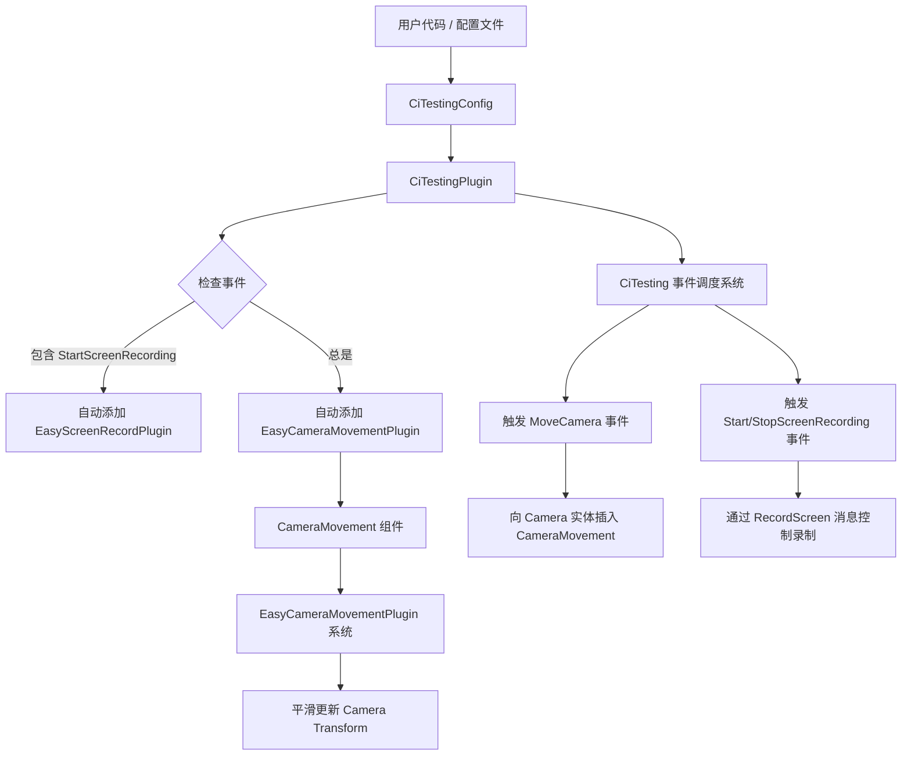

+++
title = "#21243 Easy demo recording"
date = "2025-12-16T00:00:00"
draft = false
template = "pull_request_page.html"
in_search_index = false

[extra]
current_language = "zh-cn"
available_languages = {"en" = { name = "English", url = "/pull_request/bevy/2025-12/pr-21243-en-20251216" }, "zh-cn" = { name = "中文", url = "/pull_request/bevy/2025-12/pr-21243-zh-cn-20251216" }}
+++

# 标题: Easy demo recording

## 基本信息
- **标题**: Easy demo recording
- **PR链接**: https://github.com/bevyengine/bevy/pull/21243
- **作者**: mockersf
- **状态**: 已合并
- **标签**: C-Feature, S-Ready-For-Final-Review, M-Release-Note, A-Dev-Tools
- **创建时间**: 2025-09-27T13:48:58Z
- **合并时间**: 2025-12-16T04:10:51Z
- **合并者**: cart

## 描述翻译
### 目标
- 作为 #21237 的后续工作
- 分享如何为特定功能录制演示视频可能很困难
- 使其变得容易

### 解决方案
- 添加一个可以移动摄像机的开发插件
- 在 CI 测试中添加管道，以便能够移动摄像机并控制屏幕录制
- 演示可以通过代码或配置文件进行配置

### 测试
- 添加到示例中:
```rs
let fps = 120; // 在你的计算机上运行示例的 FPS

[...]

// 在 `DefaultPlugins` 之前:
        .insert_resource(CiTestingConfig {
            events: vec![
                CiTestingEventOnFrame(fps * 1, ci_testing::CiTestingEvent::StartScreenRecording),
                {
                    let transform = Transform::from_xyz(0.7, 0.7, -1.0)
                        .looking_at(Vec3::new(0.0, 0.3, 0.0), Vec3::Y);
                    CiTestingEventOnFrame(
                        fps * 6,
                        ci_testing::CiTestingEvent::MoveCamera {
                            translation: transform.translation,
                            rotation: transform.rotation,
                        },
                    )
                },
                {
                    let transform = Transform::from_xyz(-0.7, 0.7, -1.0)
                        .looking_at(Vec3::new(0.0, 0.3, 0.0), Vec3::Y);
                    CiTestingEventOnFrame(
                        fps * 11,
                        ci_testing::CiTestingEvent::MoveCamera {
                            translation: transform.translation,
                            rotation: transform.rotation,
                        },
                    )
                },
                {
                    let transform = Transform::from_xyz(-0.7, 0.7, 1.0)
                        .looking_at(Vec3::new(0.0, 0.3, 0.0), Vec3::Y);
                    CiTestingEventOnFrame(
                        fps * 16,
                        ci_testing::CiTestingEvent::MoveCamera {
                            translation: transform.translation,
                            rotation: transform.rotation,
                        },
                    )
                },
                {
                    let transform = Transform::from_xyz(0.7, 0.7, 1.0)
                        .looking_at(Vec3::new(0.0, 0.3, 0.0), Vec3::Y);
                    CiTestingEventOnFrame(
                        fps * 21,
                        ci_testing::CiTestingEvent::MoveCamera {
                            translation: transform.translation,
                            rotation: transform.rotation,
                        },
                    )
                },
                CiTestingEventOnFrame(fps * 26, ci_testing::CiTestingEvent::StopScreenRecording),
            ],
            ..default()
        })
```
- 使用 `--features bevy_internal/screenrecording,bevy_ci_testing` 运行示例
- 躺下，享受你的演示录制
---

### 展示

https://github.com/user-attachments/assets/bbd9e56d-58c1-41eb-b6b4-1f1db2f2dab5

## 关于此 Pull Request 的叙述

这个 PR 解决了一个实际且常见的问题：为 Bevy 引擎中的功能或示例创建高质量的演示视频。以前，这个过程是临时的、手动的，并且难以复现或分享给其他贡献者。开发者需要手动操作摄像机，并依赖外部工具来捕获和编码视频。

PR 的解决方案是将演示录制流程直接集成到 Bevy 的开发工具链中。其核心思想是利用已有的 `CiTestingPlugin` 框架，该框架原本用于在 CI 环境中自动化测试（例如截屏、退出应用）。这个 PR 扩展了这个框架，使其不仅服务于测试，还能成为一个可控的、可编程的演示录制系统。

实现分为三个主要部分：事件系统扩展、摄像机运动逻辑和智能插件集成。

首先，在 `config.rs` 中，事件枚举 `CiTestingEvent` 新增了三个变体：`StartScreenRecording`、`StopScreenRecording` 和 `MoveCamera`。`MoveCamera` 事件携带了目标位置 (`translation`) 和旋转 (`rotation`)。这是一个清晰的设计决策，将“要做什么”与“何时做”（由 `CiTestingEventOnFrame` 封装）分离。所有的配置结构体都添加了 `Clone` 派生，这是为了支持后续在 `mod.rs` 中实现更灵活的配置加载逻辑。

其次，新增的 `EasyCameraMovementPlugin`（在 `easy_screenshot.rs` 中）和 `CameraMovement` 组件负责实现平滑的摄像机移动。其算法利用了 `bevy_math` 中的 `StableInterpolate` trait 的 `smooth_nudge` 方法，这是一种基于时间的平滑插值，能避免摄像机跳跃，产生更专业的视觉效果。插件允许配置 `decay_rate` 来控制移动速度。

第三，也是整合的关键，是对 `CiTestingPlugin`（在 `mod.rs` 中）的增强。它的构建逻辑现在变得更智能：
1.  **配置加载**：它首先检查 `CiTestingConfig` 资源是否已由用户代码插入。如果没有，才从环境变量或默认文件路径加载。这使得用户既可以通过代码直接配置（如 PR 描述所示），也可以通过配置文件配置，提供了灵活性。
2.  **条件插件加载**：插件会检查配置中的事件列表。如果包含了 `StartScreenRecording` 事件且 `screenrecording` 特性启用，它会自动添加 `EasyScreenRecordPlugin`。同时，如果 `EasyCameraMovementPlugin` 尚未被添加，它也会被默认添加。这是一种“按需”初始化的模式，避免了不必要的开销，并简化了用户的使用步骤——用户只需要提供配置，系统会自动设置好所需的环境。

在 `systems.rs` 中，`send_events` 系统被扩展以处理新的事件。当触发 `MoveCamera` 事件时，系统会查询场景中的 `Camera` 实体，并向其插入 `CameraMovement` 组件。这个组件随后由 `EasyCameraMovementPlugin` 的系统在 `PostUpdate` 阶段处理，驱动摄像机平滑过渡到目标变换。屏幕录制事件的处理则通过向世界写入 `RecordScreen` 消息来实现，与现有的录制系统对接。

这个设计的精妙之处在于它的非侵入性和可组合性。它没有修改任何核心的 Bevy 系统（如摄像机、渲染），而是通过事件和组件在现有架构上添加了一层控制逻辑。整个工作流通过一个简单的 `CiTestingConfig` 资源来定义，使得复杂的、包含定时摄像机移动和录制的演示脚本可以被轻松创建、分享和复现。这对于创建示例文档、功能宣传视频或在 CI 中生成一致性视觉输出非常有价值。

## 视觉表示



## 关键文件变更

1.  **`crates/bevy_dev_tools/src/ci_testing/config.rs`**
    - **变更描述**：扩展了 CI 测试配置和事件系统，新增屏幕录制和摄像机移动事件，并为所有相关结构体添加 `Clone` 实现以支持新的配置加载逻辑。
    - **代码示例**：
      ```rust
      // 新增的事件变体：
      pub enum CiTestingEvent {
          // ... 原有变体 ...
          StartScreenRecording,
          StopScreenRecording,
          MoveCamera {
              translation: Vec3,
              rotation: Quat,
          },
          // ... 原有变体 ...
      }
      // 结构体新增 Clone 派生：
      #[derive(Deserialize, Resource, PartialEq, Debug, Default, Clone)]
      pub struct CiTestingConfig { /* ... */ }
      ```
    - **与 PR 目的的关系**：这是功能定义的核心，明确了系统可以响应哪些新的命令。

2.  **`crates/bevy_dev_tools/src/ci_testing/mod.rs`**
    - **变更描述**：重构了 `CiTestingPlugin` 的构建逻辑，使其能够智能地从代码或文件加载配置，并根据配置内容有条件地自动添加 `EasyCameraMovementPlugin` 和 `EasyScreenRecordPlugin`。
    - **代码示例**：
      ```rust
      let config = if !app.world().is_resource_added::<CiTestingConfig>() {
          // 从文件加载配置...
      } else {
          app.world().resource::<CiTestingConfig>().clone()
      };
      // 条件添加插件
      if !app.is_plugin_added::<EasyCameraMovementPlugin>() {
          app.add_plugins(EasyCameraMovementPlugin::default());
      }
      ```
    - **与 PR 目的的关系**：实现了“开箱即用”的简易性，用户只需提供配置，插件自动完成环境搭建。

3.  **`crates/bevy_dev_tools/src/ci_testing/systems.rs`**
    - **变更描述**：在事件处理系统中添加了对新事件的处理逻辑，特别是 `MoveCamera` 事件会为摄像机实体添加 `CameraMovement` 组件。
    - **代码示例**：
      ```rust
      CiTestingEvent::MoveCamera { translation, rotation } => {
          info!("Moved camera at frame {}.", *current_frame);
          if let Ok(camera) = world.query_filtered::<Entity, With<Camera>>().single(world) {
              world.entity_mut(camera).insert(CameraMovement {
                  translation,
                  rotation,
              });
          }
      }
      ```
    - **与 PR 目的的关系**：将配置事件转化为实际的引擎组件操作，是事件驱动执行的关键环节。

4.  **`crates/bevy_dev_tools/src/easy_screenshot.rs`**
    - **变更描述**：新增了 `EasyCameraMovementPlugin` 和 `CameraMovement` 组件，实现了基于时间的平滑摄像机插值运动。
    - **代码示例**：
      ```rust
      pub struct EasyCameraMovementPlugin { pub decay_rate: f32, }
      #[derive(Component)]
      pub struct CameraMovement {
          pub translation: Vec3,
          pub rotation: Quat,
      }
      // 在系统内部使用 smooth_nudge 进行插值：
      query.0.translation.smooth_nudge(&target.translation, decay_rate, time.delta_secs());
      ```
    - **与 PR 目的的关系**：提供了专业、平滑的摄像机运动效果，这是制作高质量演示视频的基础。

5.  **`crates/bevy_dev_tools/Cargo.toml`**
    - **变更描述**：添加了对 `bevy_transform` crate 的依赖，这是 `EasyCameraMovementPlugin` 操作 `Transform` 组件所必需的。
    - **代码示例**：
      ```toml
      bevy_transform = { path = "../bevy_transform", version = "0.18.0-dev" }
      ```
    - **与 PR 目的的关系**：确保编译依赖正确。

## 进一步阅读
1.  **Bevy 插件系统**：了解 `Plugin` trait 以及如何构建和组合插件是理解此 PR 的基础。
2.  **Bevy ECS 与事件**：深入了解 `Resource`、`Event`、`Component` 和 `System` 如何在 ECS 架构下协作，特别是查询和修改实体的方式。
3.  **插值算法**：可以研究 `bevy_math` crate 中 `StableInterpolate` trait 的 `smooth_nudge` 方法，了解其使用的平滑算法原理。
4.  **前序 PR #21237**：查看此 PR 所跟进的工作，可能涉及屏幕录制功能的早期实现或相关背景。