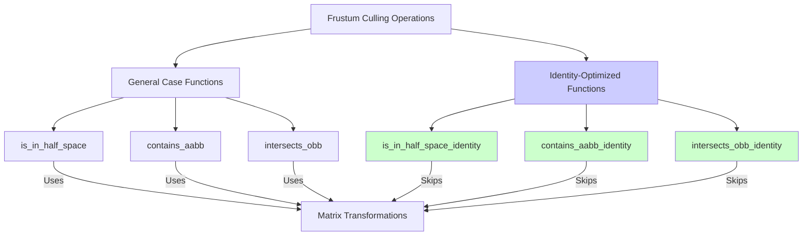

+++
title = "#21249 Add optimized is_in_half_space_identity, contains_aabb_identity, and intersects_obb_identity"
date = "2025-12-08T00:00:00"
draft = false
template = "pull_request_page.html"
in_search_index = true

[taxonomies]
list_display = ["show"]

[extra]
current_language = "en"
available_languages = {"en" = { name = "English", url = "/pull_request/bevy/2025-12/pr-21249-en-20251208" }, "zh-cn" = { name = "中文", url = "/pull_request/bevy/2025-12/pr-21249-zh-cn-20251208" }}
labels = ["C-Feature", "C-Performance", "A-Math", "D-Straightforward"]
+++

# Title: Add optimized is_in_half_space_identity, contains_aabb_identity, and intersects_obb_identity

## Basic Information
- **Title**: Add optimized is_in_half_space_identity, contains_aabb_identity, and intersects_obb_identity
- **PR Link**: https://github.com/bevyengine/bevy/pull/21249
- **Author**: Saratii
- **Status**: MERGED
- **Labels**: C-Feature, C-Performance, S-Ready-For-Final-Review, A-Math, D-Straightforward
- **Created**: 2025-09-28T04:11:29Z
- **Merged**: 2025-12-08T23:15:50Z
- **Merged By**: mockersf

## Description Translation
# Objective

This adds an optimized version of is_in_half_space, `Frustum::contains_aabb_identity`, `Aabb::is_in_half_space_identity`, and `Frustum::intersects_obb_identity` that takes advantage of how calling with IDENTITY (common) reduces the amount of matrix multiplications.

## Solution

Add a specialized function without touching the original that assumes Identity was passed to simplify math.

## Testing

I use this function extensively in my own project. I asserted the old function called with identity always returns the same as my new function.
I bench marked and profiled the usage in my real application and noticed a 16% speed up on Linux and 20% on windows for contains_aabb.
I bench marked intersects_obb_identity and noticed a 39% increase on linux and 38% on windows.
Both functions have unit tests that assert calling with identity yields the same result in both versions.

## The Story of This Pull Request

This PR addresses a performance optimization opportunity in Bevy's frustum culling system. The core insight is straightforward: when checking whether bounding volumes are inside or intersect with a camera frustum, the code frequently deals with objects that are already in world space. In these cases, the transform matrix passed to the functions is `Affine3A::IDENTITY`, but the existing implementations still perform the full matrix multiplication operations.

The problem manifests in performance-critical rendering operations, particularly during frustum culling where these functions are called for every object in a scene. Even though identity matrix multiplication is relatively cheap, eliminating it entirely provides measurable performance gains by reducing computational overhead in hot code paths.

The developer took a conservative approach to solving this problem by creating specialized versions of the functions rather than modifying the existing ones. This design decision preserves backward compatibility and API stability while providing performance improvements. The new functions are named with `_identity` suffixes to clearly indicate their purpose and constraints.

Looking at the implementation, the optimizations are mathematically sound. For `Aabb::is_in_half_space_identity`, the function eliminates the matrix transformation of the AABB center from local to world space since the AABB is already in world space. The optimization reduces the operation from:
1. Transforming the AABB center: `world_from_local.transform_point3a(aabb.center)`
2. Performing dot product with the half-space normal

To just performing the dot product directly with the AABB center. This saves one 3x4 affine matrix multiplication per call.

Similarly, `Frustum::contains_aabb_identity` leverages the optimized `is_in_half_space_identity` method for each half-space check, providing a compound optimization when checking against all six frustum planes.

The most significant optimization comes in `Frustum::intersects_obb_identity`, which handles the common case of oriented bounding box intersection testing where both `intersect_near` and `intersect_far` parameters are `true`. The optimization eliminates:
1. The full 4x4 matrix multiplication to transform the AABB center to homogeneous coordinates
2. The conditional logic for handling near and far plane checks
3. The matrix multiplication for non-identity transforms

The code implementation shows careful attention to detail. Each optimized function is marked with `#[inline]` to ensure they can be optimized away by the compiler when appropriate. The documentation clearly states when each function should be used, preventing misuse of the specialized functions.

```rust
/// Optimized version of [`Self::is_in_half_space`] when the AABB is already in world space.
/// Use this when `world_from_local` would be the identity transform.
#[inline]
pub fn is_in_half_space_identity(&self, half_space: &HalfSpace) -> bool {
    let p_normal = half_space.normal();
    let r = self.half_extents.abs().dot(p_normal.abs());
    let signed_distance = p_normal.dot(self.center) + half_space.d();
    signed_distance > r
}
```

The testing strategy is robust. The developer implemented comprehensive unit tests that verify the optimized functions produce identical results to their general counterparts when called with identity transforms. This validation approach ensures mathematical correctness while providing performance benefits.

```rust
#[test]
fn test_identity_optimized_equivalence() {
    let cases = vec![
        (
            Aabb {
                center: Vec3A::ZERO,
                half_extents: Vec3A::splat(1.0),
            },
            HalfSpace::new(Vec4::new(1.0, 0.0, 0.0, -0.5)),
        ),
        // ... more test cases
    ];
    for (aabb, half_space) in cases {
        let general = aabb.is_in_half_space(&half_space, &Affine3A::IDENTITY);
        let identity = aabb.is_in_half_space_identity(&half_space);
        assert_eq!(general, identity,);
    }
}
```

The performance improvements reported—16-20% for `contains_aabb` and 38-39% for `intersects_obb`—are substantial for a rendering engine where these operations occur thousands of times per frame. These gains come from eliminating redundant matrix operations that, while individually small, accumulate significantly in tight loops.

The impact of this change extends beyond just the immediate performance improvements. By providing specialized identity versions, the PR establishes a pattern for future optimizations in Bevy's math and geometry code. It demonstrates how common-case optimizations can be implemented without compromising API clarity or correctness.

One technical consideration is that callers must now choose between the general and optimized functions based on whether their data is already in world space. This adds a small cognitive burden but provides clear performance benefits. The naming convention (`_identity`) makes the choice explicit and self-documenting.

The implementation follows good software engineering practices: it's minimal, focused, and doesn't introduce unnecessary complexity. The changes are isolated to a single file, making the PR easy to review and understand. The addition of thorough tests ensures the optimizations don't introduce regressions.

## Visual Representation



## Key Files Changed

### `crates/bevy_camera/src/primitives.rs` (+96/-1)

This file contains geometric primitives used for camera frustum culling. The changes add three new optimized methods for the common case where transforms are identity.

1. **`Aabb::is_in_half_space_identity`**: Optimized version that skips matrix transformation when AABB is already in world space.

```rust
// Before (indirect usage through existing functions):
pub fn is_in_half_space(&self, half_space: &HalfSpace, world_from_local: &Affine3A) -> bool {
    let p_normal = half_space.normal();
    let aabb_center_world = world_from_local.transform_point3a(self.center);
    let r = self.half_extents.abs().dot(p_normal.abs());
    let signed_distance = p_normal.dot(aabb_center_world) + half_space.d();
    signed_distance > r
}

// After (new optimized function):
#[inline]
pub fn is_in_half_space_identity(&self, half_space: &HalfSpace) -> bool {
    let p_normal = half_space.normal();
    let r = self.half_extents.abs().dot(p_normal.abs());
    let signed_distance = p_normal.dot(self.center) + half_space.d();
    signed_distance > r
}
```

2. **`Frustum::intersects_obb_identity`**: Optimized version for OBB intersection testing with identity transform and both intersect_near/intersect_far set to true.

```rust
// New function:
#[inline]
pub fn intersects_obb_identity(&self, aabb: &Aabb) -> bool {
    let aabb_center_world = aabb.center.extend(1.0);
    for half_space in self.half_spaces.iter() {
        let p_normal = half_space.normal();
        let relative_radius = aabb.half_extents.abs().dot(p_normal.abs());
        if half_space.normal_d().dot(aabb_center_world) + relative_radius <= 0.0 {
            return false;
        }
    }
    true
}
```

3. **`Frustum::contains_aabb_identity`**: Optimized version that uses the new `is_in_half_space_identity` method.

```rust
// New function:
#[inline]
pub fn contains_aabb_identity(&self, aabb: &Aabb) -> bool {
    for half_space in &self.half_spaces {
        if !aabb.is_in_half_space_identity(half_space) {
            return false;
        }
    }
    true
}
```

## Further Reading

1. **Frustum Culling Fundamentals**: The PR description references [Frustum Culling](https://learnopengl.com/Guest-Articles/2021/Scene/Frustum-Culling) which provides a comprehensive explanation of the mathematics behind frustum culling.

2. **Bevy's Math Library**: Understanding `Affine3A`, `Vec3A`, and `HalfSpace` types in Bevy's math library would help contextualize these optimizations.

3. **Common Subexpression Elimination**: This optimization pattern relates to compiler optimization techniques where frequently computed expressions are cached or eliminated.

4. **Branch Prediction and Hot Paths**: The performance improvements demonstrate the importance of optimizing frequently executed code paths, particularly in game engines where rendering operations are performance-critical.

5. **SIMD Optimizations in Game Engines**: While not directly related to this PR, understanding how modern game engines use SIMD (Single Instruction, Multiple Data) operations for geometric calculations provides additional context for performance optimization in rendering systems.