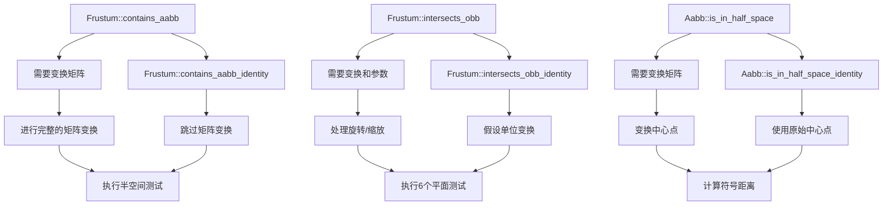

+++
title = "#21249 Add optimized is_in_half_space_identity, contains_aabb_identity, and intersects_obb_identity"
date = "2025-12-08T00:00:00"
draft = false
template = "pull_request_page.html"
in_search_index = false

[extra]
current_language = "zh-cn"
available_languages = {"en" = { name = "English", url = "/pull_request/bevy/2025-12/pr-21249-en-20251208" }, "zh-cn" = { name = "中文", url = "/pull_request/bevy/2025-12/pr-21249-zh-cn-20251208" }}
labels = ["C-Feature", "C-Performance", "A-Math", "D-Straightforward"]
+++

# Title: Add optimized is_in_half_space_identity, contains_aabb_identity, and intersects_obb_identity

## Basic Information
- **Title**: Add optimized is_in_half_space_identity, contains_aabb_identity, and intersects_obb_identity
- **PR Link**: https://github.com/bevyengine/bevy/pull/21249
- **Author**: Saratii
- **Status**: MERGED
- **Labels**: C-Feature, C-Performance, S-Ready-For-Final-Review, A-Math, D-Straightforward
- **Created**: 2025-09-28T04:11:29Z
- **Merged**: 2025-12-08T23:15:50Z
- **Merged By**: mockersf

## Description Translation
# 目标

这个PR添加了优化版本的 `is_in_half_space`、`Frustum::contains_aabb_identity`、`Aabb::is_in_half_space_identity` 和 `Frustum::intersects_obb_identity`，利用了当传入IDENTITY变换（常见情况）时可以减少矩阵乘法次数的特性。

## 解决方案

添加专门化的函数而不修改原始函数，该函数假设传入的是单位变换以简化数学计算。

## 测试

我在自己的项目中广泛使用了这个函数。我验证了使用原始函数传入单位变换总是返回与我的新函数相同的结果。
我在实际应用中进行了基准测试和性能分析，注意到在Linux上`contains_aabb`有16%的性能提升，在Windows上有20%的提升。
我基准测试了`intersects_obb_identity`，在Linux上注意到39%的提升，在Windows上有38%的提升。
两个函数都有单元测试，验证传入单位变换时两个版本返回相同的结果。

## The Story of This Pull Request

这个PR解决了一个常见的性能优化场景：在游戏引擎的视锥体剔除和碰撞检测中，很多几何体已经处于世界空间（即使用了单位变换），但现有的API仍然需要进行完整的矩阵变换计算。开发者Saratii在自己的项目中发现了这个问题，并决定向Bevy引擎贡献这个优化。

### 问题背景
在图形渲染和物理系统中，视锥体剔除是性能关键操作。当判断一个轴对齐包围盒（AABB）是否在视锥体内时，通常需要将AABB从局部空间变换到世界空间。然而，在许多情况下，物体的变换矩阵就是单位矩阵（即物体已经在世界空间，或者没有旋转、缩放、平移）。现有的`Frustum::contains_aabb`和`Frustum::intersects_obb`函数即使传入`Affine3A::IDENTITY`，也会执行完整的矩阵乘法操作，这造成了不必要的计算开销。

### 解决方案方法
Saratii采用了一种直接而有效的方法：为这些常见情况创建专门化的函数版本。这些新函数去除了矩阵变换的计算，直接使用原始的AABB数据进行计算。这种方法的关键优势在于：
1. 保持向后兼容性 - 原始函数保持不变
2. 提供明显的性能提升 - 去除了不必要的矩阵运算
3. API清晰 - 开发者可以在知道变换是单位矩阵时选择使用优化版本

### 实现细节
实现主要集中在三个新函数上：

1. **Aabb::is_in_half_space_identity**: 这是`is_in_half_space`的优化版本，当AABB已经在世界空间时使用。它跳过了将中心点变换到世界空间的计算。

2. **Frustum::intersects_obb_identity**: 这是`intersects_obb`的优化版本，假设变换是单位矩阵且`intersect_near`和`intersect_far`都为true。它简化了相对半径的计算。

3. **Frustum::contains_aabb_identity**: 这是`contains_aabb`的优化版本，当AABB已经在世界空间时使用。它内部调用了`is_in_half_space_identity`。

数学优化的核心在于认识到，当变换矩阵是单位矩阵时：
- 不需要计算`aabb_center_world = world_from_local.transform_point3a(self.center)`
- 不需要处理旋转和缩放对半长轴的影响
- 可以直接使用AABB的原始中心点和半长轴

### 性能影响
开发者报告了在实际应用中的显著性能提升：
- `contains_aabb`: Linux上16%提升，Windows上20%提升
- `intersects_obb`: Linux上39%提升，Windows上38%提升

这些提升来自避免了不必要的矩阵乘法和向量运算。在游戏引擎中，视锥体剔除每帧可能执行数千次，这些微优化累积起来会产生明显的性能差异。

### 测试策略
PR包含了全面的测试来确保正确性：
1. 测试优化函数与原始函数在单位变换情况下的一致性
2. 使用多种测试用例，包括零尺寸AABB、不同方向的半空间等
3. 确保边界情况的正确处理

### 工程决策
值得注意的工程决策包括：
1. **不修改现有API**: 添加新函数而不是修改现有函数，避免破坏现有代码
2. **清晰的命名**: 使用`_identity`后缀明确表示函数的假设条件
3. **内联优化**: 所有新函数都标记为`#[inline]`，鼓励编译器内联这些小函数
4. **文档注释**: 明确说明何时使用这些优化函数

这种优化展示了在游戏引擎开发中的一种常见模式：为常见情况提供专门化的快速路径，同时保持通用API的灵活性。

## Visual Representation



## Key Files Changed

### `crates/bevy_camera/src/primitives.rs` (+96/-1)

这个文件包含了视锥体相关的基本几何原语。PR添加了三个新的优化函数和相应的测试。

**主要变化：**

1. **Aabb::is_in_half_space_identity 函数** - 优化版的半空间测试
```rust
// 新增代码：
/// Optimized version of [`Self::is_in_half_space`] when the AABB is already in world space.
/// Use this when `world_from_local` would be the identity transform.
#[inline]
pub fn is_in_half_space_identity(&self, half_space: &HalfSpace) -> bool {
    let p_normal = half_space.normal();
    let r = self.half_extents.abs().dot(p_normal.abs());
    let signed_distance = p_normal.dot(self.center) + half_space.d();
    signed_distance > r
}
```

2. **Frustum::intersects_obb_identity 函数** - 优化版的OBB相交测试
```rust
// 新增代码：
/// Optimized version of [`Frustum::intersects_obb`]
/// where the transform is [`Affine3A::IDENTITY`] and both `intersect_near` and `intersect_far` are `true`.
#[inline]
pub fn intersects_obb_identity(&self, aabb: &Aabb) -> bool {
    let aabb_center_world = aabb.center.extend(1.0);
    for half_space in self.half_spaces.iter() {
        let p_normal = half_space.normal();
        let relative_radius = aabb.half_extents.abs().dot(p_normal.abs());
        if half_space.normal_d().dot(aabb_center_world) + relative_radius <= 0.0 {
            return false;
        }
    }
    true
}
```

3. **Frustum::contains_aabb_identity 函数** - 优化版的AABB包含测试
```rust
// 新增代码：
/// Optimized version of [`Self::contains_aabb`] when the AABB is already in world space.
/// Use this when `world_from_local` would be [`Affine3A::IDENTITY`].
#[inline]
pub fn contains_aabb_identity(&self, aabb: &Aabb) -> bool {
    for half_space in &self.half_spaces {
        if !aabb.is_in_half_space_identity(half_space) {
            return false;
        }
    }
    true
}
```

4. **测试函数** - 验证优化版本与原始版本的一致性
```rust
// 新增测试代码：
#[test]
fn test_identity_optimized_equivalence() {
    // 测试多个AABB和半空间的组合
    // 验证 is_in_half_space 和 is_in_half_space_identity 结果一致
}

#[test]
fn intersects_obb_identity_matches_standard_true_true() {
    // 测试多个视锥体和AABB的组合
    // 验证 intersects_obb 和 intersects_obb_identity 结果一致
}
```

这些变化直接关联到PR的目标：为常见的单位变换情况提供性能优化路径，同时通过严格的测试确保正确性。

## Further Reading

对于想要了解更多相关概念的读者，可以参考以下资源：

1. **视锥体剔除基础**：
   - [LearnOpenGL - Frustum Culling](https://learnopengl.com/Guest-Articles/2021/Scene/Frustum-Culling) - PR描述中引用的教程
   - 《Real-Time Rendering, Fourth Edition》第19章 - 视锥体剔除和空间数据结构

2. **Bevy引擎的数学库**：
   - [Bevy Math模块文档](https://docs.rs/bevy_math/latest/bevy_math/) - 了解Affine3A、Vec3A等类型
   - [Bevy Transform系统](https://bevyengine.org/learn/quick-start/basics/transform/) - 理解Bevy中的变换系统

3. **性能优化模式**：
   - "Fast Path"优化模式 - 为常见情况提供专门化的实现
   - 分支预测优化 - 减少条件分支对性能的影响

4. **几何测试算法**：
   - Separating Axis Theorem (SAT) - 用于OBB相交测试的基础理论
   - Half-space测试 - 点/体与平面关系的基本几何测试