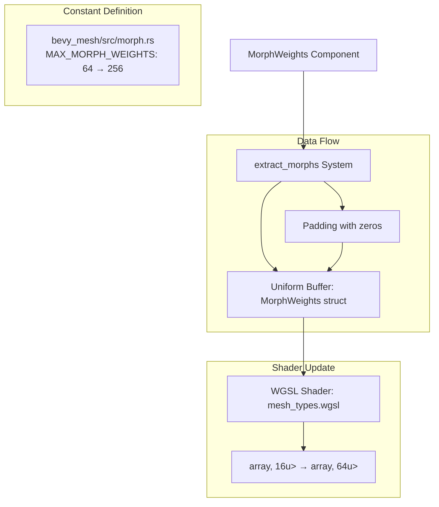

+++
title = "#21421 increase morph targets to 256"
date = "2025-12-10T00:00:00"
draft = false
template = "pull_request_page.html"
in_search_index = true

[taxonomies]
list_display = ["show"]

[extra]
current_language = "en"
available_languages = {"en" = { name = "English", url = "/pull_request/bevy/2025-12/pr-21421-en-20251210" }, "zh-cn" = { name = "中文", url = "/pull_request/bevy/2025-12/pr-21421-zh-cn-20251210" }}
labels = ["A-Rendering", "C-Usability", "A-Animation", "X-Controversial"]
+++

# Title
increase morph targets to 256

## Basic Information
- **Title**: increase morph targets to 256
- **PR Link**: https://github.com/bevyengine/bevy/pull/21421
- **Author**: robtfm
- **Status**: MERGED
- **Labels**: A-Rendering, C-Usability, S-Ready-For-Final-Review, A-Animation, X-Controversial
- **Created**: 2025-10-06T11:57:31Z
- **Merged**: 2025-12-10T21:52:21Z
- **Merged By**: mockersf

## Description Translation
# Objective

our current morph target / blend shape limit is 64 per model, documented as "to support all hardware". many assets use more than this ("over a hundred" is common), so i'd like to increase this limit. 

the relevant hardware constraint is uniform buffer size (usage in morph.wgsl). morph targets use 4 bytes per entry, and wgpu's downlevel uniform buffer size limit is 16k so we have a lot of room from the 256 bytes we are currently limiting to, while still supporting the vast majority of hardware.

## Solution

increase the limit to 256 targets / 1k.

we also increase the input to the buffer to this 1k size: this was not done previously but worked as long as the min buffer alignment was 256 (which it probably always is at the moment) as it was sized up to match alignment previously.

there may be a slight performance impact from using a larger size in all cases but it should be negligible.

## The Story of This Pull Request

This PR addresses a practical limitation in Bevy's morph target system. The existing code imposed a hard limit of 64 morph targets per model, which was documented as necessary to support all hardware. However, many real-world assets use more than 64 morph targets, with "over a hundred" being common in production scenarios. This limitation prevented users from importing complex character models with detailed facial animations or other morph-based effects.

The core constraint wasn't about GPU computation capabilities, but rather about data transfer and storage. Morph target weights are passed to the GPU via uniform buffers in the rendering pipeline. The previous implementation allocated space for exactly 64 weights in these buffers, which translated to 256 bytes (64 weights × 4 bytes per weight). This conservative limit was set to ensure compatibility with hardware that might have restrictive uniform buffer size limits.

The developer investigated the actual hardware constraints and found that the downlevel uniform buffer size limit in wgpu (the WebGPU implementation used by Bevy) is 16KB. This meant the system had significant headroom - the 256-byte allocation was using only a small fraction of the available buffer space. Given that many assets required more than 64 morph targets, increasing the limit to 256 targets (1024 bytes) was a reasonable compromise that would accommodate most real-world use cases while remaining well within hardware limitations.

The implementation required changes in three key areas. First, the constant defining the maximum number of morph weights was updated from 64 to 256 in the mesh module. Second, the shader code needed adjustment because morph weights are packed into `vec4<f32>` arrays (four weights per vector element). With 256 weights, the array size changed from 16 elements (64 ÷ 4) to 64 elements (256 ÷ 4). Third, a subtle bug was fixed in the buffer extraction logic. Previously, the code only took the available weights up to the maximum, but didn't ensure the buffer was properly padded to the expected size. This worked by accident because of buffer alignment requirements (typically 256 bytes), but with the increased size, proper padding became necessary to avoid reading uninitialized memory.

The fix involved modifying the weight extraction to pad with zeros when there are fewer weights than the maximum. This ensures the uniform buffer always contains exactly `MAX_MORPH_WEIGHTS` values, regardless of how many weights the actual mesh uses. This is important for shader stability and prevents undefined behavior.

While increasing the buffer size from 256 bytes to 1024 bytes might have minor performance implications due to increased memory bandwidth, the impact is negligible for most applications. The trade-off is clearly beneficial: users gain the ability to use more realistic assets with complex morph target animations, while the system remains compatible with virtually all hardware.

## Visual Representation



## Key Files Changed

### 1. `crates/bevy_mesh/src/morph.rs` (+5/-1)
This file defines the maximum number of morph weights constant. The change increases the limit from 64 to 256, which is the central change of the PR.

```rust
// Before:
pub const MAX_MORPH_WEIGHTS: usize = 64;

// After:
pub const MAX_MORPH_WEIGHTS: usize = 256;
```

### 2. `crates/bevy_pbr/src/render/mesh_types.wgsl` (+1/-1)
This WGSL shader file defines the struct that stores morph weights in GPU memory. Since weights are packed into `vec4<f32>` arrays (4 weights per vector), the array size changes from 16 to 64 to accommodate 256 total weights.

```wgsl
// Before:
weights: array<vec4<f32>, 16u>, // 16 = 64 / 4 (64 = MAX_MORPH_WEIGHTS)

// After:
weights: array<vec4<f32>, 64u>, // 64 = 256 / 4 (256 = MAX_MORPH_WEIGHTS)
```

### 3. `crates/bevy_pbr/src/render/morph.rs` (+5/-1)
This file contains the system that extracts morph weights and prepares them for the GPU. The change ensures the buffer is always padded to `MAX_MORPH_WEIGHTS` with zeros, which is necessary for consistent shader behavior.

```rust
// Before:
let legal_weights = weights.iter().take(MAX_MORPH_WEIGHTS).copied();

// After:
let legal_weights = weights
    .iter()
    .chain(iter::repeat(&0.0))
    .take(MAX_MORPH_WEIGHTS)
    .copied();
```

The key addition is `chain(iter::repeat(&0.0))`, which creates an infinite iterator of zeros that gets appended to the actual weights. The `take(MAX_MORPH_WEIGHTS)` then ensures we always have exactly 256 values (or whatever the maximum is set to). This padding is crucial because the shader expects a fixed-size array, and reading beyond initialized memory would cause undefined behavior.

## Further Reading

1. **WebGPU Uniform Buffer Limits**: The [WebGPU specification](https://www.w3.org/TR/webgpu/#limits) defines the minimum uniform buffer size requirements that inform these design decisions.

2. **Morph Target Animation**: For background on how morph targets work in computer graphics, see [Wikipedia: Morph target animation](https://en.wikipedia.org/wiki/Morph_target_animation).

3. **Bevy Rendering Architecture**: The [Bevy cheatbook's rendering section](https://bevy-cheatbook.github.io/features/rendering.html) provides context on how Bevy handles GPU data transfer and shader communication.

4. **WGSL Language Reference**: The [WGSL specification](https://www.w3.org/TR/WGSL/) explains the shading language syntax and semantics used in the modified shader code.

5. **Buffer Alignment in Graphics Programming**: For understanding why buffer alignment matters, [Vulkan Memory Alignment](https://vulkan-tutorial.com/Uniform_buffers/Descriptor_layout_and_buffer) provides relevant background concepts that apply to WebGPU as well.