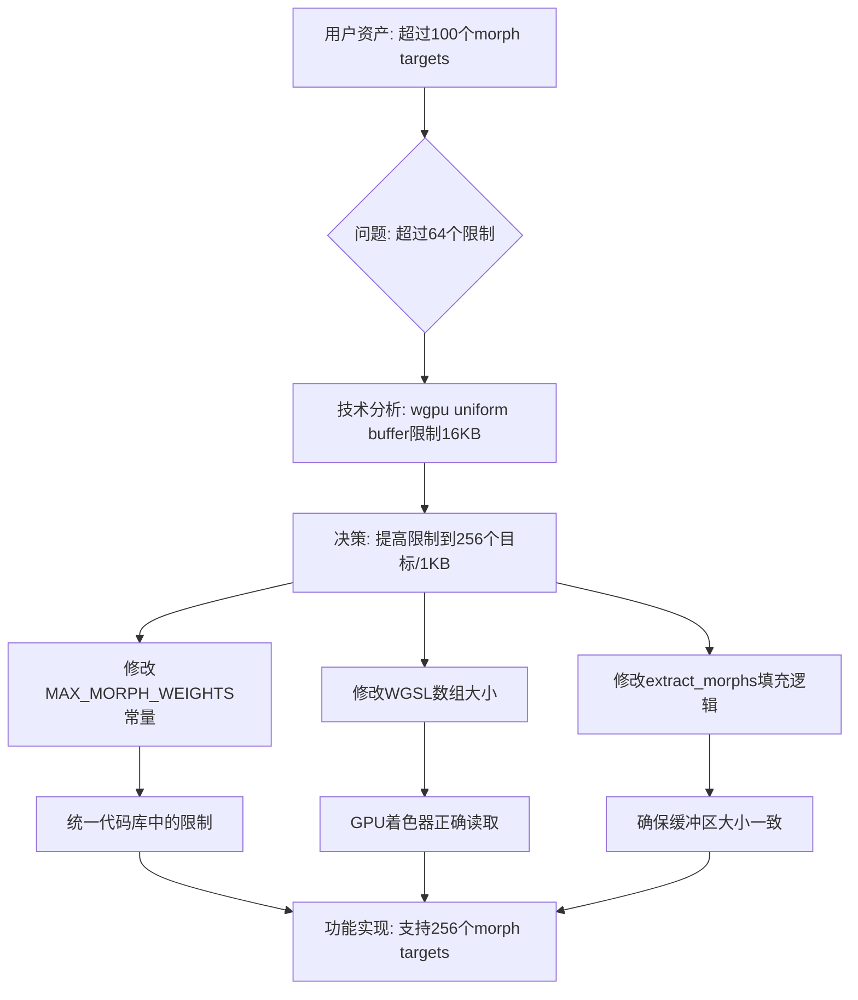

+++
title = "#21421 increase morph targets to 256"
date = "2025-12-10T00:00:00"
draft = false
template = "pull_request_page.html"
in_search_index = false

[extra]
current_language = "zh-cn"
available_languages = {"en" = { name = "English", url = "/pull_request/bevy/2025-12/pr-21421-en-20251210" }, "zh-cn" = { name = "中文", url = "/pull_request/bevy/2025-12/pr-21421-zh-cn-20251210" }}
labels = ["A-Rendering", "C-Usability", "A-Animation", "X-Controversial"]
+++

# Title: increase morph targets to 256

## Basic Information
- **Title**: increase morph targets to 256
- **PR Link**: https://github.com/bevyengine/bevy/pull/21421
- **Author**: robtfm
- **Status**: MERGED
- **Labels**: A-Rendering, C-Usability, S-Ready-For-Final-Review, A-Animation, X-Controversial
- **Created**: 2025-10-06T11:57:31Z
- **Merged**: 2025-12-10T21:52:21Z
- **Merged By**: mockersf

## Description Translation
**目标**

我们当前每个模型的变形目标(morph targets)/混合形状(blend shapes)限制是64个，文档中说明这是"为了支持所有硬件"。许多资产(assets)使用超过这个数量("超过一百个"很常见)，因此我想提高这个限制。

相关的硬件约束是uniform buffer的大小(在morph.wgsl中使用)。变形目标每个条目使用4字节，而wgpu的downlevel uniform buffer大小限制是16k，所以我们有足够空间从当前限制的256字节提高，同时仍然支持绝大多数硬件。

**解决方案**

将限制提高到256个目标/1k字节。

我们也增加了输入到缓冲区的这个1k大小：之前没有这样做，但只要最小缓冲区对齐(min buffer alignment)是256（目前可能总是这种情况），因为之前它被调整大小以匹配对齐。

在所有情况下使用更大的尺寸可能会有轻微的性能影响，但这应该可以忽略不计。

## The Story of This Pull Request

这个PR解决了一个实际的使用问题：Bevy引擎中变形目标(morph targets)的数量限制太低，无法处理许多真实世界的3D资产。当前限制设定为每个模型64个变形目标，这是基于"支持所有硬件"的保守考虑。然而，正如开发者指出的，许多资产实际上包含超过100个变形目标，这使得当前限制成为实际工作流程中的障碍。

从技术角度来看，变形目标在GPU上通过uniform buffer实现，每个权重使用4字节。这里的关键工程权衡是在功能性和硬件兼容性之间取得平衡。原始限制256字节（64个目标×4字节）远远低于wgpu的downlevel uniform buffer限制16KB。这为增加限制提供了充足的空间，同时保持对大多数硬件的兼容性。

开发者选择了将限制提高到256个目标（1024字节），这是一个平衡的决策：一方面显著提高了功能性，另一方面仍然保持在硬件限制的安全范围内。这个选择考虑了实际资产的需求（"超过一百个"是常见的），同时避免了过于激进地接近硬件限制。

实现方面，这个PR修改了三个文件来同步提高限制。首先，在`bevy_mesh/src/morph.rs`中，`MAX_MORPH_WEIGHTS`常量从64增加到256。这个常量是整个代码库中变形目标限制的权威来源，确保所有相关系统使用相同的值。

其次，在着色器代码`mesh_types.wgsl`中，对应的数组大小从16增加到64。这里需要注意的是，WGSL中的数组类型是`array<vec4<f32>, N>`，每个`vec4<f32>`包含4个float值，因此数组大小是目标数量除以4：64 = 256 ÷ 4。

第三，在`bevy_pbr/src/render/morph.rs`的`extract_morphs`函数中，开发者添加了用零填充(padding with zeros)的逻辑。这是重要的安全改进，确保即使实际变形目标数量少于最大值，uniform buffer也会被正确填充。之前的代码使用`take(MAX_MORPH_WEIGHTS)`，如果原始权重数量少于限制，这可能导致缓冲区大小不正确。新的实现使用`chain(iter::repeat(&0.0))`确保总是有足够的权重值填充到最大限制。

```rust
// Before: 可能导致缓冲区大小不足
let legal_weights = weights.iter().take(MAX_MORPH_WEIGHTS).copied();

// After: 总是填充到MAX_MORPH_WEIGHTS
let legal_weights = weights
    .iter()
    .chain(iter::repeat(&0.0))
    .take(MAX_MORPH_WEIGHTS)
    .copied();
```

这个填充逻辑解决了潜在的错误：当uniform buffer大小与着色器期望不匹配时，可能导致未定义行为或渲染错误。通过用零填充额外的权重，我们确保缓冲区大小始终一致，同时零值权重不会影响变形结果。

开发者还提到一个技术细节：缓冲区大小被调整以匹配对齐要求。虽然之前代码没有显式填充到1KB，但只要最小缓冲区对齐是256字节（这是常见情况），它就能工作。现在显式使用1KB大小，确保了跨不同对齐要求的兼容性。

性能影响方面，从256字节增加到1024字节的uniform buffer大小会增加一些内存带宽使用，但如开发者所说，这应该是"微不足道的"。这种权衡是可接受的，因为功能性的显著提升。

最后，这个PR被标记为"有争议的"(X-Controversial)，可能是因为改变硬件限制总是需要谨慎考虑。然而，基于详细的技术分析（wgpu的16KB限制 vs. 新的1KB使用），这个改变是合理且安全的。

## Visual Representation



## Key Files Changed

### 1. `crates/bevy_mesh/src/morph.rs`
- **修改内容**: 将`MAX_MORPH_WEIGHTS`常量从64增加到256
- **原因**: 这是变形目标限制的权威定义，需要在所有相关系统中保持一致
- **代码示例**:
```rust
// Before:
pub const MAX_MORPH_WEIGHTS: usize = 64;

// After:
pub const MAX_MORPH_WEIGHTS: usize = 256;
```

### 2. `crates/bevy_pbr/src/render/mesh_types.wgsl`
- **修改内容**: 将MorphWeights结构体中的数组大小从16u增加到64u
- **原因**: 着色器需要知道新的数组大小以正确读取uniform buffer。每个vec4<f32>包含4个float权重，所以64个vec4对应256个权重
- **代码示例**:
```wgsl
// Before:
struct MorphWeights {
    weights: array<vec4<f32>, 16u>, // 16 = 64 / 4 (64 = MAX_MORPH_WEIGHTS)
};

// After:
struct MorphWeights {
    weights: array<vec4<f32>, 64u>, // 64 = 256 / 4 (256 = MAX_MORPH_WEIGHTS)
};
```

### 3. `crates/bevy_pbr/src/render/morph.rs`
- **修改内容**: 在`extract_morphs`函数中添加零填充逻辑
- **原因**: 确保uniform buffer始终具有正确的大小，即使实际变形目标数量少于最大值
- **代码示例**:
```rust
// Before (简化的逻辑):
let legal_weights = weights.iter().take(MAX_MORPH_WEIGHTS).copied();

// After (添加零填充):
let legal_weights = weights
    .iter()
    .chain(iter::repeat(&0.0))  // 用零填充不足的部分
    .take(MAX_MORPH_WEIGHTS)
    .copied();
```

## Further Reading

1. **WGSL Uniform Buffer规范**: 了解WebGPU着色语言中uniform buffer的限制和使用方式
2. **Bevy渲染管线文档**: 理解Bevy如何组织渲染数据和管线
3. **Morph Targets技术原理**: 学习3D图形中变形目标的实现原理和数学基础
4. **wgpu硬件限制文档**: 深入了解不同硬件平台上的实际限制
5. **Bevy ECS中的组件提取模式**: 理解`extract_morphs`函数在Bevy ECS架构中的角色