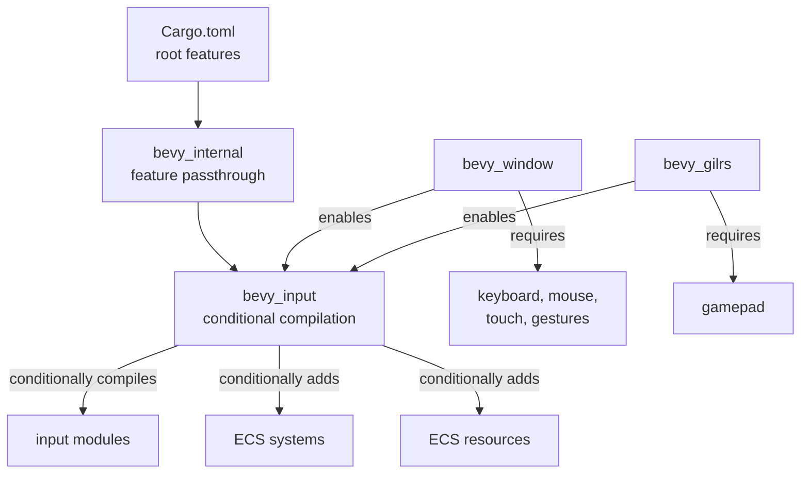

+++
title = "#21447 Put input sources for `bevy_input` under features"
date = "2025-12-16T00:00:00"
draft = false
template = "pull_request_page.html"
in_search_index = true

[taxonomies]
list_display = ["show"]

[extra]
current_language = "en"
available_languages = {"en" = { name = "English", url = "/pull_request/bevy/2025-12/pr-21447-en-20251216" }, "zh-cn" = { name = "中文", url = "/pull_request/bevy/2025-12/pr-21447-zh-cn-20251216" }}
labels = ["A-Input", "C-Usability", "M-Migration-Guide", "X-Contentious", "O-Embedded"]
+++

# Title
Put input sources for `bevy_input` under features

## Basic Information
- **Title**: Put input sources for `bevy_input` under features
- **PR Link**: https://github.com/bevyengine/bevy/pull/21447
- **Author**: Shatur
- **Status**: MERGED
- **Labels**: A-Input, C-Usability, S-Ready-For-Final-Review, M-Migration-Guide, X-Contentious, O-Embedded
- **Created**: 2025-10-07T18:04:49Z
- **Merged**: 2025-12-16T20:39:19Z
- **Merged By**: alice-i-cecile

## Description Translation
# Objective

`bevy_input` provides primitives for all kinds of input. But on consoles you usually don't have things like touch. On more obscure platforms, like GBA, only gamepad input is needed.

## Solution

To avoid including extra stuff, I put each source under a feature. I didn't enable them by default to avoid typing

```
default-features = false, features = [
    "std",
    "bevy_reflect",
    "bevy_ecs/async_executor",
    "smol_str"
]
```

in all places that include `bevy_input`. Instead, I just enabled the used input sources in `bevy_window` and `bevy_gilrs`. This way, when a crate that provides hardware support for a specific input source is not used, the corresponding feature in `bevy_input` also won't be enabled.

For GBA this reduced the binary size for the `game` example from 1.6M to 1.4M.

## Considered alternatives

I also considered doing something like this:

```rust
pub struct InputPlugin {
    pub keyboard: bool,
    pub mouse: bool,
    pub gamepad: bool,
    pub touch: bool,
}
```

But this doesn't eliminate extra code even with LTO enabled and might be confusing for users, since toggling these values could cause a crash due to a missing resource when a crate like `bevy_window` expects it.

## The Story of This Pull Request

The problem this PR addresses is straightforward: the Bevy engine's input system was carrying unnecessary bloat for certain target platforms. The `bevy_input` crate provided abstractions for all input types—keyboard, mouse, gamepad, touch, and gestures—regardless of whether a particular platform supported them. This meant that a game targeting a console without touch input, or an embedded platform like the GBA with only gamepad support, would still compile and link code for unused input systems. This led to wasted binary size, which is particularly critical for resource-constrained embedded systems.

The author identified this as an optimization opportunity, especially for platforms like GBA where binary size directly impacts distribution and performance. The initial observation was that the binary size for a GBA example could be reduced by approximately 200KB (from 1.6MB to 1.4MB) simply by eliminating unused input code.

The solution implemented follows Rust's standard approach for conditional compilation: using Cargo features. The core insight was to make each input source type (mouse, keyboard, gamepad, touch, gestures) individually optional through feature flags. However, the implementation had to consider developer experience—forcing users to manually enable features for common desktop platforms would create unnecessary friction.

To address this, the author designed a dependency-based feature activation system. Instead of requiring users to manually specify which input features they need, the system automatically enables appropriate features when users depend on crates that provide hardware support for those input types:
- `bevy_window` (which handles windowing and typically provides mouse, keyboard, touch, and gesture input) automatically enables the corresponding `bevy_input` features
- `bevy_gilrs` (which handles gamepad input) automatically enables the gamepad feature

This creates a clean separation: users targeting standard platforms continue to work as before without configuration changes, while users targeting specialized platforms can omit these dependency crates and only enable the specific input features they need.

The implementation required changes at multiple levels of the dependency chain. First, the root `Cargo.toml` exposed the new features as pass-throughs to `bevy_internal`. Then `bevy_internal` passed them through to `bevy_input`. The `bevy_input` crate itself defined the features and used `#[cfg(feature = "...")]` attributes throughout its codebase to conditionally compile modules, type definitions, and plugin setup logic.

One notable aspect of the implementation is how it handles the `InputPlugin`. The plugin's `build` method is now conditional on each feature, with separate blocks for each input type. This required adding `#[allow(unused)]` attributes because with all features disabled, the `app` parameter would be unused. The approach maintains the plugin's single responsibility while allowing fine-grained control over what gets compiled.

The author considered an alternative approach using a configurable `InputPlugin` struct with boolean flags to enable/disable input sources at runtime. This was rejected for two reasons: first, it wouldn't eliminate unused code from the binary (only compile-time features achieve that); second, it could lead to runtime crashes if users disabled an input source that a downstream crate expected to be available.

The migration impact is minimal for most users. Those using `bevy_window` or `bevy_gilrs` will see no change in behavior. Users who directly depend on `bevy_input` without these intermediary crates (likely targeting custom or embedded platforms) need to explicitly enable the features they require. A migration guide was added to document this change.

This change represents a practical application of Rust's feature system to solve a real optimization problem. It demonstrates how to balance optimization goals with user experience by using dependency-based feature activation. The approach reduces binary size for constrained platforms while maintaining convenience for mainstream use cases.

## Visual Representation



## Key Files Changed

### `crates/bevy_input/src/lib.rs` (+59/-24)
This is the core file where conditional compilation was implemented. The changes wrap entire modules, prelude re-exports, system registrations, and resource initializations with feature guards.

**Key changes:**
1. Module declarations are now conditional:
```rust
// Before:
pub mod gamepad;
pub mod gestures;
pub mod keyboard;
pub mod mouse;
pub mod touch;

// After:
#[cfg(feature = "gamepad")]
pub mod gamepad;

#[cfg(feature = "gestures")]
pub mod gestures;

#[cfg(feature = "keyboard")]
pub mod keyboard;

#[cfg(feature = "mouse")]
pub mod mouse;

#[cfg(feature = "touch")]
pub mod touch;
```

2. The `prelude` module conditionally re-exports types:
```rust
// Before:
pub mod prelude {
    pub use crate::{
        gamepad::{Gamepad, GamepadAxis, GamepadButton, GamepadSettings},
        keyboard::KeyCode,
        mouse::MouseButton,
        touch::{TouchInput, Touches},
        Axis, ButtonInput,
    };
}

// After:
pub mod prelude {
    #[doc(hidden)]
    pub use crate::{Axis, ButtonInput};

    #[doc(hidden)]
    #[cfg(feature = "gamepad")]
    pub use crate::gamepad::{Gamepad, GamepadAxis, GamepadButton, GamepadSettings};

    #[doc(hidden)]
    #[cfg(feature = "keyboard")]
    pub use crate::keyboard::KeyCode;

    #[doc(hidden)]
    #[cfg(feature = "mouse")]
    pub use crate::mouse::MouseButton;

    #[doc(hidden)]
    #[cfg(feature = "touch")]
    pub use crate::touch::{TouchInput, Touches};
}
```

3. The `InputPlugin::build` method is now split into conditional blocks:
```rust
// Before (simplified):
fn build(&self, app: &mut App) {
    // keyboard setup
    // mouse setup  
    // gamepad setup
    // touch setup
}

// After:
fn build(&self, app: &mut App) {
    #[cfg(feature = "keyboard")]
    app.add_message::<KeyboardInput>()
        // ... keyboard systems

    #[cfg(feature = "mouse")]
    app.add_message::<MouseButtonInput>()
        // ... mouse systems

    #[cfg(feature = "gamepad")]
    app.add_message::<GamepadEvent>()
        // ... gamepad systems

    #[cfg(feature = "touch")]
    app.add_message::<TouchInput>()
        // ... touch systems
}
```

### `Cargo.toml` (+15/-0)
The root Cargo.toml now exposes the input source features to users, with clear documentation about which crates automatically enable them.

```toml
# Mouse support. Automatically enabled by `bevy_window`.
mouse = ["bevy_internal/mouse"]

# Keyboard support. Automatically enabled by `bevy_window`.
keyboard = ["bevy_internal/keyboard"]

# Gamepad support. Automatically enabled by `bevy_gilrs`.
gamepad = ["bevy_internal/gamepad"]

# Touch support. Automatically enabled by `bevy_window`.
touch = ["bevy_internal/touch"]

# Gestures support. Automatically enabled by `bevy_window`.
gestures = ["bevy_internal/gestures"]
```

### `crates/bevy_input/Cargo.toml` (+7/-0)
Defines the actual features in the `bevy_input` crate itself:

```toml
## Input sources
mouse = []
keyboard = []
gamepad = []
touch = []
gestures = []
```

### `crates/bevy_internal/Cargo.toml` (+7/-0)
Passes the features through from the root to `bevy_input`:

```toml
# Input sources.
mouse = ["bevy_input/mouse"]
keyboard = ["bevy_input/keyboard"]
gamepad = ["bevy_input/gamepad"]
touch = ["bevy_input/touch"]
gestures = ["bevy_input/gestures"]
```

### `crates/bevy_window/Cargo.toml` and `crates/bevy_gilrs/Cargo.toml`
These crates now explicitly enable the features they need:

```toml
# In bevy_window/Cargo.toml:
bevy_input = { path = "../bevy_input", version = "0.18.0-dev", default-features = false, features = [
  "gestures",
  "keyboard",
  "mouse",
  "touch",
] }

# In bevy_gilrs/Cargo.toml:
bevy_input = { path = "../bevy_input", version = "0.18.0-dev", features = [
  "gamepad",
] }
```

### `release-content/migration-guides/bevy_input_features.md` (+27/-0)
Added a comprehensive migration guide explaining when users need to manually enable features:

```markdown
If you use `bevy_window` or `bevy_gilrs`, they will automatically
enable the necessary features on `bevy_input`. If you don't depend
on them (for example, if you are developing for a platform that
isn't supported by these crates), you need to enable the required
input sources on `bevy_input` manually:

```toml
# Before:
bevy = { version = "0.17", default-features = false }
# After (enable sources that you actually use):
bevy = { version = "0.18", default-features = false, features = [
  "mouse",
  "keyboard",
  "gamepad",
  "touch",
  "gestures",
] }
```

### `docs/cargo_features.md`
Updated the feature documentation to include the new input source features with clear explanations of their automatic enablement.

## Further Reading

1. **Rust Cargo Features Documentation**: The official guide on conditional compilation and features in Rust: https://doc.rust-lang.org/cargo/reference/features.html
2. **Bevy's Input System**: Official Bevy documentation on handling input: https://bevyengine.org/learn/quick-start/input/
3. **Conditional Compilation in Rust**: Rust by Example chapter on `cfg` attribute: https://doc.rust-lang.org/rust-by-example/attribute/cfg.html
4. **Embedded Development with Bevy**: Community resources for using Bevy on embedded platforms and consoles
5. **Binary Size Optimization in Rust**: Techniques for reducing Rust binary size, particularly important for embedded targets