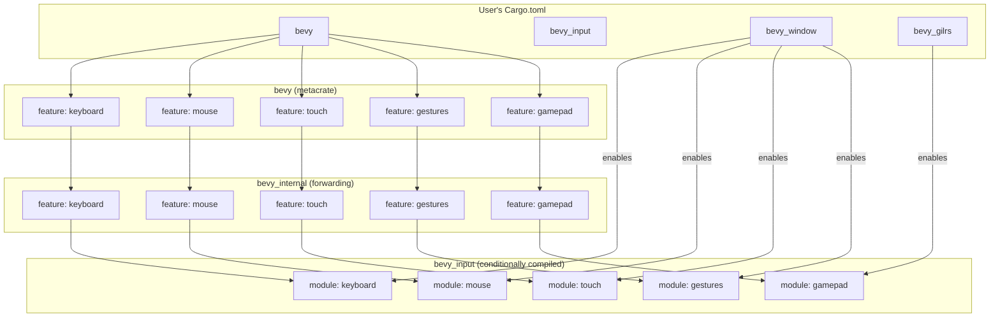

+++
title = "#21447 Put input sources for `bevy_input` under features"
date = "2025-12-16T00:00:00"
draft = false
template = "pull_request_page.html"
in_search_index = false

[extra]
current_language = "zh-cn"
available_languages = {"en" = { name = "English", url = "/pull_request/bevy/2025-12/pr-21447-en-20251216" }, "zh-cn" = { name = "中文", url = "/pull_request/bevy/2025-12/pr-21447-zh-cn-20251216" }}
labels = ["A-Input", "C-Usability", "M-Migration-Guide", "X-Contentious", "O-Embedded"]
+++

# Put input sources for `bevy_input` under features

## Basic Information
- **Title**: Put input sources for `bevy_input` under features
- **PR Link**: https://github.com/bevyengine/bevy/pull/21447
- **Author**: Shatur
- **Status**: MERGED
- **Labels**: A-Input, C-Usability, S-Ready-For-Final-Review, M-Migration-Guide, X-Contentious, O-Embedded
- **Created**: 2025-10-07T18:04:49Z
- **Merged**: 2025-12-16T20:39:19Z
- **Merged By**: alice-i-cecile

## Description Translation
# 目标

`bevy_input` 提供了各种输入的原语。但在游戏主机上，通常没有触摸屏等功能。在更冷门的平台（如GBA）上，只需要游戏手柄输入。

## 解决方案

为了避免包含额外的东西，我将每个输入源放在一个特性（feature）下。我没有默认启用它们，以避免在所有包含 `bevy_input` 的地方都输入：

```toml
default-features = false, features = [
    "std",
    "bevy_reflect",
    "bevy_ecs/async_executor",
    "smol_str"
]
```

相反，我只是在 `bevy_window` 和 `bevy_gilrs` 中启用了使用的输入源。这样，当不提供特定输入源硬件支持的crate被使用时，`bevy_input` 中相应的特性也不会被启用。

对于GBA平台，这使 `game` 示例的二进制大小从1.6M减少到1.4M。

## 考虑的替代方案

我也考虑过这样做：

```rust
pub struct InputPlugin {
    pub keyboard: bool,
    pub mouse: bool,
    pub gamepad: bool,
    pub touch: bool,
}
```

但即使启用LTO，这也不能消除额外的代码，并且可能让用户感到困惑，因为切换这些值可能会导致由于缺少资源而崩溃（当像 `bevy_window` 这样的crate期望它时）。

## The Story of This Pull Request

这个 PR 解决了一个在跨平台游戏开发中常见的问题：如何为不同平台只包含必要的输入支持代码。Bevy 引擎被设计为跨平台，从桌面、Web 到嵌入式设备（如 GBA）都能运行。然而，不同的硬件平台支持的输入设备差异很大。例如，游戏主机通常没有触摸屏，而像 GBA 这样的嵌入式设备可能只支持游戏手柄输入。

在 PR 实施之前，`bevy_input` crate 无条件地包含了所有输入源的支持代码：键盘、鼠标、游戏手柄、触摸和手势。这意味着，即使目标平台不支持某些输入类型，相关的代码、资源和系统仍然会被编译进最终二进制文件。这不仅增加了二进制大小，还可能引入不必要的依赖和潜在的错误处理。

开发者 Shatur 面临的问题是如何在不破坏现有 API 和用户体验的前提下，优雅地移除未使用的输入代码。他们考虑了两种方案：
1. 在 `InputPlugin` 中增加配置布尔值，让用户在运行时选择启用哪些输入源。
2. 使用 Cargo 的特性门控（feature gating）在编译时排除不需要的模块。

第一种方案虽然看起来更灵活，但存在明显缺陷。即使通过配置禁用某个输入源，其相关的类型和函数仍然会被编译，因为 Rust 的编译单元是整个 crate，无法基于运行时配置进行条件编译。这无法实现减少二进制大小的目标。此外，如果用户错误地禁用了某个输入源，而其他 crate（如 `bevy_window`）却依赖它，就会导致运行时资源缺失而崩溃。

因此，Shatur 选择了第二种方案：利用 Cargo 的特性系统。这种方案的核心思想是将每个输入源模块（键盘、鼠标、游戏手柄、触摸、手势）分别置于独立的特性标志后面。然后，在高级别的 crate（如 `bevy_window` 和 `bevy_gilrs`）中，根据它们实际提供的硬件支持，有选择地启用 `bevy_input` 的相应特性。

这个方案需要修改多个文件。首先，在 `bevy_input/Cargo.toml` 中定义了五个新的特性：`mouse`、`keyboard`、`gamepad`、`touch` 和 `gestures`。这些特性默认不启用，因此用户必须显式选择他们需要的输入源。

然后，在 `bevy_input/src/lib.rs` 中，使用 `#[cfg(feature = "...")]` 属性来条件编译各个模块的导入、重新导出以及插件构建逻辑。例如，只有在启用 `keyboard` 特性时，才会导入 `keyboard` 模块，添加 `KeyboardInput` 消息，初始化 `ButtonInput<KeyCode>` 资源，并注册键盘输入系统。

为了让这个特性系统对最终用户透明，Shatur 修改了 `bevy_window` 和 `bevy_gilrs` 的 `Cargo.toml` 文件，让它们自动启用相应的输入特性。`bevy_window` 启用了 `gestures`、`keyboard`、`mouse` 和 `touch`，因为这些是窗口系统通常支持的输入方式。`bevy_gilrs` 则只启用了 `gamepad` 特性，因为它专门处理游戏手柄输入。

为了在根 `Cargo.toml` 中暴露这些新特性，并确保它们能通过 `bevy` 元 crate 使用，Shatur 在根 `Cargo.toml` 中添加了相应的特性定义，并在 `bevy_internal/Cargo.toml` 中添加了转发。这样，用户既可以通过 `bevy_input` 直接启用特性，也可以通过 `bevy` 元 crate 来启用。

这个更改带来了直接的收益。在 GBA 平台上，`game` 示例的二进制大小从 1.6MB 减少到了 1.4MB，减少了约 12.5%。对于资源受限的嵌入式平台，这是一个显著的优化。

当然，这个改动是破坏性的。之前没有显式管理 `bevy_input` 特性的用户可能会发现他们的输入系统停止工作。为了帮助用户迁移，Shatur 添加了一个迁移指南文档 `release-content/migration-guides/bevy_input_features.md`，并更新了 `docs/cargo_features.md` 以记录新特性。

总的来说，这个 PR 通过引入编译时的输入源特性门控，优雅地解决了跨平台输入代码冗余的问题。它遵循了 Rust 生态系统中的常见模式（通过特性进行条件编译），并将配置责任放在了最合适的层级（提供硬件支持的 crate），从而在保持 API 简洁的同时，实现了二进制大小的优化。

## Visual Representation



## Key Files Changed

### `crates/bevy_input/Cargo.toml` (+7/-0)
这是改动的基础，在这里定义了五个新的输入源特性。这些特性默认不启用，需要用户或依赖的 crate 显式启用。

```toml
## Input sources
mouse = []
keyboard = []
gamepad = []
touch = []
gestures = []
```

### `crates/bevy_input/src/lib.rs` (+59/-24)
这是核心的改动文件，几乎所有逻辑都围绕条件编译展开。改动包括：
1. 在每个输入模块的声明前加上 `#[cfg(feature = "...")]`。
2. 在 `prelude` 模块中，对每个输入类型的重新导出也加上条件编译。
3. 在 `InputPlugin::build` 方法中，将不同输入源的初始化逻辑分别包裹在相应的 `#[cfg(feature = "...")]` 块中。
4. 在导入语句中也添加了条件编译。

```rust
// 模块声明条件编译
#[cfg(feature = "gamepad")]
pub mod gamepad;

#[cfg(feature = "gestures")]
pub mod gestures;

#[cfg(feature = "keyboard")]
pub mod keyboard;

#[cfg(feature = "mouse")]
pub mod mouse;

#[cfg(feature = "touch")]
pub mod touch;

// prelude 中的条件重新导出
#[doc(hidden)]
#[cfg(feature = "gamepad")]
pub use crate::gamepad::{Gamepad, GamepadAxis, GamepadButton, GamepadSettings};

// Plugin 构建中的条件初始化
#[cfg(feature = "keyboard")]
app.add_message::<KeyboardInput>()
    .add_message::<KeyboardFocusLost>()
    .init_resource::<ButtonInput<KeyCode>>()
    .init_resource::<ButtonInput<Key>>()
    .add_systems(PreUpdate, keyboard_input_system.in_set(InputSystems));
```

### `Cargo.toml` (+15/-0) 和 `crates/bevy_internal/Cargo.toml` (+7/-0)
这两个文件将新特性从 `bevy_input` 暴露给整个 `bevy` 元 crate 的用户。根 `Cargo.toml` 定义了用户可以启用的特性，而 `bevy_internal/Cargo.toml` 将这些特性转发给 `bevy_input`。

```toml
// 根 Cargo.toml 中的新增特性定义
# Mouse support. Automatically enabled by `bevy_window`.
mouse = ["bevy_internal/mouse"]

# Keyboard support. Automatically enabled by `bevy_window`.
keyboard = ["bevy_internal/keyboard"]

# Gamepad support. Automatically enabled by `bevy_gilrs`.
gamepad = ["bevy_internal/gamepad"]

# Touch support. Automatically enabled by `bevy_window`.
touch = ["bevy_internal/touch"]

# Gestures support. Automatically enabled by `bevy_window`.
gestures = ["bevy_internal/gestures"]

// bevy_internal/Cargo.toml 中的特性转发
mouse = ["bevy_input/mouse"]
keyboard = ["bevy_input/keyboard"]
gamepad = ["bevy_input/gamepad"]
touch = ["bevy_input/touch"]
gestures = ["bevy_input/gestures"]
```

### `crates/bevy_window/Cargo.toml` 和 `crates/bevy_gilrs/Cargo.toml`
这两个文件确保了在典型使用场景下，用户无需手动管理输入特性。`bevy_window` 启用了它支持的输入源特性，`bevy_gilrs` 启用了游戏手柄特性。

```toml
// bevy_window/Cargo.toml
bevy_input = { path = "../bevy_input", version = "0.18.0-dev", default-features = false, features = [
  "gestures",
  "keyboard",
  "mouse",
  "touch",
] }

// bevy_gilrs/Cargo.toml
bevy_input = { path = "../bevy_input", version = "0.18.0-dev", features = [
  "gamepad",
] }
```

### `release-content/migration-guides/bevy_input_features.md` (+27/-0)
这是一个新增的迁移指南，帮助用户从旧版本升级。它解释了改动的原因，并提供了示例说明如何手动启用需要的输入源特性。

### `docs/cargo_features.md` (+6/-0)
这个文件被更新，加入了新特性的文档，方便用户查阅。

## Further Reading

1. **Rust 官方文档：Cargo 特性** - 了解 Rust 中特性（features）的工作原理和最佳实践。
   - https://doc.rust-lang.org/cargo/reference/features.html

2. **Bevy 官方文档：跨平台开发** - 了解 Bevy 如何支持不同平台以及相关的考量。
   - https://bevyengine.org/learn/book/getting-started/platforms/

3. **条件编译（`#[cfg]`）** - Rust 中条件编译属性的详细说明。
   - https://doc.rust-lang.org/reference/conditional-compilation.html

4. **嵌入式开发中的二进制大小优化** - 讨论在资源受限环境中减少二进制大小的各种技术。
   - https://rust-embedded.github.io/book/unsorted/shrinking.html

5. **Bevy 输入系统架构** - 理解 Bevy 输入系统是如何设计的，包括事件、资源和系统。
   - https://bevyengine.org/learn/book/input/