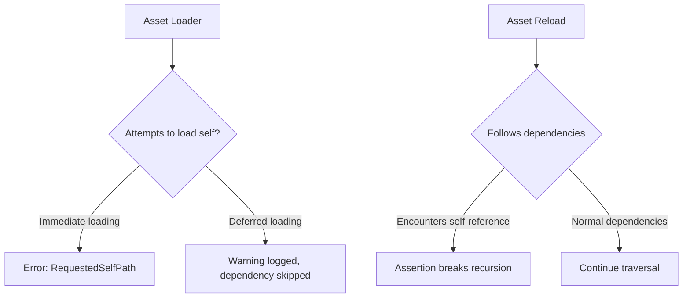

+++
title = "#21619 Fixing a Stack Overflow in Bevy's Asset System When Assets Depend on Themselves"
date = "2025-12-15T00:00:00"
draft = false
template = "pull_request_page.html"
in_search_index = true

[taxonomies]
list_display = ["show"]

[extra]
current_language = "en"
available_languages = {"en" = { name = "English", url = "/pull_request/bevy/2025-12/pr-21619-en-20251215" }, "zh-cn" = { name = "中文", url = "/pull_request/bevy/2025-12/pr-21619-zh-cn-20251215" }}
labels = ["C-Bug", "A-Assets"]
+++

# Title: Fixing a Stack Overflow in Bevy's Asset System When Assets Depend on Themselves

## Basic Information
- **Title**: bug: Fix stackoverflow on asset reload.
- **PR Link**: https://github.com/bevyengine/bevy/pull/21619
- **Author**: shanecelis
- **Status**: MERGED
- **Labels**: C-Bug, A-Assets, S-Ready-For-Final-Review
- **Created**: 2025-10-21T04:19:25Z
- **Merged**: 2025-12-14T23:46:28Z
- **Merged By**: alice-i-cecile

## Description Translation

# Objective

Fix the stackoverflow on asset reload when asset contains its own path as a dependency.

## Problem
There is a way to create a circular dependency graph with an asset loader. I don't know how I managed to do it. I have tried to create a minimal example, but it has not exhibited the error yet. But I do have a means of exhibiting the error with my project Nano-9, reproduction details below.

## Solution

This commit has two fixes: one at the insertion point (introducing self-reference), and one at the recursion point (following self-reference).

### Insertion point
Issue warning when an asset wants to mark itself as a dependency and do not allow inserting itself as a dependent.

### Recursion point
Check for self loops. Warn on self detection and do not loop.

It's likely that if you fix it at the insertion point, you don't need to worry about it at the recursion point. You will have stopped the cause of the issue. I left both in for transparency about where the issue lies so far as I could see.

## Testing

I can reproduce this error with an example from my [Nano-9 project](https://github.com/shanecelis/nano-9). I wish it were a minimal example. It's not, but I have put it on a branch to isolate this issue. It uses my Bevy fork that is v0.16.1 plus a commit tagged v0.16.1b, which was required for it to build. This PR is a cherry pick of the fix commit against Bevy's main branch.

I can reproduce this error by doing the following:

```sh
git clone -b bevy-asset-stackoverflow https://github.com/shanecelis/nano-9.git
cd nano-9
cargo run --example sprite --features watcher --no-default-features &
touch assets/BirdSprite.png
```
Here is an excerpt of the crash report on macOS 15.6.1, M4 Max:

```
...
Thread 0 Crashed:: main Dispatch queue: com.apple.main-thread
0   libsystem_kernel.dylib        	       0x18cc2a388 __pthread_kill + 8
1   libsystem_pthread.dylib       	       0x18cc6388c pthread_kill + 296
2   libsystem_c.dylib             	       0x18cb6ca3c abort + 124
3   sprite                        	       0x10598d09c std::sys::pal::unix::abort_internal::h1edcc850f5dec78e + 12
4   sprite                        	       0x10598c5b0 std::process::abort::hffd6db68ff0662a6 + 12
5   sprite                        	       0x10580d464 std::sys::pal::unix::stack_overflow::imp::signal_handler::h7b8eae417c5ee98d + 604
6   libsystem_platform.dylib      	       0x18cc9d6a4 _sigtramp + 56
7   sprite                        	       0x10573f890 _$LT$std..path..Path$u20$as$u20$core..hash..Hash$GT$::hash::h732e05949b6a170e + 136
8   sprite                        	       0x10573f890 _$LT$std..path..Path$u20$as$u20$core..hash..Hash$GT$::hash::h732e05949b6a170e + 136
9   sprite                        	       0x104d5f278 _$LT$atomicow..CowArc$LT$T$GT$$u20$as$u20$core..hash..Hash$GT$::hash::h6c45383281764a05 + 40
10  sprite                        	       0x104ed62d8 _$LT$bevy_asset..path..AssetPath$u20$as$u20$core..hash..Hash$GT$::hash::h11b348528182d76d + 52
11  sprite                        	       0x104ded598 hashbrown::map::make_hash::hb7812997186aa817 + 56
12  sprite                        	       0x104de8eec hashbrown::map::HashMap$LT$K$C$V$C$S$C$A$GT$::insert::h3a8b107dcf9615e9 + 64
13  sprite                        	       0x104da7264 hashbrown::set::HashSet$LT$T$C$S$C$A$GT$::insert::h44e988e7a7752688 + 24
14  sprite                        	       0x104e7b15c bevy_platform::collections::hash_set::HashSet$LT$T$C$S$GT$::insert::hb1d23d506d548fcc + 24
15  sprite                        	       0x104dba770 bevy_asset::server::handle_internal_asset_events::_$u7b$$u7b$closure$u7d$$u7d$::queue_ancestors::hd1670687bb18ae9f + 216
16  sprite                        	       0x104dba780 bevy_asset::server::handle_internal_asset_events::_$u7b$$u7b$closure$u7d$$u7d$::queue_ancestors::hd1670687bb18ae9f + 232
17  sprite                        	       0x104dba780 bevy_asset::server::handle_internal_asset_events::_$u7b$$u7b$closure$u7d$$u7d$::queue_ancestors::hd1670687bb18ae9f + 232
18  sprite                        	       0x104dba780 bevy_asset::server::handle_internal_asset_events::_$u7b$$u7b$closure$u7d$$u7d$::queue_ancestors::hd1670687bb18ae9f + 232
19  sprite                        	       0x104dba780 bevy_asset::server::handle_internal_asset_events::_$u7b$$u7b$closure$u7d$$u7d$::queue_ancestors::hd1670687bb18ae9f + 232
...
```

### Exercising the fix

Alter Nano-9's Cargo file to use the fix branch:

```diff
-bevy = { git = "https://github.com/shanecelis/bevy.git", tag = "v0.16.1b" }
+bevy = { git = "https://github.com/shanecelis/bevy.git", branch = "fix/asset-reload-overflow" }
```
Run the same command again, and you will see a warning:

```sh
2025-10-21T04:10:52.348726Z  WARN bevy_asset::server::info: Asset 'BirdSprite.png' wants to treat itself as a dependency
```

## Alternative Solution

This commit fixes the immediate stackoverflow issue; however, it would be even better if the user were prevented from making a circular dependency graph in the first place.

## The Story of This Pull Request

### The Problem and Context

During asset reload operations in Bevy's asset system, a developer encountered a stack overflow crash. The crash occurred when an asset loader attempted to load the same asset path that it was currently processing, creating a circular dependency. In this specific case, the asset at path `BirdSprite.png` was trying to load itself during a reload operation triggered by modifying the file on disk.

The crash stack trace showed infinite recursion in the `queue_ancestors` function within `bevy_asset::server::handle_internal_asset_events`. This function recursively follows dependency chains to determine which assets need to be reloaded when a dependency changes. When an asset depends on itself, this creates an infinite loop that eventually exhausts the call stack.

The developer attempted to create a minimal reproduction case but was unable to do so, indicating that the conditions triggering this issue were complex and likely involved specific patterns in asset loader implementations. Instead, they provided a reproduction using their Nano-9 project, which demonstrated the issue in a real-world scenario.

### The Solution Approach

The fix takes a defensive, multi-layered approach by addressing the issue at two different points in the asset loading pipeline:

1. **Prevention at insertion**: When an asset tries to register itself as a dependency during loading, detect this and prevent the self-reference from being added to the dependency graph.

2. **Safety at recursion**: Add a defensive check in the reload logic to detect and break self-referential loops, preventing infinite recursion even if a self-dependency somehow slips through the first layer of protection.

This approach is pragmatic rather than theoretical - while preventing the insertion of self-dependencies should be sufficient in theory, adding a second safety check ensures robustness against edge cases or future code changes.

### The Implementation

The implementation modifies several key points in Bevy's asset loading system:

**In `loader.rs`**, a new error variant `RequestedSelfPath` was added to `LoadDirectError` to handle immediate self-loading attempts:

```rust
#[error("The asset at path `{0:?}` requested to immediately load itself recursively, but this is not supported")]
RequestedSelfPath(AssetPath<'static>),
```

The `read_asset_bytes` method was modified to skip adding self-references to loader dependencies:

```rust
if self.asset_path != path {
    self.loader_dependencies.insert(path.clone_owned(), hash);
}
```

The `load_direct` method now checks for self-loading attempts and returns an error:

```rust
if self.asset_path == path {
    return Err(LoadDirectError::RequestedSelfPath(
        self.asset_path.clone_owned(),
    ));
}
```

**In `loader_builders.rs`**, both deferred and immediate loaders were updated to handle self-references. For deferred loading, the code now logs a debug message and skips adding the self-reference to dependencies:

```rust
let is_self_path = *self.load_context.path() == path;

// Later in the function:
if !is_self_path {
    let index = (&handle).try_into().unwrap();
    self.load_context.dependencies.insert(index);
} else {
    debug!(
        "Asset from path `{:?}` loaded its self path",
        self.load_context.path()
    );
}
```

For immediate loading, the code returns a `RequestedSelfPath` error:

```rust
if self.load_context.path() == path {
    return Err(LoadDirectError::RequestedSelfPath(path.clone()));
}
```

**In `server/mod.rs`**, the `handle_internal_asset_events` function now includes an assertion to catch any remaining self-references:

```rust
assert_ne!(
    asset_path, dependent,
    "The asset path `{}` contains itself as a dependent.",
    &asset_path
);
```

The comment notes that if this assertion fails, the following code would cause a stack overflow, highlighting the defensive nature of this check.

### Technical Insights

The PR reveals several important aspects of Bevy's asset system:

1. **Asset loading has two modes**: Immediate loading (blocking) and deferred loading (async). The fix handles both cases differently - immediate self-loading is treated as an error, while deferred self-loading generates a warning but allows the asset to function.

2. **Dependency tracking is bidirectional**: The asset system maintains both `loader_dependencies` (what an asset depends on) and `loader_dependents` (what depends on an asset). Self-references create problems in both directions.

3. **The asset reload system uses recursive traversal**: When an asset changes, the system recursively traverses the dependency graph to find all assets that need to be reloaded. This is where self-references cause infinite recursion.

4. **Type safety considerations**: The fix handles both typed and untyped asset loading scenarios, showing that self-references can occur regardless of whether the asset type is known at compile time.

### The Impact

This fix prevents a crashing bug that could occur under specific conditions in asset loaders. While the exact conditions triggering the issue were difficult to reproduce in isolation, the fix ensures that:

1. Asset loaders can no longer crash the application by creating self-references
2. The system provides clear diagnostics (errors for immediate loading, warnings for deferred loading)
3. Assets with self-references can still function (for deferred loading) without causing infinite recursion
4. The fix is defensive with multiple layers of protection

The implementation also includes comprehensive tests that document the expected behavior for various self-loading scenarios, serving as valuable documentation for future developers working with the asset system.

## Visual Representation



## Key Files Changed

### `crates/bevy_asset/src/loader.rs`
**What changed**: Added checks to prevent self-loading in immediate loading scenarios and modified `read_asset_bytes` to avoid adding self-references to dependencies.

**Key modifications**:
```rust
// Added new error variant
#[error("The asset at path `{0:?}` requested to immediately load itself recursively, but this is not supported")]
RequestedSelfPath(AssetPath<'static>),

// In load_direct method
if self.asset_path == path {
    return Err(LoadDirectError::RequestedSelfPath(
        self.asset_path.clone_owned(),
    ));
}

// In read_asset_bytes method
if self.asset_path != path {
    self.loader_dependencies.insert(path.clone_owned(), hash);
}
```

**Why**: These changes prevent assets from immediately loading themselves, which would create an infinite loop.

### `crates/bevy_asset/src/loader_builders.rs`
**What changed**: Added self-reference detection for both deferred and immediate loading, with different handling for each case.

**Key modifications**:
```rust
// For deferred loading (both typed and untyped)
let is_self_path = *self.load_context.path() == path;

if !is_self_path {
    // Add to dependencies
} else {
    debug!("Asset from path `{:?}` loaded its self path", ...);
}

// For immediate loading
if self.load_context.path() == path {
    return Err(LoadDirectError::RequestedSelfPath(path.clone()));
}
```

**Why**: Immediate self-loading is an error, while deferred self-loading generates a warning but allows the asset to function.

### `crates/bevy_asset/src/server/mod.rs`
**What changed**: Added an assertion to break infinite recursion during asset reload if self-dependencies exist.

**Key modifications**:
```rust
assert_ne!(
    asset_path, dependent,
    "The asset path `{}` contains itself as a dependent.",
    &asset_path
);
```

**Why**: This serves as a last line of defense against infinite recursion if self-dependencies somehow bypass the other checks.

### `crates/bevy_asset/src/lib.rs`
**What changed**: Added comprehensive tests covering various self-loading scenarios.

**Key test cases added**:
- `error_on_immediate_load_of_self_path`
- `error_on_unknown_type_immediate_load_of_self_path`
- `no_error_on_deferred_load_of_self_path`
- `no_error_on_read_bytes_of_self_path`
- `no_error_on_unknown_type_deferred_load_of_self_path`

**Why**: These tests document the expected behavior and ensure the fix works correctly across different loading scenarios.

## Further Reading

1. **Bevy Asset System Documentation**: For understanding how Bevy's asset loading and dependency tracking works.
2. **Rust's Ownership and Borrowing**: The fix demonstrates careful handling of `AssetPath` clones and comparisons.
3. **Graph Theory - Cycle Detection**: The problem is essentially cycle detection in a dependency graph.
4. **Defensive Programming Principles**: The multi-layered approach (prevention + safety check) is a good example of defensive programming.
5. **Bevy's Error Handling Patterns**: The use of custom error types and the `thiserror` crate for error propagation.