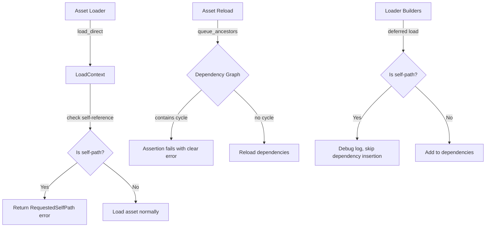

+++
title = "#21619 bug: Fix stackoverflow on asset reload."
date = "2025-12-15T00:00:00"
draft = false
template = "pull_request_page.html"
in_search_index = false

[extra]
current_language = "zh-cn"
available_languages = {"en" = { name = "English", url = "/pull_request/bevy/2025-12/pr-21619-en-20251215" }, "zh-cn" = { name = "中文", url = "/pull_request/bevy/2025-12/pr-21619-zh-cn-20251215" }}
labels = ["C-Bug", "A-Assets"]
+++

# Title
bug: Fix stackoverflow on asset reload.

## Basic Information
- **Title**: bug: Fix stackoverflow on asset reload.
- **PR Link**: https://github.com/bevyengine/bevy/pull/21619
- **Author**: shanecelis
- **Status**: MERGED
- **Labels**: C-Bug, A-Assets, S-Ready-For-Review
- **Created**: 2025-10-21T04:19:25Z
- **Merged**: 2025-12-14T23:46:28Z
- **Merged By**: alice-i-cecile

## Description Translation
# 目标

修复当资产包含其自身路径作为依赖时，资产重载导致的栈溢出（stackoverflow）问题。

## 问题
存在一种方法可以通过资产加载器（asset loader）创建循环依赖图（circular dependency graph）。我不知道自己是怎么做到的。我曾尝试创建一个最小复现示例，但未能重现此错误。但我确实可以通过我的项目Nano-9来复现这个错误，复现细节如下。

## 解决方案

这次提交包含两个修复点：一个在插入点（引入自引用时），另一个在递归点（跟随自引用时）。

### 插入点
当资产试图将自己标记为依赖时发出警告，并禁止将其自身作为依赖项插入。

### 递归点
检查自循环（self loops）。检测到自循环时发出警告并停止循环。

很可能如果你在插入点修复了问题，就不必在递归点再担心它。你已经阻止了问题的根源。我保留了两处修复，是为了透明地展示到目前为止我所能看到的问题所在。

## 测试

我可以通过我的[Nano-9项目](https://github.com/shanecelis/nano-9)中的一个示例来复现这个错误。我希望它是一个最小示例。它并不是，但我已经将其放在一个分支上来隔离此问题。它使用了我的Bevy分支，版本为v0.16.1加上一个标记为v0.16.1b的提交，这是构建所必需的。此PR是针对Bevy主分支（main branch）进行的修复提交的cherry pick。

我可以通过以下步骤复现这个错误：

```sh
git clone -b bevy-asset-stackoverflow https://github.com/shanecelis/nano-9.git
cd nano-9
cargo run --example sprite --features watcher --no-default-features &
touch assets/BirdSprite.png
```
以下是在macOS 15.6.1，M4 Max上的崩溃报告摘录：

```
...
Thread 0 Crashed:: main Dispatch queue: com.apple.main-thread
0   libsystem_kernel.dylib        	       0x18cc2a388 __pthread_kill + 8
1   libsystem_pthread.dylib       	       0x18cc6388c pthread_kill + 296
2   libsystem_c.dylib             	       0x18cb6ca3c abort + 124
3   sprite                        	       0x10598d09c std::sys::pal::unix::abort_internal::h1edcc850f5dec78e + 12
4   sprite                        	       0x10598c5b0 std::process::abort::hffd6db68ff0662a6 + 12
5   sprite                        	       0x10580d464 std::sys::pal::unix::stack_overflow::imp::signal_handler::h7b8eae417c5ee98d + 604
6   libsystem_platform.dylib      	       0x18cc9d6a4 _sigtramp + 56
7   sprite                        	       0x10573f890 _$LT$std..path..Path$u20$as$u20$core..hash..Hash$GT$::hash::h732e05949b6a170e + 136
8   sprite                        	       0x10573f890 _$LT$std..path..Path$u20$as$u20$core..hash..Hash$GT$::hash::h732e05949b6a170e + 136
9   sprite                        	       0x104d5f278 _$LT$atomicow..CowArc$LT$T$GT$$u20$as$u20$core..hash..Hash$GT$::hash::h6c45383281764a05 + 40
10  sprite                        	       0x104ed62d8 _$LT$bevy_asset..path..AssetPath$u20$as$u20$core..hash..Hash$GT$::hash::h11b348528182d76d + 52
11  sprite                        	       0x104ded598 hashbrown::map::make_hash::hb7812997186aa817 + 56
12  sprite                        	       0x104de8eec hashbrown::map::HashMap$LT$K$C$V$C$S$C$A$GT$::insert::h3a8b107dcf9615e9 + 64
13  sprite                        	       0x104da7264 hashbrown::set::HashSet$LT$T$C$S$C$A$GT$::insert::h44e988e7a7752688 + 24
14  sprite                        	       0x104e7b15c bevy_platform::collections::hash_set::HashSet$LT$T$C$S$GT$::insert::hb1d23d506d548fcc + 24
15  sprite                        	       0x104dba770 bevy_asset::server::handle_internal_asset_events::_$u7b$$u7b$closure$u7d$$u7d$::queue_ancestors::hd1670687bb18ae9f + 216
16  sprite                        	       0x104dba780 bevy_asset::server::handle_internal_asset_events::_$u7b$$u7b$closure$u7d$$u7d$::queue_ancestors::hd1670687bb18ae9f + 232
17  sprite                        	       0x104dba780 bevy_asset::server::handle_internal_asset_events::_$u7b$$u7b$closure$u7d$$u7d$::queue_ancestors::hd1670687bb18ae9f + 232
18  sprite                        	       0x104dba780 bevy_asset::server::handle_internal_asset_events::_$u7b$$u7b$closure$u7d$$u7d$::queue_ancestors::hd1670687bb18ae9f + 232
19  sprite                        	       0x104dba780 bevy_asset::server::handle_internal_asset_events::_$u7b$$u7b$closure$u7d$$u7d$::queue_ancestors::hd1670687bb18ae9f + 232
...
```

### 验证修复

修改Nano-9的Cargo文件以使用修复分支：

```diff
-bevy = { git = "https://github.com/shanecelis/bevy.git", tag = "v0.16.1b" }
+bevy = { git = "https://github.com/shanecelis/bevy.git", branch = "fix/asset-reload-overflow" }
```
再次运行相同的命令，你将看到一条警告：

```sh
2025-10-21T04:10:52.348726Z  WARN bevy_asset::server::info: Asset 'BirdSprite.png' wants to treat itself as a dependency
```

## 替代方案

这次提交修复了立即出现的栈溢出问题；然而，如果能从一开始就阻止用户创建循环依赖图，那会更好。

## The Story of This Pull Request

这个PR解决了一个在Bevy资产系统中可能出现的微妙问题：当资产在其加载过程中试图将自己标记为依赖时，会导致无限递归和最终的栈溢出崩溃。这个问题通常不会在简单的使用场景中出现，但在特定的资产加载器实现中可能被意外触发。

### 问题的发现与诊断
开发者shanecelis在开发Nano-9项目时遇到了一个栈溢出崩溃。从崩溃日志中可以看到，堆栈跟踪在`queue_ancestors`函数中不断重复，表明存在无限递归。通过分析，发现问题出现在资产重载时，当资产将其自身路径作为依赖时，会形成一个循环依赖链，导致在重新加载资产时无限递归地遍历其依赖链。

### 解决方案的双重保障
开发者采用了双重防护策略来解决这个问题，这在软件工程中是一种稳健的做法：

1. **在源头阻止**：在资产加载器试图将自身路径添加为依赖时进行检查和阻止
2. **在运行时防御**：在依赖遍历逻辑中添加循环检测，作为最后的防线

这种双重保护确保了即使在某些边缘情况下第一个防护失败，第二个防护也能防止系统崩溃。

### 实现细节
在具体实现中，开发者修改了多个关键位置：

1. **在`LoadContext::load_direct`中**：添加了明确的路径检查，如果请求加载的路径与当前加载的资产路径相同，则返回`RequestedSelfPath`错误。

```rust
if self.asset_path == path {
    return Err(LoadDirectError::RequestedSelfPath(
        self.asset_path.clone_owned(),
    ));
}
```

2. **在`LoadContext::read_asset_bytes`中**：修改了依赖记录逻辑，避免将自身路径添加到依赖集合中：

```rust
if self.asset_path != path {
    self.loader_dependencies.insert(path.clone_owned(), hash);
}
```

3. **在加载器构建器中**：对于延迟加载（deferred load）和立即加载（immediate load）两种情况都添加了自引用检查。对于延迟加载，只是记录调试日志而不将自身添加到依赖中；对于立即加载，则直接返回错误。

4. **在资产事件处理器中**：添加了一个防御性的断言（assertion），确保在遍历依赖链时不会遇到自引用。如果断言失败，会提供清晰的错误信息，而不是让程序陷入无限递归。

```rust
assert_ne!(
    asset_path, dependent,
    "The asset path `{}` contains itself as a dependent.",
    &asset_path
);
```

### 测试覆盖的全面性
这个PR的一个重要特点是它包含了全面的测试用例，覆盖了多种可能的情况：
- 立即加载自身路径（应该失败）
- 延迟加载自身路径（应该成功，但产生自引用句柄）
- 读取自身路径的字节（应该成功）
- 未知类型的延迟加载自身路径（应该成功）

这些测试不仅验证了修复的有效性，也记录了系统在各种边界情况下的预期行为，为未来的维护提供了清晰的规范。

### 工程决策与权衡
开发者明确指出了他们的工程决策：虽然修复插入点（阻止自引用作为依赖）可能就足够了，但他们保留了递归点的修复作为额外的安全措施。这种透明性对于理解代码意图非常有价值。

同时，开发者也指出，更理想的解决方案是从根本上防止用户创建循环依赖图，但这可能需要更复杂的依赖关系检测机制，当前修复是一个更直接、更实用的解决方案。

### 技术影响
这个修复虽然代码量不大，但解决了一个可能导致应用程序崩溃的重要问题。它提高了资产系统的健壮性，防止了因用户编写的资产加载器代码错误而导致的严重崩溃。这种防御性编程模式在其他类似的依赖管理系统中也值得借鉴。

## Visual Representation



## Key Files Changed

### 1. `crates/bevy_asset/src/loader.rs` (+10/-1)
**修改目的**：在直接加载资产时添加自引用检查，防止立即加载自身路径导致的循环。

**关键代码修改**：
```rust
// 在load_direct方法中添加自引用检查
if self.asset_path == path {
    return Err(LoadDirectError::RequestedSelfPath(
        self.asset_path.clone_owned(),
    ));
}

// 在read_asset_bytes方法中，避免将自身路径添加到依赖
if self.asset_path != path {
    self.loader_dependencies.insert(path.clone_owned(), hash);
}
```

**与PR目标的关系**：这是防止自引用的第一道防线，确保资产不会尝试立即加载自身。

### 2. `crates/bevy_asset/src/loader_builders.rs` (+25/-3)
**修改目的**：在加载器构建器中添加自引用检测，处理延迟加载和立即加载两种情况。

**关键代码修改**：
```rust
// 在延迟加载中检查自引用
let is_self_path = *self.load_context.path() == path;
if !is_self_path {
    let index = (&handle).try_into().unwrap();
    self.load_context.dependencies.insert(index);
} else {
    debug!(
        "Asset from path `{:?}` loaded its self path",
        self.load_context.path()
    );
}

// 在立即加载中检查自引用
if self.load_context.path() == path {
    return Err(LoadDirectError::RequestedSelfPath(path.clone()));
}
```

**与PR目标的关系**：这是插入点的修复，防止资产将自身作为依赖项插入。

### 3. `crates/bevy_asset/src/server/mod.rs` (+7/-0)
**修改目的**：在资产重载的递归遍历中添加断言，防止因循环依赖导致的栈溢出。

**关键代码修改**：
```rust
assert_ne!(
    asset_path, dependent,
    "The asset path `{}` contains itself as a dependent.",
    &asset_path
);
// 如果上面的断言失败，下面的代码将会导致栈溢出
```

**与PR目标的关系**：这是递归点的修复，作为最后一道防线防止无限递归。

### 4. `crates/bevy_asset/src/lib.rs` (+378/-0)
**修改目的**：添加全面的测试用例，验证各种自引用场景下的行为。

**测试覆盖的场景**：
1. 立即加载自身路径应该报错
2. 延迟加载自身路径应该成功
3. 读取自身路径的字节应该成功
4. 未知类型的延迟加载自身路径应该成功

**与PR目标的关系**：确保修复的可靠性和对边界情况的正确处理。

## Further Reading

1. **Bevy资产系统文档**：https://bevyengine.org/learn/book/assets/
2. **循环依赖检测算法**：了解图论中的环检测算法，如深度优先搜索（DFS）中的颜色标记法
3. **防御性编程**：学习如何在关键路径添加断言和检查，提高系统健壮性
4. **Rust中的错误处理**：了解Result和Error类型的模式，特别是如何设计清晰的错误类型

# Full Code Diff
（已在上述分析中包含关键代码修改）