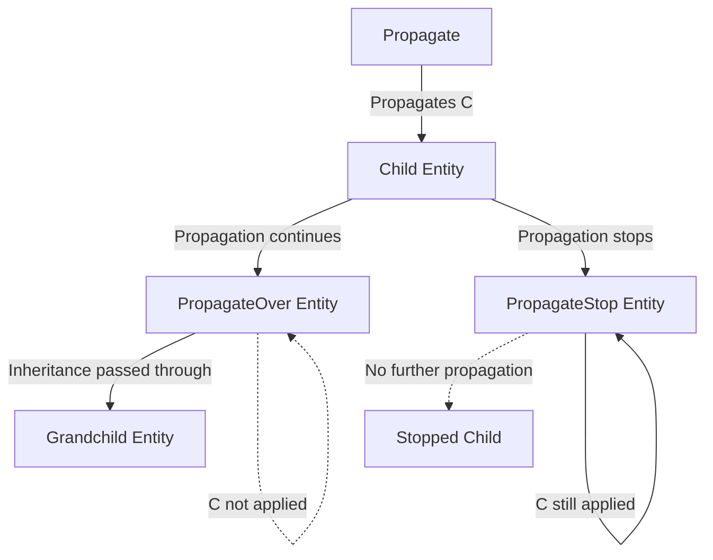

+++
title = "#21622 :bug: Fixes PropagateStop and PropagateOver"
date = "2025-12-08T00:00:00"
draft = false
template = "pull_request_page.html"
in_search_index = true

[taxonomies]
list_display = ["show"]

[extra]
current_language = "en"
available_languages = {"en" = { name = "English", url = "/pull_request/bevy/2025-12/pr-21622-en-20251208" }, "zh-cn" = { name = "中文", url = "/pull_request/bevy/2025-12/pr-21622-zh-cn-20251208" }}
labels = ["C-Bug", "A-ECS"]
+++

# Title
## Bug Fixes for PropagateStop and PropagateOver Components

## Basic Information
- **Title**: :bug: Fixes PropagateStop and PropagateOver
- **PR Link**: https://github.com/bevyengine/bevy/pull/21622
- **Author**: ekwoka
- **Status**: MERGED
- **Labels**: C-Bug, A-ECS, S-Ready-For-Final-Review
- **Created**: 2025-10-21T16:54:04Z
- **Merged**: 2025-12-08T23:06:55Z
- **Merged By**: alice-i-cecile

## Description
# Objective

Fixes #21620 

Ensures `PropagateStop` works as documented. At it stands, `PropagateStop<C>` is described as only preventing its Children from inheriting `C` but in practice that entity itself would not inherit `C`.

Makes `PropagateOver` work. It just plain didn't work at all.

## Solution

Adjusted the flow to prevent recursively inheriting `Inherited` when `PropagateStop` present, as opposed to not accessing `PropagateStop` entities entirely.

Skips applying `C` when `Inherited<C>` and `PropagateOver<C>` are on the entity.

## Testing

I updated the tests first to verify the test cases. They were incomplete and didn't pass once checking for the proper end state.

After verifying those were not functioning, trimmed and adjusted code until it functioned.

## Fuller Explanation

To my understanding of the goals (and my implementation) the idea is that the result of these components would be like

```
(Propagate<C>, Inherited<C>, C)
  (Inherited<C>, C)
    (PropagateOver<C>, Inherited<C>)
      (Inherited<C>, C)
        (PropagateStop<C>, Inherited<C>, C)
```

While the previous (incorrect by my measure) appeared to be

```
(Propagate<C>, Inherited<C>, C)
  (Inherited<C>, C)
    (PropagateOver<C>, Inherited<C>, C)
      (Inherited<C>, C)
        (PropagateStop<C>)
```

So of note: The `PropagateOver<C>` is still getting `Inherited<C>` in this current adjustment. I believe it was doing that before, but I didn't fully understand the reasoning for the `Inherited<C>` at all? I guess it's to properly mark that the `C` is an inherited one, so maybe I do need to remove it on `PropagateOver<C>` as well, to ensure cleanup doesn't also remove any separately applied `C`?

I didn't look closely at what all the other tests are attempting to test (or if they are correctly testing those) to evaluate if other changes need to be made.

if `PropagateOver<C>` doesn't have `Inherited<C>` and is reparented, would it be simple to ensure that its children have their `Inherited<C>` removed/updated properly?

Looking at the code more, chances are this can be simplified a lot with the use of AncestorIter and DescendentIter, but I am not sure if jumping into a fuller refactor makes sense at this moment as opposed to attempting to fix this immediate issue and following up with a bigger refactor?

thoughts?

## The Story of This Pull Request

This PR addresses two related bugs in Bevy's component propagation system. The system allows components to automatically propagate through entity hierarchies, with control mechanisms like `PropagateStop` to block propagation and `PropagateOver` to allow propagation through an entity while preventing it from receiving the propagated component itself.

The core issue was that `PropagateStop` wasn't working as documented. According to its intended behavior, an entity with `PropagateStop<C>` should still inherit component `C` from its ancestors, but should prevent that component from propagating further to its children. However, the implementation was incorrectly preventing the entity itself from receiving the component. Additionally, `PropagateOver` was completely non-functional.

The developer's approach involved first examining and fixing the test cases to establish correct expected behavior, then systematically adjusting the propagation logic. The key insight was that the system needed to distinguish between entities that should receive inherited components but stop propagation (PropagateStop), versus entities that should allow propagation but not receive the component themselves (PropagateOver).

The implementation changes center around two main areas: modifying the propagation logic to handle `PropagateStop` entities correctly, and fixing the `PropagateOver` functionality. Previously, the system would skip entities with `PropagateStop` entirely, preventing them from receiving the inherited component. The fix adjusts the flow so that `PropagateStop` entities still receive the `Inherited<C>` component (which tracks the inherited state) and the actual component `C`, but their children are excluded from the propagation chain.

For `PropagateOver`, the fix ensures that entities with this component don't receive the actual component `C`, but still pass the inheritance to their children. The system now checks for `PropagateOver` in the `propagate_output` system and skips applying the component when both `Inherited<C>` and `PropagateOver<C>` are present.

The changes also include better handling of edge cases like component removal and entity reparenting. A new system `update_removed_limit` was added to handle cleanup when `PropagateOver` or `PropagateStop` components are removed, marking the `Inherited` component as changed to trigger proper propagation updates.

One notable engineering consideration was the decision to keep `Inherited<C>` on `PropagateOver` entities. This maintains consistency in the propagation tracking system and ensures proper cleanup if the entity is reparented later. The developer considered whether to remove `Inherited<C>` from `PropagateOver` entities but decided against it to maintain proper inheritance tracking.

The impact of these changes is significant for users relying on component propagation in Bevy. The fixed behavior enables more precise control over how components flow through entity hierarchies, which is essential for building complex UI systems, scene management, and other hierarchical data structures. The comprehensive test suite added with this PR ensures the behavior remains correct through future changes.

## Visual Representation



## Key Files Changed

### `crates/bevy_app/src/propagate.rs` (+383/-123)

This file contains the core propagation logic that was modified to fix both bugs. The changes include:

1. **System reorganization and new system addition**: The system execution order was adjusted and a new system `update_removed_limit` was added to handle cleanup when propagation control components are removed.

2. **Fixed `PropagateStop` handling**: The `propagate_inherited` system now includes `PropagateStop<C>` in its query and uses it to decide whether to continue propagation to children.

```rust
// Before: Query didn't include PropagateStop
recurse: Query<
    (Option<&R::RelationshipTarget>, Option<&Inherited<C>>),
    (Without<Propagate<C>>, Without<PropagateStop<C>>, F),
>,

// After: Query includes PropagateStop and uses it in logic
recurse: Query<
    (
        Option<&R::RelationshipTarget>,
        Option<&Inherited<C>>,
        Option<&PropagateStop<C>>,
    ),
    (Without<Propagate<C>>, F),
>,
```

3. **Fixed `PropagateOver` handling**: The `propagate_output` system now checks for `PropagateOver` and skips applying the component when both `Inherited<C>` and `PropagateOver<C>` are present.

```rust
// Before: No check for PropagateOver in component removal
for removed in removed.read() {
    commands.entity(removed).remove::<C>();
}

// After: Check for PropagateOver before removing C
for removed in removed.read() {
    if skip.get(removed).is_err() {
        commands.entity(removed).remove::<C>();
    }
}
```

4. **Enhanced test coverage**: The PR adds extensive test cases covering various scenarios including component removal, reparenting, and edge cases with propagation control components.

```rust
// Example of new test for PropagateStop removal
#[test]
fn test_remove_propagate_stop() {
    let mut app = App::new();
    // ... test setup
    // Verifies that removing PropagateStop allows propagation to resume
    assert_eq!(
        query.get_many(app.world(), [propagate_stop, no_propagatee]),
        Ok([&TestValue(1), &TestValue(1)])
    );
}
```

## Further Reading

- [Bevy ECS Documentation](https://docs.rs/bevy_ecs/latest/bevy_ecs/) - For understanding Bevy's Entity Component System
- [Component Inheritance RFC](https://github.com/bevyengine/rfcs/pull/43) - Background on the component propagation feature
- [Relationship Trait Documentation](https://docs.rs/bevy_hierarchy/latest/bevy_hierarchy/trait.Relationship.html) - For understanding how entity relationships work in Bevy