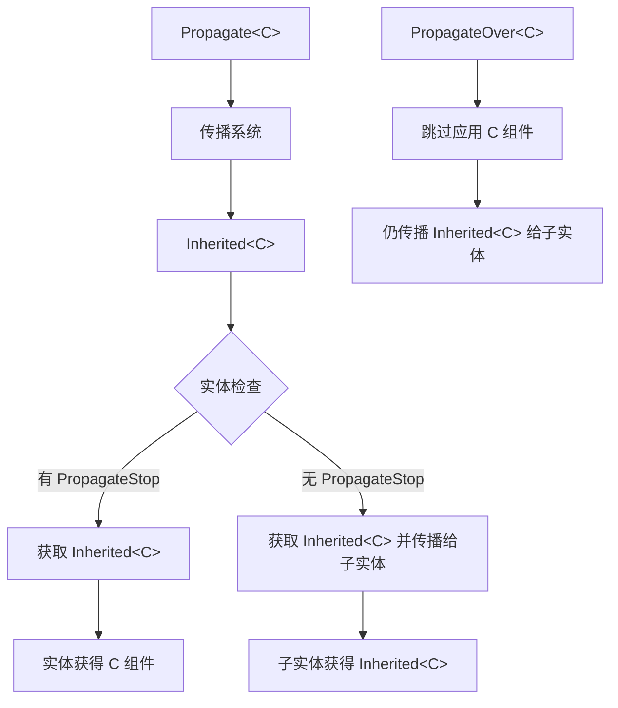

+++
title = "#21622 :bug: 修复 PropagateStop 和 PropagateOver"
date = "2025-12-08T00:00:00"
draft = false
template = "pull_request_page.html"
in_search_index = false

[extra]
current_language = "zh-cn"
available_languages = {"en" = { name = "English", url = "/pull_request/bevy/2025-12/pr-21622-en-20251208" }, "zh-cn" = { name = "中文", url = "/pull_request/bevy/2025-12/pr-21622-zh-cn-20251208" }}
+++

# Title

## 基本信息
- **标题**: :bug: 修复 PropagateStop 和 PropagateOver
- **PR 链接**: https://github.com/bevyengine/bevy/pull/21622
- **作者**: ekwoka
- **状态**: 已合并
- **标签**: C-Bug, A-ECS, S-Ready-For-Final-Review
- **创建时间**: 2025-10-21T16:54:04Z
- **合并时间**: 2025-12-08T23:06:55Z
- **合并人**: alice-i-cecile

## 描述翻译

### Objective

修复 #21620

确保 `PropagateStop` 按文档所述工作。目前，`PropagateStop<C>` 被描述为仅防止其子实体继承 `C`，但在实践中，该实体本身也不会继承 `C`。

使 `PropagateOver` 正常工作。它之前完全无效。

### Solution

调整流程，防止在存在 `PropagateStop` 时递归继承 `Inherited`，而不是完全跳过访问 `PropagateStop` 实体。

当实体同时具有 `Inherited<C>` 和 `PropagateOver<C>` 时，跳过应用 `C`。

### Testing

首先更新了测试以验证测试用例。它们不完整，并且在检查正确最终状态时无法通过。

在确认这些测试无效后，逐步调整代码直至功能正常。

### Fuller Explanation

根据我对目标的理解（以及我的实现），这些组件的结果应该是这样的：

```
(Propagate<C>, Inherited<C>, C)
  (Inherited<C>, C)
    (PropagateOver<C>, Inherited<C>)
      (Inherited<C>, C)
        (PropagateStop<C>, Inherited<C>, C)
```

而之前（我认为错误的）行为似乎是：

```
(Propagate<C>, Inherited<C>, C)
  (Inherited<C>, C)
    (PropagateOver<C>, Inherited<C>, C)
      (Inherited<C>, C)
        (PropagateStop<C>)
```

值得注意的是：在当前调整中，`PropagateOver<C>` 仍然获取了 `Inherited<C>`。我认为之前就是这样做的，但我不完全理解 `Inherited<C>` 存在的全部原因？我想它是为了正确标记 `C` 是继承而来的，所以也许我还需要从 `PropagateOver<C>` 上移除它，以确保清理时不会也移除单独应用的 `C`？

我没有仔细查看其他测试试图测试什么（或者它们是否正确测试了那些内容），以评估是否需要其他更改。

如果 `PropagateOver<C>` 没有 `Inherited<C>` 并且被重新设置父级，是否能确保其子实体正确移除/更新它们的 `Inherited<C>`？

进一步查看代码，很可能可以通过使用 AncestorIter 和 DescendentIter 来大幅简化，但我不确定在当前时刻是进行更全面的重构更有意义，还是先尝试解决这个直接问题，然后再进行更大的重构？

有什么想法？

---

## 这个 Pull Request 的故事

这个 PR 修复了 Bevy ECS 中两个层次传播组件的关键错误。问题出现在 `PropagateStop` 和 `PropagateOver` 的行为与文档描述不符，导致开发者在构建复杂的实体层次结构时遇到意外行为。

### 问题与背景

在 Bevy 的 ECS 系统中，组件可以通过实体层次关系进行传播。`Propagate<C>` 组件允许父实体的组件值传播到子实体。然而，有两个特殊的控制组件存在缺陷：

1. **`PropagateStop<C>`**：根据文档，应该只阻止其子实体继承组件 `C`，但实体本身应该继续继承父级的组件。然而，实际实现中，带有 `PropagateStop` 的实体本身也不会继承组件。

2. **`PropagateOver<C>`**：应该允许实体覆盖继承的组件值，使用自己的组件值，同时仍允许其子实体从该实体的祖先继承原始值。但实际上它完全不起作用。

这些错误影响了需要精确控制组件传播的场景，比如 UI 系统中需要局部覆盖样式，或者游戏对象层次结构中需要中断某些属性的继承。

### 解决方案方法

开发者采取了逐步修复的方法，而不是立即进行大规模重构。核心思路是调整传播系统的查询和处理逻辑，使其正确处理边界情况：

1. 对于 `PropagateStop`：改变传播算法，允许带有 `PropagateStop` 的实体继承父级组件，但阻止进一步向下游传播到其子实体。

2. 对于 `PropagateOver`：确保系统识别这些实体并跳过对它们的组件应用，同时仍允许传播标记继续向下游传递。

### 具体实现

实现主要集中在 `crates/bevy_app/src/propagate.rs` 文件中的几个关键系统：

**第一个重要变化**：修改 `propagate_inherited` 系统的查询，使其包含 `PropagateStop` 信息：

```rust
// 之前：
recurse: Query<
    (Option<&R::RelationshipTarget>, Option<&Inherited<C>>),
    (Without<Propagate<C>>, Without<PropagateStop<C>>, F),
>,

// 之后：
recurse: Query<
    (
        Option<&R::RelationshipTarget>,
        Option<&Inherited<C>>,
        Option<&PropagateStop<C>>,
    ),
    (Without<Propagate<C>>, F),
>,
```

这个变化是关键：现在查询包含了 `PropagateStop` 信息，但不再排除带有 `PropagateStop` 的实体。这使得系统能够检查一个实体是否有 `PropagateStop`，而不是完全跳过它们。

**第二个关键修改**：在传播逻辑中添加停止检查：

```rust
// 之前：无条件传播到子实体
if let Some(targets) = maybe_targets {
    to_process.extend(
        targets
            .iter()
            .map(|target| (target, maybe_inherited.clone())),
    );
}

// 之后：仅在没有 PropagateStop 时传播
if maybe_stop.is_none()
    && let Some(targets) = maybe_targets
{
    to_process.extend(
        targets
            .iter()
            .map(|target| (target, maybe_inherited.clone())),
    );
}
```

这个改变确保了 `PropagateStop` 实体仍能获得 `Inherited<C>` 组件（如果它们的父级有的话），但不会将继承状态进一步传递给它们的子实体。

**第三个重要变化**：新增 `update_removed_limit` 系统来处理 `PropagateOver` 或 `PropagateStop` 被移除的情况：

```rust
pub fn update_removed_limit<C: Component + Clone + PartialEq, F: QueryFilter, R: Relationship>(
    mut inherited: Query<&mut Inherited<C>>,
    mut removed_skip: RemovedComponents<PropagateOver<C>>,
    mut removed_stop: RemovedComponents<PropagateStop<C>>,
) {
    for entity in removed_skip.read() {
        if let Ok(mut inherited) = inherited.get_mut(entity) {
            inherited.set_changed();
        }
    }
    for entity in removed_stop.read() {
        if let Ok(mut inherited) = inherited.get_mut(entity) {
            inherited.set_changed();
        }
    }
}
```

这个新增的系统确保了当 `PropagateOver` 或 `PropagateStop` 被移除时，实体的 `Inherited<C>` 组件会被标记为已更改，从而触发重新传播。

**第四个修改**：调整 `propagate_output` 系统以正确处理 `PropagateOver`：

```rust
// 之前：只处理 Inherited<C> 变化的实体
pub fn propagate_output<C: Component + Clone + PartialEq, F: QueryFilter>(
    mut commands: Commands,
    changed: Query<
        (Entity, &Inherited<C>, Option<&C>),
        (Changed<Inherited<C>>, Without<PropagateOver<C>>, F),
    >,
) { /* ... */ }

// 之后：也处理 Inherited<C> 被移除的情况
pub fn propagate_output<C: Component + Clone + PartialEq, F: QueryFilter>(
    mut commands: Commands,
    changed: Query<
        (Entity, &Inherited<C>, Option<&C>),
        (Changed<Inherited<C>>, Without<PropagateOver<C>>, F),
    >,
    mut removed: RemovedComponents<Inherited<C>>,
    skip: Query<(), With<PropagateOver<C>>>,
) {
    // ... 处理 changed
    
    // 新增的处理移除逻辑
    for removed in removed.read() {
        if skip.get(removed).is_err() {
            commands.entity(removed).remove::<C>();
        }
    }
}
```

这个修改确保当 `Inherited<C>` 被移除时，对应的组件 `C` 也会被移除，除非实体有 `PropagateOver<C>`（这种情况下实体应该保留自己的 `C` 组件）。

### 技术洞察

这个修复展示了几个重要的 ECS 设计模式：

1. **变更检测的智能使用**：通过 `set_changed()` 手动触发变更检测，确保系统在相关组件被移除时重新运行。

2. **查询过滤的精确性**：仔细调整查询过滤器，确保系统只处理它们应该处理的实体，同时不意外排除重要实体。

3. **增量传播算法**：传播系统使用本地向量 (`Local<Vec<...>>`) 来跟踪需要处理的实体，这是一种高效的广度优先传播方法。

开发者还注意到代码有重构的空间，可能通过使用 `AncestorIter` 和 `DescendentIter` 来简化，但决定先修复紧急问题，将更大规模的重构留到以后。这是工程实践中常见的权衡：在保持系统稳定的同时修复关键错误。

### 影响

这个修复带来了以下具体改进：

1. **正确的 `PropagateStop` 行为**：带有 `PropagateStop<C>` 的实体现在会正确继承父级的组件 `C`，但阻止该组件传播给其子实体。

2. **可用的 `PropagateOver` 功能**：开发者现在可以使用 `PropagateOver` 来覆盖继承的组件值，同时仍允许子实体从祖先继承原始值。

3. **更健壮的测试套件**：PR 添加和修改了大量测试，覆盖了各种边缘情况，包括：
   - 移除 `Propagate` 组件后的传播行为
   - 实体重新设置父级的情况
   - `PropagateOver` 和 `PropagateStop` 被移除的情况
   - 过滤器条件变化的情况

测试的完善确保了这些修复不会在未来被意外破坏。

从技术债的角度看，这个修复暴露了现有实现的一些复杂性，但也为未来的重构奠定了基础。开发者明智地选择了最小化修复，同时指出了可能的改进方向。

## 可视化表示



## 关键文件更改

### `crates/bevy_app/src/propagate.rs` (+383/-123)

**变化概述**：
这个文件包含了组件传播系统的完整实现。主要变化包括修复 `PropagateStop` 和 `PropagateOver` 的逻辑错误，添加新的系统来处理边界情况，以及大幅扩展测试覆盖。

**关键代码片段**：

1. **`update_source` 系统重构**：
```rust
// 之前：移除 Propagate 时直接移除 Inherited 和 C
for removed in removed.read() {
    if let Ok(mut commands) = commands.get_entity(removed) {
        commands.remove::<(Inherited<C>, C)>();
    }
}

// 之后：检查是否有祖先可以提供继承值
for removed in removed.read() {
    if let Ok(mut commands) = commands.get_entity(removed) {
        if let Some(inherited) = relationship
            .get(removed)
            .ok()
            .and_then(|r| relations.get(r.get()).ok())
        {
            commands.insert(inherited.clone());
        } else {
            commands.remove::<Inherited<C>>();
        }
    }
}
```

2. **新增 `update_removed_limit` 系统**：
```rust
pub fn update_removed_limit<C: Component + Clone + PartialEq, F: QueryFilter, R: Relationship>(
    mut inherited: Query<&mut Inherited<C>>,
    mut removed_skip: RemovedComponents<PropagateOver<C>>,
    mut removed_stop: RemovedComponents<PropagateStop<C>>,
) {
    for entity in removed_skip.read() {
        if let Ok(mut inherited) = inherited.get_mut(entity) {
            inherited.set_changed();
        }
    }
    for entity in removed_stop.read() {
        if let Ok(mut inherited) = inherited.get_mut(entity) {
            inherited.set_changed();
        }
    }
}
```

3. **`propagate_inherited` 中的关键逻辑变化**：
```rust
// 检查是否应该传播给子实体
if maybe_stop.is_none()
    && let Some(targets) = maybe_targets
{
    to_process.extend(
        targets
            .iter()
            .map(|target| (target, maybe_inherited.clone())),
    );
}
```

**这些变化与 PR 目的的关系**：
- 第一个变化确保当 `Propagate` 组件被移除时，实体能正确地从祖先继承值（如果存在）
- 第二个变化确保当 `PropagateOver` 或 `PropagateStop` 被移除时，系统会重新计算传播
- 第三个变化是修复 `PropagateStop` 的核心：允许实体继承但阻止进一步传播

## 延伸阅读

1. **Bevy ECS 文档**：了解组件、系统和查询的基本概念
   - https://bevyengine.org/learn/book/ecs/

2. **变更检测在 Bevy 中的工作原理**：
   - `DetectChangesMut` trait 和 `set_changed()` 方法的使用

3. **实体层次结构传播模式**：
   - 在其他游戏引擎中类似的组件继承系统

4. **系统调度和执行顺序**：
   - Bevy 中系统如何排序以确保正确的数据流