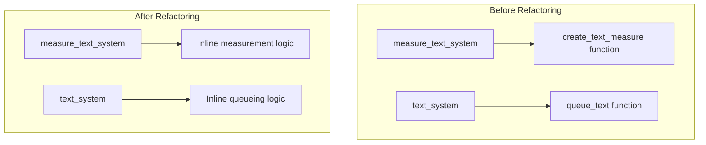

+++
title = "#21630 UI text module refactor"
date = "2025-12-02T00:00:00"
draft = false
template = "pull_request_page.html"
in_search_index = true

[taxonomies]
list_display = ["show"]

[extra]
current_language = "en"
available_languages = {"en" = { name = "English", url = "/pull_request/bevy/2025-12/pr-21630-en-20251202" }, "zh-cn" = { name = "中文", url = "/pull_request/bevy/2025-12/pr-21630-zh-cn-20251202" }}
labels = ["D-Trivial", "A-UI", "C-Code-Quality", "A-Text"]
+++

# UI text module refactor

## Basic Information
- **Title**: UI text module refactor
- **PR Link**: https://github.com/bevyengine/bevy/pull/21630
- **Author**: ickshonpe
- **Status**: MERGED
- **Labels**: D-Trivial, A-UI, C-Code-Quality, S-Ready-For-Final-Review, A-Text
- **Created**: 2025-10-22T20:35:30Z
- **Merged**: 2025-12-02T19:59:11Z
- **Merged By**: cart

## Description Translation
**Objective**

The `measure_text_system` and `text_system` systems don't do anything except iterate a query and then delegate to two other functions, `create_text_measure` and `queue_text`, respectively. This doesn't serve any purpose and just makes these systems harder to understand.

**Solution**

Flatten the module by moving the code from `create_text_measure` and `queue_text` into the systems and remove those functions.

## The Story of This Pull Request

This PR addresses a straightforward code quality issue in Bevy's UI text rendering system. The developer identified unnecessary abstraction in two key systems responsible for text measurement and text queueing. The problem was that these systems were structured as thin wrappers that did little more than iterate through components and call separate helper functions.

Looking at the original code, `measure_text_system` served as a dispatcher that checked certain conditions and then called `create_text_measure`, while `text_system` performed similar dispatching to `queue_text`. This added an extra layer of indirection without providing meaningful abstraction benefits. Each helper function had a long parameter list, making the code harder to follow and debug.

The solution approach was simple and direct: inline the helper functions into their respective systems. This eliminated the unnecessary indirection and made the control flow more linear and easier to understand. The developer recognized that flattening this module would reduce cognitive load for anyone working with the text rendering code.

In the implementation, the developer moved the entire logic from `create_text_measure` into `measure_text_system` and the logic from `queue_text` into `text_system`. Several important changes were made during this refactoring:

1. **Query pattern updates**: The systems were updated to use mutable references (`mut content_size`, `mut text_flags`, etc.) directly in the query pattern instead of using `Mut<T>` wrappers. This change simplifies the code and aligns with Bevy's ECS query patterns.

2. **Control flow restructuring**: The condition checking logic was inverted in both systems. Instead of checking if work should be done and then calling the helper function, the systems now check if work should be *skipped* and use `continue` statements to bypass processing. This makes the main logic path more linear.

3. **Error handling preservation**: All existing error handling was preserved during the inlining process. The `match` statements that handle `TextError` variants remain unchanged, maintaining the same behavior for font loading errors and fatal text processing errors.

4. **Parameter simplification**: By eliminating the helper functions, numerous parameter passing operations were removed. The systems now access resources and components directly through their query parameters rather than passing them through function calls.

The technical insight here is about balancing abstraction against clarity. While helper functions can be useful for separating concerns or reusing code, they become counterproductive when they serve only as pass-through functions. In this case, the helper functions were so tightly coupled to their calling systems that they didn't provide meaningful separation.

The impact of this change is primarily on code maintainability. Developers working on the text rendering system will now see all the logic in one place without having to jump between functions. This makes debugging easier and reduces the mental overhead of understanding the system's control flow. The change doesn't affect runtime performance since it's purely structural - the same operations execute in the same order, just without the function call overhead.

This refactoring also demonstrates good practice in system design within Bevy's ECS architecture. By keeping related logic together and minimizing unnecessary abstraction layers, the code becomes more approachable for contributors who need to understand or modify text rendering behavior.

## Visual Representation



## Key Files Changed

### `crates/bevy_ui/src/widget/text.rs` (+97/-152)

This file contains the core text rendering logic for Bevy's UI system. The changes refactor two main systems to eliminate unnecessary helper functions and flatten the module structure.

**Key modifications:**

1. **Removal of `create_text_measure` function**: The function was completely removed and its logic inlined into `measure_text_system`.

   **Before:**
   ```rust
   #[inline]
   fn create_text_measure<'a>(... very long parameter list ...) {
       match text_pipeline.create_text_measure(...) {
           // ... error handling and logic
       }
   }
   
   pub fn measure_text_system(...) {
       for (...) in &mut text_query {
           if ... condition ... {
               create_text_measure(... all parameters ...);
           }
       }
   }
   ```

   **After:**
   ```rust
   pub fn measure_text_system(...) {
       for (...) in &mut text_query {
           if !(... condition ...) {
               continue;
           }
           
           match text_pipeline.create_text_measure(...) {
               // ... inlined error handling and logic
           }
       }
   }
   ```

2. **Removal of `queue_text` function**: Similarly, this function was removed and its logic inlined into `text_system`.

   **Before:**
   ```rust
   #[inline]
   fn queue_text(... very long parameter list ...) {
       if text_flags.needs_measure_fn {
           return;
       }
       
       // ... complex text queueing logic
   }
   
   pub fn text_system(...) {
       for (entity, node, block, text_layout_info, text_flags, mut computed) in &mut text_query {
           if node.is_changed() || text_flags.needs_recompute {
               queue_text(... all parameters ...);
           }
       }
   }
   ```

   **After:**
   ```rust
   pub fn text_system(...) {
       for (entity, node, block, text_layout_info, mut text_flags, mut computed) in &mut text_query {
           if text_flags.needs_measure_fn {
               continue;
           }
           
           if !(node.is_changed() || text_flags.needs_recompute) {
               continue;
           }
           
           // ... inlined text queueing logic
       }
   }
   ```

3. **Query pattern updates**: Changed from using `Mut<T>` wrappers to mutable references in query patterns.

   **Before:**
   ```rust
   for (entity, block, content_size, text_flags, computed, computed_target, computed_node) in &mut text_query
   ```

   **After:**
   ```rust
   for (
       entity,
       block,
       mut content_size,
       mut text_flags,
       mut computed,
       computed_target,
       computed_node,
   ) in &mut text_query
   ```

These changes relate directly to the PR's purpose of simplifying the module structure by removing unnecessary indirection. The flattened code is easier to follow because all related logic is colocated, and developers don't need to trace through multiple function calls to understand the system's behavior.

## Further Reading

For readers interested in learning more about the concepts demonstrated in this PR:

1. **Bevy ECS Systems**: Understanding how Bevy structures systems and queries is fundamental to working with the engine. The official Bevy ECS guide provides detailed information on system design patterns.

2. **Code Refactoring Techniques**: Martin Fowler's "Refactoring: Improving the Design of Existing Code" covers various refactoring patterns, including "Inline Function" which is similar to what was done in this PR.

3. **Rust Module Design**: The Rust Book's chapter on modules discusses how to organize code effectively, including when to split or combine functionality.

4. **UI Text Rendering in Game Engines**: For context on why text rendering systems are complex, research on font rasterization, glyph atlases, and text layout algorithms provides background on the challenges this code addresses.

5. **Bevy Text Pipeline**: The Bevy documentation on the `TextPipeline` and related components would help understand the broader context of these changes within the engine's text rendering architecture.