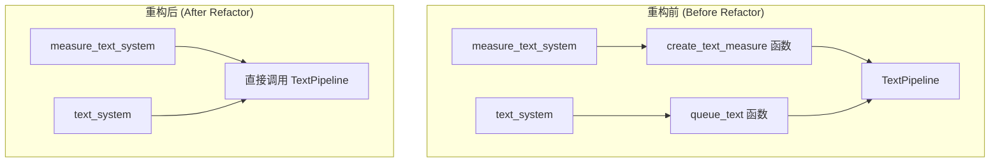

+++
title = "#21630 UI text module refactor"
date = "2025-12-02T00:00:00"
draft = false
template = "pull_request_page.html"
in_search_index = false

[extra]
current_language = "zh-cn"
available_languages = {"en" = { name = "English", url = "/pull_request/bevy/2025-12/pr-21630-en-20251202" }, "zh-cn" = { name = "中文", url = "/pull_request/bevy/2025-12/pr-21630-zh-cn-20251202" }}
labels = ["D-Trivial", "A-UI", "C-Code-Quality", "A-Text"]
+++

# UI text module refactor

## Basic Information
- **Title**: UI text module refactor
- **PR Link**: https://github.com/bevyengine/bevy/pull/21630
- **Author**: ickshonpe
- **Status**: MERGED
- **Labels**: D-Trivial, A-UI, C-Code-Quality, S-Ready-For-Final-Review, A-Text
- **Created**: 2025-10-22T20:35:30Z
- **Merged**: 2025-12-02T19:59:11Z
- **Merged By**: cart

## Description Translation

# Objective

`measure_text_system` 和 `text_system` 这两个系统除了遍历查询（query）并分别委托给另外两个函数 `create_text_measure` 和 `queue_text` 之外，没有做任何其他事情。这没有任何实际用途，只会让这些系统更难理解。

## Solution

通过将 `create_text_measure` 和 `queue_text` 中的代码移入相应的系统，并移除这两个函数，来扁平化（flatten）模块结构。

## The Story of This Pull Request

这个PR的核心是一个直接的代码重构，旨在简化Bevy引擎UI模块中文本处理系统的结构。问题在于现有的 `measure_text_system` 和 `text_system` 这两个系统（system）设计得过于间接。它们的主要作用只是作为包装器，遍历查询结果，然后将所有参数传递给独立的辅助函数 `create_text_measure` 和 `queue_text`。这种设计增加了不必要的抽象层级，使得理解数据流和控制流变得复杂。开发者需要在这三个地方（系统函数和两个辅助函数）之间跳转才能理解完整的逻辑，这降低了代码的可读性和可维护性。

开发者采取的解决方案是代码内联（inlining）。通过将 `create_text_measure` 和 `queue_text` 的函数体直接移动到它们各自被调用的系统函数内部，从而消除这个间接层。这种扁平化处理使得每个系统的逻辑自包含（self-contained），所有相关的状态变更和错误处理都集中在同一个代码块中，更易于跟踪。

具体实现涉及两个主要变更。首先，在 `measure_text_system` 中，原本调用 `create_text_measure` 函数的代码块被替换为该函数体的内容。重构还引入了一个逻辑优化：原函数在满足条件时被调用，重构后改为在**不满足**条件时使用 `continue` 跳过当前迭代，这使逻辑更加清晰。代码直接与 `text_pipeline.create_text_measure` 交互，并根据其返回的 `Result` 来设置 `content_size`（内容尺寸）和更新 `text_flags`（文本标志位）。

其次，在 `text_system` 中，`queue_text` 的函数体被内联。这里也增加了一个早期退出检查（`if text_flags.needs_measure_fn`），这原本在 `queue_text` 函数内部，现在提前到系统循环的开始处，可以避免不必要的后续计算。核心逻辑变为直接调用 `text_pipeline.queue_text` 并处理其结果。一个值得注意的细节是，成功处理文本后，用于更新 `text_layout_info.scale_factor` 和 `size` 的代码现在直接使用系统查询中获取的 `node` 组件数据，而不是通过函数参数传递，这减少了参数传递的复杂度。

从技术角度来看，这次重构并没有改变任何功能或算法，纯粹是代码组织结构（code organization）的优化。它移除了两个仅用作“传递（pass-through）”的辅助函数，减少了模块的总行数（从文件差异可见，+97/-152）。这种重构降低了认知负担（cognitive load），因为开发者现在只需阅读系统函数本身就能理解完整的文本测量和排队逻辑。此外，内联后，与文本处理相关的所有状态突变（如设置 `text_flags.needs_recompute`）都发生在同一个作用域内，使得数据流（data flow）更加明显，有助于防止因状态更新遗漏或顺序错误而导致的bug。

这次改动的影响是积极的，它使代码库更加整洁，符合保持代码简单直接（keeping code simple and straightforward）的工程原则。对于Bevy这样一个游戏引擎项目，确保核心系统易于理解和调试至关重要。从这次重构中可以学到，当辅助函数除了转发参数外没有其他明确职责（如复用逻辑、提供不同接口）时，将其内联到调用方通常是更好的选择，这能减少不必要的抽象并提高代码的透明度。

## Visual Representation



## Key Files Changed

**crates/bevy_ui/src/widget/text.rs** (+97/-152)
这是此PR中唯一被修改的文件。改动主要包括删除两个独立的辅助函数（`create_text_measure` 和 `queue_text`），并将它们的逻辑直接内联到对应的系统函数（`measure_text_system` 和 `text_system`）中。这使得代码逻辑更加集中，减少了不必要的间接调用层。

关键修改示例：

1. **`measure_text_system` 的重构**：
   - 之前：系统遍历查询，在条件满足时调用 `create_text_measure` 辅助函数。
   - 之后：系统包含所有逻辑，直接处理 `text_pipeline.create_text_measure` 的调用和结果。

```rust
// 重构前（简化示意）：
for ... in &mut text_query {
    if condition {
        create_text_measure(entity, fonts, ..., &mut text_pipeline, content_size, text_flags, computed, ...);
    }
}

// 重构后（关键部分）：
for (..., mut content_size, mut text_flags, mut computed, ...) in &mut text_query {
    if !condition {
        continue;
    }
    match text_pipeline.create_text_measure(entity, fonts.as_ref(), ..., &block, computed.as_mut(), ...) {
        Ok(measure) => {
            // 直接设置 content_size 和 text_flags
            if block.linebreak == LineBreak::NoWrap {
                content_size.set(NodeMeasure::Fixed(FixedMeasure { size: measure.max }));
            } else {
                content_size.set(NodeMeasure::Text(TextMeasure { info: measure }));
            }
            text_flags.needs_measure_fn = false;
            text_flags.needs_recompute = true;
        }
        Err(TextError::NoSuchFont) => {
            text_flags.needs_measure_fn = true;
        }
        // ... 其他错误处理
    }
}
```

2. **`text_system` 的重构**：
   - 之前：系统调用 `queue_text` 辅助函数。
   - 之后：系统直接包含排队逻辑和错误处理。

```rust
// 重构后逻辑的核心部分：
for (entity, node, block, text_layout_info, mut text_flags, mut computed) in &mut text_query {
    if text_flags.needs_measure_fn {
        continue;
    }
    if !(node.is_changed() || text_flags.needs_recompute) {
        continue;
    }

    let physical_node_size = ...; // 直接计算
    let text_layout_info = text_layout_info.into_inner();
    match text_pipeline.queue_text(text_layout_info, &fonts, ..., &mut computed, ...) {
        Ok(()) => {
            // 直接更新 text_layout_info 和 flags
            text_layout_info.scale_factor = node.inverse_scale_factor.recip();
            text_layout_info.size *= node.inverse_scale_factor;
            text_flags.needs_recompute = false;
        }
        // ... 错误处理
    }
}
```

3. **被移除的函数**：
   文件中原有的 `create_text_measure` 和 `queue_text` 函数定义被完全删除。

## Further Reading

- **Bevy ECS 官方手册 - 系统（Systems）**: https://bevyengine.org/learn/book/next/programming/ecs/systems 有助于理解 `measure_text_system` 和 `text_system` 在 Bevy 的实体组件系统（ECS）架构中的角色。
- **代码重构：内联函数（Inline Method）**: 这是 Martin Fowler 在《重构：改善既有代码的设计》中提出的一个经典重构手法。此PR是此手法的一个典型应用场景。
- **Rust 编程语言：闭包与代码组织**: 虽然此PR没有使用闭包，但理解何时将代码组织为独立函数、何时内联，是编写清晰 Rust 代码的重要部分。Rust 官方教程中关于函数和模块的章节提供了基础。

# Full Code Diff
diff --git a/crates/bevy_ui/src/widget/text.rs b/crates/bevy_ui/src/widget/text.rs
index d604bc6977cd9..c84b463ddf3cb 100644
--- a/crates/bevy_ui/src/widget/text.rs
+++ b/crates/bevy_ui/src/widget/text.rs
@@ -12,7 +12,7 @@ use bevy_ecs::{
     query::With,
     reflect::ReflectComponent,
     system::{Query, Res, ResMut},
-    world::{Mut, Ref},
+    world::Ref,
 };
 use bevy_image::prelude::*;
 use bevy_math::Vec2;
@@ -223,55 +223,6 @@ impl Measure for TextMeasure {
     }
 }
 
-#[inline]
-fn create_text_measure<'a>(
-    entity: Entity,
-    fonts: &Assets<Font>,
-    scale_factor: f64,
-    spans: impl Iterator<Item = (Entity, usize, &'a str, &'a TextFont, Color, LineHeight)>,
-    block: Ref<TextLayout>,
-    text_pipeline: &mut TextPipeline,
-    mut content_size: Mut<ContentSize>,
-    mut text_flags: Mut<TextNodeFlags>,
-    mut computed: Mut<ComputedTextBlock>,
-    font_system: &mut CosmicFontSystem,
-) {
-    match text_pipeline.create_text_measure(
-        entity,
-        fonts,
-        spans,
-        scale_factor,
-        &block,
-        computed.as_mut(),
-        font_system,
-    ) {
-        Ok(measure) => {
-            if block.linebreak == LineBreak::NoWrap {
-                content_size.set(NodeMeasure::Fixed(FixedMeasure { size: measure.max }));
-            } else {
-                content_size.set(NodeMeasure::Text(TextMeasure { info: measure }));
-            }
-
-            // Text measure func created successfully, so set `TextNodeFlags` to schedule a recompute
-            text_flags.needs_measure_fn = false;
-            text_flags.needs_recompute = true;
-        }
-        Err(TextError::NoSuchFont) => {
-            // Try again next frame
-            text_flags.needs_measure_fn = true;
-        }
-        Err(
-            e @ (TextError::FailedToAddGlyph(_)
-            | TextError::FailedToGetGlyphImage(_)
-            | TextError::MissingAtlasLayout
-            | TextError::MissingAtlasTexture
-            | TextError::InconsistentAtlasState),
-        ) => {
-            panic!("Fatal error when processing text: {e}.");
-        }
-    };
-}
-
 /// Generates a new [`Measure`] for a text node on changes to its [`Text`] component.
 ///
 /// A `Measure` is used by the UI's layout algorithm to determine the appropriate amount of space
@@ -300,98 +251,61 @@ pub fn measure_text_system(
     mut text_pipeline: ResMut<TextPipeline>,
     mut font_system: ResMut<CosmicFontSystem>,
 ) {
-    for (entity, block, content_size, text_flags, computed, computed_target, computed_node) in
-        &mut text_query
+    for (
+        entity,
+        block,
+        mut content_size,
+        mut text_flags,
+        mut computed,
+        computed_target,
+        computed_node,
+    ) in &mut text_query
     {
         // Note: the ComputedTextBlock::needs_rerender bool is cleared in create_text_measure().
         // 1e-5 epsilon to ignore tiny scale factor float errors
-        if 1e-5
+        if !(1e-5
             < (computed_target.scale_factor() - computed_node.inverse_scale_factor.recip()).abs()
             || computed.needs_rerender()
             || text_flags.needs_measure_fn
-            || content_size.is_added()
+            || content_size.is_added())
         {
-            create_text_measure(
-                entity,
-                &fonts,
-                computed_target.scale_factor.into(),
-                text_reader.iter(entity),
-                block,
-                &mut text_pipeline,
-                content_size,
-                text_flags,
-                computed,
-                &mut font_system,
-            );
+            continue;
         }
-    }
-}
-
-#[inline]
-fn queue_text(
-    entity: Entity,
-    fonts: &Assets<Font>,
-    text_pipeline: &mut TextPipeline,
-    font_atlas_set: &mut FontAtlasSet,
-    texture_atlases: &mut Assets<TextureAtlasLayout>,
-    textures: &mut Assets<Image>,
-    scale_factor: f32,
-    inverse_scale_factor: f32,
-    block: &TextLayout,
-    node: Ref<ComputedNode>,
-    mut text_flags: Mut<TextNodeFlags>,
-    text_layout_info: Mut<TextLayoutInfo>,
-    computed: &mut ComputedTextBlock,
-    text_reader: &mut TextUiReader,
-    font_system: &mut CosmicFontSystem,
-    swash_cache: &mut SwashCache,
-) {
-    // Skip the text node if it is waiting for a new measure func
-    if text_flags.needs_measure_fn {
-        return;
-    }
 
-    let physical_node_size = if block.linebreak == LineBreak::NoWrap {
-        // With `NoWrap` set, no constraints are placed on the width of the text.
-        TextBounds::UNBOUNDED
-    } else {
-        // `scale_factor` is already multiplied by `UiScale`
-        TextBounds::new(node.unrounded_size.x, node.unrounded_size.y)
-    };
+        match text_pipeline.create_text_measure(
+            entity,
+            fonts.as_ref(),
+            text_reader.iter(entity),
+            computed_target.scale_factor.into(),
+            &block,
+            computed.as_mut(),
+            &mut font_system,
+        ) {
+            Ok(measure) => {
+                if block.linebreak == LineBreak::NoWrap {
+                    content_size.set(NodeMeasure::Fixed(FixedMeasure { size: measure.max }));
+                } else {
+                    content_size.set(NodeMeasure::Text(TextMeasure { info: measure }));
+                }
 
-    let text_layout_info = text_layout_info.into_inner();
-    match text_pipeline.queue_text(
-        text_layout_info,
-        fonts,
-        text_reader.iter(entity),
-        scale_factor.into(),
-        block,
-        physical_node_size,
-        font_atlas_set,
-        texture_atlases,
-        textures,
-        computed,
-        font_system,
-        swash_cache,
-    ) {
-        Err(TextError::NoSuchFont) => {
-            // There was an error processing the text layout, try again next frame
-            text_flags.needs_recompute = true;
-        }
-        Err(
-            e @ (TextError::FailedToAddGlyph(_)
-            | TextError::FailedToGetGlyphImage(_)
-            | TextError::MissingAtlasLayout
-            | TextError::MissingAtlasTexture
-            | TextError::InconsistentAtlasState),
-        ) => {
-            panic!("Fatal error when processing text: {e}.");
-        }
-        Ok(()) => {
-            text_layout_info.scale_factor = scale_factor;
-            text_layout_info.size *= inverse_scale_factor;
-            text_flags.needs_recompute = false;
-        }
+                // Text measure func created successfully, so set `TextNodeFlags` to schedule a recompute
+                text_flags.needs_measure_fn = false;
+                text_flags.needs_recompute = true;
+            }
+            Err(TextError::NoSuchFont) => {
+                // Try again next frame
+                text_flags.needs_measure_fn = true;
+            }
+            Err(
+                e @ (TextError::FailedToAddGlyph(_)
+                | TextError::FailedToGetGlyphImage(_)
+                | TextError::MissingAtlasLayout
+                | TextError::MissingAtlasTexture
+                | TextError::InconsistentAtlasState),
+            ) => {
+                panic!("Fatal error when processing text: {e}.");
+            }
+        };
     }
 }
 
@@ -421,26 +335,57 @@ pub fn text_system(
     mut font_system: ResMut<CosmicFontSystem>,
     mut swash_cache: ResMut<SwashCache>,
 ) {
-    for (entity, node, block, text_layout_info, text_flags, mut computed) in &mut text_query {
-        if node.is_changed() || text_flags.needs_recompute {
-            queue_text(
-                entity,
-                &fonts,
-                &mut text_pipeline,
-                &mut font_atlas_set,
-                &mut texture_atlases,
-                &mut textures,
-                node.inverse_scale_factor.recip(),
-                node.inverse_scale_factor,
-                block,
-                node,
-                text_flags,
-                text_layout_info,
-                computed.as_mut(),
-                &mut text_reader,
-                &mut font_system,
-                &mut swash_cache,
-            );
+    for (entity, node, block, text_layout_info, mut text_flags, mut computed) in &mut text_query {
+        // Skip the text node if it is waiting for a new measure func
+        if text_flags.needs_measure_fn {
+            continue;
+        }
+
+        if !(node.is_changed() || text_flags.needs_recompute) {
+            continue;
+        }
+
+        let physical_node_size = if block.linebreak == LineBreak::NoWrap {
+            // With `NoWrap` set, no constraints are placed on the width of the text.
+            TextBounds::UNBOUNDED
+        } else {
+            // `scale_factor` is already multiplied by `UiScale`
+            TextBounds::new(node.unrounded_size.x, node.unrounded_size.y)
+        };
+
+        let text_layout_info = text_layout_info.into_inner();
+        match text_pipeline.queue_text(
+            text_layout_info,
+            &fonts,
+            text_reader.iter(entity),
+            node.inverse_scale_factor.recip() as f64,
+            block,
+            physical_node_size,
+            &mut font_atlas_set,
+            &mut texture_atlases,
+            &mut textures,
+            &mut computed,
+            &mut font_system,
+            &mut swash_cache,
+        ) {
+            Err(TextError::NoSuchFont) => {
+                // There was an error processing the text layout, try again next frame
+                text_flags.needs_recompute = true;
+            }
+            Err(
+                e @ (TextError::FailedToAddGlyph(_)
+                | TextError::FailedToGetGlyphImage(_)
+                | TextError::MissingAtlasLayout
+                | TextError::MissingAtlasTexture
+                | TextError::InconsistentAtlasState),
+            ) => {
+                panic!("Fatal error when processing text: {e}.");
+            }
+            Ok(()) => {
+                text_layout_info.scale_factor = node.inverse_scale_factor.recip();
+                text_layout_info.size *= node.inverse_scale_factor;
+                text_flags.needs_recompute = false;
+            }
         }
     }
 }