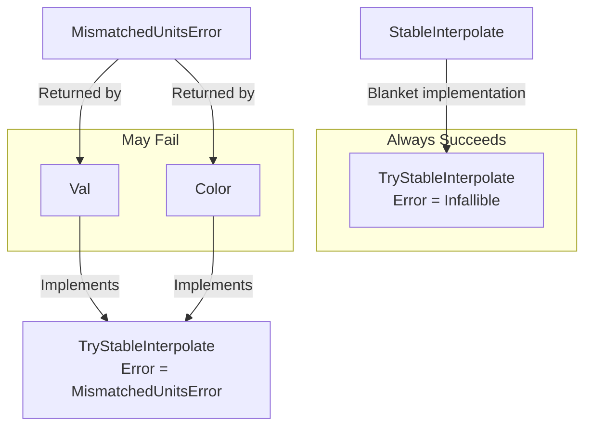

+++
title = "#21633 Implement `TryStableInterpolate`."
date = "2025-12-16T00:00:00"
draft = false
template = "pull_request_page.html"
in_search_index = true

[taxonomies]
list_display = ["show"]

[extra]
current_language = "en"
available_languages = {"en" = { name = "English", url = "/pull_request/bevy/2025-12/pr-21633-en-20251216" }, "zh-cn" = { name = "中文", url = "/pull_request/bevy/2025-12/pr-21633-zh-cn-20251216" }}
labels = ["C-Feature", "A-UI", "A-Animation", "A-Math"]
+++

# Title

## Basic Information
- **Title**: Implement `TryStableInterpolate`.
- **PR Link**: https://github.com/bevyengine/bevy/pull/21633
- **Author**: viridia
- **Status**: MERGED
- **Labels**: C-Feature, A-UI, S-Ready-For-Final-Review, A-Animation, A-Math
- **Created**: 2025-10-23T03:31:08Z
- **Merged**: 2025-12-16T05:43:14Z
- **Merged By**: alice-i-cecile

## Description Translation
Fixes: #20579

## Testing

- Doc test
- Also tested extensively in a separate repo, however that code was not carried over (yet).

Note: Because docs.rs was down, I could not validate the doc link urls.

## The Story of This Pull Request

### The Problem and Context
The Bevy engine's animation system needed a way to handle interpolation between values that might not always be compatible. The existing `StableInterpolate` trait worked well for numeric types and simple structs, but it couldn't handle types like `Val` from `bevy_ui` or `Color` from `bevy_color` when they represented different units or color spaces. 

For `Val`, which represents different measurement units (pixels, percentages, viewport units, etc.), interpolating between `Val::Px(10)` and `Val::Percent(50)` doesn't make mathematical sense. Similarly for `Color`, which has multiple color space representations (RGB, HSL, Lab, etc.), interpolating between different color spaces requires conversion that might be expensive or produce unexpected results.

Issue #20579 highlighted this limitation, where developers wanted to animate UI elements but couldn't use the existing interpolation infrastructure because `Val` didn't implement `StableInterpolate`. The challenge was to provide a way to attempt interpolation that could gracefully handle incompatible cases.

### The Solution Approach
The solution introduced a new trait called `TryStableInterpolate` that provides fallible interpolation. Instead of requiring all interpolations to succeed, this trait returns a `Result` that can indicate when interpolation fails due to incompatible units or representations. This approach has several advantages:

1. It allows animation systems to attempt interpolation and handle failure gracefully
2. It provides a clear boundary between always-interpolable types and conditionally-interpolable types
3. It maintains backward compatibility through a blanket implementation for existing `StableInterpolate` types

The key insight was that animation systems don't necessarily need all interpolations to succeed. When interpolation fails, the system can simply "snap" to the target value, which is often acceptable behavior for UI animations and transitions.

### The Implementation
The implementation consists of three main parts:

First, in `bevy_math`, the new `TryStableInterpolate` trait is defined:

```rust
pub trait TryStableInterpolate: Clone {
    type Error;
    fn try_interpolate_stable(&self, other: &Self, t: f32) -> Result<Self, Self::Error>;
}
```

A blanket implementation is provided for all types that already implement `StableInterpolate`:

```rust
impl<T: StableInterpolate> TryStableInterpolate for T {
    type Error = Infallible;
    fn try_interpolate_stable(&self, other: &Self, t: f32) -> Result<Self, Self::Error> {
        Ok(self.interpolate_stable(other, t))
    }
}
```

This ensures that all existing code using `StableInterpolate` automatically gets a `TryStableInterpolate` implementation that never fails.

Second, the `Val` type in `bevy_ui` gets an implementation that only succeeds when both values use the same unit:

```rust
impl TryStableInterpolate for Val {
    type Error = MismatchedUnitsError;

    fn try_interpolate_stable(&self, other: &Self, t: f32) -> Result<Self, Self::Error> {
        match (self, other) {
            (Val::Px(a), Val::Px(b)) => Ok(Val::Px(a.interpolate_stable(b, t))),
            (Val::Percent(a), Val::Percent(b)) => Ok(Val::Percent(a.interpolate_stable(b, t))),
            // ... other unit matches
            _ => Err(MismatchedUnitsError),
        }
    }
}
```

This pattern ensures type safety by checking at runtime that both values are in compatible units before attempting interpolation.

Third, the `Color` type gets a similar implementation that only interpolates within the same color space:

```rust
impl TryStableInterpolate for Color {
    type Error = MismatchedUnitsError;

    fn try_interpolate_stable(&self, other: &Self, t: f32) -> Result<Self, Self::Error> {
        match (self, other) {
            (Color::Srgba(a), Color::Srgba(b)) => Ok(Color::Srgba(a.mix(b, t))),
            (Color::LinearRgba(a), Color::LinearRgba(b)) => Ok(Color::LinearRgba(a.mix(b, t))),
            // ... other color space matches
            _ => Err(MismatchedUnitsError),
        }
    }
}
```

### Technical Insights
The design uses Rust's type system effectively. The `MismatchedUnitsError` type provides a clear error case without requiring complex error hierarchies. Using `Infallible` for the blanket implementation ensures that types implementing `StableInterpolate` can be used in contexts expecting `TryStableInterpolate` without any runtime overhead for error checking.

The match statement pattern in the implementations for `Val` and `Color` is verbose but provides compile-time safety that all variants are handled. This approach is more maintainable than trying to use a generic conversion approach that might have subtle bugs.

One important design decision was to not automatically convert between different units or color spaces. While Bevy's `Color` type has mixing methods that can convert between color spaces, those conversions are expensive and can produce unexpected visual results. The `TryStableInterpolate` implementation takes a more conservative approach, requiring explicit conversion by the caller if needed.

### The Impact
This change enables UI animations that were previously impossible. Animation systems can now attempt to interpolate `Val` values and gracefully handle cases where interpolation fails. This is particularly useful for responsive UI design where elements might switch between different measurement units based on screen size.

The implementation also sets a pattern for handling fallible operations in Bevy's trait system. Other areas of the codebase could adopt similar patterns for operations that might fail under certain conditions.

From a performance perspective, the match statement overhead is minimal, and the blanket implementation for `StableInterpolate` types has zero runtime cost since it uses `Infallible`. This makes the trait suitable for use in performance-critical animation systems.

## Visual Representation



## Key Files Changed

### `crates/bevy_math/src/common_traits.rs` (+53/-1)
This file defines the new `TryStableInterpolate` trait and provides the blanket implementation for `StableInterpolate` types. The key addition is:

```rust
pub trait TryStableInterpolate: Clone {
    type Error;
    fn try_interpolate_stable(&self, other: &Self, t: f32) -> Result<Self, Self::Error>;
}

impl<T: StableInterpolate> TryStableInterpolate for T {
    type Error = Infallible;
    fn try_interpolate_stable(&self, other: &Self, t: f32) -> Result<Self, Self::Error> {
        Ok(self.interpolate_stable(other, t))
    }
}
```

### `crates/bevy_ui/src/geometry.rs` (+25/-1)
This file implements `TryStableInterpolate` for the `Val` enum. The implementation checks that both values use the same unit before interpolating:

```rust
impl TryStableInterpolate for Val {
    type Error = MismatchedUnitsError;

    fn try_interpolate_stable(&self, other: &Self, t: f32) -> Result<Self, Self::Error> {
        match (self, other) {
            (Val::Px(a), Val::Px(b)) => Ok(Val::Px(a.interpolate_stable(b, t))),
            (Val::Percent(a), Val::Percent(b)) => Ok(Val::Percent(a.interpolate_stable(b, t))),
            (Val::Vw(a), Val::Vw(b)) => Ok(Val::Vw(a.interpolate_stable(b, t))),
            (Val::Vh(a), Val::Vh(b)) => Ok(Val::Vh(a.interpolate_stable(b, t))),
            (Val::VMin(a), Val::VMin(b)) => Ok(Val::VMin(a.interpolate_stable(b, t))),
            (Val::VMax(a), Val::VMax(b)) => Ok(Val::VMax(a.interpolate_stable(b, t))),
            (Val::Auto, Val::Auto) => Ok(Val::Auto),
            _ => Err(MismatchedUnitsError),
        }
    }
}
```

### `crates/bevy_color/src/color.rs` (+21/-0)
This file implements `TryStableInterpolate` for the `Color` enum. Similar to `Val`, it only interpolates within the same color space:

```rust
impl TryStableInterpolate for Color {
    type Error = MismatchedUnitsError;

    fn try_interpolate_stable(&self, other: &Self, t: f32) -> Result<Self, Self::Error> {
        match (self, other) {
            (Color::Srgba(a), Color::Srgba(b)) => Ok(Color::Srgba(a.mix(b, t))),
            (Color::LinearRgba(a), Color::LinearRgba(b)) => Ok(Color::LinearRgba(a.mix(b, t))),
            (Color::Hsla(a), Color::Hsla(b)) => Ok(Color::Hsla(a.mix(b, t))),
            (Color::Hsva(a), Color::Hsva(b)) => Ok(Color::Hsva(a.mix(b, t))),
            (Color::Hwba(a), Color::Hwba(b)) => Ok(Color::Hwba(a.mix(b, t))),
            (Color::Laba(a), Color::Laba(b)) => Ok(Color::Laba(a.mix(b, t))),
            (Color::Lcha(a), Color::Lcha(b)) => Ok(Color::Lcha(a.mix(b, t))),
            (Color::Oklaba(a), Color::Oklaba(b)) => Ok(Color::Oklaba(a.mix(b, t))),
            (Color::Oklcha(a), Color::Oklcha(b)) => Ok(Color::Oklcha(a.mix(b, t))),
            (Color::Xyza(a), Color::Xyza(b)) => Ok(Color::Xyza(a.mix(b, t))),
            _ => Err(MismatchedUnitsError),
        }
    }
}
```

### `release-content/release-notes/fallible_interpolation.md` (+26/-0)
This file adds release notes documenting the new feature:

```markdown
---
title: Fallible Interpolation
authors: ["@viridia"]
pull_requests: [21633]
---

## Fallible Interpolation

The `StableInterpolate` trait is great, but sadly there's one important type that it doesn't work
with: The `Val` type from `bevy_ui`. The reason is that `Val` is an enum, representing different
length units such as pixels and percentages, and it's not generally possible or even meaningful to
try and interpolate between different units.

However, the use cases for wanting to animate `Val` don't require mixing units: often we just want
to slide or stretch the length of a widget such as a toggle switch. We can do this so long as we
check at runtime that both interpolation control points are in the same units.

The new `TryStableInterpolate` trait introduces the idea of interpolation that can fail, by returning
a `Result`. Note that "failure" in this case is not necessarily bad: it just means that the
animation player will need to modify the parameter in some other way, such as "snapping" or
"jumping" to the new keyframe without smoothly interpolating. This lets us create complex animations
that incorporate both kinds of parameters: ones that interpolate, and ones that don't.

There's a blanket implementation of `TryStableInterpolate` for all types that impl
`StableInterpolate`, and these can never fail. There are additional impls for `Color` and `Val`
which can fail if the control points are not in the same units / color space.
```

## Further Reading

1. [Rust Book: Error Handling](https://doc.rust-lang.org/book/ch09-00-error-handling.html) - For understanding the `Result` type and error handling patterns used in this PR
2. [Rust Reference: Blanket Implementations](https://doc.rust-lang.org/reference/items/implementations.html#blanket-implementations) - For understanding how the blanket implementation for `StableInterpolate` types works
3. [Bevy Animation System Documentation](https://bevyengine.org/learn/book/next/animations/) - For context on how this trait fits into Bevy's animation system
4. [Bevy UI System](https://bevyengine.org/learn/book/next/ui/) - For understanding the `Val` type and UI layout system