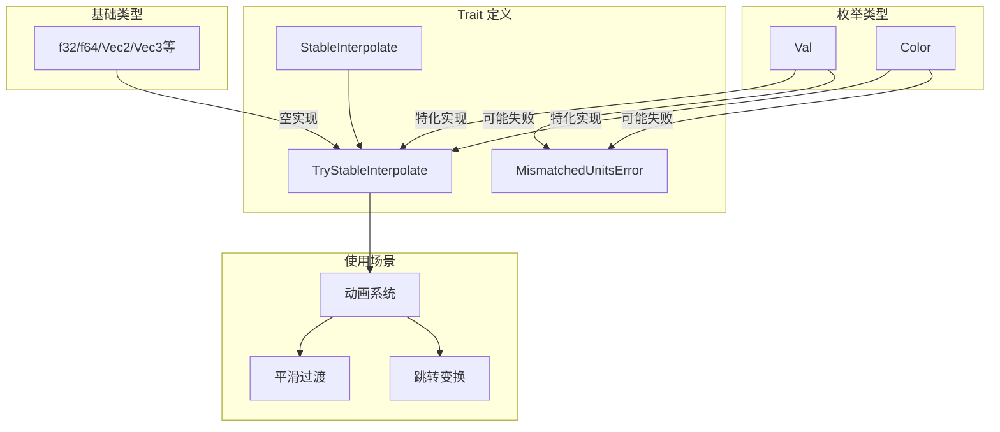

+++
title = "#21633 Implement `TryStableInterpolate`."
date = "2025-12-16T00:00:00"
draft = false
template = "pull_request_page.html"
in_search_index = false

[extra]
current_language = "zh-cn"
available_languages = {"en" = { name = "English", url = "/pull_request/bevy/2025-12/pr-21633-en-20251216" }, "zh-cn" = { name = "中文", url = "/pull_request/bevy/2025-12/pr-21633-zh-cn-20251216" }}
+++

# Title

## 基本信息
- **标题**: Implement `TryStableInterpolate`.
- **PR 链接**: https://github.com/bevyengine/bevy/pull/21633
- **作者**: viridia
- **状态**: 已合并
- **标签**: C-Feature, A-UI, S-Ready-For-Final-Review, A-Animation, A-Math
- **创建时间**: 2025-10-23T03:31:08Z
- **合并时间**: 2025-12-16T05:43:14Z
- **合并者**: alice-i-cecile

## 描述翻译
修复: #20579

## 测试
- 文档测试
- 在单独的仓库中也进行了广泛测试，但该代码尚未移植过来。

注意：由于 docs.rs 服务中断，我无法验证文档链接的 URL。

## 本 PR 的技术分析

这个 PR 的核心是解决一个具体的工程问题：如何在类型系统中优雅地处理可能失败的插值操作。现有的 `StableInterpolate` trait 为许多数学类型提供了稳定的插值功能，但当遇到像 `Val`（UI 值类型）或 `Color`（颜色类型）这样的枚举时，简单的插值可能没有意义或会产生意料之外的结果。

问题的关键在于 `Val` 枚举包含不同的单位变体（如像素 `Px`、百分比 `Percent` 等），而 `Color` 枚举包含不同的色彩空间变体（如 `Srgba`、`LinearRgba` 等）。在这些枚举内部，只有相同变体之间的插值才是直接且有意义的。例如，从 `Val::Px(10.0)` 到 `Val::Px(20.0)` 的线性插值得到 `Val::Px(15.0)` 是合理的，但从 `Val::Px(10.0)` 到 `Val::Percent(50.0)` 的插值则没有明确的定义。

开发者采用了"可失败插值"的设计模式来解决这个问题。这种模式在动画系统中特别有用：当插值可行时，系统可以进行平滑过渡；当插值不可行时，系统可以优雅地回退到"跳转"到目标值，而不是强制进行无意义的插值。

实现上，这个 PR 在 `bevy_math` crate 中新增了 `TryStableInterpolate` trait 和 `MismatchedUnitsError` 错误类型：

```rust
pub trait TryStableInterpolate: Clone {
    type Error;
    fn try_interpolate_stable(&self, other: &Self, t: f32) -> Result<Self, Self::Error>;
}

#[derive(Clone, Debug, Error)]
#[error("cannot interpolate between two values of different units")]
pub struct MismatchedUnitsError;
```

这个 trait 的设计巧妙之处在于它的通用性。通过为所有实现了 `StableInterpolate` 的类型提供空实现（blanket implementation），确保了向后兼容性：

```rust
impl<T: StableInterpolate> TryStableInterpolate for T {
    type Error = Infallible;
    fn try_interpolate_stable(&self, other: &Self, t: f32) -> Result<Self, Self::Error> {
        Ok(self.interpolate_stable(other, t))
    }
}
```

对于 `Val` 类型，实现检查了两个值是否为相同的变体，只有在匹配时才进行内部值的插值：

```rust
impl TryStableInterpolate for Val {
    type Error = MismatchedUnitsError;

    fn try_interpolate_stable(&self, other: &Self, t: f32) -> Result<Self, Self::Error> {
        match (self, other) {
            (Val::Px(a), Val::Px(b)) => Ok(Val::Px(a.interpolate_stable(b, t))),
            (Val::Percent(a), Val::Percent(b)) => Ok(Val::Percent(a.interpolate_stable(b, t))),
            // ... 其他变体的匹配
            _ => Err(MismatchedUnitsError),
        }
    }
}
```

`Color` 类型的实现遵循类似的模式，但有一个重要的设计决策：它明确避免了不同色彩空间之间的自动转换。虽然 `Color` 类型本身提供了在不同色彩空间之间混合的方法（通过 `Mix` trait），但这种转换可能代价较高且结果复杂。`TryStableInterpolate` 的实现更加保守，只允许在相同色彩空间内进行插值，从而提供更可预测的性能表现。

从工程角度看，这个实现体现了几个良好的设计原则：

1. **关注点分离**：将"可失败"的插值逻辑从基础的插值逻辑中分离出来
2. **渐进增强**：通过空实现确保现有代码不受影响
3. **显式错误处理**：使用 `Result` 类型强制调用者处理可能的失败情况
4. **类型安全**：在编译时确保错误类型与实现匹配

这种设计允许动画系统构建复杂的动画轨道，其中一些参数可以平滑插值，而另一些参数则可以在无法插值时直接跳转到目标值。例如，一个切换开关的动画可以平滑地改变其宽度（当宽度值使用相同单位时），同时立即改变其颜色（如果颜色空间不匹配）。

## 视觉表示



## 主要文件变更

### `crates/bevy_math/src/common_traits.rs` (+53/-1)
这个文件新增了 `TryStableInterpolate` trait 的定义和基础实现。

关键变化：
```rust
// 新增错误类型
#[derive(Clone, Debug, Error)]
#[error("cannot interpolate between two values of different units")]
pub struct MismatchedUnitsError;

// 新增 trait 定义
pub trait TryStableInterpolate: Clone {
    type Error;
    fn try_interpolate_stable(&self, other: &Self, t: f32) -> Result<Self, Self::Error>;
}

// 为所有 StableInterpolate 类型提供空实现
impl<T: StableInterpolate> TryStableInterpolate for T {
    type Error = Infallible;
    fn try_interpolate_stable(&self, other: &Self, t: f32) -> Result<Self, Self::Error> {
        Ok(self.interpolate_stable(other, t))
    }
}
```

### `crates/bevy_ui/src/geometry.rs` (+25/-1)
为 `Val` 枚举实现了 `TryStableInterpolate` trait，仅允许相同单位变体之间的插值。

关键变化：
```rust
impl TryStableInterpolate for Val {
    type Error = MismatchedUnitsError;

    fn try_interpolate_stable(&self, other: &Self, t: f32) -> Result<Self, Self::Error> {
        match (self, other) {
            (Val::Px(a), Val::Px(b)) => Ok(Val::Px(a.interpolate_stable(b, t))),
            (Val::Percent(a), Val::Percent(b)) => Ok(Val::Percent(a.interpolate_stable(b, t))),
            (Val::Vw(a), Val::Vw(b)) => Ok(Val::Vw(a.interpolate_stable(b, t))),
            (Val::Vh(a), Val::Vh(b)) => Ok(Val::Vh(a.interpolate_stable(b, t))),
            (Val::VMin(a), Val::VMin(b)) => Ok(Val::VMin(a.interpolate_stable(b, t))),
            (Val::VMax(a), Val::VMax(b)) => Ok(Val::VMax(a.interpolate_stable(b, t))),
            (Val::Auto, Val::Auto) => Ok(Val::Auto),
            _ => Err(MismatchedUnitsError),
        }
    }
}
```

### `crates/bevy_color/src/color.rs` (+21/-0)
为 `Color` 枚举实现了 `TryStableInterpolate` trait，仅允许相同色彩空间变体之间的插值。

关键变化：
```rust
impl TryStableInterpolate for Color {
    type Error = MismatchedUnitsError;

    fn try_interpolate_stable(&self, other: &Self, t: f32) -> Result<Self, Self::Error> {
        match (self, other) {
            (Color::Srgba(a), Color::Srgba(b)) => Ok(Color::Srgba(a.mix(b, t))),
            (Color::LinearRgba(a), Color::LinearRgba(b)) => Ok(Color::LinearRgba(a.mix(b, t))),
            (Color::Hsla(a), Color::Hsla(b)) => Ok(Color::Hsla(a.mix(b, t))),
            // ... 其他色彩空间的匹配
            _ => Err(MismatchedUnitsError),
        }
    }
}
```

### `release-content/release-notes/fallible_interpolation.md` (+26/-0)
新增发布说明文档，解释了 `TryStableInterpolate` trait 的设计动机和使用场景。

## 延伸阅读

1. **Rust 错误处理模式**：[The Rust Book - Error Handling](https://doc.rust-lang.org/book/ch09-00-error-handling.html)
2. **Trait 设计和空实现**：[The Rust Reference - Blanket Implementations](https://doc.rust-lang.org/reference/items/implementations.html#blanket-implementations)
3. **Bevy 动画系统**：[Bevy Engine - Animation](https://bevyengine.org/learn/book/features/animation/)
4. **插值算法**：[Wikipedia - Interpolation](https://en.wikipedia.org/wiki/Interpolation)