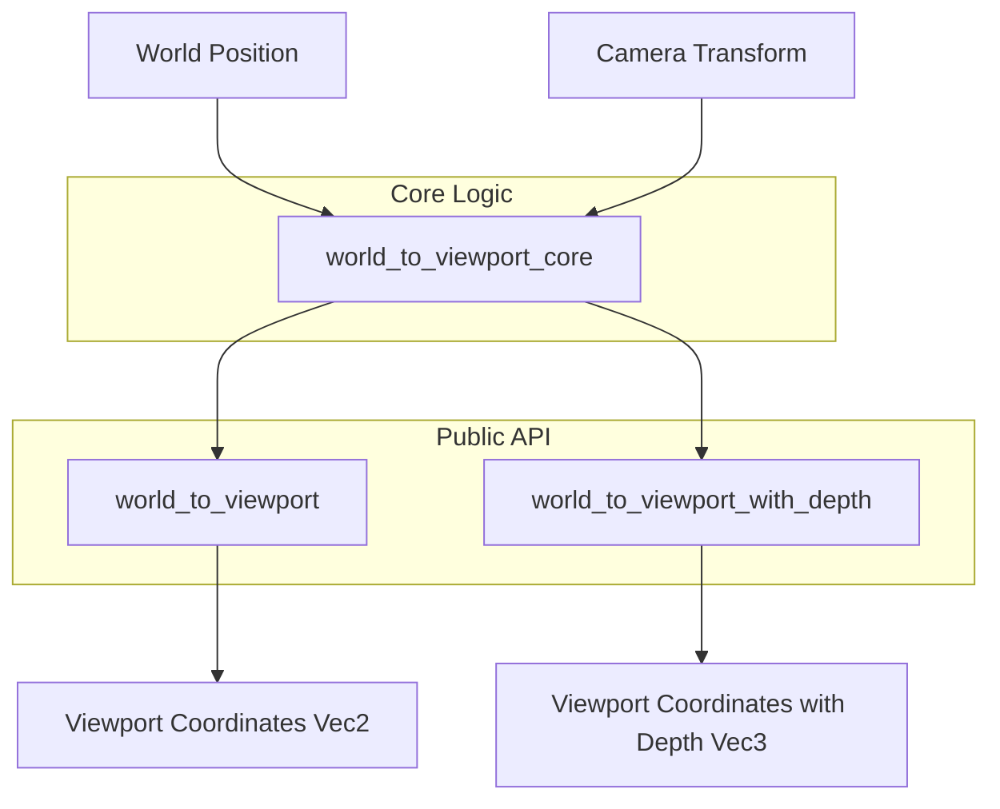

+++
title = "#21715 Deduplicate world_to_view logic"
date = "2025-12-16T00:00:00"
draft = false
template = "pull_request_page.html"
in_search_index = true

[taxonomies]
list_display = ["show"]

[extra]
current_language = "en"
available_languages = {"en" = { name = "English", url = "/pull_request/bevy/2025-12/pr-21715-en-20251216" }, "zh-cn" = { name = "中文", url = "/pull_request/bevy/2025-12/pr-21715-zh-cn-20251216" }}
labels = ["C-Code-Quality", "X-Contentious", "D-Straightforward", "A-Camera"]
+++

# Title: Deduplicate world_to_view logic

## Basic Information
- **Title**: Deduplicate world_to_view logic
- **PR Link**: https://github.com/bevyengine/bevy/pull/21715
- **Author**: Breakdown-Dog
- **Status**: MERGED
- **Labels**: C-Code-Quality, X-Contentious, D-Straightforward, S-Needs-Review, A-Camera
- **Created**: 2025-11-02T02:08:08Z
- **Merged**: 2025-12-16T05:47:32Z
- **Merged By**: alice-i-cecile

## Description Translation

# Objective

- The functions logical_viewport_size and physical_viewport_size in camera.rs share a very similar pattern.
- Refactor code to reduce duplication.

## Solution

- extract to a shared function.

## Testing

- Ran `cargo test` and all the tests pass.

## The Story of This Pull Request

This pull request addresses a common code quality issue: duplication of logic across multiple functions. The author identified that two functions in the camera module, `world_to_viewport` and `world_to_viewport_with_depth`, contained nearly identical logic for converting world coordinates to viewport coordinates, with the only difference being the return value.

The existing implementation had both functions independently performing the same sequence of operations: retrieving the viewport rectangle, converting world coordinates to Normalized Device Coordinates (NDC), validating the depth range, flipping the Y-axis, and finally mapping NDC coordinates to the viewport. This duplication created maintenance overhead - any change to the coordinate transformation logic would need to be made in two places, increasing the risk of inconsistencies.

The solution implemented follows standard refactoring practices: extract the common logic into a shared private function. The author created a new private method called `world_to_viewport_core` that returns both the viewport position and the depth value. This core function handles all the shared transformation logic and returns a tuple `(Vec2, f32)` containing the viewport coordinates and the NDC depth.

The refactoring maintains the existing public API while eliminating duplication. The `world_to_viewport` function now calls the core function and extracts just the position component, while `world_to_viewport_with_depth` calls the same core function and processes the depth component further to convert it to view-space depth.

This change demonstrates several sound software engineering principles. First, it follows the DRY (Don't Repeat Yourself) principle by eliminating duplicate logic. Second, it preserves backward compatibility - the public interface remains unchanged, so existing code continues to work without modification. Third, it improves code maintainability by centralizing the coordinate transformation logic in one place.

The implementation also shows careful attention to error handling. Both functions share the same error conditions, which are now handled consistently in the core function. This ensures that edge cases like missing viewport size or coordinates outside the frustum are handled identically in both code paths.

From a performance perspective, this refactoring is neutral. The core logic remains the same, and the only additional overhead is the tuple construction and destructuring, which the Rust compiler can optimize effectively. The more important benefit is the reduction in cognitive load for developers maintaining this code - they now need to understand and potentially modify only one implementation of the coordinate transformation.

## Visual Representation



## Key Files Changed

### `crates/bevy_camera/src/camera.rs` (+32/-34)

The changes refactor the coordinate transformation logic in the Camera struct to eliminate duplication between two similar functions.

**Key Changes:**

1. **New private method `world_to_viewport_core`**: This function contains the shared logic previously duplicated in both `world_to_viewport` and `world_to_viewport_with_depth`.

```rust
// File: crates/bevy_camera/src/camera.rs
// Before (logic duplicated in two places):
pub fn world_to_viewport(&self, ...) -> Result<Vec2, ...> {
    let target_rect = ...;
    let mut ndc_space_coords = ...;
    // Validation and transformation logic
    // ...
    Ok(viewport_position)
}

pub fn world_to_viewport_with_depth(&self, ...) -> Result<Vec3, ...> {
    let target_rect = ...;
    let mut ndc_space_coords = ...;
    // Nearly identical validation and transformation logic
    // ...
    Ok(viewport_position.extend(depth))
}

// After (extracted to shared function):
fn world_to_viewport_core(&self, ...) -> Result<(Vec2, f32), ...> {
    let target_rect = ...;
    let mut ndc_space_coords = ...;
    // Shared validation and transformation logic
    // ...
    Ok((viewport_position, depth))
}

pub fn world_to_viewport(&self, ...) -> Result<Vec2, ...> {
    Ok(self.world_to_viewport_core(...)?.0)
}

pub fn world_to_viewport_with_depth(&self, ...) -> Result<Vec3, ...> {
    let result = self.world_to_viewport_core(...)?;
    let depth = -self.depth_ndc_to_view_z(result.1);
    Ok(result.0.extend(depth))
}
```

2. **Simplified public functions**: Both public functions now delegate to the core function and handle only their specific return value requirements.

3. **Improved documentation**: The core function includes clear documentation explaining its purpose as shared logic.

## Further Reading

1. **DRY Principle**: The "Don't Repeat Yourself" principle is a fundamental software engineering concept that emphasizes reducing duplication in code.
   
2. **Rust API Guidelines**: The Rust API Guidelines provide recommendations for designing Rust APIs, including advice on error handling and code organization.

3. **Refactoring Techniques**: Martin Fowler's "Refactoring: Improving the Design of Existing Code" covers the "Extract Method" pattern used in this PR.

4. **Bevy Camera System**: The Bevy engine's camera system documentation explains how coordinate spaces work in 3D rendering.

5. **Coordinate Systems in Computer Graphics**: Understanding the transformation between world space, view space, NDC, and viewport coordinates is essential for 3D graphics programming.