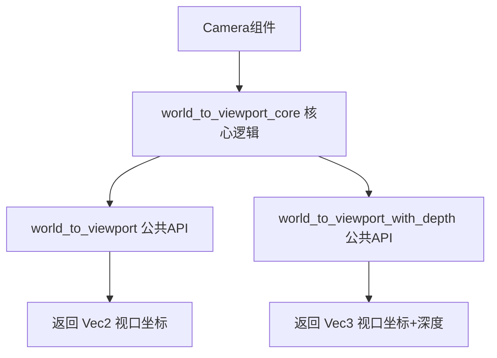

+++
title = "#21715 消除 world_to_view 逻辑的重复"
date = "2025-12-16T00:00:00"
draft = false
template = "pull_request_page.html"
in_search_index = false

[extra]
current_language = "zh-cn"
available_languages = {"en" = { name = "English", url = "/pull_request/bevy/2025-12/pr-21715-en-20251216" }, "zh-cn" = { name = "中文", url = "/pull_request/bevy/2025-12/pr-21715-zh-cn-20251216" }}
+++

# Title
## Basic Information
- **标题**: 消除 world_to_view 逻辑的重复
- **PR链接**: https://github.com/bevyengine/bevy/pull/21715
- **作者**: Breakdown-Dog
- **状态**: 已合并
- **标签**: C-Code-Quality, X-Contentious, D-Straightforward, S-Needs-Review, A-Camera
- **创建时间**: 2025-11-02T02:08:08Z
- **合并时间**: 2025-12-16T05:47:32Z
- **合并者**: alice-i-cecile

## 描述翻译
### 目标
- `camera.rs` 中的 `world_to_viewport` 和 `world_to_viewport_with_depth` 函数具有非常相似的模式。
- 重构代码以减少重复。

### 解决方案
- 提取共享逻辑到一个新函数中。

### 测试
- 运行 `cargo test`，所有测试通过。

## 这个PR的故事

这个PR解决了一个常见的代码质量问题：逻辑重复。在Bevy的相机模块中，两个公共API函数`world_to_viewport`和`world_to_viewport_with_depth`执行几乎相同的计算，但返回类型不同。前者返回`Vec2`（仅包含视口坐标），后者返回`Vec3`（包含视口坐标和深度）。

开发者Breakdown-Dog识别到这个重复问题，并决定重构代码以提高可维护性。这是一个典型的代码重构（refactoring）场景，不改变API行为，只改进内部结构。

### 问题识别
查看原始代码，两个函数都执行以下核心步骤：
1. 获取逻辑视口矩形
2. 将世界坐标转换为NDC（归一化设备坐标）
3. 检查NDC z值是否在有效范围内（0到1之间）
4. 翻转Y坐标（从底部原点转换为顶部原点）
5. 将NDC坐标映射到视口矩形

主要区别在于：
- `world_to_viewport`：忽略深度，只返回2D视口坐标
- `world_to_viewport_with_depth`：额外计算视图空间深度并返回3D坐标

### 解决方案设计
开发者设计了一个简洁的解决方案：创建一个新的私有方法`world_to_viewport_core`，该方法返回一个元组`(viewport_position, depth)`，其中depth是NDC空间中的z值。这样，两个公共方法都可以调用这个核心函数，然后根据需要处理返回值。

这种设计有几个优点：
1. 逻辑集中在一个地方，便于维护和调试
2. 减少了代码重复，符合DRY（Don't Repeat Yourself）原则
3. 保持了API不变，对现有代码零影响

### 实现细节
新的`world_to_viewport_core`方法封装了之前的重复逻辑。关键实现点包括：

```rust
fn world_to_viewport_core(
    &self,
    camera_transform: &GlobalTransform,
    world_position: Vec3,
) -> Result<(Vec2, f32), ViewportConversionError> {
    // ... 共享逻辑
}
```

修改后，`world_to_viewport`简化为：
```rust
pub fn world_to_viewport(
    &self,
    camera_transform: &GlobalTransform,
    world_position: Vec3,
) -> Result<Vec2, ViewportConversionError> {
    Ok(self
        .world_to_viewport_core(camera_transform, world_position)?
        .0)
}
```

`world_to_viewport_with_depth`则简化为：
```rust
pub fn world_to_viewport_with_depth(
    &self,
    camera_transform: &GlobalTransform,
    world_position: Vec3,
) -> Result<Vec3, ViewportConversionError> {
    let result = self.world_to_viewport_core(camera_transform, world_position)?;
    // Stretching ndc depth to value via near plane and negating result to be in positive room again.
    let depth = -self.depth_ndc_to_view_z(result.1);
    Ok(result.0.extend(depth))
}
```

### 技术考量
1. **错误处理的一致性**：两个函数共享相同的错误处理逻辑，确保行为一致。
2. **性能影响**：重构不会引入性能开销，因为只是代码重组而非算法改变。
3. **API稳定性**：公共API完全保持不变，这是无风险重构的关键。

### 代码质量提升
这个PR展示了良好的代码重构实践：
- 识别重复模式
- 提取共享逻辑到单一函数
- 保持公共接口不变
- 通过测试验证正确性

标签中的`C-Code-Quality`（代码质量）和`D-Straightforward`（直接明了）准确描述了这次修改的性质。`X-Contentious`（有争议的）标签可能表明团队对重构的细节有过讨论，比如是否应该改变API设计而不仅仅是内部重构。

### 可维护性收益
通过这次重构，未来需要修改视口坐标计算逻辑时，只需在一个地方修改。这降低了维护成本，减少了因多处修改不一致导致bug的风险。

## 可视化表示



## 关键文件变更

### `crates/bevy_camera/src/camera.rs` (+32/-34)
这是本次PR修改的唯一文件，重构了两个相机相关的方法。

**主要变化**：
1. 新增私有方法`world_to_viewport_core`，封装共享逻辑
2. 简化两个公共方法，使其调用新的核心方法
3. 更新文档注释以反映新的内部结构

**代码对比**：

```rust
// 修改前: world_to_viewport 方法
pub fn world_to_viewport(
    &self,
    camera_transform: &GlobalTransform,
    world_position: Vec3,
) -> Result<Vec2, ViewportConversionError> {
    let target_rect = self
        .logical_viewport_rect()
        .ok_or(ViewportConversionError::NoViewportSize)?;
    let mut ndc_space_coords = self
        .world_to_ndc(camera_transform, world_position)
        .ok_or(ViewportConversionError::InvalidData)?;
    // NDC z-values outside of 0 < z < 1 are outside the (implicit) camera frustum...
    if ndc_space_coords.z < 0.0 {
        return Err(ViewportConversionError::PastFarPlane);
    }
    if ndc_space_coords.z > 1.0 {
        return Err(ViewportConversionError::PastNearPlane);
    }
    
    // Flip the Y co-ordinate origin from the bottom to the top.
    ndc_space_coords.y = -ndc_space_coords.y;
    
    // Once in NDC space, we can discard the z element and map x/y to the viewport rect
    let viewport_position =
        (ndc_space_coords.truncate() + Vec2::ONE) / 2.0 * target_rect.size() + target_rect.min;
    Ok(viewport_position)
}

// 修改后: world_to_viewport 方法
pub fn world_to_viewport(
    &self,
    camera_transform: &GlobalTransform,
    world_position: Vec3,
) -> Result<Vec2, ViewportConversionError> {
    Ok(self
        .world_to_viewport_core(camera_transform, world_position)?
        .0)
}
```

```rust
// 新增的核心方法
fn world_to_viewport_core(
    &self,
    camera_transform: &GlobalTransform,
    world_position: Vec3,
) -> Result<(Vec2, f32), ViewportConversionError> {
    let target_rect = self
        .logical_viewport_rect()
        .ok_or(ViewportConversionError::NoViewportSize)?;
    let mut ndc_space_coords = self
        .world_to_ndc(camera_transform, world_position)
        .ok_or(ViewportConversionError::InvalidData)?;
    // NDC z-values outside of 0 < z < 1 are outside the (implicit) camera frustum...
    if ndc_space_coords.z < 0.0 {
        return Err(ViewportConversionError::PastFarPlane);
    }
    if ndc_space_coords.z > 1.0 {
        return Err(ViewportConversionError::PastNearPlane);
    }
    
    let depth = ndc_space_coords.z;
    
    // Flip the Y co-ordinate origin from the bottom to the top.
    ndc_space_coords.y = -ndc_space_coords.y;
    
    // Once in NDC space, we can discard the z element and map x/y to the viewport rect
    let viewport_position =
        (ndc_space_coords.truncate() + Vec2::ONE) / 2.0 * target_rect.size() + target_rect.min;
    Ok((viewport_position, depth))
}
```

## 进一步阅读

1. **DRY原则（Don't Repeat Yourself）**：软件设计中的基本原则，强调避免代码重复以提高可维护性。
2. **代码重构技术**：Martin Fowler的《重构：改善既有代码的设计》是学习重构技术的经典资源。
3. **Bevy相机系统**：了解Bevy的相机组件和坐标转换系统，可以参考[Bevy官方文档](https://docs.rs/bevy/latest/bevy/camera/index.html)。
4. **Rust模块化设计**：学习如何在Rust中设计可维护的模块化代码结构。