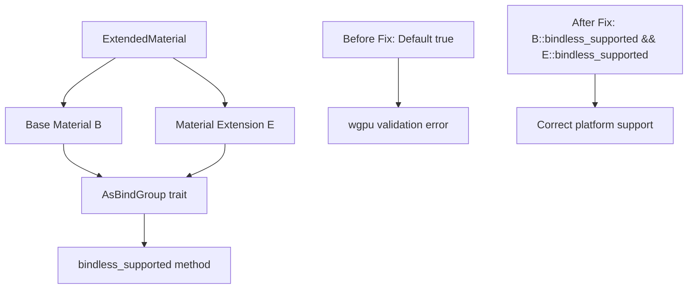

+++
title = "#21729 Fix extended_material_bindless example wgpu validation error on MacOS/Metal"
date = "2025-12-03T00:00:00"
draft = false
template = "pull_request_page.html"
in_search_index = true

[taxonomies]
list_display = ["show"]

[extra]
current_language = "en"
available_languages = {"en" = { name = "English", url = "/pull_request/bevy/2025-12/pr-21729-en-20251203" }, "zh-cn" = { name = "中文", url = "/pull_request/bevy/2025-12/pr-21729-zh-cn-20251203" }}
labels = ["C-Bug", "A-Rendering", "C-Examples", "O-MacOS"]
+++

# Title
Fix extended_material_bindless example wgpu validation error on MacOS/Metal

## Basic Information
- **Title**: Fix extended_material_bindless example wgpu validation error on MacOS/Metal
- **PR Link**: https://github.com/bevyengine/bevy/pull/21729
- **Author**: NicoZweifel
- **Status**: MERGED
- **Labels**: C-Bug, A-Rendering, C-Examples, O-MacOS, S-Ready-For-Final-Review
- **Created**: 2025-11-03T09:00:29Z
- **Merged**: 2025-12-03T07:26:06Z
- **Merged By**: alice-i-cecile

## Description Translation

# Objective

- Fixes https://github.com/bevyengine/bevy/issues/21719

## Solution

- Implementing `bindless_supported` of the `AsBindGroup` trait for `ExtendedMaterial`:
```rust
    fn bindless_supported(render_device: &RenderDevice) -> bool {
        B::bindless_supported(render_device) && E::bindless_supported(render_device)
    }
```
Before it just returned the default (true), leading to the mismatch.

I made small, mostly stylistic, improvements to `fn bind_group_layout_entries` and a few other locations like a comment in `extended_material` during debugging but I could move that out into a separate PR as well. Since the changes are rather limited and related to the issue I decided to leave it in for now.

## Testing

- Tested on Windows/NixOS and MacOS, tested multiple examples but most testing happened on the `extended_material_bindless` and `extended_material` examples.

## The Story of This Pull Request

The problem began with a wgpu validation error occurring specifically on MacOS/Metal when running the `extended_material_bindless` example. This was tracked in issue #21719. The error stemmed from a mismatch in how the `ExtendedMaterial` type handled bindless rendering support detection.

The core issue was that `ExtendedMaterial` didn't properly implement the `bindless_supported` method from the `AsBindGroup` trait. Instead of checking whether both its base material type `B` and its extension material type `E` supported bindless rendering, it relied on the trait's default implementation which always returns `true`. This created a situation where `ExtendedMaterial` would claim to support bindless rendering even when one or both of its component materials didn't, leading to wgpu validation errors on platforms like MacOS/Metal where bindless support might be limited.

The solution approach was straightforward: implement the `bindless_supported` method for `ExtendedMaterial` to properly check both component materials. The implementation uses a logical AND operation between the results of calling `bindless_supported` on both the base material `B` and the extension material `E`. This ensures that `ExtendedMaterial` only reports bindless support when both of its constituent materials support it.

During debugging this issue, the developer also noticed opportunities for code cleanup in related methods. The `bind_group_layout_entries` method was refactored from an imperative style using a for-loop and mutable vector to a more functional style using `filter` and `collect`. This change maintains the same behavior - deduplicating bindings by their binding index using a HashSet - but expresses it more concisely. The variable naming in `unprepared_bind_group` was also improved for clarity, changing from `extended_bindgroup` to `extension_bindings` to better reflect what the value represents.

The implementation fits cleanly into Bevy's existing architecture. `ExtendedMaterial` is a wrapper type that combines a base material with a material extension, and its `AsBindGroup` implementation needs to properly delegate to both component types. The fix ensures that platform-specific limitations are properly propagated through the material system.

One technical insight from this fix is the importance of properly implementing trait methods that have default implementations. The default `bindless_supported` returning `true` works for simple materials but breaks down for composite types like `ExtendedMaterial`. This pattern of needing to override default trait implementations for composite types is common in Rust and this PR serves as a good example of when and how to do it correctly.

The impact of this change is that the `extended_material_bindless` example now runs correctly on MacOS/Metal without validation errors. More broadly, it ensures that `ExtendedMaterial` properly respects the bindless capabilities of its component materials across all platforms, preventing similar issues on other platforms with limited bindless support.

## Visual Representation



## Key Files Changed

**crates/bevy_pbr/src/extended_material.rs** (+18/-13)

This file contains the `ExtendedMaterial` type implementation. The changes fix the bindless support detection and include minor code improvements for clarity and style.

Key modifications:

1. **Added `bindless_supported` method implementation**:
```rust
// Before: Using default implementation (implicitly returns true)

// After: Proper implementation checking both components
fn bindless_supported(render_device: &RenderDevice) -> bool {
    B::bindless_supported(render_device) && E::bindless_supported(render_device)
}
```

2. **Improved variable naming and destructuring in `unprepared_bind_group`**:
```rust
// Before:
let extended_bindgroup = E::unprepared_bind_group(...)?;
bindings.extend(extended_bindgroup.bindings.0);

// After:
let UnpreparedBindGroup {
    bindings: extension_bindings,
} = E::unprepared_bind_group(...)?;
bindings.extend(extension_bindings.0);
```

3. **Refactored `bind_group_layout_entries` to functional style**:
```rust
// Before: Imperative style with for-loop
let mut entries = vec![];
let mut seen_bindings = HashSet::<_>::with_hasher(FixedHasher);
for entry in B::bind_group_layout_entries(render_device, force_non_bindless)
    .into_iter()
    .chain(E::bind_group_layout_entries(render_device, force_non_bindless).into_iter())
{
    if seen_bindings.insert(entry.binding) {
        entries.push(entry);
    }
}
entries

// After: Functional style with filter and collect
let base_entries = B::bind_group_layout_entries(render_device, force_non_bindless);
let extension_entries = E::bind_group_layout_entries(render_device, force_non_bindless);

let mut seen_bindings = HashSet::<u32>::with_hasher(FixedHasher);

base_entries
    .into_iter()
    .chain(extension_entries)
    .filter(|entry| seen_bindings.insert(entry.binding))
    .collect()
```

4. **Fixed comment for clarity**:
```rust
// Before:
// add together the bindings of the base material and the user material

// After:
// add together the bindings of the base material and the extension
```

These changes relate directly to the PR's purpose: fixing the bindless support detection and improving code clarity in the process. The functional refactoring of `bind_group_layout_entries` doesn't change behavior but makes the deduplication logic more explicit and easier to read.

## Further Reading

1. **Bevy Material System Documentation**: Understanding Bevy's material system and the `AsBindGroup` trait
2. **wgpu Bindless Rendering**: Documentation on bindless descriptor indexing and platform support limitations
3. **Rust Trait Default Implementations**: When and how to override default trait methods in composite types
4. **Metal Graphics API**: Platform-specific constraints and validation requirements on Apple platforms
5. **Functional vs Imperative Programming in Rust**: Using iterator combinators like `filter` and `collect` for cleaner code