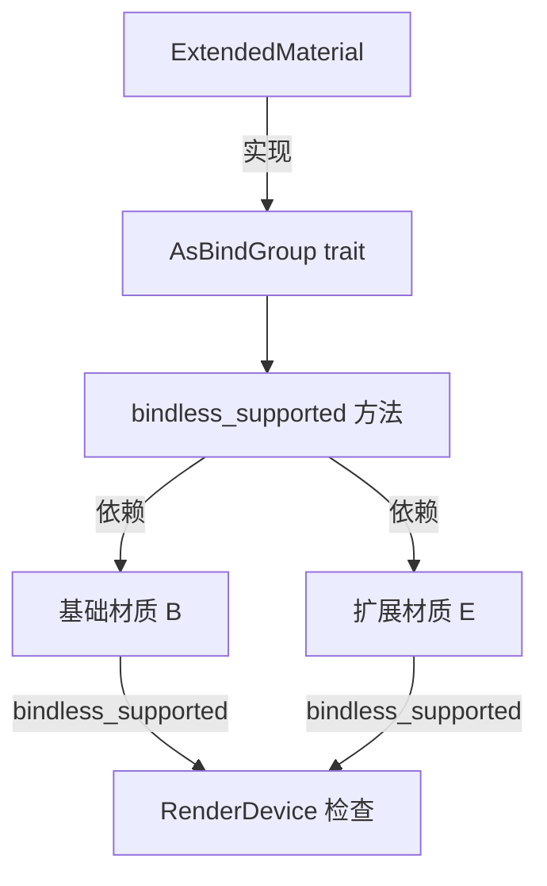

+++
title = "#21729 Fix extended_material_bindless example wgpu validation error on MacOS/Metal"
date = "2025-12-03T00:00:00"
draft = false
template = "pull_request_page.html"
in_search_index = false

[extra]
current_language = "zh-cn"
available_languages = {"en" = { name = "English", url = "/pull_request/bevy/2025-12/pr-21729-en-20251203" }, "zh-cn" = { name = "中文", url = "/pull_request/bevy/2025-12/pr-21729-zh-cn-20251203" }}
+++

# 修复 extended_material_bindless 示例在 MacOS/Metal 上的 wgpu 验证错误

## 基本信息
- **标题**: Fix extended_material_bindless example wgpu validation error on MacOS/Metal
- **PR 链接**: https://github.com/bevyengine/bevy/pull/21729
- **作者**: NicoZweifel
- **状态**: 已合并
- **标签**: C-Bug, A-Rendering, C-Examples, O-MacOS, S-Ready-For-Final-Review
- **创建时间**: 2025-11-03T09:00:29Z
- **合并时间**: 2025-12-03T07:26:06Z
- **合并者**: alice-i-cecile

## 描述翻译

### 目标
- 修复 https://github.com/bevyengine/bevy/issues/21719

### 解决方案
- 为 `ExtendedMaterial` 实现 `AsBindGroup` trait 的 `bindless_supported` 方法：
```rust
    fn bindless_supported(render_device: &RenderDevice) -> bool {
        B::bindless_supported(render_device) && E::bindless_supported(render_device)
    }
```
之前它只是返回默认值（true），导致不匹配。

我在调试过程中对 `fn bind_group_layout_entries` 函数和其他一些地方（如 `extended_material` 中的一个注释）做了一些小的、主要是风格上的改进。由于这些更改有限且与问题相关，我决定暂时保留在此 PR 中。

### 测试
- 在 Windows/NixOS 和 MacOS 上测试，测试了多个示例，但主要在 `extended_material_bindless` 和 `extended_material` 示例上进行。

## 这个 PR 的故事

这个 PR 源于一个具体的 bug 报告：`extended_material_bindless` 示例在 MacOS 的 Metal 后端上运行时产生了 wgpu 验证错误。这个问题的根本原因在于 `ExtendedMaterial` 类型对 bindless 渲染的支持检查不够完善。

### 问题分析

`ExtendedMaterial` 是 Bevy 中一个用于组合基础材质和材质扩展的泛型类型。它实现了 `AsBindGroup` trait，这个 trait 定义了材质如何转换为 GPU 绑定组。在 bindless 渲染模式下，多个资源可以组织在数组中，通过索引访问，而不是每个资源单独绑定。但并非所有硬件或 API 都支持 bindless，因此需要检查支持性。

问题出现在 `ExtendedMaterial` 的 `bindless_supported` 方法实现上。之前，这个方法继承自默认实现，总是返回 `true`。这意味着即使底层的基础材质 `B` 或扩展材质 `E` 不支持 bindless，`ExtendedMaterial` 也会报告支持 bindless。这种不一致性导致在 MacOS/Metal 上尝试使用 bindless 功能时出现验证错误，因为某些材质组件实际上并不支持该功能。

### 解决方案

修复方案很直接：为 `ExtendedMaterial` 实现正确的 `bindless_supported` 方法。逻辑上，只有当基础材质 `B` 和扩展材质 `E` 都支持 bindless 时，`ExtendedMaterial` 才应报告支持。因此，实现改为检查两个组件的支持性并进行逻辑与运算。

```rust
fn bindless_supported(render_device: &RenderDevice) -> bool {
    B::bindless_supported(render_device) && E::bindless_supported(render_device)
}
```

这个更改确保了 `ExtendedMaterial` 正确反映其组合组件的实际能力。

### 代码优化

在修复主要问题的同时，作者还对相关代码进行了小幅重构以提高清晰度：

1. **变量重命名**：在 `unprepared_bind_group` 方法中，将 `extended_bindgroup` 重命名为 `extension_bindings`，使其更准确地反映其内容。

2. **注释改进**：将注释从 "user material" 改为 "extension"，以更准确地描述扩展材质的作用。

3. **逻辑简化**：在 `bind_group_layout_entries` 方法中，将手动循环和收集条目的代码改为使用迭代器链和 `filter` 操作，使代码更简洁。

### 实现细节

让我们看一下关键更改：

1. **添加 `bindless_supported` 方法**：这是核心修复。之前缺失此方法，所以使用默认实现（返回 `true`）。现在明确实现，检查基础材质和扩展材质的支持性。

2. **重构绑定组布局条目收集**：原代码使用显式循环和临时向量收集条目，同时使用 HashSet 去重。新代码使用迭代器链和 `filter` 操作，更符合 Rust 的习惯用法。

```rust
// 之前
let mut entries = vec![];
let mut seen_bindings = HashSet::<_>::with_hasher(FixedHasher);
for entry in B::bind_group_layout_entries(render_device, force_non_bindless)
    .into_iter()
    .chain(E::bind_group_layout_entries(render_device, force_non_bindless).into_iter())
{
    if seen_bindings.insert(entry.binding) {
        entries.push(entry);
    }
}
entries

// 之后
let base_entries = B::bind_group_layout_entries(render_device, force_non_bindless);
let extension_entries = E::bind_group_layout_entries(render_device, force_non_bindless);

let mut seen_bindings = HashSet::<u32>::with_hasher(FixedHasher);

base_entries
    .into_iter()
    .chain(extension_entries)
    .filter(|entry| seen_bindings.insert(entry.binding))
    .collect()
```

### 技术见解

这个修复展示了组合类型（composite types）中 trait 实现的一个重要原则：当类型由多个组件组成时，其行为应该反映所有组件的联合行为。在这种情况下，`ExtendedMaterial` 的 bindless 支持性应该是其组件的逻辑与（AND），因为所有组件都需要支持该功能才能使组合类型正常工作。

此外，这个 PR 也展示了迭代器链和 `filter` 操作如何使集合处理代码更清晰。使用 `filter` 与有副作用的 `insert` 调用需要小心，但在这里是合适的，因为 `HashSet::insert` 返回一个布尔值，表示是否成功插入（即元素是否之前不存在）。

### 影响

这个修复解决了 MacOS/Metal 上的验证错误，使 `extended_material_bindless` 示例能够正确运行。更重要的是，它确保了 `ExtendedMaterial` 在各种平台上行为一致，避免在不支持 bindless 的硬件上错误地尝试使用 bindless 功能。

从代码质量角度看，这个 PR 也带来了小幅改进：更清晰的变量名、更准确的注释以及更简洁的迭代器用法。

## 视觉表示



## 关键文件更改

### `crates/bevy_pbr/src/extended_material.rs` (+18/-13)

这个文件包含了所有修改。主要更改包括：

1. **添加 `bindless_supported` 方法**：为 `ExtendedMaterial` 实现正确的 bindless 支持检查。

```rust
// 添加的方法：
fn bindless_supported(render_device: &RenderDevice) -> bool {
    B::bindless_supported(render_device) && E::bindless_supported(render_device)
}
```

2. **改进 `unprepared_bind_group` 方法**：重命名变量并更新注释以提高清晰度。

```rust
// 之前：
let extended_bindgroup = E::unprepared_bind_group(...)?;
bindings.extend(extended_bindgroup.bindings.0);

// 之后：
let UnpreparedBindGroup {
    bindings: extension_bindings,
} = E::unprepared_bind_group(...)?;
bindings.extend(extension_bindings.0);
```

3. **重构 `bind_group_layout_entries` 方法**：使用更简洁的迭代器链。

```rust
// 之前：
let mut entries = vec![];
let mut seen_bindings = HashSet::<_>::with_hasher(FixedHasher);
for entry in B::bind_group_layout_entries(render_device, force_non_bindless)
    .into_iter()
    .chain(E::bind_group_layout_entries(render_device, force_non_bindless).into_iter())
{
    if seen_bindings.insert(entry.binding) {
        entries.push(entry);
    }
}
entries

// 之后：
let base_entries = B::bind_group_layout_entries(render_device, force_non_bindless);
let extension_entries = E::bind_group_layout_entries(render_device, force_non_bindless);

let mut seen_bindings = HashSet::<u32>::with_hasher(FixedHasher);

base_entries
    .into_iter()
    .chain(extension_entries)
    .filter(|entry| seen_bindings.insert(entry.binding))
    .collect()
```

这些更改共同修复了 bindless 支持检查的问题，并提高了代码的可读性。

## 进一步阅读

1. [Bevy 的材质系统文档](https://bevyengine.org/learn/book/next/features/materials) - 了解 Bevy 中材质的工作原理
2. [wgpu 的 bindless 渲染](https://github.com/gfx-rs/wgpu/wiki/Feature-Testing#bindless) - 关于 wgpu 中 bindless 功能的说明
3. [Rust 迭代器模式](https://doc.rust-lang.org/book/ch13-02-iterators.html) - 了解迭代器链和 filter 操作
4. [组合模式](https://en.wikipedia.org/wiki/Composite_pattern) - 了解组合类型的设计原则