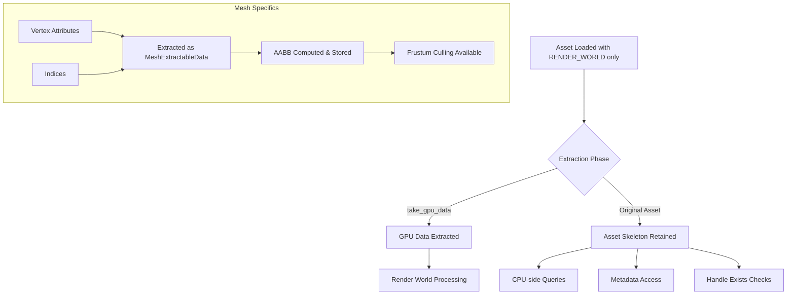

+++
title = "#21732 Retain asset without data for RENDER_WORLD-only assets"
date = "2025-12-14T00:00:00"
draft = false
template = "pull_request_page.html"
in_search_index = true

[taxonomies]
list_display = ["show"]

[extra]
current_language = "en"
available_languages = {"en" = { name = "English", url = "/pull_request/bevy/2025-12/pr-21732-en-20251214" }, "zh-cn" = { name = "中文", url = "/pull_request/bevy/2025-12/pr-21732-zh-cn-20251214" }}
labels = ["C-Bug", "A-Rendering", "A-Assets"]
+++

# Retain asset without data for RENDER_WORLD-only assets

## Basic Information
- **Title**: Retain asset without data for RENDER_WORLD-only assets
- **PR Link**: https://github.com/bevyengine/bevy/pull/21732
- **Author**: robtfm
- **Status**: MERGED
- **Labels**: C-Bug, A-Rendering, A-Assets, S-Ready-For-Final-Review
- **Created**: 2025-11-03T13:47:36Z
- **Merged**: 2025-12-14T23:22:16Z
- **Merged By**: alice-i-cecile

## Description Translation
# Objective

when `RenderAssets` with `RenderAssetUsages::RENDER_WORLD` and without `RenderAssetUsages::MAIN_WORLD` are extracted, the asset is removed from the assets collection. this causes some issues:
- systems which rely on the asset, like picking with meshes, fail with "asset not found" errors which are unintuitive.
- loading the asset by path a second time results in the asset being reloaded from storage, re-extracted and re-transferred to gpu, replacing the existing asset
- knowledge about the asset state is lost, we cannot tell if an asset is already loaded with `AssetServer::get_handle`
- metadata (image size, e.g.) is no longer available for the asset

## Solution

### extraction:
- add `take_gpu_data` to the `RenderAsset` trait. use it to pull the data out of the asset for transfer, and leave the empty asset in the collection. default implementation just `clone`s the asset.
- if the data has already been taken, ~~panic. this follows from modifying an asset after extraction, which is always a code error, so i think panic here makes sense~~ _log an error_

### Mesh/RenderMesh:
- make `Mesh::attributes` and `Mesh::indices` options
- take them on extraction
- `expect` operations which access or modify the vertex data or indices if it has been extracted. accessing the vertex data after extraction is always a code error. fixes #19737 by resulting in the error `Mesh has been extracted to RenderWorld. To access vertex attributes, the mesh must have RenderAssetUsages::MAIN_WORLD`
- provide `try_xxx` operations which allow users to handle the access error gracefully if required (no usages as part of this pr, but provided for future)
- compute the mesh `Aabb` when gpu data is taken and store the result. this allows extracted meshes to still use frustum culling (otherwise using multiple copies of an extracted mesh now panics as `compute_aabb` relied on vertex positions). there's a bit of a tradeoff here: users may not need the Aabb and we needlessly compute it. but i think users almost always do want them, and computing once (for extracted meshes) is cheaper than the alternative, keeping position data and computing a fresh `Aabb` every time the mesh is used on a new entity.

### Image/GpuImage:
images are a little more complex because the data can be deliberately `None` for render-targets / GPU-written textures where we only want an uninitialized gpu-side texture.
- take `Image::data` on extraction
- record on the resulting `GpuImage` whether any data was found initially
- on subsequent modifications with no data, panic if there was data previously

corner case / issue: when used with `RenderAssetBytesPerFrameLimiter` there may be no previous gpu asset if it is still queued pending upload due to the bandwidth limit. this can result in a modified image with initial data skipping the `had_data` check, resulting in a blank texture. i think this is sufficiently rare that it's not a real problem, users would still hit the panic if the asset is transferred in time and the problem/solution should be clear when they do hit it.

### ShaderStorageBuffer/GpuShaderStorageBuffer
follows the same pattern as Image/GpuImage:
- take `ShaderStorageBuffer::data` on extraction
- record on the resulting `GpuShaderStorageBuffer` whether any data was found initially
- on modifications with no data, panic if there was data previously

we don't have the queue issue here because `GpuShaderStorageBuffer` doesn't implement `byte_len` so we can't end up queueing them.

#### other RenderAssets
i didn't modify the other `RenderAsset` types (`GpuAutoExposureCompensationCurve`, `GpuLineGizmo`, `RenderWireframeMaterial`, `PreparedMaterial`, `PreparedMaterial2d`, `PreparedUiMaterial`) on the assumption that ~~cloning these is cheap enough anyway~~ _the asset usages are not exposed so we should never call `take_gpu_data`. the default implementation panics with a message directing users to implement the method if required_

## Testing

only really tested within my work project. i can add some explicit tests if required.

## The Story of This Pull Request

This PR addresses a fundamental issue in Bevy's asset extraction pipeline where assets marked with `RenderAssetUsages::RENDER_WORLD` but not `RenderAssetUsages::MAIN_WORLD` were being completely removed from the asset collection after extraction. This caused several practical problems for developers.

The core issue stemmed from a design decision to remove assets from CPU memory once they were uploaded to GPU memory, which makes sense for saving RAM but breaks important functionality. When an asset was extracted, the system would call `assets.remove(id)`, removing the asset entirely. This meant that systems like mesh picking would fail with "asset not found" errors, reloading an asset by path would cause redundant GPU uploads, and metadata like image dimensions became inaccessible.

The solution introduces a more nuanced approach: instead of removing the asset, we extract the GPU-specific data while keeping a skeleton of the asset in the collection. This requires a new abstraction to track which parts of an asset have been extracted.

### The Extraction Mechanism

The PR introduces a new `take_gpu_data` method on the `RenderAsset` trait:

```rust
fn take_gpu_data(
    _source: &mut Self::SourceAsset,
    _previous_gpu_asset: Option<&Self>,
) -> Result<Self::SourceAsset, AssetExtractionError> {
    Err(AssetExtractionError::NoExtractionImplementation)
}
```

The default implementation returns an error, indicating that the asset type doesn't support this extraction pattern. For assets that do support it, the method should create a copy of the asset with the heavy data (like vertex positions or pixel data) moved out, leaving the original asset in a valid but data-less state.

In the extraction system, when an asset has only `RENDER_WORLD` usage (not `MAIN_WORLD`), instead of removing it, we now call:

```rust
match A::take_gpu_data(asset, previous_asset) {
    Ok(gpu_data_asset) => {
        extracted_assets.push((id, gpu_data_asset));
        added.insert(id);
    }
    Err(e) => {
        error!("... cannot be extracted: {e}");
    }
};
```

This preserves the asset handle and its metadata while transferring only the GPU-required data to the render world.

### Mesh: The Most Complex Case

Meshes presented the most challenging implementation because they have multiple data components (vertex attributes, indices, morph targets) that need coordinated extraction. The solution introduces a new enum `MeshExtractableData<T>`:

```rust
enum MeshExtractableData<T> {
    Data(T),
    NoData,
    ExtractedToRenderWorld,
}
```

This enum replaces direct fields in the `Mesh` struct:

```rust
// Before:
attributes: BTreeMap<MeshVertexAttributeId, MeshAttributeData>,
indices: Option<Indices>,

// After:
attributes: MeshExtractableData<BTreeMap<MeshVertexAttributeId, MeshAttributeData>>,
indices: MeshExtractableData<Indices>,
```

The `MeshExtractableData` type provides methods that return `Result` types with `MeshAccessError`, which can be either `ExtractedToRenderWorld` or `NotFound`. This allows the mesh to track whether data has been extracted and provide clear error messages.

When GPU data is taken from a mesh via `take_gpu_data()`, the method also computes and stores the mesh's AABB:

```rust
if let Some(MeshAttributeData {
    values: VertexAttributeValues::Float32x3(position_values),
    ..
}) = attributes.as_ref_option()?.and_then(|attrs| attrs.get(&Self::ATTRIBUTE_POSITION.id))
&& !position_values.is_empty()
{
    let mut iter = position_values.iter().map(|p| Vec3::from_slice(p));
    let mut min = iter.next().unwrap();
    let mut max = min;
    for v in iter {
        min = Vec3::min(min, v);
        max = Vec3::max(max, v);
    }
    self.final_aabb = Some(Aabb3d::new(min, max));
}
```

This AABB computation is necessary because frustum culling needs the mesh bounds, but after extraction, the vertex position data is no longer available. Computing it once during extraction is cheaper than keeping all vertex data in RAM just for AABB calculations.

### API Design: Safe Access Patterns

The mesh API was significantly refactored to provide safe access patterns. For every method that accesses mesh data (like `attribute()`, `indices()`, etc.), there are now three variants:

1. **Panicking version** (existing API): `mesh.attribute(id)` - panics with clear error message if data was extracted
2. **Result-returning version**: `mesh.try_attribute(id)` - returns `Result<&VertexAttributeValues, MeshAccessError>`
3. **Optional version**: `mesh.try_attribute_option(id)` - returns `Result<Option<&VertexAttributeValues>, MeshAccessError>`

This pattern is applied consistently across all mesh access methods, including attribute access, index access, and mesh operations like `compute_normals()` and `transform_by()`.

### Image and ShaderStorageBuffer Patterns

For `Image` and `ShaderStorageBuffer`, the pattern is simpler since they only have one main data field. The solution tracks whether the asset originally had data:

```rust
// In GpuImage struct:
pub struct GpuImage {
    // ... existing fields
    pub had_data: bool,
}

// In take_gpu_data for Image:
let data = source.data.take();
let valid_upload = data.is_some() || previous_gpu_asset.is_none_or(|prev| !prev.had_data);
valid_upload.then(|| Self::SourceAsset { data, ..source.clone() })
    .ok_or(AssetExtractionError::AlreadyExtracted)
```

The `had_data` flag is crucial for distinguishing between:
1. An image that never had data (like a render target)
2. An image that had data but was extracted
3. An image that still has data

### Edge Cases and Trade-offs

The implementation handles several edge cases:

1. **RenderAssetBytesPerFrameLimiter**: When bandwidth limiting delays GPU upload, there might be no previous GPU asset to check against. This could allow an extracted image to be modified without detection. The PR author considers this rare enough to accept.

2. **AABB Computation Trade-off**: Computing AABB for every extracted mesh adds overhead even if the mesh isn't used for frustum culling. The alternative would be keeping vertex data in RAM or recomputing AABB each frame, both of which have worse performance characteristics.

3. **Backwards Compatibility**: The existing panicking API is preserved, so existing code continues to work but with better error messages. New `try_` methods allow graceful error handling when needed.

### Impact and Benefits

This change fixes multiple issues simultaneously:

1. **Asset Discovery**: Systems can now query if an asset exists without triggering reloads
2. **Metadata Access**: Image dimensions, mesh topology, and other metadata remain accessible
3. **Error Clarity**: Instead of "asset not found", users get clear messages about extraction state
4. **Performance**: Prevents redundant asset reloading and GPU uploads
5. **Memory Efficiency**: Still achieves the original goal of freeing CPU memory for GPU-only assets

The implementation demonstrates a sophisticated approach to resource management where assets transition through states (full → extracted → potentially reloaded) while maintaining API safety and clear error reporting.

## Visual Representation



## Key Files Changed

### `crates/bevy_mesh/src/mesh.rs` (+1032/-102)
This file contains the majority of changes, implementing the `MeshExtractableData` system and updating all mesh access methods.

**Key changes:**
- Introduced `MeshExtractableData<T>` enum to track extraction state
- Added `final_aabb` field to store computed bounds after extraction
- Updated all access methods to return `Result` types with clear errors
- Implemented `take_gpu_data()` method for mesh extraction

```rust
// Example of the new access pattern:
pub fn try_attribute(
    &self,
    id: impl Into<MeshVertexAttributeId>,
) -> Result<&VertexAttributeValues, MeshAccessError> {
    self.try_attribute_option(id)?
        .ok_or(MeshAccessError::NotFound)
}

pub fn take_gpu_data(&mut self) -> Result<Self, MeshAccessError> {
    let attributes = self.attributes.extract()?;
    let indices = self.indices.extract()?;
    // ... compute AABB when data exists
    Ok(Self {
        attributes,
        indices,
        ..self.clone()
    })
}
```

### `crates/bevy_render/src/render_asset.rs` (+34/-4)
Added the `take_gpu_data` trait method and updated the extraction system.

```rust
// New trait method:
fn take_gpu_data(
    _source: &mut Self::SourceAsset,
    _previous_gpu_asset: Option<&Self>,
) -> Result<Self::SourceAsset, AssetExtractionError> {
    Err(AssetExtractionError::NoExtractionImplementation)
}

// Updated extraction logic:
match A::take_gpu_data(asset, previous_asset) {
    Ok(gpu_data_asset) => {
        extracted_assets.push((id, gpu_data_asset));
        added.insert(id);
    }
    Err(e) => {
        error!("... cannot be extracted: {e}");
    }
};
```

### `crates/bevy_render/src/storage.rs` (+26/-3)
Implemented `take_gpu_data` for `ShaderStorageBuffer` with `had_data` tracking.

```rust
fn take_gpu_data(
    source: &mut Self::SourceAsset,
    previous_gpu_asset: Option<&Self>,
) -> Result<Self::SourceAsset, AssetExtractionError> {
    let data = source.data.take();
    let valid_upload = data.is_some() || previous_gpu_asset.is_none_or(|prev| !prev.had_data);
    valid_upload
        .then(|| Self::SourceAsset {
            data,
            ..source.clone()
        })
        .ok_or(AssetExtractionError::AlreadyExtracted)
}
```

### `crates/bevy_render/src/texture/gpu_image.rs` (+22/-1)
Implemented `take_gpu_data` for `Image` with similar `had_data` tracking.

### `crates/bevy_render/src/mesh/mod.rs` (+12/-1)
Implemented `take_gpu_data` for `RenderMesh` to delegate to the mesh's implementation.

## Further Reading

- [Bevy Render Assets Documentation](https://docs.rs/bevy_render/latest/bevy_render/render_asset/trait.RenderAsset.html)
- [Asset System in Bevy](https://bevy-cheatbook.github.io/features/assets.html)
- [Render World Architecture](https://bevyengine.org/learn/quick-start/ecs/render-world/)
- [Error Handling in Rust](https://doc.rust-lang.org/book/ch09-00-error-handling.html)