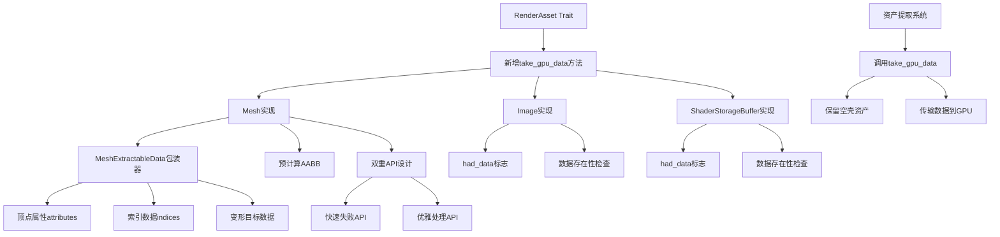

+++
title = "#21732 为仅用于渲染世界的资产保留无数据的资产对象"
date = "2025-12-14T00:00:00"
draft = false
template = "pull_request_page.html"
in_search_index = false

[extra]
current_language = "zh-cn"
available_languages = {"en" = { name = "English", url = "/pull_request/bevy/2025-12/pr-21732-en-20251214" }, "zh-cn" = { name = "中文", url = "/pull_request/bevy/2025-12/pr-21732-zh-cn-20251214" }}
+++

# Retain asset without data for RENDER_WORLD-only assets

## Basic Information
- **标题**: 为仅用于渲染世界的资产保留无数据的资产对象
- **PR链接**: https://github.com/bevyengine/bevy/pull/21732
- **作者**: robtfm
- **状态**: 已合并
- **标签**: C-Bug, A-Rendering, A-Assets, S-Ready-For-Final-Review
- **创建时间**: 2025-11-03T13:47:36Z
- **合并时间**: 2025-12-14T23:22:16Z
- **合并者**: alice-i-cecile

## 描述翻译

### 目标

当使用 `RenderAssetUsages::RENDER_WORLD` 且不含 `RenderAssetUsages::MAIN_WORLD` 的 `RenderAssets` 被提取时，这些资产会从资产集合中移除。这会导致一些问题：
- 依赖这些资产的系统（例如使用网格的拾取功能）会因"找不到资产"的错误而失败，这种错误信息不够直观。
- 通过路径第二次加载资产会导致资产从存储中重新加载、重新提取并重新传输到GPU，替换现有的资产。
- 资产状态信息丢失，我们无法通过 `AssetServer::get_handle` 判断资产是否已加载。
- 资产的元数据（例如图片尺寸）不再可用。

### 解决方案

#### 提取过程：
- 在 `RenderAsset` trait 中添加 `take_gpu_data` 方法。使用它来提取资产数据以供传输，并在集合中留下空的资产对象。默认实现只是克隆资产。
- 如果数据已被提取，则记录错误（之前是panic，现改为记录错误）。

#### Mesh/RenderMesh：
- 将 `Mesh::attributes` 和 `Mesh::indices` 改为可选类型
- 在提取时取走它们
- 如果数据已被提取，则通过 `expect` 操作访问或修改顶点数据或索引。在提取后访问顶点数据始终是代码错误。通过返回错误信息 `Mesh has been extracted to RenderWorld. To access vertex attributes, the mesh must have RenderAssetUsages::MAIN_WORLD` 修复了问题 #19737
- 提供 `try_xxx` 操作，允许用户在需要时优雅地处理访问错误（本PR中未使用，但为未来提供）
- 在提取GPU数据时计算网格的 `Aabb` 并存储结果。这使得提取后的网格仍能使用视锥体剔除（否则使用提取后网格的多个副本会因 `compute_aabb` 依赖顶点位置而panic）。这里有一个权衡：用户可能不需要Aabb，但我们仍然计算它。但考虑到用户几乎总是需要它，并且只计算一次（对于提取的网格）比替代方案更便宜——替代方案是保留位置数据并在每次将网格用于新实体时重新计算 `Aabb`。

#### Image/GpuImage：
图片稍微复杂一些，因为对于渲染目标/GPU写入的纹理，数据可以故意为 `None`，我们只需要一个未初始化的GPU端纹理。
- 在提取时取走 `Image::data`
- 在生成的 `GpuImage` 中记录最初是否有数据
- 在后续没有数据的修改中，如果之前有数据则panic

边缘情况/问题：当与 `RenderAssetBytesPerFrameLimiter` 一起使用时，如果由于带宽限制仍在排队等待上传，则可能没有先前的GPU资产。这可能导致带有初始数据的修改后的图片跳过 `had_data` 检查，导致空白纹理。我认为这种情况足够罕见，不是真正的问题，如果资产及时传输，用户仍会遇到panic，并且在遇到问题时问题/解决方案应该是清晰的。

#### ShaderStorageBuffer/GpuShaderStorageBuffer
遵循与Image/GpuImage相同的模式：
- 在提取时取走 `ShaderStorageBuffer::data`
- 在生成的 `GpuShaderStorageBuffer` 中记录最初是否有数据
- 在后续没有数据的修改中，如果之前有数据则panic

我们没有这里的队列问题，因为 `GpuShaderStorageBuffer` 没有实现 `byte_len`，所以我们不会将它们排队。

#### 其他RenderAssets
我没有修改其他 `RenderAsset` 类型（`GpuAutoExposureCompensationCurve`、`GpuLineGizmo`、`RenderWireframeMaterial`、`PreparedMaterial`、`PreparedMaterial2d`、`PreparedUiMaterial`），基于以下假设：这些资产的用途（usages）未公开，因此我们不应调用 `take_gpu_data`。默认实现会panic并显示消息，指导用户在需要时实现该方法。

### 测试

仅在我的工作项目中进行了测试。如果需要，我可以添加一些明确的测试。

## 此Pull Request的技术分析

### 问题和背景

Bevy引擎的渲染系统有一个关键优化：当资产（如网格、纹理）只需要在渲染世界（RENDER_WORLD）中使用而不需要主世界（MAIN_WORLD）访问时，系统会在资产提取到GPU后从CPU内存中移除这些资产的数据。这个设计旨在减少内存使用，因为一旦数据上传到GPU的VRAM，通常就不再需要保留CPU副本。

然而，这个优化带来了几个实际问题：

1. **资产访问失败**：某些系统（如网格拾取）仍需要访问已提取的资产，导致"资产未找到"的错误。
2. **重复加载**：如果通过路径再次请求同一个资产，系统会从存储重新加载，导致不必要的I/O和GPU传输。
3. **状态信息丢失**：无法通过`AssetServer`查询资产是否已加载。
4. **元数据丢失**：图片尺寸等元数据不再可用。

问题根源在于资产提取过程完全移除了资产对象，而不是仅仅移除其大数据部分。这破坏了资产系统的完整性，使得本应是内部优化的功能对外部系统产生了负面影响。

### 解决方案

核心思路是修改资产提取机制：不是完全移除资产，而是提取资产的GPU数据部分，留下一个"空壳"资产对象在资产集合中。这个空壳资产保留元数据和状态信息，但不再包含可能占用大量内存的实际数据（如顶点数据、像素数据）。

这个方案通过向`RenderAsset` trait添加`take_gpu_data`方法来实现。该方法负责：
- 从源资产中提取GPU数据
- 返回一个包含这些数据的新资产对象（用于传输到GPU）
- 修改原资产，将其标记为"已提取"，但保留在资产集合中

### 具体实现

#### RenderAsset trait扩展

首先在`RenderAsset` trait中添加了新的方法：

```rust
fn take_gpu_data(
    _source: &mut Self::SourceAsset,
    _previous_gpu_asset: Option<&Self>,
) -> Result<Self::SourceAsset, AssetExtractionError> {
    Err(AssetExtractionError::NoExtractionImplementation)
}
```

这个方法返回`Result`类型，允许在资产已被提取时返回错误。默认实现返回错误，指示该资产类型不支持提取。支持提取的资产类型需要实现这个方法。

#### Mesh的改造

Mesh的改造最为复杂，因为网格数据包含多个部分：顶点属性、索引，以及可选的变形目标。

**数据结构变化**：
```rust
// 之前：直接存储数据
attributes: BTreeMap<MeshVertexAttributeId, MeshAttributeData>,
indices: Option<Indices>,

// 之后：使用可提取的数据包装器
attributes: MeshExtractableData<BTreeMap<MeshVertexAttributeId, MeshAttributeData>>,
indices: MeshExtractableData<Indices>,
```

`MeshExtractableData`枚举有三个状态：
- `Data(T)`：包含实际数据
- `NoData`：没有数据（本来就是空的）
- `ExtractedToRenderWorld`：数据已被提取到渲染世界

**新增错误处理**：
```rust
#[derive(Error, Debug, Clone)]
pub enum MeshAccessError {
    #[error("The mesh vertex/index data has been extracted to the RenderWorld (via `Mesh::asset_usage`)")]
    ExtractedToRenderWorld,
    #[error("The requested mesh data wasn't found in this mesh")]
    NotFound,
}
```

**双重API设计**：
对于每个可能访问已提取数据的操作，都提供了两个版本：
- `attribute()`：在数据被提取时panic
- `try_attribute()`：返回`Result`，允许错误处理

例如：
```rust
pub fn attribute(&self, id: impl Into<MeshVertexAttributeId>) -> Option<&VertexAttributeValues> {
    self.try_attribute_option(id).expect(MESH_EXTRACTED_ERROR)
}

pub fn try_attribute(
    &self,
    id: impl Into<MeshVertexAttributeId>,
) -> Result<&VertexAttributeValues, MeshAccessError> {
    self.try_attribute_option(id)?
        .ok_or(MeshAccessError::NotFound)
}
```

**AABB预计算**：
在提取网格数据时，预先计算并存储边界框（AABB）：
```rust
if let Some(MeshAttributeData {
    values: VertexAttributeValues::Float32x3(position_values),
    ..
}) = attributes
    .as_ref_option()?
    .and_then(|attrs| attrs.get(&Self::ATTRIBUTE_POSITION.id))
    && !position_values.is_empty()
{
    // 计算min和max
    self.final_aabb = Some(Aabb3d::new(min, max));
}
```

这是一个权衡：不是所有用户都需要AABB，但计算一次比保留顶点数据并在每次使用时重新计算更高效。

#### Image和ShaderStorageBuffer的实现

Image和ShaderStorageBuffer遵循类似的模式，但需要考虑一个特殊情况：渲染目标或GPU写入的纹理可能本来就没有CPU端数据。

实现关键：
- 在`take_gpu_data`中检查是否有数据
- 在GPU资产中记录`had_data`标志
- 后续修改时，如果尝试将"有数据"的资产改为"无数据"，则panic

```rust
fn take_gpu_data(
    source: &mut Self::SourceAsset,
    previous_gpu_asset: Option<&Self>,
) -> Result<Self::SourceAsset, AssetExtractionError> {
    let data = source.data.take();
    
    // 检查此图片原本是否有数据而现在没有了，这暗示它已经被提取过
    let valid_upload = data.is_some() || previous_gpu_asset.is_none_or(|prev| !prev.had_data);
    
    valid_upload
        .then(|| Self::SourceAsset {
            data,
            ..source.clone()
        })
        .ok_or(AssetExtractionError::AlreadyExtracted)
}
```

#### 提取系统的修改

提取系统现在调用`take_gpu_data`而不是直接移除资产：

```rust
if let Some(asset) = assets.get_mut_untracked(id) {
    let previous_asset = maybe_render_assets.as_ref().and_then(|render_assets| render_assets.get(id));
    match A::take_gpu_data(asset, previous_asset) {
        Ok(gpu_data_asset) => {
            extracted_assets.push((id, gpu_data_asset));
            added.insert(id);
        }
        Err(e) => {
            error!("{} with RenderAssetUsages == RENDER_WORLD cannot be extracted: {e}", 
                   core::any::type_name::<A>());
        }
    };
}
```

### 技术洞察

#### 设计模式
这个PR引入了一个清晰的状态管理模式：
1. **数据存在**：资产包含完整数据，可以自由访问
2. **数据被提取**：数据已传输到GPU，CPU端只保留元数据和预计算的衍生数据（如AABB）
3. **数据不存在**：资产原本就没有数据

通过`MeshExtractableData`枚举清晰地表示这些状态，避免了使用`Option`可能导致的歧义。

#### 错误处理策略
提供了两套API：
1. **快速失败API**（如`attribute()`）：在数据被提取时panic，适合在开发阶段快速发现问题
2. **优雅处理API**（如`try_attribute()`）：返回`Result`，适合需要处理提取情况的代码

这种设计平衡了开发便利性和运行时健壮性。

#### 性能权衡
预计算AABB是一个典型的空间换时间优化：
- **优点**：提取后的网格仍可用于视锥体剔除，无需保留顶点数据
- **缺点**：不是所有用户都需要AABB，但仍需计算和存储

考虑到视锥体剔除在渲染中的普遍性，这个权衡是合理的。

### 影响

#### 修复的问题
1. **资产拾取系统**：现在可以正常工作，因为资产对象仍然存在
2. **重复加载**：避免，因为资产句柄仍然指向同一个资产对象
3. **状态查询**：通过`AssetServer`可以正确查询资产状态
4. **元数据访问**：图片尺寸等元数据仍然可用

#### 向后兼容性
大多数现有代码无需修改，因为：
- 修改主要影响内部提取机制
- 公共API保持兼容，只是新增了`try_`变体
- 对于已提取资产的访问现在会提供清晰的错误信息，而不是"资产未找到"

#### 开发者体验改善
- 更清晰的错误信息帮助开发者理解问题本质
- `try_`API为需要处理提取情况的代码提供了优雅的处理方式
- 文档更新解释了`RenderAssetUsages`的实际含义和行为变化

## 组件关系图



## 关键文件变更

### 1. `crates/bevy_mesh/src/mesh.rs` (+1032/-102)
**变更描述**：这是本次PR中变更最复杂的文件，重构了Mesh的数据结构以支持数据提取，并添加了相关的错误处理和API。

**关键代码片段**：
```rust
// 新的数据结构
enum MeshExtractableData<T> {
    Data(T),
    NoData,
    ExtractedToRenderWorld,
}

// 在Mesh结构体中的使用
pub struct Mesh {
    // 之前：attributes: BTreeMap<MeshVertexAttributeId, MeshAttributeData>,
    // 之后：
    attributes: MeshExtractableData<BTreeMap<MeshVertexAttributeId, MeshAttributeData>>,
    
    // 新增：预计算的AABB
    pub final_aabb: Option<Aabb3d>,
}

// 数据提取方法
pub fn take_gpu_data(&mut self) -> Result<Self, MeshAccessError> {
    let attributes = self.attributes.extract()?;
    let indices = self.indices.extract()?;
    
    // 预计算AABB
    if let Some(MeshAttributeData {
        values: VertexAttributeValues::Float32x3(position_values),
        ..
    }) = attributes
        .as_ref_option()?
        .and_then(|attrs| attrs.get(&Self::ATTRIBUTE_POSITION.id))
        && !position_values.is_empty()
    {
        // 计算min和max...
        self.final_aabb = Some(Aabb3d::new(min, max));
    }
    
    Ok(Self {
        attributes,
        indices,
        // ...其他字段
    })
}
```

**与PR目的的关系**：这是实现网格数据提取的核心，通过`MeshExtractableData`管理数据状态，通过`take_gpu_data`方法提取数据并预计算AABB。

### 2. `crates/bevy_render/src/render_asset.rs` (+34/-4)
**变更描述**：扩展了`RenderAsset` trait，添加了`take_gpu_data`方法和相关的错误类型，修改了资产提取系统以使用新方法。

**关键代码片段**：
```rust
// 新增错误类型
#[derive(Debug, Error)]
pub enum AssetExtractionError {
    #[error("The asset has already been extracted")]
    AlreadyExtracted,
    #[error("The asset type does not support extraction. To clone the asset to the renderworld, use `RenderAssetUsages::default()`")]
    NoExtractionImplementation,
}

// RenderAsset trait扩展
pub trait RenderAsset: Send + Sync + 'static + Sized {
    // ... 现有方法
    
    fn take_gpu_data(
        _source: &mut Self::SourceAsset,
        _previous_gpu_asset: Option<&Self>,
    ) -> Result<Self::SourceAsset, AssetExtractionError> {
        Err(AssetExtractionError::NoExtractionImplementation)
    }
}

// 提取系统修改
if let Some(asset) = assets.get_mut_untracked(id) {
    let previous_asset = maybe_render_assets.as_ref().and_then(|render_assets| render_assets.get(id));
    match A::take_gpu_data(asset, previous_asset) {
        Ok(gpu_data_asset) => {
            extracted_assets.push((id, gpu_data_asset));
            added.insert(id);
        }
        Err(e) => {
            error!("{} with RenderAssetUsages == RENDER_WORLD cannot be extracted: {e}", 
                   core::any::type_name::<A>());
        }
    };
}
```

**与PR目的的关系**：提供了资产提取的通用机制，使得不同类型的资产可以自定义数据提取逻辑。

### 3. `crates/bevy_render/src/storage.rs` (+26/-3)
**变更描述**：为`ShaderStorageBuffer`实现了`take_gpu_data`方法，添加了`had_data`标志来跟踪数据存在性。

**关键代码片段**：
```rust
// GpuShaderStorageBuffer结构体扩展
pub struct GpuShaderStorageBuffer {
    pub buffer: Buffer,
    pub had_data: bool, // 新增字段
}

// take_gpu_data实现
fn take_gpu_data(
    source: &mut Self::SourceAsset,
    previous_gpu_asset: Option<&Self>,
) -> Result<Self::SourceAsset, AssetExtractionError> {
    let data = source.data.take();
    
    let valid_upload = data.is_some() || previous_gpu_asset.is_none_or(|prev| !prev.had_data);
    
    valid_upload
        .then(|| Self::SourceAsset {
            data,
            ..source.clone()
        })
        .ok_or(AssetExtractionError::AlreadyExtracted)
}
```

**与PR目的的关系**：为ShaderStorageBuffer实现了数据提取逻辑，确保在数据已被提取时正确处理后续修改。

### 4. `crates/bevy_render/src/texture/gpu_image.rs` (+22/-1)
**变更描述**：为`Image`实现了`take_gpu_data`方法，添加了`had_data`标志。

**关键代码片段**：
```rust
// GpuImage结构体扩展
pub struct GpuImage {
    // ... 现有字段
    pub had_data: bool, // 新增字段
}

// take_gpu_data实现（与ShaderStorageBuffer类似）
fn take_gpu_data(
    source: &mut Self::SourceAsset,
    previous_gpu_asset: Option<&Self>,
) -> Result<Self::SourceAsset, AssetExtractionError> {
    let data = source.data.take();
    
    let valid_upload = data.is_some() || previous_gpu_asset.is_none_or(|prev| !prev.had_data);
    
    valid_upload
        .then(|| Self::SourceAsset {
            data,
            ..source.clone()
        })
        .ok_or(AssetExtractionError::AlreadyExtracted)
}
```

**与PR目的的关系**：为Image类型实现了数据提取，处理了渲染目标等特殊情况。

### 5. `crates/bevy_render/src/mesh/mod.rs` (+12/-1)
**变更描述**：为`RenderMesh`实现了`take_gpu_data`方法，委托给`Mesh::take_gpu_data`。

**关键代码片段**：
```rust
impl RenderAsset for RenderMesh {
    // ... 其他实现
    
    fn take_gpu_data(
        source: &mut Self::SourceAsset,
        _previous_gpu_asset: Option<&Self>,
    ) -> Result<Self::SourceAsset, AssetExtractionError> {
        source
            .take_gpu_data()
            .map_err(|_| AssetExtractionError::AlreadyExtracted)
    }
}
```

**与PR目的的关系**：连接了RenderAsset系统和Mesh的数据提取实现。

## 进一步阅读建议

1. **Bevy资产系统文档**：了解Bevy中资产管理系统的基本概念和工作原理
2. **渲染管线架构**：理解Bevy中主世界（MAIN_WORLD）和渲染世界（RENDER_WORLD）的分离设计
3. **状态模式（State Pattern）**：`MeshExtractableData`是状态模式的一个典型应用
4. **错误处理最佳实践**：学习Rust中错误处理的不同策略，包括快速失败和优雅恢复
5. **空间换时间优化**：了解预计算AABB这类优化的权衡考虑
6. **Bevy PR #19737**：本次PR修复的具体问题，了解原始问题的上下文

# Full Code Diff
（已在"关键文件变更"部分包含主要代码差异）